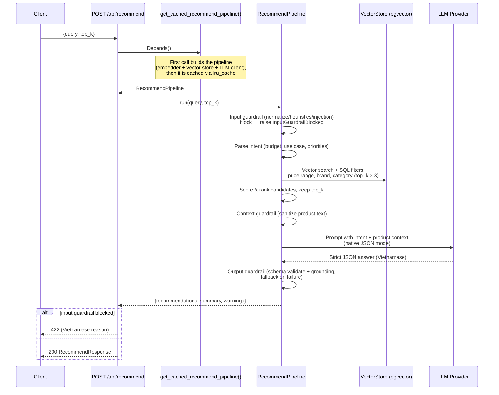

# API Endpoints

Base URL: `http://localhost:8000`

## Health Check

```
GET /health
```

**Response:**
```json
{"status": "ok"}
```

## Recommend Products

```
POST /api/recommend
```

Find products matching a user's natural language query and generate an
LLM-written explanation (in Vietnamese) of why each product fits.

**Request Body:**

| Field     | Type   | Required | Default | Description                    |
| --------- | ------ | -------- | ------- | ------------------------------ |
| `query`   | string | Yes      | —       | Natural language product query (Vietnamese or English). 1–2000 characters, whitespace-only rejected |
| `top_k`   | int    | No       | 5       | Number of recommendations. Must be 1–10 |
| `filters` | object | No       | null    | Reserved for future use — filters are currently extracted automatically from `query` by the `FilterEngine`. Only whitelisted keys are accepted: `brand`, `category`, `price_min`, `price_max`, `min_rating`, `tags` — any other key is a `422` |

Beyond these field-level checks, `query` also passes through the [input
guardrail](../architecture/guardrails.md) (normalize → length/URL/code
heuristics → prompt-injection denylist) before retrieval runs.

Filters extracted from the query and applied **at the vector-store level**
(products failing them never reach the LLM):

| Filter      | Example phrases                                             |
| ----------- | ----------------------------------------------------------- |
| Price range | "dưới 15 triệu", "tầm 10 triệu", "từ 10 đến 20 triệu", "under 15 million", "from 10 to 20 million", "around 10 million" |
| Brand       | "Samsung", "iPhone" (mapped to canonical brand)              |
| Category    | "điện thoại"/"phone" → smartphone, "laptop", "tai nghe", ... |
| Min rating  | "đánh giá tốt", "rating cao" → ≥ 4.0                        |

**Example:**

```bash
curl -X POST http://localhost:8000/api/recommend \
  -H "Content-Type: application/json" \
  -d '{"query": "Phone with great camera under 15 million VND", "top_k": 3}'
```

**Response:**

| Field             | Type     | Description                                        |
| ----------------- | -------- | -------------------------------------------------- |
| `recommendations` | array    | LLM-ranked products with reasoning (see below)     |
| `summary`         | string   | Overall summary of the recommendations (Vietnamese) |
| `warnings`        | string[] | Vietnamese notes about anything a guardrail sanitized, dropped, or replaced (empty when nothing happened) |

```json
{
  "recommendations": [
    {
      "name": "Xiaomi 14",
      "price": 13990000,
      "reason": "Leica camera system with competitive pricing",
      "pros": ["Leica camera quality", "Great value", "90W fast charging"],
      "cons": ["HyperOS has ads"],
      "best_for": "Photography enthusiasts on a budget"
    }
  ],
  "summary": "Top picks based on camera quality within your budget",
  "warnings": []
}
```

The LLM is called in **native JSON mode** (Gemini `response_mime_type`,
OpenAI `response_format`), so the output is machine-parseable JSON with no
prose preamble. The response then passes the [output guardrail](../architecture/guardrails.md):
it's validated against a Pydantic schema and every recommendation is
**grounded** against the retrieved products (a hallucinated product name is
dropped). If validation fails or nothing survives grounding, the endpoint
still returns `200` with a deterministic fallback built from the top-ranked
retrieved products — never an error — and `warnings` explains what happened.

**Errors:**

| Status | `detail` message | Meaning |
| ------ | ---------------- | ------- |
| `422`  | (FastAPI validation) | Invalid request body — missing/blank/too-long `query`, `top_k` outside `1..10`, or an unknown `filters` key |
| `422`  | Guardrail-specific Vietnamese reason (e.g. *"Yêu cầu chứa nội dung nghi vấn prompt injection/jailbreak."*) | The [input guardrail](../architecture/guardrails.md) rejected the query (prompt injection, abnormal length/URLs/code) |
| `503`  | "Hệ thống đã hết hạn mức gọi AI…" | LLM/embedding provider quota exhausted (429). The API fails fast — no quota-wait sleeps — and logs a one-line summary |
| `503`  | "Hệ thống gợi ý đang gặp sự cố…" | Any other pipeline failure (vector DB unreachable, provider error…). Full traceback is logged server-side |

### How it works

The endpoint is wired to the full RAG pipeline through FastAPI dependency
injection (`api/deps.py`):



Key implementation details:

1. **Pipeline construction is cached.** `get_cached_recommend_pipeline()` in
   `api/deps.py` builds the pipeline once per process (embedder setup, vector
   DB connection, LLM client) and reuses it for every request.
2. **The route is a sync (`def`) endpoint on purpose.** The pipeline performs
   blocking I/O (Postgres query, LLM HTTP call), so FastAPI executes it in its
   threadpool instead of blocking the event loop.
3. **Errors return `503` and fail fast.** The API path uses `max_retries=0`
   for provider calls (no quota-wait sleeps) and a 5s DB connect timeout, so
   a broken dependency answers in seconds instead of hanging. Quota errors
   (429) are logged as a single line; unexpected errors keep the full
   traceback. Internal details are never leaked in the response.
4. **Strict JSON output.** The LLM is invoked in native JSON mode, so the
   response always parses into `recommendations` + `summary` instead of
   free-form prose.
5. **Budget is enforced at retrieval.** Price/brand/category/rating filters
   extracted from the query become SQL conditions on the vector search
   (e.g. `(metadata->>'price')::numeric <= 15000000`), so over-budget
   products are excluded before scoring and prompting.
6. **Configuration** comes from `configs/settings.yaml` (embedding model,
   vector DB URL, LLM provider/model) and API keys from environment variables
   (`.env` is loaded at startup). Multiple keys per provider are supported
   (`GEMINI_API_KEY=key_a,key_b` or `GEMINI_API_KEY_1=...`) and rotated
   automatically on rate-limit errors.

For the internal steps of the pipeline itself (intent parsing, retrieval,
scoring, generation) see [Pipeline Flow](../architecture/pipeline-flow.md#recommend-pipeline).

**Prerequisites:** products must be ingested into the vector store first
(`uv run python scripts/ingest.py`), and the embedding/LLM provider API keys
must be set in `.env` — otherwise the endpoint responds with `503`.

## Compare Products

```
POST /api/compare
```

Compare two or more products side by side.

**Request Body:**

| Field         | Type     | Required | Description                         |
| ------------- | -------- | -------- | ----------------------------------- |
| `query`       | string   | No       | Natural language comparison query. 0–2000 characters |
| `product_ids` | string[] | No       | Specific product IDs to compare, looked up via the source-of-truth catalog. Max 5, each matching `[a-zA-Z0-9_-]{1,64}`, duplicates removed |

Provide either `query` or `product_ids` — at least one is required (`422` if both are missing). `query` also passes through the same [input guardrail](../architecture/guardrails.md) as `/api/recommend`; `product_ids` alone skips that check (there's no free-text query to validate).

**Example:**

```bash
curl -X POST http://localhost:8000/api/compare \
  -H "Content-Type: application/json" \
  -d '{"query": "Compare iPhone 15 Pro Max vs Samsung Galaxy S24 Ultra"}'
```

**Response:**

| Field              | Type     | Description                                        |
| ------------------ | -------- | -------------------------------------------------- |
| `comparison_table` | object   | Aligned specs table (`SpecAligner` output)         |
| `analysis`         | object   | LLM analysis: `criteria_comparison`, `product_analysis` |
| `conclusion`       | string   | Final verdict (Vietnamese)                          |
| `warnings`         | string[] | Vietnamese notes about anything a guardrail sanitized, dropped, or replaced |

```json
{
  "comparison_table": {
    "fields": ["processor", "ram", "battery", "rear_camera"],
    "products": [...]
  },
  "analysis": {
    "criteria_comparison": [...],
    "product_analysis": [...]
  },
  "conclusion": "Summary of which product suits which use case",
  "warnings": []
}
```

Same [output guardrail](../architecture/guardrails.md) mechanism as
`/api/recommend`: the LLM's JSON is schema-validated and every
`product_analysis[].name` is grounded against the products actually being
compared. On failure the endpoint still returns `200` with a deterministic
fallback built from the comparison table — never an error.

**Errors:**

| Status | `detail` message | Meaning |
| ------ | ---------------- | ------- |
| `422`  | (FastAPI validation) | Invalid request body — both `query` and `product_ids` missing, `product_ids` malformed/too many, or `query` too long |
| `422`  | Guardrail-specific Vietnamese reason | The [input guardrail](../architecture/guardrails.md) rejected `query` (prompt injection, abnormal length/URLs/code) |
| `422`  | "Cần ít nhất 2 sản phẩm để so sánh." | Fewer than 2 products could be resolved from `product_ids`/`query` |
| `503`  | "Hệ thống đã hết hạn mức gọi AI…" | LLM/embedding provider quota exhausted (429) |
| `503`  | "Hệ thống so sánh đang gặp sự cố…" | Any other pipeline failure (vector DB unreachable, provider error…) |

**Prerequisites:** same as `/api/recommend` — products must be ingested
first, and `product_ids` lookups require the catalog table (`product_catalog`)
to be populated (via the CRUD API or `scripts/ingest.py`).

## Search Products

```
POST /api/search
```

Search products by query with optional filters.

**Request Body:**

| Field     | Type   | Required | Default | Description            |
| --------- | ------ | -------- | ------- | ---------------------- |
| `query`   | string | Yes      | —       | Search query           |
| `filters` | object | No       | null    | Metadata filters       |
| `limit`   | int    | No       | 10      | Max results to return  |

**Response:**

```json
{
  "results": [
    {
      "id": "iphone-15-pro-max",
      "document": "iPhone 15 Pro Max - Apple...",
      "metadata": {"brand": "Apple", "price": 29990000},
      "score": 0.92
    }
  ],
  "total": 1
}
```

## Manage Products (CRUD)

The catalog is the **source of truth**: these endpoints write only to the
`product_catalog` table. Debezium (CDC) picks the change up from the WAL and
the sync workers propagate it to Elasticsearch and pgvector automatically —
usually within a few seconds (eventual consistency).

### Create

```
POST /api/products            → 201
```

| Field | Type | Required | Description |
| ----- | ---- | -------- | ----------- |
| `product_id` | string | No | Generated from `name` when omitted |
| `name` | string | Yes | Product name |
| `brand`, `category`, `description`, `review_summary`, `currency` | string | No | Text fields |
| `price` | int ≥ 0 | No | Price in VND |
| `specifications` | object | No | Spec key/values |
| `pros`, `cons`, `tags` | string[] | No | Lists |
| `avg_rating` | float 0–5 | No | Average rating |
| `review_count` | int ≥ 0 | No | Number of reviews |

```bash
curl -X POST http://localhost:8000/api/products \
  -H "Content-Type: application/json" \
  -d '{"product_id": "xiaomi-15", "name": "Xiaomi 15", "brand": "Xiaomi",
       "category": "smartphone", "price": 18990000,
       "description": "Snapdragon 8 Elite, camera Leica."}'
```

**Response:** `{"product_id": "xiaomi-15", "message": "Đã tạo sản phẩm. Dữ liệu tìm kiếm sẽ được đồng bộ trong giây lát."}`

`409` if the id already exists.

### Update (partial)

```
PUT /api/products/{product_id}
```

Send only the fields to change. A price/rating-only change is propagated as
a cheap metadata update (no re-embedding); text changes trigger re-embedding
of the product's chunks.

```bash
curl -X PUT http://localhost:8000/api/products/xiaomi-15 \
  -H "Content-Type: application/json" -d '{"price": 17490000}'
```

`404` if the product does not exist; `422` if the body is empty.

### Delete

```
DELETE /api/products/{product_id}
```

Removes the product from the catalog; CDC removes it from both search
indexes. `404` if it does not exist.

### Read

```
GET /api/products/{product_id}
GET /api/products?limit=50&offset=0
```

Read the catalog directly (always strongly consistent — no index lag).
