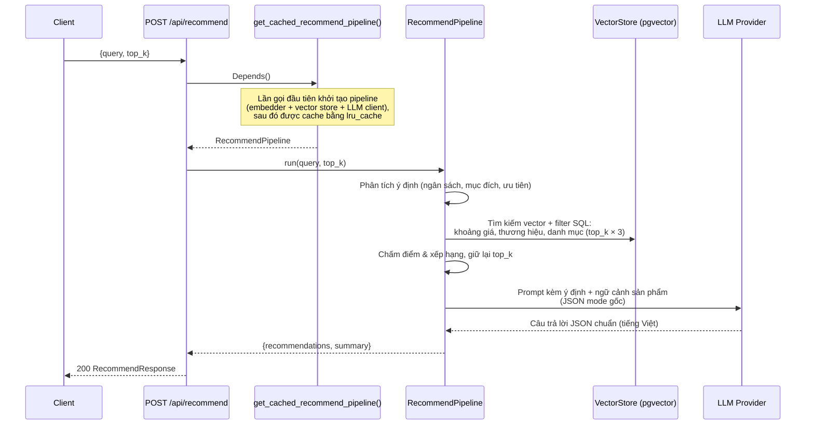

# API Endpoints

Base URL: `http://localhost:8000`

## Health Check

```
GET /health
```

**Response:**
```json
{"status": "ok"}
```

## Gợi ý sản phẩm

```
POST /api/recommend
```

Tìm các sản phẩm khớp với truy vấn ngôn ngữ tự nhiên của người dùng và sinh
lời giải thích bằng tiếng Việt (do LLM viết) về lý do mỗi sản phẩm phù hợp.

**Request Body:**

| Trường    | Kiểu   | Bắt buộc | Mặc định | Mô tả                    |
| --------- | ------ | -------- | ------- | ------------------------------ |
| `query`   | string | Có      | —       | Truy vấn sản phẩm bằng ngôn ngữ tự nhiên (tiếng Việt hoặc tiếng Anh) |
| `top_k`   | int    | Không       | 5       | Số lượng gợi ý      |
| `filters` | object | Không       | null    | Dành cho tương lai — hiện tại filter được trích xuất tự động từ `query` bởi `FilterEngine` |

Các filter được trích xuất từ truy vấn và áp dụng **ngay tại tầng vector
store** (sản phẩm không đạt sẽ không bao giờ đến được LLM):

| Filter        | Ví dụ cụm từ                                                |
| ------------- | ----------------------------------------------------------- |
| Khoảng giá    | "dưới 15 triệu", "tầm 10 triệu", "từ 10 đến 20 triệu", "under 15 million", "from 10 to 20 million", "around 10 million" |
| Thương hiệu   | "Samsung", "iPhone" (được quy về thương hiệu chuẩn)          |
| Danh mục      | "điện thoại"/"phone" → smartphone, "laptop", "tai nghe", ... |
| Rating tối thiểu | "đánh giá tốt", "rating cao" → ≥ 4.0                     |

**Ví dụ:**

```bash
curl -X POST http://localhost:8000/api/recommend \
  -H "Content-Type: application/json" \
  -d '{"query": "Phone with great camera under 15 million VND", "top_k": 3}'
```

**Response:**

| Trường            | Kiểu   | Mô tả                                              |
| ----------------- | ------ | -------------------------------------------------- |
| `recommendations` | array  | Danh sách sản phẩm đã xếp hạng kèm lý do (xem bên dưới) |
| `summary`         | string | Tóm tắt chung về các gợi ý (tiếng Việt)            |

```json
{
  "recommendations": [
    {
      "name": "Xiaomi 14",
      "price": 13990000,
      "reason": "Leica camera system with competitive pricing",
      "pros": ["Leica camera quality", "Great value", "90W fast charging"],
      "cons": ["HyperOS has ads"],
      "best_for": "Photography enthusiasts on a budget"
    }
  ],
  "summary": "Top picks based on camera quality within your budget"
}
```

LLM được gọi ở chế độ **JSON mode gốc** (Gemini `response_mime_type`,
OpenAI `response_format`) nên output luôn là JSON parse được, không có đoạn
văn mở đầu. Trường hợp hiếm khi parse vẫn thất bại, `recommendations` sẽ rỗng
và `summary` chứa nguyên văn câu trả lời của LLM (cơ chế dự phòng).

**Lỗi:**

| Status | Thông báo `detail` | Ý nghĩa |
| ------ | ------------------ | ------- |
| `422`  | (FastAPI validation) | Request body không hợp lệ (ví dụ thiếu `query`) |
| `503`  | "Hệ thống đã hết hạn mức gọi AI…" | Hết quota LLM/embedding provider (429). API fail fast — không ngủ chờ quota — và log tóm tắt 1 dòng |
| `503`  | "Hệ thống gợi ý đang gặp sự cố…" | Sự cố pipeline khác (không kết nối được vector DB, lỗi provider…). Traceback đầy đủ được log phía server |

### Cách hoạt động

Endpoint được nối với pipeline RAG đầy đủ thông qua dependency injection của
FastAPI (`api/deps.py`):



Các chi tiết triển khai quan trọng:

1. **Việc khởi tạo pipeline được cache.** `get_cached_recommend_pipeline()`
   trong `api/deps.py` chỉ khởi tạo pipeline một lần cho mỗi process (setup
   embedder, kết nối vector DB, LLM client) và tái sử dụng cho mọi request.
2. **Route được khai báo sync (`def`) có chủ đích.** Pipeline thực hiện I/O
   blocking (truy vấn Postgres, gọi HTTP tới LLM), nên FastAPI chạy nó trong
   threadpool thay vì chặn event loop.
3. **Lỗi trả về `503` và fail fast.** API path dùng `max_retries=0` khi gọi
   provider (không ngủ chờ quota) và timeout kết nối DB 5 giây, nên dependency
   hỏng sẽ trả lời trong vài giây thay vì treo. Lỗi quota (429) được log gọn
   1 dòng; lỗi bất ngờ giữ nguyên traceback đầy đủ. Chi tiết nội bộ không bao
   giờ bị lộ trong response.
4. **Output JSON chuẩn.** LLM được gọi ở JSON mode gốc, nên response luôn
   parse được thành `recommendations` + `summary` thay vì văn xuôi tự do.
5. **Ngân sách được áp ngay từ bước truy xuất.** Filter giá/thương hiệu/danh
   mục/rating trích từ truy vấn trở thành điều kiện SQL của vector search
   (ví dụ `(metadata->>'price')::numeric <= 15000000`), nên sản phẩm vượt
   ngân sách bị loại trước khi chấm điểm và đưa vào prompt.
6. **Cấu hình** lấy từ `configs/settings.yaml` (model embedding, URL vector
   DB, provider/model LLM) và API key từ biến môi trường (`.env` được nạp khi
   khởi động). Hỗ trợ nhiều key cho mỗi provider (`GEMINI_API_KEY=key_a,key_b`
   hoặc `GEMINI_API_KEY_1=...`) và tự động xoay key khi gặp lỗi rate limit.

Về các bước bên trong pipeline (phân tích ý định, truy xuất, chấm điểm, sinh
câu trả lời) xem [Luồng xử lý](../architecture/pipeline-flow.md#recommend-pipeline).

**Điều kiện tiên quyết:** dữ liệu sản phẩm phải được nạp vào vector store
trước (`uv run python scripts/ingest.py`), và API key của embedding/LLM
provider phải được đặt trong `.env` — nếu không endpoint sẽ trả về `503`.

## So sánh sản phẩm

```
POST /api/compare
```

So sánh hai hoặc nhiều sản phẩm cạnh nhau.

**Request Body:**

| Trường         | Kiểu     | Bắt buộc | Mô tả                         |
| ------------- | -------- | -------- | ----------------------------------- |
| `query`       | string   | Không       | Truy vấn so sánh bằng ngôn ngữ tự nhiên   |
| `product_ids` | string[] | Không       | ID sản phẩm cụ thể cần so sánh     |

Cung cấp `query` hoặc `product_ids` (cần ít nhất một trong hai).

**Ví dụ:**

```bash
curl -X POST http://localhost:8000/api/compare \
  -H "Content-Type: application/json" \
  -d '{"query": "Compare iPhone 15 Pro Max vs Samsung Galaxy S24 Ultra"}'
```

**Response:**

```json
{
  "comparison_table": {
    "fields": ["processor", "ram", "battery", "rear_camera"],
    "products": [...]
  },
  "analysis": {
    "criteria_comparison": [...],
    "product_analysis": [...]
  },
  "conclusion": "Summary of which product suits which use case"
}
```

## Tìm kiếm sản phẩm

```
POST /api/search
```

Tìm kiếm sản phẩm theo truy vấn kèm filter tùy chọn.

**Request Body:**

| Trường    | Kiểu   | Bắt buộc | Mặc định | Mô tả            |
| --------- | ------ | -------- | ------- | ---------------------- |
| `query`   | string | Có      | —       | Truy vấn tìm kiếm           |
| `filters` | object | Không       | null    | Filter metadata       |
| `limit`   | int    | Không       | 10      | Số kết quả tối đa trả về  |

**Response:**

```json
{
  "results": [
    {
      "id": "iphone-15-pro-max",
      "document": "iPhone 15 Pro Max - Apple...",
      "metadata": {"brand": "Apple", "price": 29990000},
      "score": 0.92
    }
  ],
  "total": 1
}
```

## Quản lý sản phẩm (CRUD)

Catalog là **source of truth**: các endpoint này chỉ ghi vào bảng
`product_catalog`. Debezium (CDC) bắt thay đổi từ WAL và các sync worker tự
lan truyền sang Elasticsearch + pgvector — thường trong vài giây (eventual
consistency).

### Tạo mới

```
POST /api/products            → 201
```

| Trường | Kiểu | Bắt buộc | Mô tả |
| ------ | ---- | -------- | ----- |
| `product_id` | string | Không | Tự sinh từ `name` nếu bỏ trống |
| `name` | string | Có | Tên sản phẩm |
| `brand`, `category`, `description`, `review_summary`, `currency` | string | Không | Các trường text |
| `price` | int ≥ 0 | Không | Giá (VND) |
| `specifications` | object | Không | Thông số kỹ thuật |
| `pros`, `cons`, `tags` | string[] | Không | Danh sách |
| `avg_rating` | float 0–5 | Không | Điểm đánh giá trung bình |
| `review_count` | int ≥ 0 | Không | Số lượt đánh giá |

```bash
curl -X POST http://localhost:8000/api/products \
  -H "Content-Type: application/json" \
  -d '{"product_id": "xiaomi-15", "name": "Xiaomi 15", "brand": "Xiaomi",
       "category": "smartphone", "price": 18990000,
       "description": "Snapdragon 8 Elite, camera Leica."}'
```

**Response:** `{"product_id": "xiaomi-15", "message": "Đã tạo sản phẩm. Dữ liệu tìm kiếm sẽ được đồng bộ trong giây lát."}`

`409` nếu id đã tồn tại.

### Cập nhật (partial)

```
PUT /api/products/{product_id}
```

Chỉ gửi các trường cần đổi. Thay đổi chỉ giá/rating được lan truyền bằng
update metadata rẻ (không re-embed); thay đổi text sẽ re-embed các chunk
của sản phẩm.

```bash
curl -X PUT http://localhost:8000/api/products/xiaomi-15 \
  -H "Content-Type: application/json" -d '{"price": 17490000}'
```

`404` nếu sản phẩm không tồn tại; `422` nếu body rỗng.

### Xóa

```
DELETE /api/products/{product_id}
```

Xóa sản phẩm khỏi catalog; CDC gỡ khỏi cả hai index tìm kiếm. `404` nếu
không tồn tại.

### Đọc

```
GET /api/products/{product_id}
GET /api/products?limit=50&offset=0
```

Đọc thẳng catalog (luôn nhất quán mạnh — không có độ trễ index).
