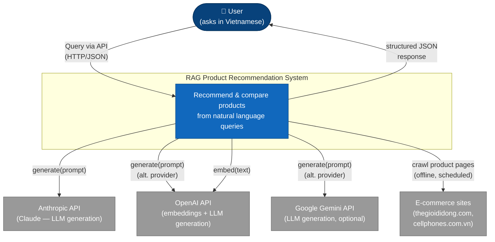
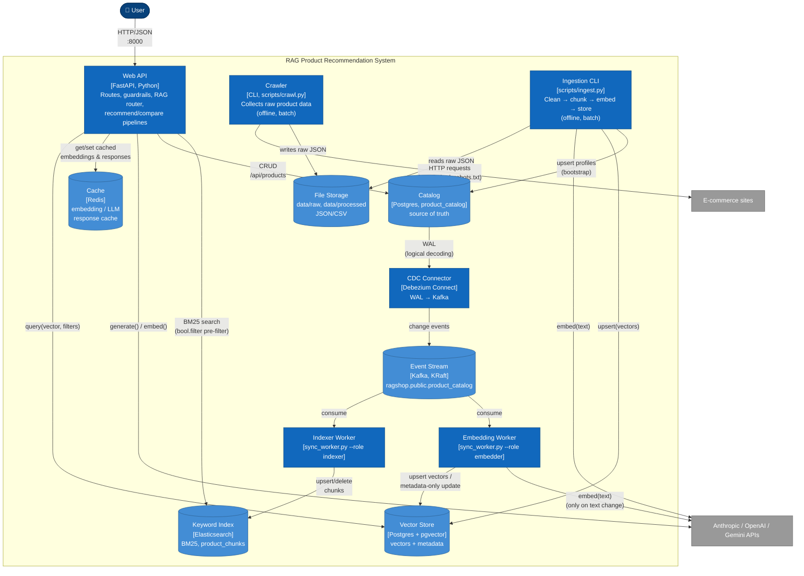
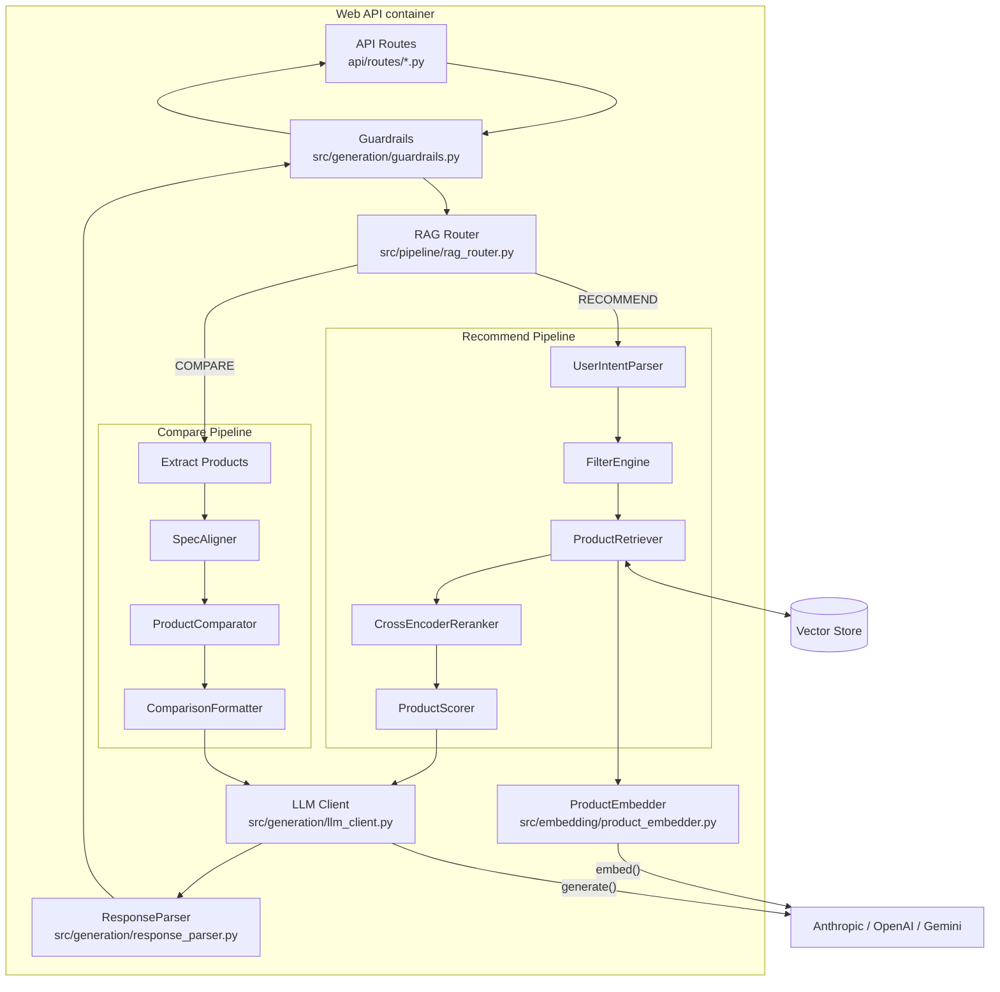

# C4 Model

The [C4 model](https://c4model.com/) (Context, Container, Component, Code) describes a software system at four zoom levels. This page covers the first three — Context, Container, Component — which are the levels useful for understanding this system's architecture. The Code level is skipped in favor of the per-module tables in [Project Structure](structure.md).

## Level 1: System Context

The context diagram shows the system as a single box, the people who use it, and the external systems it depends on.

**Actors and external systems**

| Element | Type | Description |
| ------- | ---- | ----------- |
| User | Person | Sends natural-language product queries in Vietnamese via `POST /api/recommend`, `/api/compare`, or `/api/search`. |
| Anthropic API | External system | Default LLM provider (`claude-sonnet-4-6`) for generating recommendation/comparison text. |
| OpenAI API | External system | Provides the embedding model (`text-embedding-3-small`) and can serve as an alternate LLM provider (`gpt-4o`). |
| Google Gemini API | External system | Alternate LLM provider (`gemini-2.0-flash`), selectable via `configs/settings.yaml`. |
| E-commerce sites | External system | Source of raw product data (specs, prices, reviews), collected offline by the crawler. |

The active LLM/embedding providers are chosen by `llm_provider` / `embedding_provider` in `configs/settings.yaml` — only one LLM provider is called per request, not all three.

## Level 2: Container

The container diagram zooms into the system and shows the separately runnable/deployable units, per `docker/docker-compose.yml` and the `scripts/` CLI entry points.

**Containers**

| Container | Technology | Responsibility | Deployment |
| --------- | ---------- | --------------- | ---------- |
| Web API | FastAPI (Python 3.11+), served by uvicorn | Serves `/api/recommend`, `/api/compare`, `/api/search`; hosts the RAG router and both pipelines in-process | `app` service in `docker-compose.yml`, port 8000 |
| Crawler | Python CLI (`scripts/crawl.py`) | Collects raw specs + reviews from e-commerce sites into `data/raw/crawled/` | Run ad hoc / scheduled, same image as the API |
| Ingestion CLI | Python CLI (`scripts/ingest.py`) | Loads raw data, cleans, chunks, embeds, and upserts into the vector store | Run ad hoc / scheduled, same image as the API |
| Vector Store | Postgres 16 + pgvector | Cosine-similarity search (HNSW index) over product embeddings + JSONB metadata | `postgres` service in `docker-compose.yml`, port 5432 — persisted in the `pgdata` volume; connection via `DATABASE_URL` |
| Cache | Redis 7 | Intended cache for embeddings and LLM responses (`src/utils/cache.py`) | `redis` service in `docker-compose.yml`, port 6379. **Note:** `SimpleCache` currently only implements an in-memory dict regardless of the configured backend — the Redis wiring is provisioned but not yet consumed |
| File Storage | Local filesystem | Raw crawled JSON, processed/cleaned data, sample product data | Mounted volume (`../data:/app/data`) |
| Catalog | Postgres 16 (`product_catalog` table, same instance as the vector store) | Source of truth for product data; written only by the CRUD API and the ingest bootstrap; captured by CDC (`REPLICA IDENTITY FULL`, `wal_level=logical`) | `postgres` service |
| Keyword Index | Elasticsearch 8 | BM25 keyword search over product chunks (`product_chunks` index) with `bool.filter` pre-filtering; derived from the catalog via CDC | `elasticsearch` service, port 9200, `esdata` volume |
| Event Stream | Kafka 3.7 (KRaft, single node) | Ordered change-event stream (`ragshop.public.product_catalog`) feeding both sync workers | `kafka` service, `kafkadata` volume |
| CDC Connector | Debezium Connect 2.7 | Streams `product_catalog` row changes from the Postgres WAL into Kafka; registered idempotently by the one-shot `connect-init` service (`docker/debezium/`) | `connect` service, port 8083 |
| Indexer Worker | Python CLI (`scripts/sync_worker.py --role indexer`) | Consumes change events → idempotent upsert/delete of chunks in Elasticsearch | `indexer-worker` service |
| Embedding Worker | Python CLI (`scripts/sync_worker.py --role embedder`) | Consumes change events → re-embeds into pgvector only when text changed; price/rating changes are metadata-only updates | `embedding-worker` service |

## Level 3: Component

Zooming into the **Web API** container shows the components that handle a single request, matching the runtime call path documented in [Pipeline Flow](pipeline-flow.md).

**Key components**

| Component | Source | Role |
| --------- | ------ | ---- |
| API Routes | `api/routes/recommend.py`, `compare.py`, `search.py` | HTTP handlers; call pipeline factories from `api/deps.py` |
| Guardrails | `src/generation/guardrails.py` | Validates request input and LLM output before it reaches the user |
| RAG Router | `src/pipeline/rag_router.py` | Classifies each query as `RECOMMEND` / `COMPARE` / `INFO` / `HYBRID` |
| UserIntentParser | `src/pipeline/recommend/user_intent_parser.py` | Extracts budget, use case, priorities from the query |
| FilterEngine | `src/retrieval/filter_engine.py` | Extracts brand/category/price/rating filters from Vietnamese text |
| ProductRetriever | `src/retrieval/product_retriever.py` | Combines embedding, metadata filters, and vector search |
| CrossEncoderReranker | `src/retrieval/reranker.py` | Optional relevance rerank with `ms-marco-MiniLM-L-6-v2` |
| ProductScorer | `src/pipeline/recommend/scoring.py` | Multi-criteria scoring (relevance, review, value, popularity) |
| SpecAligner / ProductComparator / ComparisonFormatter | `src/pipeline/compare/*.py` | Align specs, compute differences, render a Markdown comparison table |
| ProductEmbedder | `src/embedding/product_embedder.py` | Converts query/product text to vectors via OpenAI |
| LLM Client | `src/generation/llm_client.py` | Unified interface over Anthropic/OpenAI/Gemini |
| ResponseParser | `src/generation/response_parser.py` | Extracts structured JSON from the LLM's raw text output |

For the underlying data as it moves through these components, see [Data Flow](data-flow.md).
