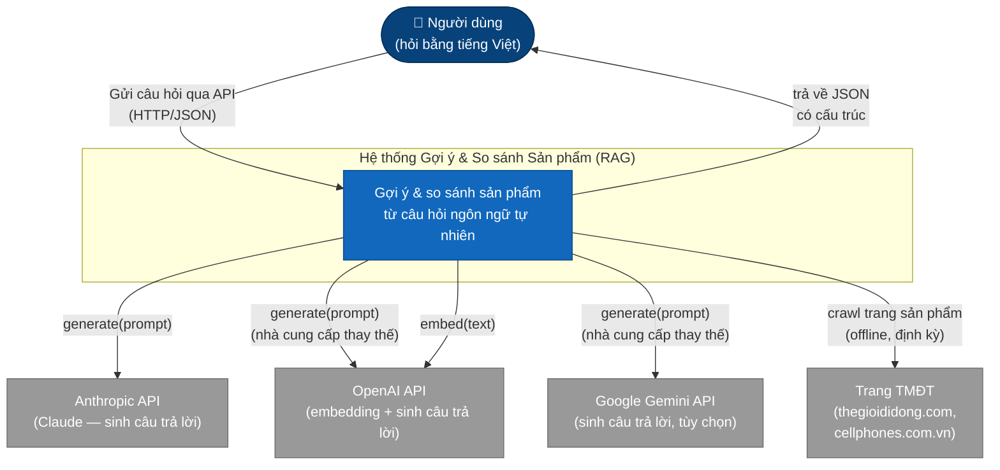
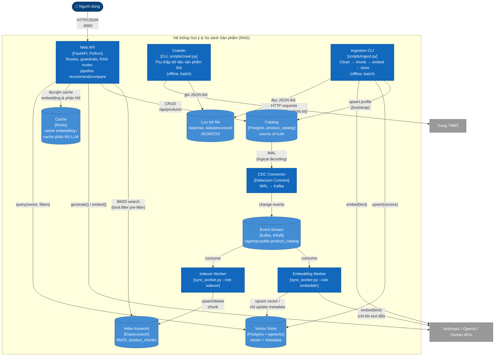
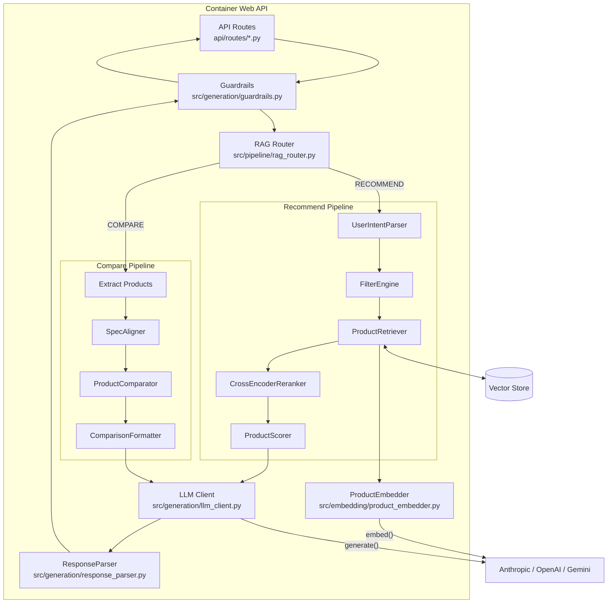

# Mô hình C4

[Mô hình C4](https://c4model.com/) (Context, Container, Component, Code) mô tả một hệ thống phần mềm ở bốn mức độ phóng to dần. Trang này trình bày ba mức đầu — Context (Bối cảnh), Container (Khối triển khai), Component (Thành phần) — vì đây là các mức hữu ích để hiểu kiến trúc hệ thống này. Mức Code được bỏ qua, thay vào đó xem bảng chi tiết theo từng module tại [Cấu trúc dự án](structure.vi.md).

## Mức 1: System Context (Bối cảnh hệ thống)

Sơ đồ context thể hiện toàn bộ hệ thống như một khối duy nhất, cùng với người dùng và các hệ thống bên ngoài mà nó phụ thuộc vào.

**Tác nhân và hệ thống bên ngoài**

| Thành phần | Loại | Mô tả |
| ---------- | ---- | ----- |
| Người dùng | Person | Gửi câu hỏi tự nhiên bằng tiếng Việt qua `POST /api/recommend`, `/api/compare`, hoặc `/api/search`. |
| Anthropic API | Hệ thống ngoài | Nhà cung cấp LLM mặc định (`claude-sonnet-4-6`) để sinh nội dung gợi ý/so sánh. |
| OpenAI API | Hệ thống ngoài | Cung cấp model embedding (`text-embedding-3-small`) và có thể dùng làm LLM thay thế (`gpt-4o`). |
| Google Gemini API | Hệ thống ngoài | LLM thay thế (`gemini-2.0-flash`), chọn qua `configs/settings.yaml`. |
| Trang TMĐT | Hệ thống ngoài | Nguồn dữ liệu sản phẩm thô (thông số, giá, đánh giá), được crawler thu thập offline. |

Nhà cung cấp LLM/embedding đang hoạt động được chọn bởi `llm_provider` / `embedding_provider` trong `configs/settings.yaml` — mỗi request chỉ gọi một nhà cung cấp LLM, không phải cả ba.

## Mức 2: Container (Khối triển khai)

Sơ đồ container phóng to hệ thống, thể hiện các đơn vị có thể chạy/triển khai độc lập, theo `docker/docker-compose.yml` và các CLI trong `scripts/`.

**Các container**

| Container | Công nghệ | Trách nhiệm | Triển khai |
| --------- | --------- | ----------- | ---------- |
| Web API | FastAPI (Python 3.11+), chạy bằng uvicorn | Phục vụ `/api/recommend`, `/api/compare`, `/api/search`; chứa RAG router và cả hai pipeline trong cùng tiến trình | Service `app` trong `docker-compose.yml`, cổng 8000 |
| Crawler | CLI Python (`scripts/crawl.py`) | Thu thập thông số + đánh giá thô từ các trang TMĐT vào `data/raw/crawled/` | Chạy thủ công/định kỳ, dùng chung image với API |
| Ingestion CLI | CLI Python (`scripts/ingest.py`) | Đọc dữ liệu thô, làm sạch, chia chunk, embed, và upsert vào vector store | Chạy thủ công/định kỳ, dùng chung image với API |
| Vector Store | Postgres 16 + pgvector | Tìm kiếm tương đồng cosine (chỉ mục HNSW) trên embedding sản phẩm + metadata dạng JSONB | Service `postgres` trong `docker-compose.yml`, cổng 5432 — persist qua volume `pgdata`; kết nối qua `DATABASE_URL` |
| Cache | Redis 7 | Dự kiến cache cho embedding và phản hồi LLM (`src/utils/cache.py`) | Service `redis` trong `docker-compose.yml`, cổng 6379. **Lưu ý:** `SimpleCache` hiện chỉ triển khai lưu trữ dạng dict trong bộ nhớ bất kể backend cấu hình — phần kết nối Redis đã được chuẩn bị nhưng chưa được sử dụng |
| Lưu trữ file | Hệ thống file cục bộ | JSON crawl thô, dữ liệu đã xử lý/làm sạch, dữ liệu sản phẩm mẫu | Volume mount (`../data:/app/data`) |
| Catalog | Postgres 16 (bảng `product_catalog`, cùng instance với vector store) | Source of truth cho dữ liệu sản phẩm; chỉ API CRUD và ingest bootstrap được ghi; CDC capture (`REPLICA IDENTITY FULL`, `wal_level=logical`) | Service `postgres` |
| Index keyword | Elasticsearch 8 | BM25 keyword search trên chunk sản phẩm (index `product_chunks`) với pre-filter `bool.filter`; dẫn xuất từ catalog qua CDC | Service `elasticsearch`, port 9200, volume `esdata` |
| Event Stream | Kafka 3.7 (KRaft, single node) | Stream sự kiện thay đổi có thứ tự (`ragshop.public.product_catalog`) nuôi cả hai sync worker | Service `kafka`, volume `kafkadata` |
| CDC Connector | Debezium Connect 2.7 | Stream thay đổi row của `product_catalog` từ WAL Postgres vào Kafka; đăng ký idempotent bởi service one-shot `connect-init` (`docker/debezium/`) | Service `connect`, port 8083 |
| Indexer Worker | Python CLI (`scripts/sync_worker.py --role indexer`) | Consume change event → upsert/delete chunk idempotent vào Elasticsearch | Service `indexer-worker` |
| Embedding Worker | Python CLI (`scripts/sync_worker.py --role embedder`) | Consume change event → chỉ re-embed vào pgvector khi text đổi; đổi giá/rating là update metadata-only | Service `embedding-worker` |

## Mức 3: Component (Thành phần)

Phóng to container **Web API** cho thấy các thành phần xử lý một request, khớp với luồng gọi runtime đã mô tả tại [Pipeline Flow](pipeline-flow.vi.md).

**Các thành phần chính**

| Thành phần | Nguồn | Vai trò |
| ---------- | ----- | ------- |
| API Routes | `api/routes/recommend.py`, `compare.py`, `search.py` | Xử lý HTTP; gọi các factory pipeline từ `api/deps.py` |
| Guardrails | `src/generation/guardrails.py` | Kiểm tra đầu vào của request và đầu ra của LLM trước khi trả về người dùng |
| RAG Router | `src/pipeline/rag_router.py` | Phân loại mỗi câu hỏi thành `RECOMMEND` / `COMPARE` / `INFO` / `HYBRID` |
| UserIntentParser | `src/pipeline/recommend/user_intent_parser.py` | Trích xuất ngân sách, mục đích sử dụng, ưu tiên từ câu hỏi |
| FilterEngine | `src/retrieval/filter_engine.py` | Trích xuất bộ lọc thương hiệu/danh mục/giá/đánh giá từ văn bản tiếng Việt |
| ProductRetriever | `src/retrieval/product_retriever.py` | Kết hợp embedding, bộ lọc metadata, và tìm kiếm vector |
| CrossEncoderReranker | `src/retrieval/reranker.py` | Rerank độ liên quan tùy chọn với `ms-marco-MiniLM-L-6-v2` |
| ProductScorer | `src/pipeline/recommend/scoring.py` | Chấm điểm đa tiêu chí (độ liên quan, đánh giá, giá trị, độ phổ biến) |
| SpecAligner / ProductComparator / ComparisonFormatter | `src/pipeline/compare/*.py` | Căn chỉnh thông số, tính khác biệt, dựng bảng so sánh Markdown |
| ProductEmbedder | `src/embedding/product_embedder.py` | Chuyển văn bản câu hỏi/sản phẩm thành vector qua OpenAI |
| LLM Client | `src/generation/llm_client.py` | Giao diện thống nhất cho Anthropic/OpenAI/Gemini |
| ResponseParser | `src/generation/response_parser.py` | Trích xuất JSON có cấu trúc từ văn bản thô do LLM trả về |

Để xem dữ liệu cụ thể di chuyển qua các thành phần này, xem [Luồng dữ liệu](data-flow.vi.md).
