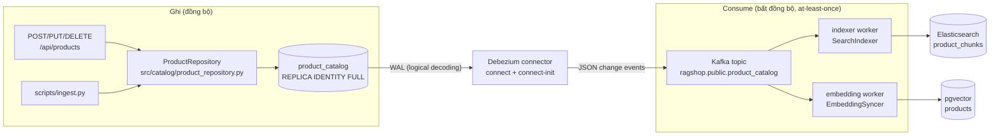
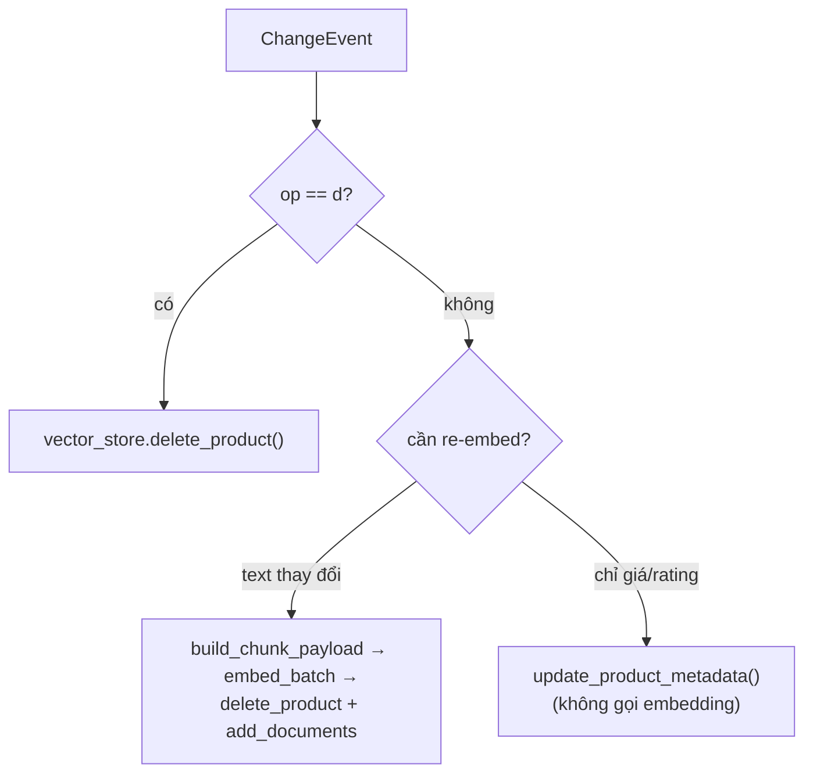
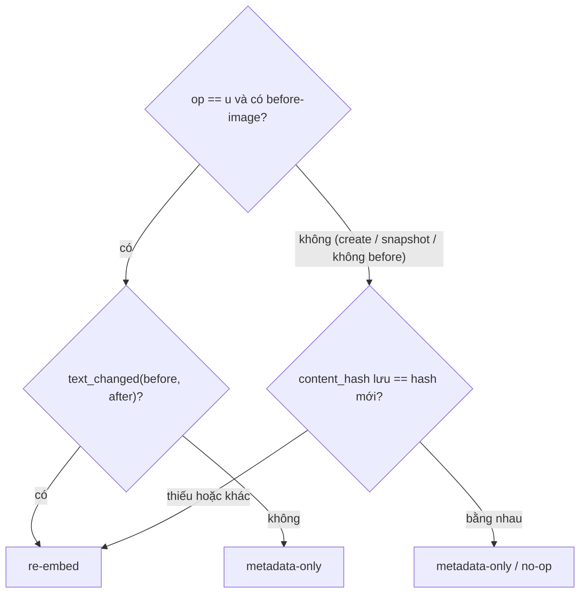

# Đồng bộ CDC (Change Data Capture)

Trang này đi sâu vào phần hiện thực của hệ thống con **CDC** — phần giữ hai index
tìm kiếm dẫn xuất (Elasticsearch keyword + pgvector semantic) đồng bộ với source
of truth `product_catalog`. Về dạng dữ liệu xem [Luồng dữ liệu](data-flow.vi.md);
về các điểm ghi xem [Luồng ghi](write-path.vi.md); về CLI xem
[sync_worker.py](../scripts/sync-worker.vi.md).

## Vấn đề nó giải quyết: không dual-write

Nếu API tự ghi một sản phẩm vào Postgres **và** Elasticsearch **và** pgvector,
thì một sự cố crash giữa các lời gọi đó sẽ khiến các store lệch nhau (vấn đề
"dual-write" / ghi phân tán) mà không có cách nào biết index nào đang cũ.

CDC loại bỏ lớp lỗi này. Mọi thay đổi chỉ ghi vào **một** nơi —
`product_catalog` — và các index tìm kiếm được dựng lại *từ* nó một cách bất đồng
bộ:

- **Một người ghi, một source of truth.** `POST/PUT/DELETE /api/products` và `scripts/ingest.py` chỉ đụng vào `product_catalog`.
- **Index là dẫn xuất, không bao giờ là authoritative.** Luôn có thể dựng lại bằng cách replay stream thay đổi.
- **Eventual consistency thay vì drift.** Sau khi ghi, index bắt kịp một lát sau; chúng không bao giờ *sai*, chỉ *cũ* trong chốc lát.

## Luồng đầu-cuối



Nửa **ghi** là đồng bộ và trả về ngay khi row catalog được commit. Nửa
**consume** chạy liên tục trong hai tiến trình worker độc lập.

## Thành phần & file

Mọi thứ liên quan CDC nằm trong `src/sync/`, được điều khiển bởi một script
entry-point.

| Thành phần | File | Trách nhiệm |
| ---------- | ---- | ----------- |
| Source of truth | `src/catalog/product_repository.py` | CRUD trên `product_catalog`; đặt `REPLICA IDENTITY FULL` để update/delete phát ra before-image đầy đủ |
| Cấu hình connector | `docker/debezium/product-catalog-connector.json` | Debezium Postgres connector: `topic.prefix=ragshop`, `table.include.list=public.product_catalog`, `plugin.name=pgoutput`, `snapshot.mode=initial` |
| Entry point | `scripts/sync_worker.py` | `--role indexer` hoặc `--role embedder`; dựng handler + Kafka consumer và chạy loop |
| Consumer loop | `src/sync/runner.py` | `build_consumer()` + `run_loop()` — poll → parse → apply → commit (at-least-once) |
| Parse event | `src/sync/events.py` | `parse_debezium_message()` → `ChangeEvent`; `content_hash()`, `text_changed()`, `metadata_fields()` |
| Chunk builder | `src/sync/chunk_builder.py` | `build_chunk_payload()` — row → `(ids, documents, metadatas)`, dùng chung với `ingest.py` |
| Handler indexer | `src/sync/indexer_worker.py` | `SearchIndexer` → Elasticsearch (`ESKeywordSearch`) |
| Handler embedding | `src/sync/embedding_worker.py` | `EmbeddingSyncer` → pgvector (`ProductEmbedder` + `VectorStore`) |
| Backend ES | `src/retrieval/es_keyword_search.py` | `upsert_chunks()` / `delete_product()` trên index `product_chunks` |
| Vector store | `src/embedding/vector_store.py` | `add_documents()` / `delete_product()` / `update_product_metadata()` / `get_product_content_hash()` |

## Change event của Debezium

Debezium (JSON converter, không schema) phát ra một message cho mỗi thay đổi row:

```json
{
  "payload": {
    "op": "c",
    "before": null,
    "after": { "product_id": "...", "name": "...", "price": 12990000, "specifications": "{...}" }
  }
}
```

Giá trị `op`: **`c`** insert, **`u`** update, **`d`** delete, **`r`** snapshot
read (snapshot ban đầu / khi connector restart). `parse_debezium_message()`
trong `src/sync/events.py` biến message này thành `ChangeEvent(op, before, after)`
và:

- trả về `None` cho tombstone (value null), heartbeat và mọi thứ không parse được — loop bỏ qua và commit;
- decode các cột JSONB (`specifications`, `pros`, `cons`, `tags`) — vốn tới dưới dạng **chuỗi** JSON (`io.debezium.data.Json`) — về lại object Python;
- suy ra `product_id` từ `after` (hoặc `before` khi delete).

Vì bảng catalog dùng `REPLICA IDENTITY FULL`, một update event mang **toàn bộ**
row cũ trong `before`, không chỉ mỗi primary key — đó là thứ cho phép embedding
worker so sánh các text field một cách rẻ (bên dưới).

## Consumer loop (`runner.py`)

Cả hai worker dùng chung một loop. `build_consumer()` tạo một consumer
`confluent-kafka` với:

- **`group.id`** = `rag-sync-indexer` hoặc `rag-sync-embedder` — mỗi worker là một consumer group riêng, nên cả hai đều nhận mọi event một cách độc lập.
- **`auto.offset.reset=earliest`** — lần đầu khởi động, worker đọc *toàn bộ* topic. Đó là cách một index mới được bootstrap từ initial snapshot của Debezium.
- **`enable.auto.commit=false`** — offset được commit **thủ công, chỉ sau khi** handler đã áp xong event.

```python
event = parse_debezium_message(message.value())
if event is not None:
    handler.handle(event)   # có thể raise -> offset KHÔNG commit -> redeliver
    applied += 1
consumer.commit(message)
```

Điều này cho delivery **at-least-once**: nếu handler raise, worker crash mà không
commit, và event được redeliver khi restart. Cả hai handler đều **idempotent**,
nên redeliver áp lại lên cùng trạng thái mà vô hại.

## Indexer worker → Elasticsearch

`SearchIndexer.handle()` (`src/sync/indexer_worker.py`):

- **`op == d`** → `es.delete_product(product_id)` (xóa mọi chunk của sản phẩm đó).
- **`c` / `u` / `r`** → `build_chunk_payload()` rồi `es.delete_product()` **rồi** `es.upsert_chunks()`.

Xóa trước khi upsert đảm bảo các chunk_type đã biến mất (ví dụ specs bị gỡ) không
còn sót lại. Chunk id có tính xác định (`{product_id}_{chunk_type}`), nên upsert
ghi đè tại chỗ — replay stream sẽ hội tụ về cùng một index.

## Embedding worker → pgvector

`EmbeddingSyncer.handle()` (`src/sync/embedding_worker.py`) là nơi tối ưu chi phí
— lời gọi embedding API là bước đắt nhất, nên nó chỉ chạy **khi thật sự cần**:



### Quyết định re-embed (`content_hash`)

`_needs_reembed()` quyết định đi nhánh nào:



Hai nhóm field điều khiển việc này (`src/sync/events.py`):

- **`TEXT_FIELDS`** = `name, brand, category, description, specifications, pros, cons, review_summary`. Chúng xuất hiện trong text chunk, nên đổi bất kỳ field nào cũng cần re-embed. `content_hash()` là MD5 trên đúng các field này.
- **`METADATA_FIELDS`** = `price, avg_rating, review_count`. Chỉ đổi các field này thì được lan truyền bằng `update_product_metadata()` — một update JSONB rẻ, **không** gọi embedding.

`avg_rating` / `review_count` về mặt kỹ thuật có xuất hiện trong text chunk
review, nhưng chúng biến động liên tục; re-embed mỗi khi rating nhích một chút sẽ
đốt quota embedding để đổi lấy độ liên quan tăng không đáng kể, nên chúng được cố
ý xử lý metadata-only.

`content_hash` được lưu trong metadata của mỗi chunk (và `ingest.py` cũng ghi
nó). Nên khi Debezium replay **initial snapshot** của một catalog đã ingest,
worker thấy hash lưu vẫn khớp và gọi **zero** lời embedding — replay cả topic là
miễn phí khi không có gì thay đổi.

## Đảm bảo delivery & consistency

- **At-least-once** — offset commit sau khi apply; crash thì redeliver, không bao giờ mất.
- **Applier idempotent** — chunk id xác định + ngữ nghĩa upsert/delete, nên redeliver hội tụ.
- **Thứ tự** — một topic duy nhất (một partition trên Kafka single-node dev) giữ đúng thứ tự thay đổi theo từng sản phẩm, nên một update không bao giờ vượt qua create trước nó.
- **Eventual consistency** — tác động duy nhất thấy được của lag là kết quả tìm kiếm cũ trong chốc lát; source of truth (`product_catalog`, được `GET /api/products` đọc trực tiếp) luôn cập nhật.

## Snapshot & bootstrap một index mới

`snapshot.mode: initial` nghĩa là khi connector được đăng ký lần đầu, Debezium
đọc toàn bộ bảng `product_catalog` và phát ra dưới dạng event `op=r` ("read")
trước khi chuyển sang stream live. Kết hợp với `auto.offset.reset=earliest`, một
worker hoàn toàn mới (hoặc một index vừa dựng lại, rỗng) tự lấp đầy từ snapshot đó
mà không cần công cụ nào thêm. `ingest.py --catalog-only` dựa vào đúng điều này:
chỉ ghi catalog, để worker dựng cả hai index từ snapshot.

## Chạy & vận hành

```bash
# Trong Docker chúng chạy dưới dạng service indexer-worker / embedding-worker.
# Standalone (cần Kafka + ES/Postgres truy cập được + connector đã đăng ký):
uv run python scripts/sync_worker.py --role indexer    # -> Elasticsearch
uv run python scripts/sync_worker.py --role embedder   # -> pgvector
```

Giám sát: xem **lag** của consumer-group và **trạng thái connector** Debezium —
xem [Docker › Kafka & Debezium](docker.vi.md#kafka-topic-consumer-lag).

## Các tình huống lỗi & phục hồi

| Lỗi | Điều xảy ra | Phục hồi |
| --- | ----------- | -------- |
| Worker crash giữa chừng event | Offset chưa commit | Event redeliver khi restart (at-least-once) |
| Embedding API down / hết quota | `embed_batch` raise → worker thoát | Restart consume lại đúng offset khi API hồi phục |
| Elasticsearch / pgvector down | Handler raise → chưa commit | Redeliver khi store trở lại |
| Index bị wipe nhầm | — | Restart worker (hoặc đăng ký lại connector) → dựng lại từ snapshot |
| Connector bị gỡ / chưa đăng ký | Không có event nào được sinh ra | `docker compose up -d connect-init` `PUT` lại cấu hình (idempotent) |

## Liên quan

- [Luồng ghi](write-path.vi.md) — nửa đồng bộ (CRUD + ingest).
- [sync_worker.py](../scripts/sync-worker.vi.md) — tham chiếu execution-flow cho entry point.
- [Luồng dữ liệu](data-flow.vi.md#continuous-product-write-data-flow-cdc) — cùng pipeline nhìn từ góc dạng dữ liệu.
- [Truy xuất lai](hybrid-retrieval.vi.md) — cách các index mới được dùng lúc query.
