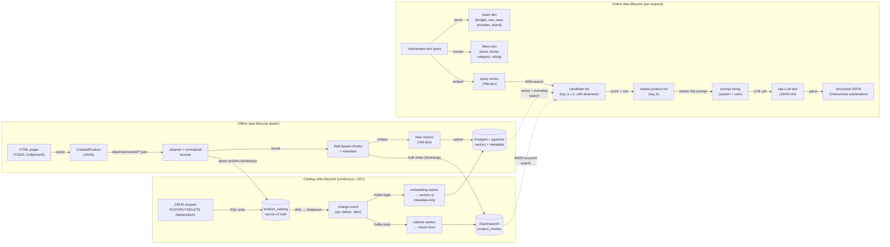

# Data Flow

This page tracks the system from a **data** perspective — what shape the data takes at each stage, where it's stored, and how it moves between components. For the control flow / algorithm steps, see [Pipeline Flow](pipeline-flow.md); for the static structure of runnable units, see [C4 Model](c4-model.md).

There are three data lifecycles: an **offline** batch lifecycle that bootstraps the catalog and both search indexes, a **continuous** CDC lifecycle that propagates every catalog write to the indexes, and an **online** per-request lifecycle that answers a user query.

## Offline: Ingestion Data Flow

| Stage | Input | Output | Format | Location | Source |
| ----- | ----- | ------ | ------ | -------- | ------ |
| Crawl | Live HTML pages | `CrawledProduct` records (specs, `spec_groups`, reviews) | JSON | `data/raw/crawled/<source>/<timestamp>.json` + `latest.json` (gitignored) | `src/crawler/pipeline.py`, `src/crawler/storage.py` |
| Load | Raw JSON/CSV | In-memory product records | Python dict/dataclass | — | `src/ingestion/product_loader.py` |
| Clean | Raw records | Normalized records (fixed encoding, deduped, currency normalized) | Python dict | — | `src/ingestion/data_cleaner.py` |
| Parse specs | Free-text specs | Structured key-value spec map | Python dict | — | `src/ingestion/spec_parser.py` |
| Chunk | Cleaned product | Field-based chunks (description, specs, pros/cons, reviews), each carrying `product_id`, `brand`, `category`, `price` metadata | List of chunk dicts | — | `src/ingestion/chunker.py` |
| Embed | Chunk text | Dense vector | `list[float]`, 768-dim (`gemini-embedding-001`) | — | `src/embedding/product_embedder.py` |
| Store | Vectors + documents + metadata | Indexed table | Postgres table with pgvector column (HNSW, cosine similarity) | Postgres (`pgdata` volume) | `src/embedding/vector_store.py` |

This whole lifecycle runs via `scripts/crawl.py` then `scripts/ingest.py` — never automatically triggered by an API request. `ingest.py` also upserts the cleaned profiles into `product_catalog` (source of truth) and bulk-indexes the chunks into Elasticsearch; with `--catalog-only` it writes just the catalog and lets the CDC workers build both indexes from the Debezium snapshot.

## Continuous: Product Write Data Flow (CDC)

Every write to the catalog (CRUD API or ingest) flows through one ordered pipeline to both search indexes:

| Stage | Input | Output | Format | Source |
| ----- | ----- | ------ | ------ | ------ |
| CRUD write | HTTP request (`/api/products`) | Row in `product_catalog` | SQL (parameterized) | `api/routes/products.py`, `src/catalog/product_repository.py` |
| Capture | WAL (logical decoding) | Debezium change event | JSON: `op` (c/u/d/r), `before`, `after` | Debezium connector (`docker/debezium/`) |
| Transport | Change event | Kafka record | Topic `ragshop.public.product_catalog` | Kafka |
| Parse | Kafka record | `ChangeEvent` | Dataclass (JSONB fields decoded) | `src/sync/events.py` |
| Index (keyword) | `ChangeEvent` | Upserted/deleted chunk docs | ES docs, id `{product_id}_{chunk_type}` | `src/sync/indexer_worker.py` |
| Index (semantic) | `ChangeEvent` | Re-embedded chunks **or** metadata-only JSONB update | pgvector rows; embedding call only when a text field changed (`content_hash`) | `src/sync/embedding_worker.py` |

Delivery is at-least-once (offsets committed after apply) and both appliers are idempotent, so replays converge. Lag makes search results *stale*, never wrong.

## Online: Per-Request Data Flow

| Stage | Input | Output | Format | Source |
| ----- | ----- | ------ | ------ | ------ |
| Ingress | HTTP request | Validated request body | Pydantic model (`api/schemas.py`) | `api/routes/*.py` |
| Input guardrail | Raw query string | Pass/reject decision | bool + reason | `src/generation/guardrails.py` |
| Route | Query string | Query type | Enum: `RECOMMEND` / `COMPARE` / `INFO` / `HYBRID` | `src/pipeline/rag_router.py` |
| Intent parse (recommend) | Query string | Intent | Dict: `budget`, `use_case`, `priorities`, `brand_pref` | `src/pipeline/recommend/user_intent_parser.py` |
| Filter extraction | Query string | Metadata filters | Dict: `price_min/max`, `brand`, `category`, `min_rating` | `src/retrieval/filter_engine.py` |
| Query embedding | Query string | Query vector | `list[float]`, 768-dim | `src/embedding/product_embedder.py` |
| Vector search | Query vector + filters | Candidates | List of `{id, document, metadata, distance}`, size `top_k x 3` | `src/embedding/vector_store.py` |
| Rerank (optional) | Candidates + query | Reordered candidates | Same shape, reordered by cross-encoder score | `src/retrieval/reranker.py` |
| Scoring | Candidates + intent | Ranked products | List sorted by `final_score`, truncated to `top_k` | `src/pipeline/recommend/scoring.py`, `src/retrieval/similarity_scorer.py` |
| Compare: alignment | 2+ products | Aligned spec table | Dict keyed by normalized spec name | `src/pipeline/compare/spec_aligner.py` |
| Compare: formatting | Aligned specs | Markdown table | String | `src/pipeline/compare/formatter.py` |
| Prompt fill | Products/table + intent | Prompt | String (`SYSTEM_PROMPT` + `USER_PROMPT_TEMPLATE`) | `src/generation/prompt_templates/*.py` |
| Generation | Prompt | Raw completion | String (expected to contain JSON) | `src/generation/llm_client.py` |
| Response parse | Raw completion | Structured result | Dict / Pydantic model | `src/generation/response_parser.py` |
| Output guardrail | Structured result | Pass/reject decision | bool + reason (checks for hallucinated product data, malformed JSON) | `src/generation/guardrails.py` |
| Egress | Structured result | HTTP response | JSON, Vietnamese user-facing text | `api/routes/*.py` |

## Data at Rest

| Location | Contents | Format | Git status | Written by | Read by |
| -------- | -------- | ------ | ---------- | ---------- | ------- |
| `data/raw/products/` | Original sample product data | JSON/CSV | Tracked | Manually curated / `scripts/seed.py` | `src/ingestion/product_loader.py` |
| `data/raw/crawled/` | Raw crawler output per source | JSON | Gitignored | `scripts/crawl.py` | `scripts/ingest.py` |
| `data/processed/` | Cleaned, normalized, chunked data | JSON | Gitignored | `src/ingestion/data_cleaner.py`, `chunker.py` | `src/embedding/product_embedder.py` |
| Postgres (`postgres` container) | Product vectors + documents + JSONB metadata (`products` table) | pgvector `vector(768)` column + HNSW index | N/A (external service, `pgdata` volume) | `src/embedding/vector_store.py` | `src/retrieval/product_retriever.py` |
| Postgres (`postgres` container) | Source-of-truth product rows (`product_catalog` table, `REPLICA IDENTITY FULL`) | SQL columns + JSONB (specs, pros, cons, tags) | N/A (`pgdata` volume) | `src/catalog/product_repository.py` (CRUD API, ingest) | Debezium (WAL), `api/routes/products.py` |
| Elasticsearch (`elasticsearch` container) | Keyword chunk documents (`product_chunks` index) | Text + keyword/numeric fields, BM25 | N/A (`esdata` volume) | `src/sync/indexer_worker.py`, ingest bootstrap | `src/retrieval/es_keyword_search.py` |
| Kafka (`kafka` container) | Product change events (`ragshop.public.product_catalog`) | Debezium JSON | N/A (`kafkadata` volume) | Debezium connector | Both sync workers |
| Redis (`redis` container) | Cache entries keyed by an MD5 hash of the call arguments (`SimpleCache.make_key`) | Key → serialized value | N/A (external service) | Intended for `src/utils/cache.py` — **currently unused**; `SimpleCache` only keeps an in-memory dict regardless of `backend` | — |

## Notes on Data Sensitivity

Queries and generated responses are user-facing Vietnamese text and are not persisted by the API layer itself (no request/response logging table in this codebase today). Product data (prices, specs, reviews) is public information already published by the crawled e-commerce sites. API keys for Anthropic/OpenAI/Gemini are read from environment variables (`.env`, not committed) and never appear in logs or responses.
