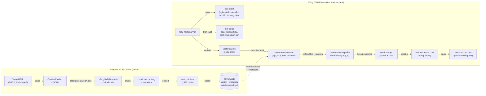

# Luồng dữ liệu

Trang này theo dõi hệ thống từ góc nhìn **dữ liệu** — dữ liệu có hình dạng gì ở mỗi giai đoạn, được lưu ở đâu, và di chuyển giữa các thành phần như thế nào. Về luồng điều khiển / các bước thuật toán, xem [Pipeline Flow](pipeline-flow.vi.md); về cấu trúc tĩnh của các đơn vị chạy được, xem [Mô hình C4](c4-model.vi.md).

Có hai vòng đời dữ liệu độc lập: vòng đời **offline** dạng batch để nạp dữ liệu vào vector store, và vòng đời **online** theo từng request để trả lời câu hỏi người dùng.

## Offline: Luồng dữ liệu Ingestion

| Giai đoạn | Đầu vào | Đầu ra | Định dạng | Vị trí | Nguồn |
| --------- | ------- | ------ | --------- | ------ | ----- |
| Crawl | Trang HTML trực tiếp | Bản ghi `CrawledProduct` (thông số, `spec_groups`, đánh giá) | JSON | `data/raw/crawled/<source>/<timestamp>.json` + `latest.json` (gitignored) | `src/crawler/pipeline.py`, `src/crawler/storage.py` |
| Load | JSON/CSV thô | Bản ghi sản phẩm trong bộ nhớ | Python dict/dataclass | — | `src/ingestion/product_loader.py` |
| Clean | Bản ghi thô | Bản ghi đã chuẩn hóa (sửa encoding, loại trùng, chuẩn hóa tiền tệ) | Python dict | — | `src/ingestion/data_cleaner.py` |
| Parse specs | Thông số dạng văn bản tự do | Map key-value có cấu trúc | Python dict | — | `src/ingestion/spec_parser.py` |
| Chunk | Sản phẩm đã làm sạch | Chunk theo trường (mô tả, thông số, ưu/nhược điểm, đánh giá), mỗi chunk kèm metadata `product_id`, `brand`, `category`, `price` | Danh sách dict chunk | — | `src/ingestion/chunker.py` |
| Embed | Văn bản chunk | Vector dày đặc | `list[float]`, 1536 chiều (`text-embedding-3-small`) | — | `src/embedding/product_embedder.py` |
| Store | Vector + document + metadata | Collection đã đánh index | Collection ChromaDB (cosine similarity) | `data/embeddings/` (gitignored) | `src/embedding/vector_store.py` |

Toàn bộ vòng đời này chạy qua `scripts/crawl.py` rồi `scripts/ingest.py` — không bao giờ tự động kích hoạt bởi một request API.

## Online: Luồng dữ liệu theo request

| Giai đoạn | Đầu vào | Đầu ra | Định dạng | Nguồn |
| --------- | ------- | ------ | --------- | ----- |
| Ingress | HTTP request | Request body đã validate | Pydantic model (`api/schemas.py`) | `api/routes/*.py` |
| Guardrail đầu vào | Chuỗi query thô | Quyết định pass/reject | bool + lý do | `src/generation/guardrails.py` |
| Route | Chuỗi query | Loại query | Enum: `RECOMMEND` / `COMPARE` / `INFO` / `HYBRID` | `src/pipeline/rag_router.py` |
| Parse intent (recommend) | Chuỗi query | Intent | Dict: `budget`, `use_case`, `priorities`, `brand_pref` | `src/pipeline/recommend/user_intent_parser.py` |
| Trích xuất filter | Chuỗi query | Bộ lọc metadata | Dict: `price_min/max`, `brand`, `category`, `min_rating` | `src/retrieval/filter_engine.py` |
| Embed query | Chuỗi query | Vector query | `list[float]`, 1536 chiều | `src/embedding/product_embedder.py` |
| Tìm kiếm vector | Vector query + filter | Candidates | Danh sách `{id, document, metadata, distance}`, kích thước `top_k x 3` | `src/embedding/vector_store.py` |
| Rerank (tùy chọn) | Candidates + query | Candidates đã sắp xếp lại | Cùng định dạng, sắp xếp lại theo điểm cross-encoder | `src/retrieval/reranker.py` |
| Chấm điểm | Candidates + intent | Sản phẩm đã xếp hạng | Danh sách sắp theo `final_score`, cắt còn `top_k` | `src/pipeline/recommend/scoring.py`, `src/retrieval/similarity_scorer.py` |
| Compare: căn chỉnh | 2+ sản phẩm | Bảng thông số đã căn chỉnh | Dict theo tên thông số đã chuẩn hóa | `src/pipeline/compare/spec_aligner.py` |
| Compare: định dạng | Thông số đã căn chỉnh | Bảng Markdown | String | `src/pipeline/compare/formatter.py` |
| Điền prompt | Sản phẩm/bảng + intent | Prompt | String (`SYSTEM_PROMPT` + `USER_PROMPT_TEMPLATE`) | `src/generation/prompt_templates/*.py` |
| Generation | Prompt | Văn bản thô | String (kỳ vọng chứa JSON) | `src/generation/llm_client.py` |
| Parse response | Văn bản thô | Kết quả có cấu trúc | Dict / Pydantic model | `src/generation/response_parser.py` |
| Guardrail đầu ra | Kết quả có cấu trúc | Quyết định pass/reject | bool + lý do (kiểm tra JSON sai định dạng, dữ liệu sản phẩm bịa đặt) | `src/generation/guardrails.py` |
| Egress | Kết quả có cấu trúc | HTTP response | JSON, văn bản tiếng Việt hiển thị cho người dùng | `api/routes/*.py` |

## Dữ liệu lưu trữ (data at rest)

| Vị trí | Nội dung | Định dạng | Trạng thái Git | Ghi bởi | Đọc bởi |
| ------ | -------- | --------- | -------------- | ------- | ------- |
| `data/raw/products/` | Dữ liệu sản phẩm mẫu gốc | JSON/CSV | Tracked | Biên soạn thủ công / `scripts/seed.py` | `src/ingestion/product_loader.py` |
| `data/raw/crawled/` | Dữ liệu thô từ crawler theo từng nguồn | JSON | Gitignored | `scripts/crawl.py` | `scripts/ingest.py` |
| `data/processed/` | Dữ liệu đã làm sạch, chuẩn hóa, chia chunk | JSON | Gitignored | `src/ingestion/data_cleaner.py`, `chunker.py` | `src/embedding/product_embedder.py` |
| `data/embeddings/` | Collection ChromaDB dạng persistent | Định dạng nội bộ Chroma (SQLite + các segment kiểu Parquet) | Gitignored | `src/embedding/vector_store.py` | `src/retrieval/product_retriever.py` |
| Redis (container `redis`) | Entry cache, khóa bằng hash MD5 của tham số gọi (`SimpleCache.make_key`) | Key → giá trị đã serialize | N/A (dịch vụ ngoài) | Dự kiến cho `src/utils/cache.py` — **hiện chưa được dùng**; `SimpleCache` chỉ giữ dict trong bộ nhớ bất kể `backend` | — |

## Lưu ý về độ nhạy cảm dữ liệu

Câu hỏi và phản hồi sinh ra là văn bản tiếng Việt hiển thị cho người dùng và hiện không được tầng API lưu lại (chưa có bảng log request/response trong codebase này). Dữ liệu sản phẩm (giá, thông số, đánh giá) là thông tin công khai đã được các trang TMĐT crawl công bố sẵn. API key cho Anthropic/OpenAI/Gemini được đọc từ biến môi trường (`.env`, không commit) và không bao giờ xuất hiện trong log hay phản hồi.
