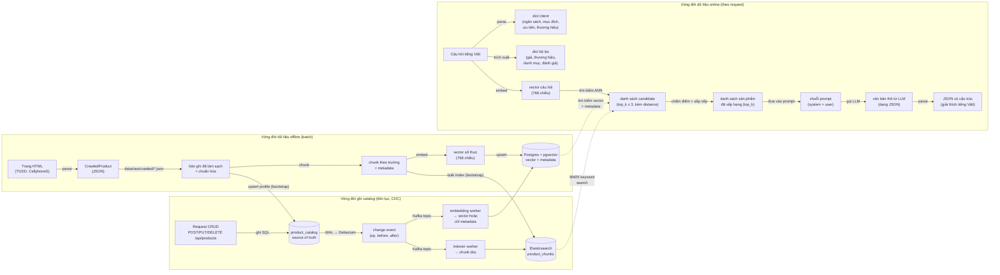

# Luồng dữ liệu

Trang này theo dõi hệ thống từ góc nhìn **dữ liệu** — dữ liệu có hình dạng gì ở mỗi giai đoạn, được lưu ở đâu, và di chuyển giữa các thành phần như thế nào. Về luồng điều khiển / các bước thuật toán, xem [Pipeline Flow](pipeline-flow.vi.md); về cấu trúc tĩnh của các đơn vị chạy được, xem [Mô hình C4](c4-model.vi.md).

Có ba vòng đời dữ liệu: vòng đời **offline** dạng batch để bootstrap catalog và cả hai index tìm kiếm, vòng đời **liên tục** (CDC) lan truyền mọi lần ghi catalog sang các index, và vòng đời **online** theo từng request để trả lời câu hỏi người dùng.

## Offline: Luồng dữ liệu Ingestion

| Giai đoạn | Đầu vào | Đầu ra | Định dạng | Vị trí | Nguồn |
| --------- | ------- | ------ | --------- | ------ | ----- |
| Crawl | Trang HTML trực tiếp | Bản ghi `CrawledProduct` (thông số, `spec_groups`, đánh giá) | JSON | `data/raw/crawled/<source>/<timestamp>.json` + `latest.json` (gitignored) | `src/crawler/pipeline.py`, `src/crawler/storage.py` |
| Load | JSON/CSV thô | Bản ghi sản phẩm trong bộ nhớ | Python dict/dataclass | — | `src/ingestion/product_loader.py` |
| Clean | Bản ghi thô | Bản ghi đã chuẩn hóa (sửa encoding, loại trùng, chuẩn hóa tiền tệ) | Python dict | — | `src/ingestion/data_cleaner.py` |
| Parse specs | Thông số dạng văn bản tự do | Map key-value có cấu trúc | Python dict | — | `src/ingestion/spec_parser.py` |
| Chunk | Sản phẩm đã làm sạch | Chunk theo trường (mô tả, thông số, ưu/nhược điểm, đánh giá), mỗi chunk kèm metadata `product_id`, `brand`, `category`, `price` | Danh sách dict chunk | — | `src/ingestion/chunker.py` |
| Embed | Văn bản chunk | Vector dày đặc | `list[float]`, 768 chiều (`gemini-embedding-001`) | — | `src/embedding/product_embedder.py` |
| Store | Vector + document + metadata | Bảng đã đánh index | Bảng Postgres với cột pgvector (HNSW, cosine similarity) | Postgres (volume `pgdata`) | `src/embedding/vector_store.py` |

Toàn bộ vòng đời này chạy qua `scripts/crawl.py` rồi `scripts/ingest.py` — không bao giờ tự động kích hoạt bởi một request API. `ingest.py` cũng upsert các profile đã làm sạch vào `product_catalog` (source of truth) và bulk-index chunk vào Elasticsearch; với `--catalog-only` nó chỉ ghi catalog và để CDC worker tự build cả hai index từ snapshot Debezium.

## Liên tục: Luồng dữ liệu ghi sản phẩm (CDC)

Mọi lần ghi catalog (API CRUD hoặc ingest) đi qua một pipeline có thứ tự duy nhất tới cả hai index tìm kiếm:

| Bước | Input | Output | Định dạng | Nguồn |
| ---- | ----- | ------ | --------- | ----- |
| Ghi CRUD | HTTP request (`/api/products`) | Row trong `product_catalog` | SQL (parameterized) | `api/routes/products.py`, `src/catalog/product_repository.py` |
| Capture | WAL (logical decoding) | Debezium change event | JSON: `op` (c/u/d/r), `before`, `after` | Debezium connector (`docker/debezium/`) |
| Vận chuyển | Change event | Kafka record | Topic `ragshop.public.product_catalog` | Kafka |
| Parse | Kafka record | `ChangeEvent` | Dataclass (JSONB đã decode) | `src/sync/events.py` |
| Index (keyword) | `ChangeEvent` | Chunk doc upsert/delete | ES doc, id `{product_id}_{chunk_type}` | `src/sync/indexer_worker.py` |
| Index (semantic) | `ChangeEvent` | Re-embed chunk **hoặc** update metadata JSONB | Row pgvector; chỉ gọi embedding khi trường text đổi (`content_hash`) | `src/sync/embedding_worker.py` |

Delivery là at-least-once (commit offset sau khi áp xong) và cả hai applier đều idempotent, nên replay luôn hội tụ. Lag chỉ làm kết quả tìm kiếm bị *trễ*, không bao giờ sai.

## Online: Luồng dữ liệu theo request

| Giai đoạn | Đầu vào | Đầu ra | Định dạng | Nguồn |
| --------- | ------- | ------ | --------- | ----- |
| Ingress | HTTP request | Request body đã validate | Pydantic model (`api/schemas.py`) — độ dài `query`, khoảng `top_k`, whitelist `filters`, định dạng/số lượng `product_ids` | `api/routes/*.py`, `api/schemas.py` |
| Guardrail đầu vào | Chuỗi query thô | `GuardrailResult` (`allow`/`sanitize`/`block`) + query đã sanitize | Normalize → heuristic (độ dài/URL/code/ký tự lặp) → regex injection; `block` raise `InputGuardrailBlocked` → `HTTP 422` | `src/guardrails/input/` |
| Route | Chuỗi query | Loại query | Enum: `RECOMMEND` / `COMPARE` / `INFO` / `HYBRID` | `src/pipeline/rag_router.py` |
| Parse intent (recommend) | Chuỗi query | Intent | Dict: `budget`, `use_case`, `priorities`, `brand_pref` | `src/pipeline/recommend/user_intent_parser.py` |
| Trích xuất filter | Chuỗi query | Bộ lọc metadata | Dict: `price_min/max`, `brand`, `category`, `min_rating` | `src/retrieval/filter_engine.py` |
| Embed query | Chuỗi query | Vector query | `list[float]`, 768 chiều | `src/embedding/product_embedder.py` |
| Tìm kiếm vector | Vector query + filter | Candidates | Danh sách `{id, document, metadata, distance}`, kích thước `top_k x 3` | `src/embedding/vector_store.py` |
| Rerank (tùy chọn) | Candidates + query | Candidates đã sắp xếp lại | Cùng định dạng, sắp xếp lại theo điểm cross-encoder | `src/retrieval/reranker.py` |
| Chấm điểm | Candidates + intent | Sản phẩm đã xếp hạng | Danh sách sắp theo `final_score`, cắt còn `top_k` | `src/pipeline/recommend/scoring.py`, `src/retrieval/similarity_scorer.py` |
| Compare: căn chỉnh | 2+ sản phẩm | Bảng thông số đã căn chỉnh | Dict theo tên thông số đã chuẩn hóa | `src/pipeline/compare/spec_aligner.py` |
| Compare: định dạng | Thông số đã căn chỉnh | Bảng Markdown | String | `src/pipeline/compare/formatter.py` |
| Guardrail ngữ cảnh | Trường sản phẩm đã truy xuất/so sánh (name, brand, document/description) | Giá trị trường đã sanitize | Bỏ HTML/`<script>`, thay câu chứa chỉ dẫn giả mạo, cắt còn `max_context_field_chars` (mặc định 300) | `src/guardrails/context/sanitizer.py` |
| Điền prompt | Sản phẩm/bảng đã sanitize + intent | Prompt | String (`SYSTEM_PROMPT` + `USER_PROMPT_TEMPLATE`) | `src/generation/prompt_templates/*.py` |
| Generation | Prompt | Văn bản thô | String (kỳ vọng chứa JSON) | `src/generation/llm_client.py` |
| Parse response | Văn bản thô | Dict đã parse hoặc `None` | Parse JSON trực tiếp, fallback trích xuất từ markdown-fence | `src/generation/response_parser.py` |
| Guardrail đầu ra | Dict đã parse | `GuardrailResult` — payload đã validate, hoặc `block` | Validate schema Pydantic (`RecommendLLMOutput`/`CompareLLMOutput`) đúng contract JSON của prompt | `src/guardrails/output/schemas.py`, `validator.py` |
| Grounding | Item đã validate + sản phẩm đã truy xuất/so sánh | Item đã grounding + `warnings[]` | Loại item có `name` không khớp sản phẩm đã truy xuất/so sánh (không phân biệt hoa/thường, khoảng trắng) | `src/guardrails/output/grounding.py` |
| Fallback (khi schema thất bại hoặc grounding rỗng) | Sản phẩm đã truy xuất/so sánh | Kết quả có cấu trúc tất định | Dựng từ candidate đã có sẵn — **không gọi lại LLM** | `src/guardrails/fallback.py` |
| Egress | Kết quả có cấu trúc + `warnings[]` | HTTP response | JSON, văn bản tiếng Việt hiển thị cho người dùng | `api/routes/*.py` |

## Dữ liệu lưu trữ (data at rest)

| Vị trí | Nội dung | Định dạng | Trạng thái Git | Ghi bởi | Đọc bởi |
| ------ | -------- | --------- | -------------- | ------- | ------- |
| `data/raw/products/` | Dữ liệu sản phẩm mẫu gốc | JSON/CSV | Tracked | Biên soạn thủ công / `scripts/seed.py` | `src/ingestion/product_loader.py` |
| `data/raw/crawled/` | Dữ liệu thô từ crawler theo từng nguồn | JSON | Gitignored | `scripts/crawl.py` | `scripts/ingest.py` |
| `data/processed/` | Dữ liệu đã làm sạch, chuẩn hóa, chia chunk | JSON | Gitignored | `src/ingestion/data_cleaner.py`, `chunker.py` | `src/embedding/product_embedder.py` |
| Postgres (container `postgres`) | Vector sản phẩm + document + metadata JSONB (bảng `products`) | Cột pgvector `vector(768)` + chỉ mục HNSW | N/A (dịch vụ ngoài, volume `pgdata`) | `src/embedding/vector_store.py` | `src/retrieval/product_retriever.py` |
| Postgres (container `postgres`) | Row sản phẩm source-of-truth (bảng `product_catalog`, `REPLICA IDENTITY FULL`) | Cột SQL + JSONB (specs, pros, cons, tags) | N/A (volume `pgdata`) | `src/catalog/product_repository.py` (API CRUD, ingest) | Debezium (WAL), `api/routes/products.py` |
| Elasticsearch (container `elasticsearch`) | Chunk document keyword (index `product_chunks`) | Text + trường keyword/số, BM25 | N/A (volume `esdata`) | `src/sync/indexer_worker.py`, ingest bootstrap | `src/retrieval/es_keyword_search.py` |
| Kafka (container `kafka`) | Sự kiện thay đổi sản phẩm (`ragshop.public.product_catalog`) | Debezium JSON | N/A (volume `kafkadata`) | Debezium connector | Cả hai sync worker |
| Redis (container `redis`) | Entry cache, khóa bằng hash MD5 của tham số gọi (`SimpleCache.make_key`) | Key → giá trị đã serialize | N/A (dịch vụ ngoài) | Dự kiến cho `src/utils/cache.py` — **hiện chưa được dùng**; `SimpleCache` chỉ giữ dict trong bộ nhớ bất kể `backend` | — |

## Lưu ý về độ nhạy cảm dữ liệu

Câu hỏi và phản hồi sinh ra là văn bản tiếng Việt hiển thị cho người dùng và hiện không được tầng API lưu lại (chưa có bảng log request/response trong codebase này). Dữ liệu sản phẩm (giá, thông số, đánh giá) là thông tin công khai đã được các trang TMĐT crawl công bố sẵn. API key cho Anthropic/OpenAI/Gemini được đọc từ biến môi trường (`.env`, không commit) và không bao giờ xuất hiện trong log hay phản hồi.
