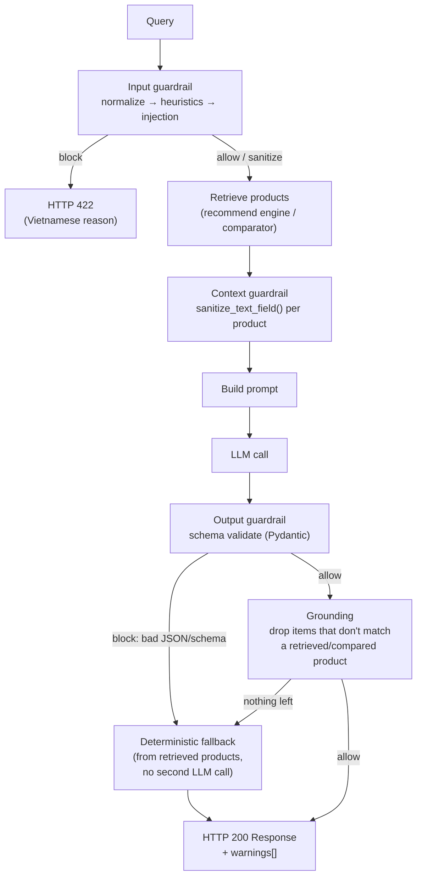

# Guardrails

Non-LLM guardrails protect both API endpoints (`/api/recommend`, `/api/compare`) at three points in the request lifecycle: the raw user **query** (input), the retrieved **product data** injected into the prompt (context), and the **LLM's JSON response** (output). None of these checks call an LLM — they are pure rule/heuristic/schema code, so they're fast, free, and deterministic.

This complements the schema-level validation in [Request & Response Schemas](../api/schemas.md) (Pydantic `Field` constraints on the API models) — schema checks reject malformed *requests*; the guardrails described here additionally catch things schema types can't express (prompt injection phrasing, hallucinated products, malformed LLM JSON).

**Source:** `src/guardrails/` (package), integrated into `src/pipeline/recommend_pipeline.py` and `src/pipeline/compare_pipeline.py`.

## Contract

Every guardrail — input, context, or output — returns the same result shape, with three possible actions:

| Action | Meaning | What happens next |
| ------ | ------- | ------------------ |
| `allow` | Data is fine as-is. | Continue the pipeline unchanged. |
| `sanitize` | Data was modified (cleaned, truncated, item dropped) but is still usable. | Continue with the sanitized version; a human-readable note is added to `warnings`. |
| `block` | Data must not be used. | **Input side:** the pipeline raises `InputGuardrailBlocked`; the API route maps it to `HTTP 422` with a Vietnamese `reason`. **Output side:** the pipeline never raises — it falls back to a deterministic response built from data already retrieved (no second LLM call), so the API still returns `200`. |

```python
@dataclass
class GuardrailResult:
    action: GuardrailAction   # allow | sanitize | block
    valid: bool
    reason: str | None
    warnings: list[str]
    sanitized_text: str | None
    sanitized_payload: dict | None
```

**Source:** `src/guardrails/types.py`

## Where guardrails run



Both `RecommendPipeline.run()` and `ComparePipeline.run()` follow this exact sequence. `warnings` accumulates human-readable Vietnamese notes from every `sanitize` step along the way and is returned to the client in the `warnings` field of `RecommendResponse` / `CompareResponse`.

## 1. Input guardrail — reject or clean the raw query

Runs first, before retrieval, so nothing bad reaches the vector store, the LLM prompt, or the logs unsanitized. Built as a `GuardrailChain` of three checks, run in order and short-circuited on the first `block`:

| Order | Guardrail | Checks | Action |
| ----- | --------- | ------ | ------ |
| 1 | `NormalizeGuardrail` | Unicode NFC, strips control characters, collapses whitespace | Always `sanitize` (never blocks) |
| 2 | `HeuristicGuardrail` | Blank/too short/too long query, too many URLs, fenced code blocks, abnormally repeated characters | `block` on length/URL/code violations; `sanitize` (collapse repeats) otherwise |
| 3 | `InjectionGuardrail` | Regex denylist for prompt-injection/jailbreak phrasing — English (*"ignore previous instructions"*, *"reveal your system prompt"*) and Vietnamese (*"bỏ qua hướng dẫn trước"*, *"tiết lộ system prompt"*) | `block` on match |

```python
from src.guardrails import build_input_chain

chain = build_input_chain()          # or build_input_chain(GuardrailConfig(...))
result = chain.run(raw_query)
if result.blocked:
    raise InputGuardrailBlocked(reason=result.reason, warnings=result.warnings)
query = result.sanitized_text or raw_query
```

`ComparePipeline.run()` only runs this chain when a `query` string is provided — a pure `product_ids` request has no free-text query to check.

**Source:** `src/guardrails/input/` (`normalize.py`, `heuristics.py`, `injection.py`, `__init__.py`)

## 2. Context guardrail — sanitize retrieved product text

Product descriptions/documents originate from **crawled third-party pages** and must be treated as untrusted text before they're interpolated into an LLM prompt: a malicious or malformed product description could otherwise smuggle an instruction ("ignore previous instructions...") straight into the prompt.

`sanitize_text_field()` strips HTML/`<script>` tags, replaces sentences matching the same injection patterns with a placeholder, collapses whitespace, and truncates to `GuardrailConfig.max_context_field_chars` (default 300). Both pipelines' `_build_context()` methods run every free-text field (name, brand, document/description) through it, and only pass the fields the prompt actually needs — no raw document blob is ever dumped into the prompt.

**Source:** `src/guardrails/context/sanitizer.py`

## 3. Output guardrail — schema validation, then grounding

### 3a. Schema validation

The LLM's raw text is parsed as JSON (reusing `ResponseParser`'s direct + markdown-fence extraction) and validated against a Pydantic model that mirrors the exact JSON contract requested in the prompt template:

| Pipeline | Model | Mirrors |
| -------- | ----- | ------- |
| Recommend | `RecommendLLMOutput` (`recommendations: list[RecommendationItem]`, `summary`) | `src/generation/prompt_templates/recommend_prompt.py` |
| Compare | `CompareLLMOutput` (`criteria_comparison`, `product_analysis: list[ProductAnalysis]`, `conclusion`) | `src/generation/prompt_templates/compare_prompt.py` |

Any parse failure, missing required field, or wrong type → `block`. **Keep these models in sync** whenever a prompt template's JSON contract changes.

**Source:** `src/guardrails/output/schemas.py`, `src/guardrails/output/validator.py`

### 3b. Grounding

Even when the JSON is well-formed, the LLM can still *hallucinate* a product name that was never retrieved. `ground_recommendations()` / `ground_compare_analysis()` compare every item's `name` (case/whitespace-insensitive) against the retrieved/compared product list and drop anything that doesn't match, adding a `warnings` entry with the count dropped. If *every* item gets dropped, the pipeline treats it the same as a schema failure and falls back.

**Source:** `src/guardrails/output/grounding.py`

### 3c. Fallback

When schema validation fails, or grounding empties the result, `build_recommend_fallback()` / `build_compare_fallback()` build a response straight from the candidates already retrieved/compared — **no second LLM call**. For recommend this means the top-`k` already-scored products with a generic Vietnamese reason string; for compare it means an empty `criteria_comparison` plus one `product_analysis` entry per product with a note pointing at the raw comparison table. This guarantees the API always returns a schema-valid `200` response, never an internal error, even when the LLM output is unusable.

**Source:** `src/guardrails/fallback.py`

## Package layout

```
src/guardrails/
├── __init__.py            # public exports + docstring extension guide
├── types.py                # GuardrailAction, GuardrailResult
├── base.py                 # BaseGuardrail (ABC) + GuardrailChain (short-circuits on block)
├── config.py                # GuardrailConfig — every threshold in one place
├── exceptions.py            # InputGuardrailBlocked
├── logging_utils.py         # log_guardrail_event() — structured "guardrail=... action=... reason=..." logs
│
├── input/                   # §1 above
│   ├── normalize.py
│   ├── heuristics.py
│   └── injection.py
│
├── context/                 # §2 above
│   └── sanitizer.py
│
├── output/                  # §3a/§3b above
│   ├── schemas.py
│   ├── validator.py
│   └── grounding.py
│
└── fallback.py               # §3c above
```

The legacy `src/generation/guardrails.py` (a single `Guardrails` class) is superseded by this package and no longer used by either pipeline — it stays in the tree only as dead code until removed.

## Configuration

Every threshold lives in `GuardrailConfig` (`src/guardrails/config.py`) — never hardcoded inside a guardrail module:

| Field | Default | Used by |
| ----- | ------- | ------- |
| `min_query_length` / `max_query_length` | `1` / `2000` | `HeuristicGuardrail` |
| `max_url_count` | `3` | `HeuristicGuardrail` |
| `max_code_block_markers` | `2` | `HeuristicGuardrail` |
| `repeated_char_threshold` / `repeated_char_collapse_to` | `8` / `3` | `HeuristicGuardrail` |
| `max_context_field_chars` | `300` | `context/sanitizer.py` |
| `max_context_products` | `10` | `RecommendPipeline._build_context()` |
| `max_compare_products` | `5` | `ComparePipeline.run()` |

Each pipeline accepts an optional `guardrail_config: GuardrailConfig` constructor argument, defaulting to `GuardrailConfig()`.

## API-level errors

| Layer | Failure | HTTP status | Detail |
| ----- | ------- | ------------ | ------ |
| Pydantic request schema | Blank/too-long `query`, `top_k` out of `1..10`, unknown `filters` key, neither `query` nor `product_ids`, malformed/too many `product_ids` | `422` | FastAPI's default validation error body |
| Input guardrail (`InputGuardrailBlocked`) | Prompt injection, abnormal length/URLs/code, blank after normalization | `422` | The guardrail's Vietnamese `reason` |
| Compare: fewer than 2 valid products | `< 2` products resolved from `product_ids` or query extraction | `422` | *"Cần ít nhất 2 sản phẩm để so sánh."* |
| Output guardrail | *(never surfaces as an error)* | `200` | Deterministic fallback response, plus `warnings[]` explaining what was replaced |
| Pipeline/provider failure (DB, LLM quota, network) | Unrelated to guardrails | `503` | Existing quota/generic error mapping (unchanged) |

See [API Endpoints](../api/endpoints.md) for the full error tables per route.

## Extending

- **New input check** — subclass `BaseGuardrail` in `src/guardrails/input/`, implement `check(text) -> GuardrailResult`, add an instance to the list in `input.build_input_chain()`.
- **New output field/shape** — update the matching Pydantic model in `output/schemas.py`, keeping it in sync with the prompt template's JSON contract.
- **New threshold** — add a field to `GuardrailConfig`; never hardcode a number inside a guardrail module.
- **Guardrails for a new pipeline** (e.g. `/api/search`) — reuse `build_input_chain()` and `sanitize_text_field()` directly; no need to write new primitives.

## Testing

| Test file | Covers |
| --------- | ------ |
| `tests/unit/guardrails/test_input.py` | Normalize / injection / heuristic / chain short-circuiting |
| `tests/unit/guardrails/test_output.py` | Schema validation, grounding, fallback builders |
| `tests/unit/api/test_schemas.py` | Pydantic request-schema validators |
| `tests/unit/pipeline/test_recommend_pipeline.py`, `test_compare_pipeline.py` | Full guardrail wiring inside each pipeline (fake engine/LLM client, no DB/network) |
| `tests/unit/api/routes/test_recommend.py`, `test_compare.py` | `InputGuardrailBlocked` → `422` mapping at the route layer |

See [Testing](../development/testing.md) for how to run the suite.
