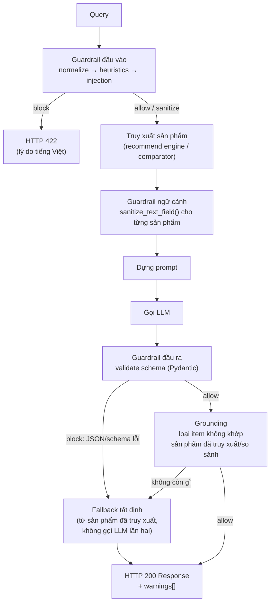

# Guardrail

Các guardrail không dùng LLM bảo vệ cả hai API endpoint (`/api/recommend`, `/api/compare`) tại ba điểm trong vòng đời request: **truy vấn** thô của người dùng (đầu vào), **dữ liệu sản phẩm** đã truy xuất được đưa vào prompt (ngữ cảnh), và **response JSON của LLM** (đầu ra). Không guardrail nào trong số này gọi LLM — tất cả đều là code rule/heuristic/schema thuần túy, nên nhanh, miễn phí và tất định (deterministic).

Cơ chế này bổ sung cho việc validate ở tầng schema trong [Schema Request & Response](../api/schemas.vi.md) (ràng buộc `Field` của Pydantic trên các model API) — kiểm tra schema từ chối các *request* sai định dạng; các guardrail được mô tả ở đây bắt thêm những thứ mà kiểu dữ liệu schema không thể diễn đạt được (câu chữ prompt injection, sản phẩm bị "bịa", JSON LLM sai định dạng).

**Nguồn:** `src/guardrails/` (package), được tích hợp vào `src/pipeline/recommend_pipeline.py` và `src/pipeline/compare_pipeline.py`.

## Hợp đồng (Contract)

Mọi guardrail — đầu vào, ngữ cảnh, hay đầu ra — đều trả về cùng một dạng kết quả, với ba action khả dĩ:

| Action | Ý nghĩa | Điều gì xảy ra tiếp theo |
| ------ | ------- | ------------------------- |
| `allow` | Dữ liệu ổn, giữ nguyên. | Pipeline tiếp tục không đổi. |
| `sanitize` | Dữ liệu đã được chỉnh sửa (làm sạch, cắt bớt, loại bỏ item) nhưng vẫn dùng được. | Tiếp tục với phiên bản đã sanitize; một ghi chú dễ đọc được thêm vào `warnings`. |
| `block` | Dữ liệu không được phép dùng. | **Phía đầu vào:** pipeline raise `InputGuardrailBlocked`; route API map thành `HTTP 422` kèm `reason` tiếng Việt. **Phía đầu ra:** pipeline không bao giờ raise — nó fallback về một response tất định dựng từ dữ liệu đã truy xuất sẵn (không gọi LLM lần hai), nên API vẫn trả về `200`. |

```python
@dataclass
class GuardrailResult:
    action: GuardrailAction   # allow | sanitize | block
    valid: bool
    reason: str | None
    warnings: list[str]
    sanitized_text: str | None
    sanitized_payload: dict | None
```

**Nguồn:** `src/guardrails/types.py`

## Guardrail chạy ở đâu



Cả `RecommendPipeline.run()` lẫn `ComparePipeline.run()` đều tuân theo đúng trình tự này. `warnings` tích lũy các ghi chú tiếng Việt dễ đọc từ mỗi bước `sanitize` dọc đường và được trả về client trong trường `warnings` của `RecommendResponse` / `CompareResponse`.

## 1. Guardrail đầu vào — từ chối hoặc làm sạch truy vấn thô

Chạy đầu tiên, trước khi truy xuất, để không có gì xấu lọt tới vector store, prompt LLM, hay log mà chưa được sanitize. Được xây dựng dưới dạng một `GuardrailChain` gồm ba bước kiểm tra, chạy theo thứ tự và short-circuit ngay khi gặp `block` đầu tiên:

| Thứ tự | Guardrail | Kiểm tra | Action |
| ----- | --------- | ------ | ------ |
| 1 | `NormalizeGuardrail` | Unicode NFC, loại control character, gộp khoảng trắng | Luôn `sanitize` (không bao giờ block) |
| 2 | `HeuristicGuardrail` | Query rỗng/quá ngắn/quá dài, quá nhiều URL, code block dạng fenced, ký tự lặp bất thường | `block` khi vi phạm độ dài/URL/code; `sanitize` (gộp ký tự lặp) trong các trường hợp còn lại |
| 3 | `InjectionGuardrail` | Denylist regex cho câu chữ prompt-injection/jailbreak — tiếng Anh (*"ignore previous instructions"*, *"reveal your system prompt"*) và tiếng Việt (*"bỏ qua hướng dẫn trước"*, *"tiết lộ system prompt"*) | `block` khi khớp |

```python
from src.guardrails import build_input_chain

chain = build_input_chain()          # hoặc build_input_chain(GuardrailConfig(...))
result = chain.run(raw_query)
if result.blocked:
    raise InputGuardrailBlocked(reason=result.reason, warnings=result.warnings)
query = result.sanitized_text or raw_query
```

`ComparePipeline.run()` chỉ chạy chain này khi có `query` dạng string — request chỉ có `product_ids` không có truy vấn dạng text tự do để kiểm tra.

**Nguồn:** `src/guardrails/input/` (`normalize.py`, `heuristics.py`, `injection.py`, `__init__.py`)

## 2. Guardrail ngữ cảnh — sanitize text sản phẩm đã truy xuất

Mô tả/document sản phẩm bắt nguồn từ **các trang bên thứ ba đã crawl** và phải được coi là text không đáng tin trước khi được nội suy vào prompt LLM: một mô tả sản phẩm độc hại hoặc sai định dạng có thể "buôn lậu" một chỉ thị ("ignore previous instructions...") thẳng vào prompt nếu không được kiểm tra.

`sanitize_text_field()` loại bỏ tag HTML/`<script>`, thay thế các câu khớp cùng pattern injection bằng placeholder, gộp khoảng trắng, và cắt bớt theo `GuardrailConfig.max_context_field_chars` (mặc định 300). Phương thức `_build_context()` của cả hai pipeline chạy mọi trường text tự do (name, brand, document/description) qua hàm này, và chỉ truyền các trường mà prompt thực sự cần — không bao giờ đổ nguyên khối document thô vào prompt.

**Nguồn:** `src/guardrails/context/sanitizer.py`

## 3. Guardrail đầu ra — validate schema, sau đó grounding

### 3a. Validate schema

Text thô của LLM được parse thành JSON (tái sử dụng cơ chế extract trực tiếp + markdown-fence của `ResponseParser`) và validate theo một Pydantic model phản ánh đúng hợp đồng JSON được yêu cầu trong prompt template:

| Pipeline | Model | Phản ánh |
| -------- | ----- | ------- |
| Recommend | `RecommendLLMOutput` (`recommendations: list[RecommendationItem]`, `summary`) | `src/generation/prompt_templates/recommend_prompt.py` |
| Compare | `CompareLLMOutput` (`criteria_comparison`, `product_analysis: list[ProductAnalysis]`, `conclusion`) | `src/generation/prompt_templates/compare_prompt.py` |

Bất kỳ lỗi parse, trường bắt buộc bị thiếu, hay sai kiểu nào → `block`. **Phải giữ các model này đồng bộ** mỗi khi hợp đồng JSON của một prompt template thay đổi.

**Nguồn:** `src/guardrails/output/schemas.py`, `src/guardrails/output/validator.py`

### 3b. Grounding

Ngay cả khi JSON đúng định dạng, LLM vẫn có thể "bịa" ra một tên sản phẩm chưa từng được truy xuất. `ground_recommendations()` / `ground_compare_analysis()` so khớp `name` của từng item (không phân biệt hoa/thường, khoảng trắng) với danh sách sản phẩm đã truy xuất/so sánh và loại bỏ những gì không khớp, thêm một mục vào `warnings` ghi rõ số lượng đã loại. Nếu *toàn bộ* item đều bị loại, pipeline xử lý giống như một lỗi schema và fallback.

**Nguồn:** `src/guardrails/output/grounding.py`

### 3c. Fallback

Khi validate schema thất bại, hoặc grounding làm rỗng kết quả, `build_recommend_fallback()` / `build_compare_fallback()` dựng một response thẳng từ các ứng viên đã truy xuất/so sánh sẵn — **không gọi LLM lần hai**. Với recommend, đó là top-`k` sản phẩm đã được chấm điểm sẵn kèm một chuỗi lý do tiếng Việt chung chung; với compare, đó là `criteria_comparison` rỗng cộng với một entry `product_analysis` cho mỗi sản phẩm kèm ghi chú trỏ tới bảng so sánh thô. Điều này đảm bảo API luôn trả về một response `200` hợp lệ schema, không bao giờ là lỗi nội bộ, kể cả khi output của LLM không dùng được.

**Nguồn:** `src/guardrails/fallback.py`

## Cấu trúc package

```
src/guardrails/
├── __init__.py            # export công khai + docstring hướng dẫn mở rộng
├── types.py                # GuardrailAction, GuardrailResult
├── base.py                 # BaseGuardrail (ABC) + GuardrailChain (short-circuit khi block)
├── config.py                # GuardrailConfig — tất cả ngưỡng ở một chỗ
├── exceptions.py            # InputGuardrailBlocked
├── logging_utils.py         # log_guardrail_event() — log dạng cấu trúc "guardrail=... action=... reason=..."
│
├── input/                   # §1 ở trên
│   ├── normalize.py
│   ├── heuristics.py
│   └── injection.py
│
├── context/                 # §2 ở trên
│   └── sanitizer.py
│
├── output/                  # §3a/§3b ở trên
│   ├── schemas.py
│   ├── validator.py
│   └── grounding.py
│
└── fallback.py               # §3c ở trên
```

`src/generation/guardrails.py` (class `Guardrails` cũ) đã được thay thế bởi package này và không còn được pipeline nào dùng — nó vẫn nằm trong cây thư mục như dead code cho tới khi bị xóa.

## Cấu hình

Mọi ngưỡng đều nằm trong `GuardrailConfig` (`src/guardrails/config.py`) — không bao giờ hardcode bên trong một module guardrail:

| Trường | Mặc định | Dùng bởi |
| ----- | ------- | ------- |
| `min_query_length` / `max_query_length` | `1` / `2000` | `HeuristicGuardrail` |
| `max_url_count` | `3` | `HeuristicGuardrail` |
| `max_code_block_markers` | `2` | `HeuristicGuardrail` |
| `repeated_char_threshold` / `repeated_char_collapse_to` | `8` / `3` | `HeuristicGuardrail` |
| `max_context_field_chars` | `300` | `context/sanitizer.py` |
| `max_context_products` | `10` | `RecommendPipeline._build_context()` |
| `max_compare_products` | `5` | `ComparePipeline.run()` |

Mỗi pipeline nhận một tham số constructor tùy chọn `guardrail_config: GuardrailConfig`, mặc định là `GuardrailConfig()`.

## Lỗi ở tầng API

| Lớp | Lỗi | HTTP status | Chi tiết |
| ----- | ------- | ------------ | ------ |
| Schema request Pydantic | `query` rỗng/quá dài, `top_k` ngoài khoảng `1..10`, key `filters` lạ, thiếu cả `query` lẫn `product_ids`, `product_ids` sai định dạng/quá nhiều | `422` | Body lỗi validate mặc định của FastAPI |
| Guardrail đầu vào (`InputGuardrailBlocked`) | Prompt injection, độ dài/URL/code bất thường, rỗng sau khi normalize | `422` | `reason` tiếng Việt của guardrail |
| Compare: ít hơn 2 sản phẩm hợp lệ | `< 2` sản phẩm được xác định từ `product_ids` hoặc trích xuất từ query | `422` | *"Cần ít nhất 2 sản phẩm để so sánh."* |
| Guardrail đầu ra | *(không bao giờ hiện ra như một lỗi)* | `200` | Response fallback tất định, kèm `warnings[]` giải thích những gì đã bị thay thế |
| Lỗi pipeline/provider (DB, quota LLM, network) | Không liên quan tới guardrail | `503` | Cơ chế map lỗi quota/lỗi chung hiện có (không đổi) |

Xem [API Endpoints](../api/endpoints.vi.md) để biết đầy đủ bảng lỗi theo từng route.

## Mở rộng

- **Thêm kiểm tra đầu vào mới** — kế thừa `BaseGuardrail` trong `src/guardrails/input/`, implement `check(text) -> GuardrailResult`, thêm một instance vào danh sách trong `input.build_input_chain()`.
- **Thêm trường/hình dạng đầu ra mới** — cập nhật Pydantic model tương ứng trong `output/schemas.py`, giữ đồng bộ với hợp đồng JSON của prompt template.
- **Thêm ngưỡng mới** — thêm một trường vào `GuardrailConfig`; không bao giờ hardcode một con số bên trong module guardrail.
- **Guardrail cho một pipeline mới** (ví dụ `/api/search`) — tái sử dụng trực tiếp `build_input_chain()` và `sanitize_text_field()`; không cần viết primitive mới.

## Testing

| File test | Bao phủ |
| --------- | ------ |
| `tests/unit/guardrails/test_input.py` | Normalize / injection / heuristic / short-circuit của chain |
| `tests/unit/guardrails/test_output.py` | Validate schema, grounding, các hàm dựng fallback |
| `tests/unit/api/test_schemas.py` | Validator schema request Pydantic |
| `tests/unit/pipeline/test_recommend_pipeline.py`, `test_compare_pipeline.py` | Toàn bộ dây nối guardrail bên trong từng pipeline (engine/LLM client giả, không DB/network) |
| `tests/unit/api/routes/test_recommend.py`, `test_compare.py` | Map `InputGuardrailBlocked` → `422` ở tầng route |

Xem [Testing](../development/testing.vi.md) để biết cách chạy bộ test.
