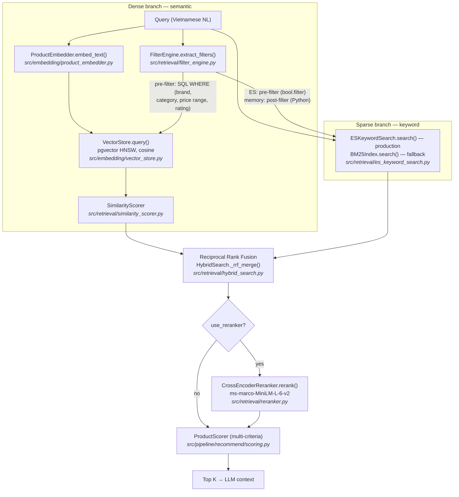
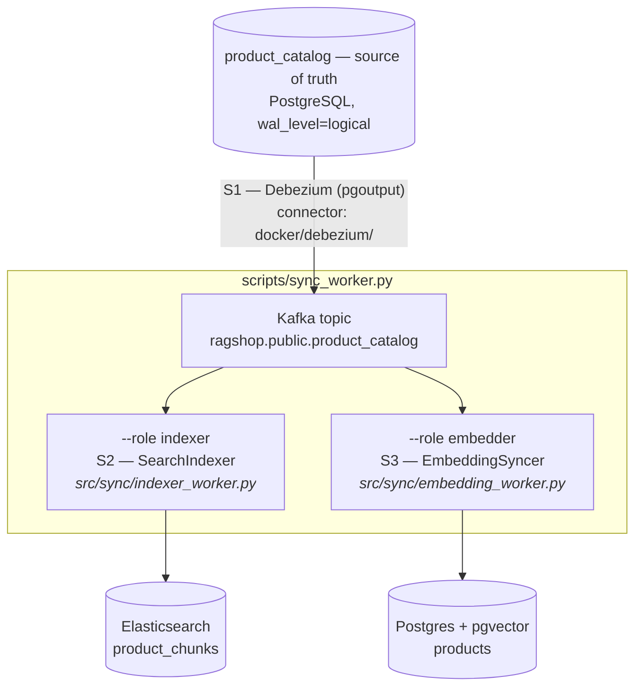

# Hybrid Retrieval & Reranking

The recommend flow (`POST /api/recommend`) retrieves candidates with a **hybrid
strategy**: dense semantic search (pgvector) fused with sparse keyword search
(BM25) via Reciprocal Rank Fusion, optionally followed by **cross-encoder
reranking**. In production the keyword branch is served by **Elasticsearch**,
kept fresh through CDC (Debezium + Kafka); an in-memory BM25 snapshot remains
as an automatic fallback for development. This page explains each technique
and exactly where it runs in the code.

## End-to-end flow



## Dense branch: semantic search

The query is embedded (`embedding_provider` in `configs/settings.yaml`) and
matched against product chunks in Postgres + pgvector using cosine distance
over an HNSW index. Metadata filters extracted by `FilterEngine` are pushed
down as SQL `WHERE` conditions, so e.g. over-budget products never become
candidates. Relevance is `1 - cosine_distance`, refined by `SimilarityScorer`.

## Sparse branch: BM25 keyword search

Dense retrieval can miss **exact-term** matches: model numbers ("A55",
"14 Pro"), spec tokens ("120Hz", "5000mAh"), or rare Vietnamese terms the
embedding model underweights. BM25 (Okapi) fills that gap. Two backends
implement it (`keyword_backend` in `configs/settings.yaml`):

### Elasticsearch (production, `keyword_backend: elasticsearch`)

`src/retrieval/es_keyword_search.py`. One shared index (`product_chunks`,
one document per chunk, id `{product_id}_{chunk_type}`), kept fresh by the
CDC sync workers — no startup snapshot, no per-worker RAM, no staleness.
The extracted filters are pushed into the query itself as `bool.filter`
clauses (term `brand`/`category`, range `price`/`avg_rating`), so the keyword
branch **pre-filters** exactly like the SQL branch. Standard tokenizer +
lowercase keeps Vietnamese diacritics intact ("trâu" ≠ "trau").

If Elasticsearch is unreachable at startup, `get_searcher()` falls back to
the in-memory backend; if a query fails mid-flight, that request degrades to
semantic-only. The API never breaks because of the keyword branch.

### In-memory snapshot (fallback, `keyword_backend: memory`)

`src/retrieval/keyword_search.py`. Pure-Python Okapi BM25 (`k1 = 1.5`,
`b = 0.75`, smoothed IDF `log(1 + (N - df + 0.5) / (df + 0.5))`), built once
at API startup from `VectorStore.list_documents()`:

```text
score(q, d) = Σ_t∈q  IDF(t) · tf(t,d)·(k1+1) / ( tf(t,d) + k1·(1 - b + b·|d|/avgdl) )
```

Filters are re-applied in Python (`HybridSearch._matches_filters`) to every
hit — a **post-filter**. Fine for development and small static corpora;
its trade-offs (stale snapshot, per-worker copies) are why production uses
Elasticsearch.

## Where filtering happens: pre-filter vs post-filter

All branches enforce the **same** filter set from
`FilterEngine.extract_filters()` (brand, category, price range, min rating):

| Branch | Strategy | Where |
|---|---|---|
| Dense (pgvector) | **Pre-filter** | SQL `WHERE` inside the vector query (`ProductRetriever._build_where_clause()`) |
| Keyword — Elasticsearch | **Pre-filter** | `bool.filter` inside the ES query (`es_keyword_search.build_bool_query()`) |
| Keyword — in-memory fallback | **Post-filter** | Python, after search (`HybridSearch._matches_filters()`) |

Pre-filtering means only rows/documents that already satisfy the constraints
are ranked — the branch always fills its candidate quota when matching data
exists. The post-filtering fallback searches its whole snapshot first and
drops non-matching hits after, so a tight budget can leave it with few or
zero candidates (it does not go back for more). The end guarantee is
identical everywhere: no product violating the extracted filters can reach
RRF or the LLM context.

## Fusion: Reciprocal Rank Fusion (RRF)

Cosine similarities (~0–1) and BM25 scores (unbounded) are not comparable, so
scores are never mixed directly. RRF fuses the two **rankings** instead:

```text
RRF(d) = Σ_ranking  1 / (k + rank(d))
```

with `k = rrf_k = 60` (the standard value; higher `k` flattens the influence
of top ranks). A document found by **both** branches accumulates two terms and
rises above single-branch hits — exact-match products get boosted without any
score calibration. Implemented in `HybridSearch._rrf_merge()`; results carry
`rrf_score`, plus `bm25_score` when the keyword branch found them.

## CDC architecture: how the indexes stay fresh

The catalog table `product_catalog` (Postgres) is the **source of truth**:
the CRUD API (`/api/products`) writes only there. Debezium streams row
changes from the WAL into Kafka, and two workers consume that **single
ordered stream** to update both derived indexes:



- **S1 — one stream.** Both workers read the same topic, so the two indexes
  apply changes in the same order — they can lag, but never diverge.
  `REPLICA IDENTITY FULL` on the table gives Debezium full before-images.
- **S2 — idempotent indexer.** Chunk ids are deterministic
  (`{product_id}_{chunk_type}`); every apply is delete-then-upsert, so
  replays (snapshot restarts, rebalances) converge. Offsets are committed
  only after a successful apply (at-least-once).
- **S3 — cheap metadata path.** The embedding worker re-embeds **only when a
  text-bearing field changed** (name, brand, category, description, specs,
  pros/cons, review summary — see `TEXT_FIELDS` in `src/sync/events.py`).
  Price/rating changes flow as a metadata-only JSONB update: zero embedding
  API calls. A `content_hash` stored in chunk metadata lets snapshot replays
  skip re-embedding entirely.

### Runbook

```bash
cd docker && docker compose up --build        # full stack, connector auto-registered
uv run python scripts/ingest.py               # bootstrap: catalog + both indexes
uv run python scripts/ingest.py --catalog-only  # alt: let CDC build the indexes
```

After bootstrap, all writes go through the CRUD API (`POST/PUT/DELETE
/api/products`) and propagate automatically within seconds. Monitor consumer
lag on group ids `rag-sync-indexer` / `rag-sync-embedder`; lag means stale
search results, never wrong ones.

## Cross-encoder reranking (optional)

The bi-encoder embeds query and document *independently* — fast, but it can't
model term interactions. A **cross-encoder** feeds the concatenated
`(query, document)` pair through the model jointly, yielding much more precise
relevance at ~10–50 ms per pair, which is why it only runs on the small fused
candidate pool (`top_k × 3` → pruned to `top_k × 2`), never on the whole corpus.

- Model: `cross-encoder/ms-marco-MiniLM-L-6-v2` (configurable via
  `reranker_model`).
- Output logits are unbounded, so `RecommendEngine._relevance()` squashes them
  with a sigmoid `1 / (1 + e^{-x})` before they enter `ProductScorer` as the
  relevance component (weight 0.35), keeping all scoring inputs in `[0, 1]`.
- If the model isn't loaded, `rerank()` passes candidates through unchanged —
  the API never breaks because of the reranker.

## Configuration & wiring

Settings (`configs/settings.yaml` → `PipelineConfig`):

| Key | Default | Meaning |
|---|---|---|
| `use_bm25` | `true` | Wrap `ProductRetriever` in `HybridSearch` (keyword + RRF) |
| `keyword_backend` | `elasticsearch` | `elasticsearch` (CDC-synced) or `memory` (snapshot) |
| `es_url` | `http://localhost:9200` | Overridden by `ELASTICSEARCH_URL` |
| `es_index` | `product_chunks` | Keyword index name |
| `kafka_bootstrap` | `localhost:9092` | Overridden by `KAFKA_BOOTSTRAP_SERVERS` |
| `products_topic` | `ragshop.public.product_catalog` | Debezium topic the workers consume |
| `catalog_table` | `product_catalog` | Source-of-truth table (CDC-captured) |
| `rrf_k` | `60` | RRF smoothing constant |
| `keyword_candidates` | `50` | Max keyword hits considered before fusion |
| `use_reranker` | `false` | Enable cross-encoder reranking |
| `reranker_model` | `ms-marco-MiniLM-L-6-v2` | Cross-encoder checkpoint |

Wiring lives in `api/deps.py`:

```
get_keyword_backend() → ESKeywordSearch | None    # None: ES off/unreachable
get_searcher()        → HybridSearch(ProductRetriever)
                        # keyword: ES → in-memory BM25 → semantic-only
get_reranker()        → CrossEncoderReranker | None
get_cached_product_repository() → ProductRepository  # CRUD (source of truth)
```

Everything **degrades gracefully**: no Elasticsearch → in-memory BM25; empty
vector store → semantic-only; no `sentence-transformers` → reranker skipped.

To enable reranking:

```bash
uv add sentence-transformers
# configs/settings.yaml: use_reranker: true
```

!!! note
    The compare flow (`POST /api/compare`) still uses the plain
    `ProductRetriever` — hybrid retrieval currently applies to recommend only.

**Tests:** `tests/unit/retrieval/test_hybrid_search.py` covers BM25 ranking, Vietnamese
tokenization, RRF boosting and filter parity; `tests/unit/retrieval/test_es_keyword_search.py`
covers ES query building and the pre-filter wiring;
`tests/unit/retrieval/test_es_keyword_search_startup.py` covers ES startup retry;
`tests/unit/sync/test_events.py` and `tests/unit/sync/test_workers.py` cover CDC event
parsing and both workers (re-embed vs metadata-only vs delete, snapshot idempotency).
