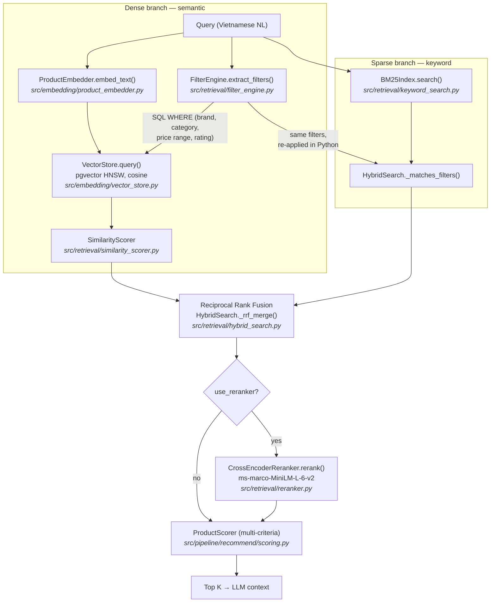

# Hybrid Retrieval & Reranking

The recommend flow (`POST /api/recommend`) retrieves candidates with a **hybrid
strategy**: dense semantic search (pgvector) fused with sparse keyword search
(BM25) via Reciprocal Rank Fusion, optionally followed by **cross-encoder
reranking**. This page explains each technique and exactly where it runs in the
code.

## End-to-end flow



## Dense branch: semantic search

The query is embedded (`embedding_provider` in `configs/settings.yaml`) and
matched against product chunks in Postgres + pgvector using cosine distance
over an HNSW index. Metadata filters extracted by `FilterEngine` are pushed
down as SQL `WHERE` conditions, so e.g. over-budget products never become
candidates. Relevance is `1 - cosine_distance`, refined by `SimilarityScorer`.

## Sparse branch: BM25 keyword search

Dense retrieval can miss **exact-term** matches: model numbers ("A55",
"14 Pro"), spec tokens ("120Hz", "5000mAh"), or rare Vietnamese terms the
embedding model underweights. BM25 (Okapi) fills that gap.

Implementation (`src/retrieval/keyword_search.py`):

- **Index** — pure-Python, in-memory, built once at API startup from
  `VectorStore.list_documents()` (the exact same corpus the dense branch
  searches). No extra dependency; the product-chunk corpus is small enough
  that a rebuild takes milliseconds.
- **Tokenization** — lowercase + Unicode `\w+`, so Vietnamese diacritics are
  preserved ("trâu" ≠ "trau").
- **Scoring** — standard Okapi BM25 with `k1 = 1.5`, `b = 0.75` and the
  smoothed IDF `log(1 + (N - df + 0.5) / (df + 0.5))` (always non-negative):

```text
score(q, d) = Σ_t∈q  IDF(t) · tf(t,d)·(k1+1) / ( tf(t,d) + k1·(1 - b + b·|d|/avgdl) )
```

- **Filter parity** — the same filters the dense branch pushes to SQL are
  re-applied in Python (`HybridSearch._matches_filters`) to every BM25 hit,
  so the keyword branch cannot leak over-budget or wrong-brand products into
  the LLM context.

## Fusion: Reciprocal Rank Fusion (RRF)

Cosine similarities (~0–1) and BM25 scores (unbounded) are not comparable, so
scores are never mixed directly. RRF fuses the two **rankings** instead:

```text
RRF(d) = Σ_ranking  1 / (k + rank(d))
```

with `k = rrf_k = 60` (the standard value; higher `k` flattens the influence
of top ranks). A document found by **both** branches accumulates two terms and
rises above single-branch hits — exact-match products get boosted without any
score calibration. Implemented in `HybridSearch._rrf_merge()`; results carry
`rrf_score`, plus `bm25_score` when the keyword branch found them.

## Cross-encoder reranking (optional)

The bi-encoder embeds query and document *independently* — fast, but it can't
model term interactions. A **cross-encoder** feeds the concatenated
`(query, document)` pair through the model jointly, yielding much more precise
relevance at ~10–50 ms per pair, which is why it only runs on the small fused
candidate pool (`top_k × 3` → pruned to `top_k × 2`), never on the whole corpus.

- Model: `cross-encoder/ms-marco-MiniLM-L-6-v2` (configurable via
  `reranker_model`).
- Output logits are unbounded, so `RecommendEngine._relevance()` squashes them
  with a sigmoid `1 / (1 + e^{-x})` before they enter `ProductScorer` as the
  relevance component (weight 0.35), keeping all scoring inputs in `[0, 1]`.
- If the model isn't loaded, `rerank()` passes candidates through unchanged —
  the API never breaks because of the reranker.

## Configuration & wiring

Settings (`configs/settings.yaml` → `PipelineConfig`):

| Key | Default | Meaning |
|---|---|---|
| `use_bm25` | `true` | Wrap `ProductRetriever` in `HybridSearch` (BM25 + RRF) |
| `rrf_k` | `60` | RRF smoothing constant |
| `keyword_candidates` | `50` | Max BM25 hits considered before fusion |
| `use_reranker` | `false` | Enable cross-encoder reranking |
| `reranker_model` | `ms-marco-MiniLM-L-6-v2` | Cross-encoder checkpoint |

Wiring lives in `api/deps.py`:

```
get_searcher()  → HybridSearch(ProductRetriever)   # BM25 index built at startup
get_reranker()  → CrossEncoderReranker | None      # None if disabled/missing dep
get_recommend_pipeline() → RecommendEngine(retriever=searcher, reranker=...)
```

Both features **degrade gracefully**: if the BM25 index build fails (e.g. empty
vector store), the flow falls back to semantic-only retrieval; if
`sentence-transformers` is not installed, the reranker is skipped with a warning.

To enable reranking:

```bash
uv add sentence-transformers
# configs/settings.yaml: use_reranker: true
```

!!! note
    The compare flow (`POST /api/compare`) still uses the plain
    `ProductRetriever` — hybrid retrieval currently applies to recommend only.

**Tests:** `tests/unit/test_hybrid_search.py` covers BM25 ranking, Vietnamese
tokenization, RRF boosting, filter parity on the keyword branch, and the
reranker → sigmoid relevance path.
