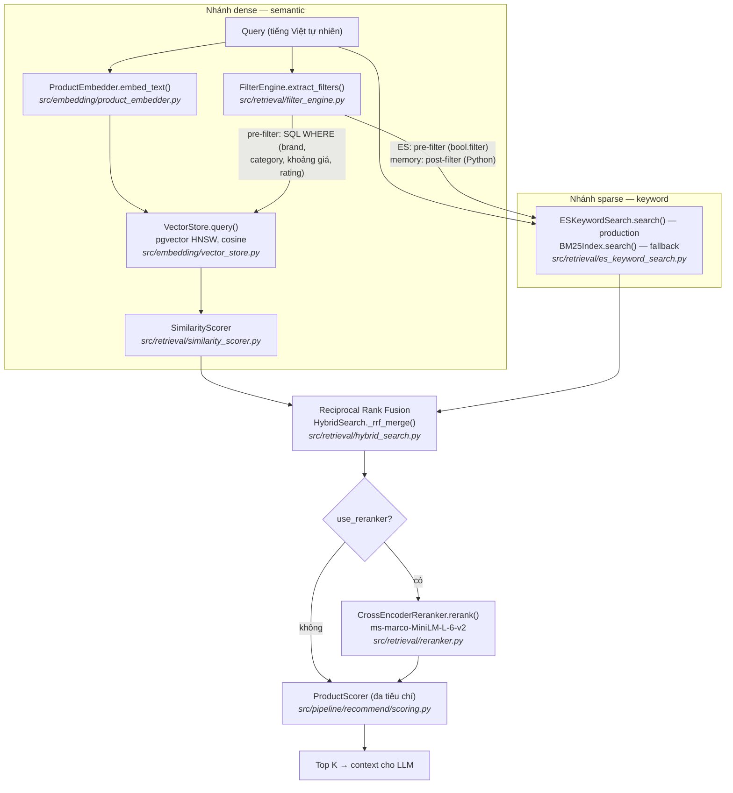
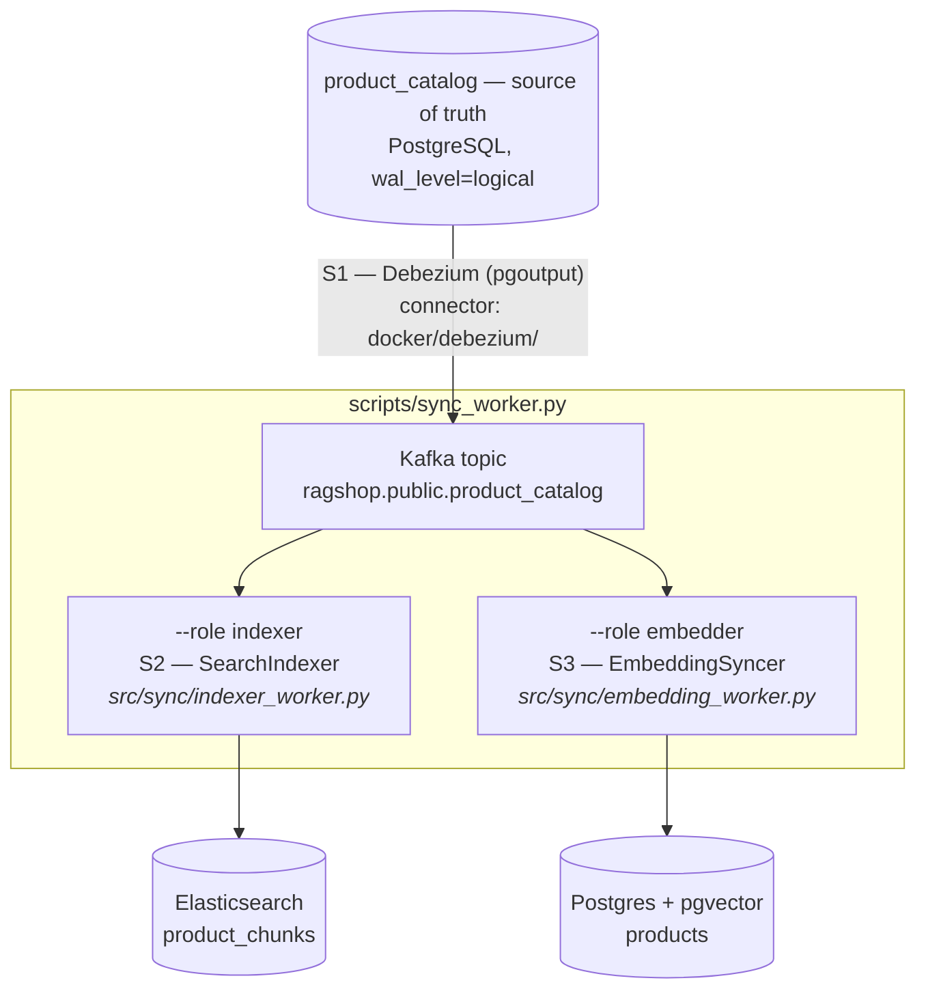

# Truy xuất lai & Reranking

Luồng recommend (`POST /api/recommend`) truy xuất ứng viên bằng **chiến lược
lai**: semantic search dày đặc (pgvector) hợp nhất với keyword search thưa
(BM25) qua Reciprocal Rank Fusion, sau đó tùy chọn **rerank bằng
cross-encoder**. Ở production, nhánh keyword do **Elasticsearch** phục vụ,
luôn fresh nhờ CDC (Debezium + Kafka); snapshot BM25 in-memory vẫn là
fallback tự động cho môi trường dev. Trang này giải thích từng kỹ thuật và
vị trí chính xác trong code.

## Luồng end-to-end



## Nhánh dense: semantic search

Query được embed (`embedding_provider` trong `configs/settings.yaml`) và so
khớp với các chunk sản phẩm trong Postgres + pgvector bằng cosine distance
trên HNSW index. Filter metadata do `FilterEngine` trích xuất được đẩy xuống
thành điều kiện SQL `WHERE`, nên sản phẩm vượt ngân sách không bao giờ thành
ứng viên. Độ liên quan là `1 - cosine_distance`, tinh chỉnh bởi `SimilarityScorer`.

## Nhánh sparse: BM25 keyword search

Dense retrieval có thể bỏ sót khớp **chính xác theo từ**: mã model ("A55",
"14 Pro"), thông số ("120Hz", "5000mAh"), hoặc từ tiếng Việt hiếm mà embedding
model đánh giá thấp. BM25 (Okapi) lấp khoảng trống đó. Có hai backend
(`keyword_backend` trong `configs/settings.yaml`):

### Elasticsearch (production, `keyword_backend: elasticsearch`)

`src/retrieval/es_keyword_search.py`. Một index dùng chung (`product_chunks`,
mỗi chunk một document, id `{product_id}_{chunk_type}`), luôn fresh nhờ các
sync worker CDC — không snapshot lúc khởi động, không tốn RAM mỗi worker,
không stale. Bộ filter trích xuất được đẩy thẳng vào query dưới dạng
`bool.filter` (term `brand`/`category`, range `price`/`avg_rating`), nên
nhánh keyword **pre-filter** đúng như nhánh SQL. Tokenizer standard +
lowercase giữ nguyên dấu tiếng Việt ("trâu" ≠ "trau").

Nếu Elasticsearch không kết nối được lúc khởi động, `get_searcher()` tự rơi
về backend in-memory; nếu một query lỗi giữa chừng, request đó suy giảm về
semantic-only. API không bao giờ hỏng vì nhánh keyword.

### Snapshot in-memory (fallback, `keyword_backend: memory`)

`src/retrieval/keyword_search.py`. Okapi BM25 thuần Python (`k1 = 1.5`,
`b = 0.75`, IDF làm mượt `log(1 + (N - df + 0.5) / (df + 0.5))`), build một
lần lúc API khởi động từ `VectorStore.list_documents()`:

```text
score(q, d) = Σ_t∈q  IDF(t) · tf(t,d)·(k1+1) / ( tf(t,d) + k1·(1 - b + b·|d|/avgdl) )
```

Filter được áp lại bằng Python (`HybridSearch._matches_filters`) cho từng
hit — tức **post-filter**. Đủ tốt cho dev và corpus nhỏ, tĩnh; các nhược
điểm của nó (snapshot stale, mỗi worker một bản copy) chính là lý do
production dùng Elasticsearch.

## Lọc diễn ra ở đâu: pre-filter vs post-filter

Mọi nhánh đều thực thi **cùng một** bộ filter từ
`FilterEngine.extract_filters()` (brand, category, khoảng giá, rating tối thiểu):

| Nhánh | Chiến lược | Vị trí |
|---|---|---|
| Dense (pgvector) | **Pre-filter** | SQL `WHERE` ngay trong câu query vector (`ProductRetriever._build_where_clause()`) |
| Keyword — Elasticsearch | **Pre-filter** | `bool.filter` ngay trong query ES (`es_keyword_search.build_bool_query()`) |
| Keyword — fallback in-memory | **Post-filter** | Python, sau khi search (`HybridSearch._matches_filters()`) |

Pre-filter nghĩa là chỉ các row/document đã thỏa điều kiện mới được xếp
hạng — nhánh luôn lấy đủ chỉ tiêu ứng viên khi dữ liệu khớp còn tồn tại.
Fallback post-filter thì search toàn bộ snapshot trước rồi mới loại hit
không khớp, nên ngân sách chặt có thể khiến nó còn rất ít hoặc 0 ứng viên
(không tự lấy thêm để bù). Đảm bảo cuối cùng ở mọi nhánh là như nhau: không
sản phẩm nào vi phạm filter lọt vào RRF hay context của LLM.

## Hợp nhất: Reciprocal Rank Fusion (RRF)

Cosine similarity (~0–1) và điểm BM25 (không chặn trên) không so sánh trực
tiếp được, nên không bao giờ trộn điểm. RRF hợp nhất hai **bảng xếp hạng**:

```text
RRF(d) = Σ_ranking  1 / (k + rank(d))
```

với `k = rrf_k = 60` (giá trị chuẩn; `k` càng lớn thì ảnh hưởng của các rank
đầu càng phẳng). Document xuất hiện ở **cả hai** nhánh cộng dồn hai số hạng và
vượt lên trên các hit một nhánh — sản phẩm khớp chính xác được đẩy hạng mà
không cần hiệu chỉnh thang điểm. Cài đặt tại `HybridSearch._rrf_merge()`; kết
quả mang `rrf_score`, kèm `bm25_score` nếu nhánh keyword tìm thấy.

## Kiến trúc CDC: index luôn fresh bằng cách nào

Bảng `product_catalog` (Postgres) là **source of truth**: API CRUD
(`/api/products`) chỉ ghi vào đó. Debezium stream các thay đổi row từ WAL
vào Kafka, và hai worker consume **một stream có thứ tự duy nhất** để cập
nhật cả hai index dẫn xuất:



- **S1 — một stream.** Hai worker đọc cùng một topic, nên hai index áp thay
  đổi theo cùng thứ tự — có thể trễ, nhưng không bao giờ lệch nhau.
  `REPLICA IDENTITY FULL` trên bảng cho Debezium before-image đầy đủ.
- **S2 — indexer idempotent.** Chunk id có tính tất định
  (`{product_id}_{chunk_type}`); mỗi lần áp là delete-rồi-upsert, nên replay
  (snapshot chạy lại, rebalance) đều hội tụ. Offset chỉ commit sau khi áp
  thành công (at-least-once).
- **S3 — đường metadata rẻ.** Embedding worker chỉ re-embed **khi trường
  mang text thay đổi** (name, brand, category, description, specs,
  pros/cons, review summary — xem `TEXT_FIELDS` trong `src/sync/events.py`).
  Thay đổi giá/rating đi đường update metadata JSONB: không tốn lần gọi API
  embedding nào. `content_hash` lưu trong metadata chunk giúp replay
  snapshot bỏ qua re-embed hoàn toàn.

### Runbook

```bash
cd docker && docker compose up --build        # full stack, connector tự đăng ký
uv run python scripts/ingest.py               # bootstrap: catalog + cả hai index
uv run python scripts/ingest.py --catalog-only  # hoặc: để CDC tự build index
```

Sau bootstrap, mọi thay đổi đi qua API CRUD (`POST/PUT/DELETE /api/products`)
và tự lan truyền trong vài giây. Giám sát consumer lag của group
`rag-sync-indexer` / `rag-sync-embedder`; lag nghĩa là kết quả tìm kiếm bị
trễ, không bao giờ sai.

## Rerank bằng cross-encoder (tùy chọn)

Bi-encoder embed query và document *độc lập* — nhanh, nhưng không mô hình hóa
được tương tác giữa các từ. **Cross-encoder** đưa cặp `(query, document)` qua
model cùng lúc, cho độ liên quan chính xác hơn nhiều với chi phí ~10–50 ms mỗi
cặp — vì vậy chỉ chạy trên nhóm ứng viên nhỏ sau fusion (`top_k × 3` → cắt còn
`top_k × 2`), không bao giờ trên toàn corpus.

- Model: `cross-encoder/ms-marco-MiniLM-L-6-v2` (đổi qua `reranker_model`).
- Logit đầu ra không chặn, nên `RecommendEngine._relevance()` ép về `[0, 1]`
  bằng sigmoid `1 / (1 + e^-x)` trước khi vào `ProductScorer` làm thành phần
  relevance (trọng số 0.35), giữ mọi input chấm điểm trong `[0, 1]`.
- Nếu model chưa load, `rerank()` trả candidates nguyên trạng — API không bao
  giờ hỏng vì reranker.

## Cấu hình & wiring

Settings (`configs/settings.yaml` → `PipelineConfig`):

| Key | Mặc định | Ý nghĩa |
|---|---|---|
| `use_bm25` | `true` | Bọc `ProductRetriever` trong `HybridSearch` (keyword + RRF) |
| `keyword_backend` | `elasticsearch` | `elasticsearch` (CDC-synced) hoặc `memory` (snapshot) |
| `es_url` | `http://localhost:9200` | Override bằng `ELASTICSEARCH_URL` |
| `es_index` | `product_chunks` | Tên index keyword |
| `kafka_bootstrap` | `localhost:9092` | Override bằng `KAFKA_BOOTSTRAP_SERVERS` |
| `products_topic` | `ragshop.public.product_catalog` | Topic Debezium mà worker consume |
| `catalog_table` | `product_catalog` | Bảng source-of-truth (CDC capture) |
| `rrf_k` | `60` | Hằng số làm mượt RRF |
| `keyword_candidates` | `50` | Số hit keyword tối đa xét trước fusion |
| `use_reranker` | `false` | Bật rerank cross-encoder |
| `reranker_model` | `ms-marco-MiniLM-L-6-v2` | Checkpoint cross-encoder |

Wiring nằm ở `api/deps.py`:

```
get_keyword_backend() → ESKeywordSearch | None    # None: ES tắt/không kết nối được
get_searcher()        → HybridSearch(ProductRetriever)
                        # keyword: ES → BM25 in-memory → semantic-only
get_reranker()        → CrossEncoderReranker | None
get_cached_product_repository() → ProductRepository  # CRUD (source of truth)
```

Mọi thứ đều **suy giảm êm**: không có Elasticsearch → BM25 in-memory; vector
store rỗng → semantic-only; thiếu `sentence-transformers` → bỏ qua reranker.

Bật reranking:

```bash
uv add sentence-transformers
# configs/settings.yaml: use_reranker: true
```

!!! note
    Luồng compare (`POST /api/compare`) vẫn dùng `ProductRetriever` thuần —
    truy xuất lai hiện chỉ áp dụng cho recommend.

**Tests:** `tests/unit/test_hybrid_search.py` phủ BM25 ranking, tokenize tiếng
Việt, RRF boosting và đồng bộ filter; `tests/unit/test_es_keyword_search.py`
phủ dựng query ES và wiring pre-filter; `tests/unit/test_sync_events.py` và
`tests/unit/test_sync_workers.py` phủ parse sự kiện CDC và cả hai worker
(re-embed vs metadata-only vs delete, idempotency khi replay snapshot).
