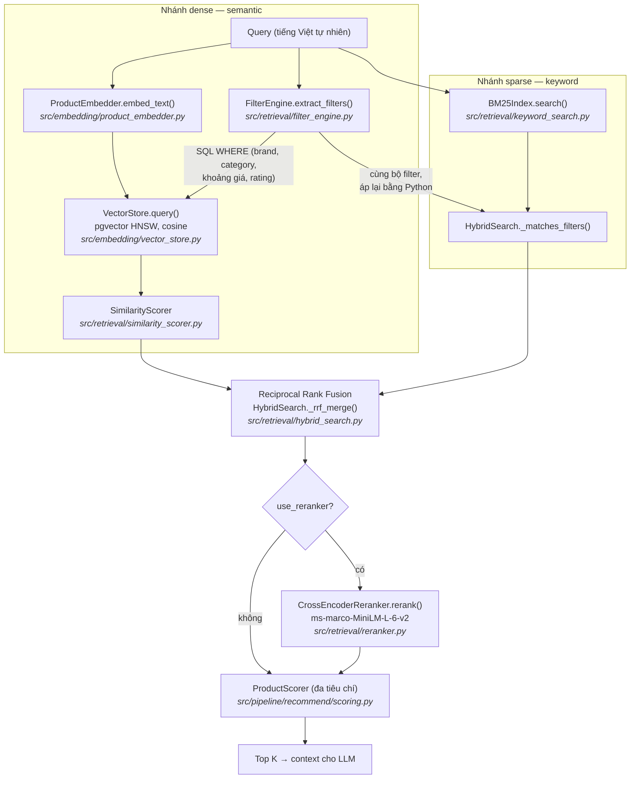

# Truy xuất lai & Reranking

Luồng recommend (`POST /api/recommend`) truy xuất ứng viên bằng **chiến lược
lai**: semantic search dày đặc (pgvector) hợp nhất với keyword search thưa
(BM25) qua Reciprocal Rank Fusion, sau đó tùy chọn **rerank bằng
cross-encoder**. Trang này giải thích từng kỹ thuật và vị trí chính xác trong code.

## Luồng end-to-end



## Nhánh dense: semantic search

Query được embed (`embedding_provider` trong `configs/settings.yaml`) và so
khớp với các chunk sản phẩm trong Postgres + pgvector bằng cosine distance
trên HNSW index. Filter metadata do `FilterEngine` trích xuất được đẩy xuống
thành điều kiện SQL `WHERE`, nên sản phẩm vượt ngân sách không bao giờ thành
ứng viên. Độ liên quan là `1 - cosine_distance`, tinh chỉnh bởi `SimilarityScorer`.

## Nhánh sparse: BM25 keyword search

Dense retrieval có thể bỏ sót khớp **chính xác theo từ**: mã model ("A55",
"14 Pro"), thông số ("120Hz", "5000mAh"), hoặc từ tiếng Việt hiếm mà embedding
model đánh giá thấp. BM25 (Okapi) lấp khoảng trống đó.

Cài đặt (`src/retrieval/keyword_search.py`):

- **Index** — pure-Python, in-memory, build một lần lúc API khởi động từ
  `VectorStore.list_documents()` (đúng corpus mà nhánh dense tìm kiếm).
  Không thêm dependency; corpus chunk sản phẩm đủ nhỏ để rebuild trong vài mili giây.
- **Tokenization** — lowercase + Unicode `\w+`, giữ nguyên dấu tiếng Việt
  ("trâu" ≠ "trau").
- **Chấm điểm** — Okapi BM25 chuẩn với `k1 = 1.5`, `b = 0.75` và IDF làm mượt
  `log(1 + (N - df + 0.5) / (df + 0.5))` (luôn không âm):

```text
score(q, d) = Σ_t∈q  IDF(t) · tf(t,d)·(k1+1) / ( tf(t,d) + k1·(1 - b + b·|d|/avgdl) )
```

- **Đồng bộ filter** — bộ filter mà nhánh dense đẩy xuống SQL được áp lại
  bằng Python (`HybridSearch._matches_filters`) cho từng hit BM25, nên nhánh
  keyword không thể tuồn sản phẩm vượt giá hay sai brand vào context của LLM.

## Hợp nhất: Reciprocal Rank Fusion (RRF)

Cosine similarity (~0–1) và điểm BM25 (không chặn trên) không so sánh trực
tiếp được, nên không bao giờ trộn điểm. RRF hợp nhất hai **bảng xếp hạng**:

```text
RRF(d) = Σ_ranking  1 / (k + rank(d))
```

với `k = rrf_k = 60` (giá trị chuẩn; `k` càng lớn thì ảnh hưởng của các rank
đầu càng phẳng). Document xuất hiện ở **cả hai** nhánh cộng dồn hai số hạng và
vượt lên trên các hit một nhánh — sản phẩm khớp chính xác được đẩy hạng mà
không cần hiệu chỉnh thang điểm. Cài đặt tại `HybridSearch._rrf_merge()`; kết
quả mang `rrf_score`, kèm `bm25_score` nếu nhánh keyword tìm thấy.

## Rerank bằng cross-encoder (tùy chọn)

Bi-encoder embed query và document *độc lập* — nhanh, nhưng không mô hình hóa
được tương tác giữa các từ. **Cross-encoder** đưa cặp `(query, document)` qua
model cùng lúc, cho độ liên quan chính xác hơn nhiều với chi phí ~10–50 ms mỗi
cặp — vì vậy chỉ chạy trên nhóm ứng viên nhỏ sau fusion (`top_k × 3` → cắt còn
`top_k × 2`), không bao giờ trên toàn corpus.

- Model: `cross-encoder/ms-marco-MiniLM-L-6-v2` (đổi qua `reranker_model`).
- Logit đầu ra không chặn, nên `RecommendEngine._relevance()` ép về `[0, 1]`
  bằng sigmoid `1 / (1 + e^-x)` trước khi vào `ProductScorer` làm thành phần
  relevance (trọng số 0.35), giữ mọi input chấm điểm trong `[0, 1]`.
- Nếu model chưa load, `rerank()` trả candidates nguyên trạng — API không bao
  giờ hỏng vì reranker.

## Cấu hình & wiring

Settings (`configs/settings.yaml` → `PipelineConfig`):

| Key | Mặc định | Ý nghĩa |
|---|---|---|
| `use_bm25` | `true` | Bọc `ProductRetriever` trong `HybridSearch` (BM25 + RRF) |
| `rrf_k` | `60` | Hằng số làm mượt RRF |
| `keyword_candidates` | `50` | Số hit BM25 tối đa xét trước fusion |
| `use_reranker` | `false` | Bật rerank cross-encoder |
| `reranker_model` | `ms-marco-MiniLM-L-6-v2` | Checkpoint cross-encoder |

Wiring nằm ở `api/deps.py`:

```
get_searcher()  → HybridSearch(ProductRetriever)   # BM25 index build lúc khởi động
get_reranker()  → CrossEncoderReranker | None      # None nếu tắt/thiếu dependency
get_recommend_pipeline() → RecommendEngine(retriever=searcher, reranker=...)
```

Cả hai tính năng đều **suy giảm êm**: nếu build BM25 index thất bại (ví dụ
vector store rỗng), luồng quay về semantic-only; nếu chưa cài
`sentence-transformers`, reranker bị bỏ qua kèm cảnh báo.

Bật reranking:

```bash
uv add sentence-transformers
# configs/settings.yaml: use_reranker: true
```

!!! note
    Luồng compare (`POST /api/compare`) vẫn dùng `ProductRetriever` thuần —
    truy xuất lai hiện chỉ áp dụng cho recommend.

**Tests:** `tests/unit/test_hybrid_search.py` phủ BM25 ranking, tokenize tiếng
Việt, RRF boosting, đồng bộ filter ở nhánh keyword, và đường đi
reranker → sigmoid relevance.
