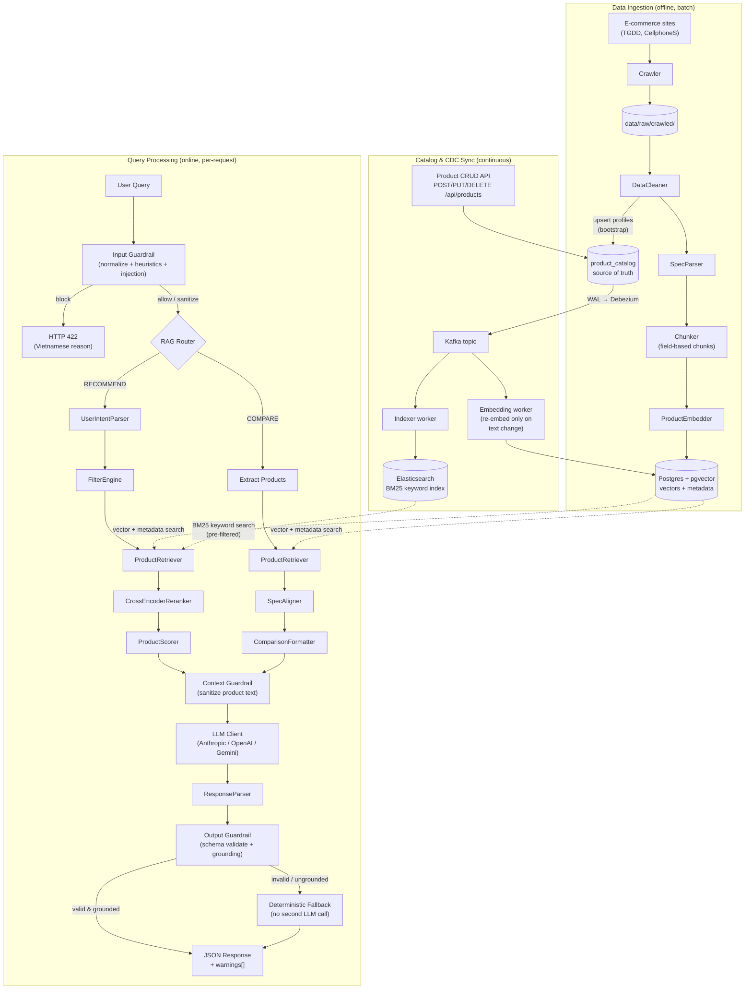
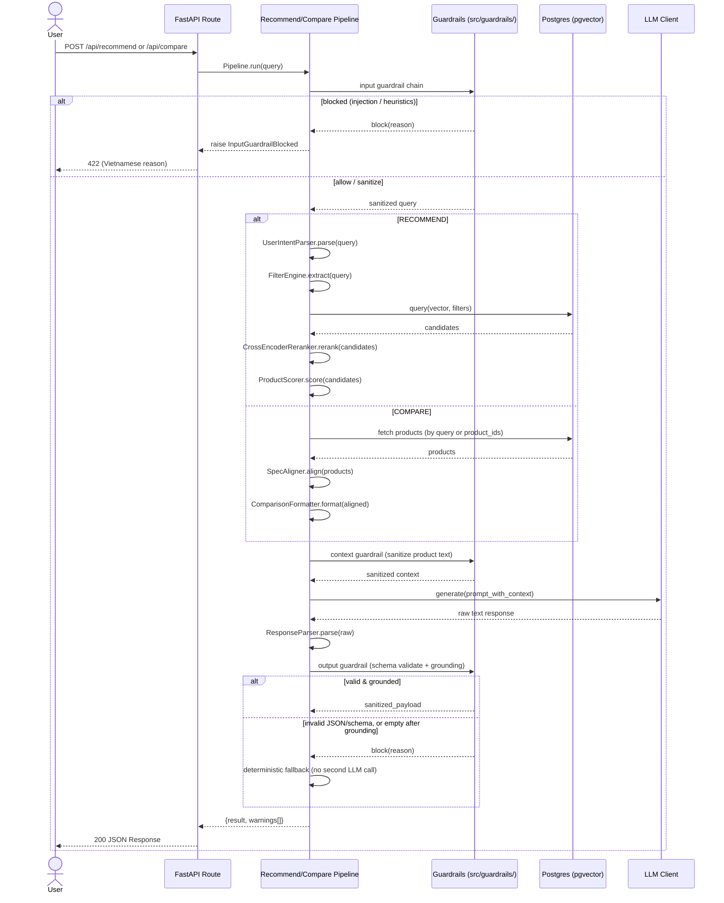

# Architecture Overview

The system follows a standard RAG architecture with five core layers:

## End-to-End Flow

The diagram below covers the full system: the **offline** ingestion path that populates the vector store, and the **online** path that serves a single user query.

## End-to-End Sequence

The sequence diagram below shows the same online path as a single request timeline, including the `RECOMMEND` vs `COMPARE` branch.

## Core Layers

### 1. Ingestion (`src/ingestion/`)

Loads raw product data (JSON, CSV), cleans and normalizes it, then splits each product into field-based chunks (description, specs, pros/cons, reviews). Each chunk carries metadata (product_id, brand, category, price) for filtering.

### 2. Embedding (`src/embedding/`)

Converts text chunks into vector embeddings using OpenAI's `text-embedding-3-small` model. Stores vectors in Postgres (pgvector) with an HNSW cosine-similarity index. Supports multi-field embedding for richer retrieval.

### 3. Retrieval (`src/retrieval/`)

Given a user query, the retrieval layer extracts filters from natural language (price range, brand, category), performs hybrid search — semantic (pgvector) fused with BM25 keyword search (Elasticsearch in production, in-memory fallback) via Reciprocal Rank Fusion, with the same filters pre-applied on both branches — computes composite scores (semantic similarity, price match, rating, popularity), and optionally reranks with a cross-encoder. See [Hybrid Retrieval](hybrid-retrieval.md).

### 4. Generation (`src/generation/`)

Takes the retrieved products and user intent, fills a prompt template, and calls the LLM (Claude or GPT) to generate a structured JSON response.

### Guardrails (`src/guardrails/`)

A cross-cutting, non-LLM layer wired into both pipelines at three points: an **input guardrail** rejects/cleans the raw query before retrieval, a **context guardrail** sanitizes retrieved product text before it enters the prompt, and an **output guardrail** validates the LLM's JSON against a schema and grounds every item against retrieved products — falling back to a deterministic response (no second LLM call) on failure instead of erroring out. See [Guardrails](guardrails.md) for the full breakdown.

### 5. Catalog & CDC Sync (`src/catalog/`, `src/sync/`)

The `product_catalog` table (Postgres) is the single source of truth. The CRUD API (`/api/products`) writes only there; Debezium captures row changes from the WAL into Kafka, and two workers (`scripts/sync_worker.py`) consume that single ordered stream to keep the derived indexes fresh: the **indexer** updates the Elasticsearch keyword index, the **embedding worker** updates pgvector — re-embedding only when text-bearing fields changed (price/rating changes are cheap metadata-only updates).

## Orchestration (`src/pipeline/`)

The pipeline layer ties everything together. The `RAGRouter` classifies incoming queries (recommend, compare, info, hybrid) and delegates to the appropriate pipeline. Each pipeline orchestrates the full flow from query to response.

### Service discovery (`src/registry/`)

Separate from the RAG pipeline: on startup, the FastAPI `lifespan` in
`api/app.py` calls `src/registry/client.py:register_if_configured` to
register `{name: "rag-recommend", host, port: <GRPC_PORT>, health:
"http://<host>:<HTTP_PORT>/health"}` with the platform's `service-registry`
(`REGISTRY_URL`), heartbeating every ~10s and deregistering on shutdown.
The *gRPC* port is registered (what the gateway dials); `health` points at
the HTTP port. Registration is skipped entirely if `REGISTRY_URL` is unset,
so the service still runs standalone.

## See Also

- [C4 Model](c4-model.md) — Context, Container, and Component diagrams of the system.
- [Data Flow](data-flow.md) — data formats and storage as they move through ingestion and per-request processing.
- [Hybrid Retrieval](hybrid-retrieval.md) — semantic + BM25 fusion, and how CDC keeps both indexes fresh.
- [Guardrails](guardrails.md) — input/context/output validation, grounding, and the deterministic fallback policy.
