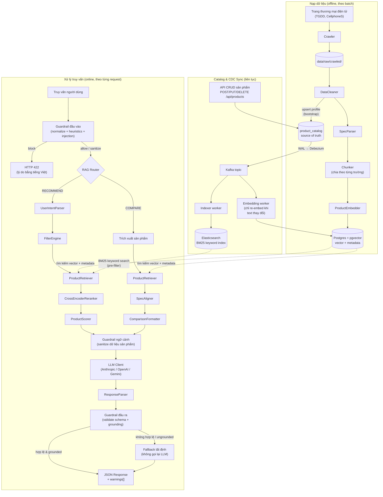
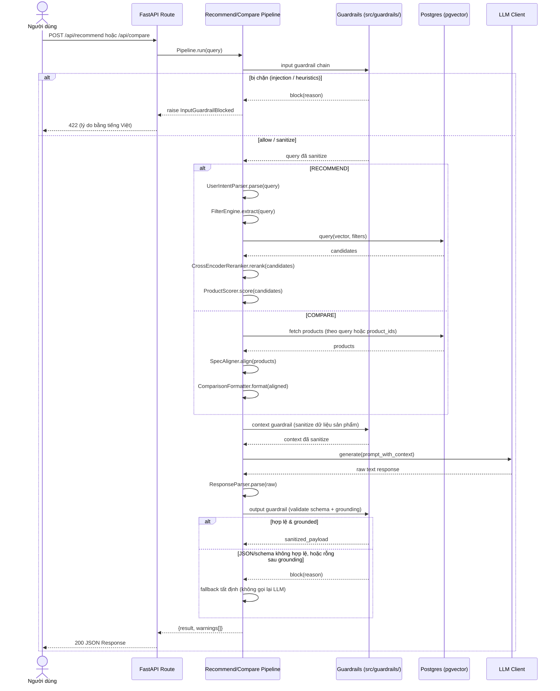

# Tổng quan kiến trúc

Hệ thống tuân theo kiến trúc RAG tiêu chuẩn với năm tầng cốt lõi:

## Luồng End-to-End

Sơ đồ dưới đây bao quát toàn bộ hệ thống: luồng nạp dữ liệu **offline** đổ vào vector store, và luồng **online** xử lý một truy vấn của người dùng.

## Sequence Diagram End-to-End

Sơ đồ tuần tự dưới đây thể hiện cùng luồng online nhưng theo dạng timeline của một request, bao gồm cả nhánh rẽ `RECOMMEND` và `COMPARE`.

## Các tầng cốt lõi

### 1. Ingestion (`src/ingestion/`)

Nạp dữ liệu sản phẩm thô (JSON, CSV), làm sạch và chuẩn hóa, sau đó tách mỗi sản phẩm thành các chunk theo trường (mô tả, thông số, ưu/nhược điểm, đánh giá). Mỗi chunk mang theo metadata (product_id, brand, category, price) để phục vụ lọc.

### 2. Embedding (`src/embedding/`)

Chuyển các đoạn văn bản thành vector embedding bằng model `text-embedding-3-small` của OpenAI. Lưu vector vào Postgres (pgvector) với chỉ mục HNSW cosine similarity. Hỗ trợ embedding đa trường (multi-field) để truy xuất phong phú hơn.

### 3. Retrieval (`src/retrieval/`)

Với một truy vấn của người dùng, tầng retrieval trích xuất filter từ ngôn ngữ tự nhiên (khoảng giá, thương hiệu, danh mục), thực hiện hybrid search — semantic (pgvector) hợp nhất với BM25 keyword search (Elasticsearch ở production, in-memory làm fallback) qua Reciprocal Rank Fusion, cùng bộ filter pre-apply trên cả hai nhánh — tính composite score (độ tương đồng ngữ nghĩa, độ khớp giá, rating, độ phổ biến), và tùy chọn rerank bằng cross-encoder. Xem [Truy xuất lai](hybrid-retrieval.vi.md).

### 4. Generation (`src/generation/`)

Lấy các sản phẩm đã truy xuất cùng ý định người dùng, điền vào prompt template, và gọi LLM (Claude hoặc GPT) để sinh phản hồi JSON có cấu trúc.

### Guardrails (`src/guardrails/`)

Một tầng cross-cutting, không dùng LLM, được nối vào cả hai pipeline tại ba điểm: **guardrail đầu vào** từ chối/làm sạch truy vấn thô trước khi truy xuất, **guardrail ngữ cảnh** sanitize dữ liệu sản phẩm đã truy xuất trước khi đưa vào prompt, và **guardrail đầu ra** validate JSON của LLM theo schema rồi grounding từng item với sản phẩm đã truy xuất — rơi về phản hồi tất định (không gọi lại LLM) khi thất bại thay vì trả lỗi. Xem [Guardrail](guardrails.vi.md) để biết chi tiết đầy đủ.

### 5. Catalog & CDC Sync (`src/catalog/`, `src/sync/`)

Bảng `product_catalog` (Postgres) là source of truth duy nhất. API CRUD (`/api/products`) chỉ ghi vào đó; Debezium bắt thay đổi row từ WAL vào Kafka, và hai worker (`scripts/sync_worker.py`) consume một stream có thứ tự duy nhất để giữ các index dẫn xuất luôn fresh: **indexer** cập nhật index keyword Elasticsearch, **embedding worker** cập nhật pgvector — chỉ re-embed khi trường mang text thay đổi (đổi giá/rating là update metadata rẻ, không gọi API embedding).

## Điều phối (`src/pipeline/`)

Tầng pipeline kết nối mọi thứ lại với nhau. `RAGRouter` phân loại các truy vấn đến (gợi ý, so sánh, thông tin, hybrid) và điều hướng tới pipeline phù hợp. Mỗi pipeline điều phối toàn bộ luồng từ truy vấn đến phản hồi.

### Service discovery (`src/registry/`)

Tách biệt với pipeline RAG: khi khởi động, `lifespan` của FastAPI trong
`api/app.py` gọi `src/registry/client.py:register_if_configured` để đăng ký
`{name: "rag-recommend", host, port: <GRPC_PORT>, health:
"http://<host>:<HTTP_PORT>/health"}` với `service-registry` của platform
(`REGISTRY_URL`), heartbeat mỗi ~10s và deregister khi shutdown. Port đăng ký
là port *gRPC* (port gateway gọi vào); `health` trỏ tới port HTTP. Bỏ qua
đăng ký hoàn toàn nếu `REGISTRY_URL` chưa set — service vẫn chạy độc lập
bình thường.

## Xem thêm

- [Mô hình C4](c4-model.vi.md) — sơ đồ Context, Container, và Component của hệ thống.
- [Luồng dữ liệu](data-flow.vi.md) — định dạng dữ liệu và nơi lưu trữ khi di chuyển qua ingestion và xử lý theo request.
- [Truy xuất lai](hybrid-retrieval.vi.md) — hợp nhất semantic + BM25, và cách CDC giữ cả hai index luôn fresh.
- [Guardrail](guardrails.vi.md) — validate input/context/output, grounding, và chính sách fallback tất định.
