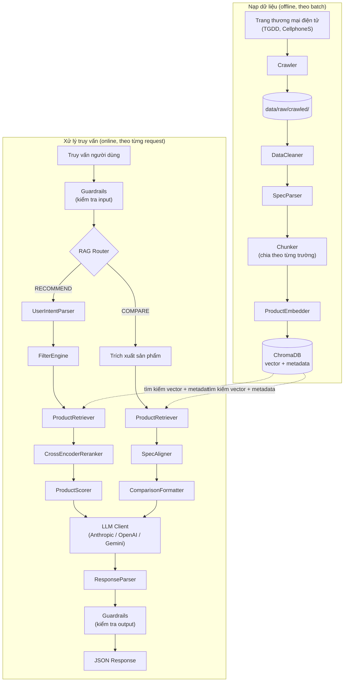
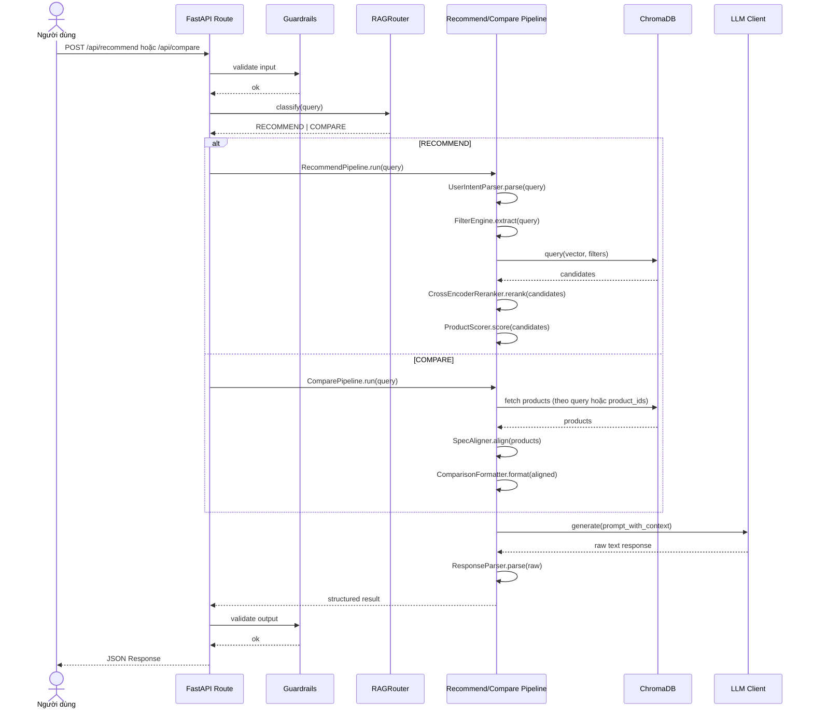

# Tổng quan kiến trúc

Hệ thống tuân theo kiến trúc RAG tiêu chuẩn với bốn tầng cốt lõi:

## Luồng End-to-End

Sơ đồ dưới đây bao quát toàn bộ hệ thống: luồng nạp dữ liệu **offline** đổ vào vector store, và luồng **online** xử lý một truy vấn của người dùng.

## Sequence Diagram End-to-End

Sơ đồ tuần tự dưới đây thể hiện cùng luồng online nhưng theo dạng timeline của một request, bao gồm cả nhánh rẽ `RECOMMEND` và `COMPARE`.

## Các tầng cốt lõi

### 1. Ingestion (`src/ingestion/`)

Nạp dữ liệu sản phẩm thô (JSON, CSV), làm sạch và chuẩn hóa, sau đó tách mỗi sản phẩm thành các chunk theo trường (mô tả, thông số, ưu/nhược điểm, đánh giá). Mỗi chunk mang theo metadata (product_id, brand, category, price) để phục vụ lọc.

### 2. Embedding (`src/embedding/`)

Chuyển các đoạn văn bản thành vector embedding bằng model `text-embedding-3-small` của OpenAI. Lưu vector vào ChromaDB với chỉ mục cosine similarity. Hỗ trợ embedding đa trường (multi-field) để truy xuất phong phú hơn.

### 3. Retrieval (`src/retrieval/`)

Với một truy vấn của người dùng, tầng retrieval trích xuất filter từ ngôn ngữ tự nhiên (khoảng giá, thương hiệu, danh mục), thực hiện hybrid search (semantic + metadata), tính composite score (độ tương đồng ngữ nghĩa, độ khớp giá, rating, độ phổ biến), và tùy chọn rerank bằng cross-encoder.

### 4. Generation (`src/generation/`)

Lấy các sản phẩm đã truy xuất cùng ý định người dùng, điền vào prompt template, và gọi LLM (Claude hoặc GPT) để sinh phản hồi JSON có cấu trúc. Bao gồm các guardrail để validate input và kiểm tra an toàn output.

## Điều phối (`src/pipeline/`)

Tầng pipeline kết nối mọi thứ lại với nhau. `RAGRouter` phân loại các truy vấn đến (gợi ý, so sánh, thông tin, hybrid) và điều hướng tới pipeline phù hợp. Mỗi pipeline điều phối toàn bộ luồng từ truy vấn đến phản hồi.
