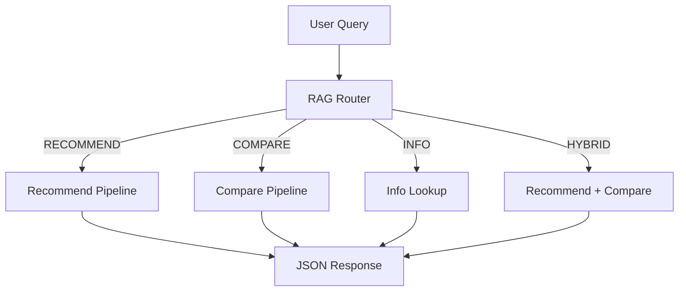
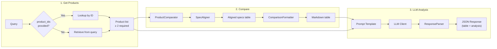
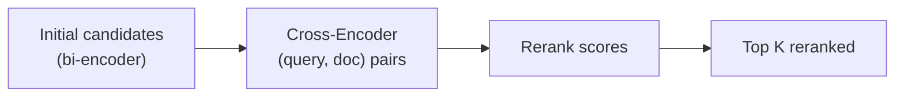
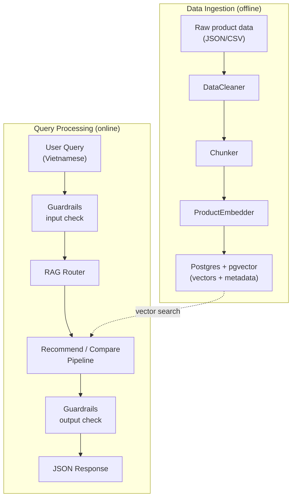

# Pipeline Flow

This page describes the detailed data flow through the RAG system, from user query to final response.

## High-Level Overview

Every user query goes through the **RAG Router** first, which classifies the query into one of four types and dispatches it to the appropriate pipeline.



## Query Classification (RAG Router)

The `RAGRouter` classifies queries using regex pattern matching on Vietnamese and English keywords.

| Query Type | Trigger Keywords | Example |
| ---------- | --------------- | ------- |
| **RECOMMEND** | gợi ý, nên mua, tư vấn, recommend, đề xuất | *"Tư vấn điện thoại dưới 10 triệu"* |
| **COMPARE** | so sánh, compare, vs, tốt hơn, khác nhau | *"So sánh iPhone 15 và Samsung S24"* |
| **INFO** | thông số, giá, specs, cấu hình, review | *"Giá iPhone 15 Pro Max bao nhiêu?"* |
| **HYBRID** | Both recommend + compare patterns matched | *"Nên mua iPhone hay Samsung, so sánh giúp tôi"* |

If no pattern matches, the router defaults to **RECOMMEND**.

**Source:** `src/pipeline/rag_router.py`

---

## Recommend Pipeline

The recommendation pipeline finds products matching the user's intent and generates an LLM-powered explanation.

```mermaid
flowchart LR
    subgraph Intent["1. Parse Intent"]
        Q[Query] --> IP[UserIntentParser]
        IP --> Intent_Out["budget, use_case,\npriorities, brand_pref"]
    end

    subgraph Retrieve["2. Retrieve"]
        Intent_Out --> FE[FilterEngine]
        FE --> Filters["price, brand,\ncategory, rating"]
        Q --> EMB[ProductEmbedder]
        EMB --> Vec[Query Vector]
        Filters --> VS[VectorStore.query]
        Vec --> VS
        Q --> BM["BM25Index\n(keyword)"]
        Filters --> BM
        VS --> RRF["RRF fusion\n(HybridSearch)"]
        BM --> RRF
        RRF --> Candidates["top_k × 3 candidates"]
    end

    subgraph Score["3. Score & Rank"]
        Candidates --> CE["CrossEncoderReranker\n(optional)"]
        CE --> PS[ProductScorer]
        PS --> Ranked["Scored + sorted"]
        Ranked --> TopK["Top K products"]
    end

    subgraph Generate["4. Generate"]
        TopK --> PT[Prompt Template]
        PT --> LLM[LLM Client]
        LLM --> RP[ResponseParser]
        RP --> Resp[JSON Response]
    end
```



### Step-by-Step

**Step 1 — Parse User Intent**

The `UserIntentParser` analyzes the query to extract structured intent:

- **budget** — price range (e.g., "dưới 15 triệu" → `price_max: 15_000_000`)
- **use_case** — purpose (gaming, photography, work, etc.)
- **priorities** — what matters most (camera, battery, performance, etc.)
- **brand_pref** — preferred brand if mentioned

**Source:** `src/pipeline/recommend/user_intent_parser.py`

**Step 2 — Filter & Retrieve**

Two things happen in parallel:

1. **FilterEngine** extracts metadata filters from the query (brand, category, price range, minimum rating) using regex patterns on both Vietnamese ("dưới 15 triệu") and English ("under 15 million") text.
2. **ProductEmbedder** converts the query into a vector using the configured embedding provider (`embedding_provider`/`embedding_model` in `configs/settings.yaml`, e.g. Gemini `gemini-embedding-001` or OpenAI `text-embedding-3-small`).

The `ProductRetriever` then queries Postgres (pgvector) with both the vector and the filters translated into SQL conditions — equality for brand/category, numeric ranges for price/rating (e.g. `(metadata->>'price')::numeric <= 15000000`) — retrieving `top_k × 3` candidates (over-fetching for the scoring step to narrow down). Over-budget products are excluded here, before scoring and prompting.

With `use_bm25` enabled (default), the semantic results are then fused with an in-memory **BM25** keyword ranking via **Reciprocal Rank Fusion** (`HybridSearch`), so exact-term matches (model numbers, spec tokens) get boosted. The same filters are re-applied to the BM25 hits. See [Hybrid Retrieval & Reranking](hybrid-retrieval.md) for the full technique.

**Source:** `src/retrieval/product_retriever.py`, `src/retrieval/filter_engine.py`, `src/retrieval/hybrid_search.py`, `src/retrieval/keyword_search.py`

**Step 3 — Score & Rank**

Each candidate gets a composite score from `ProductScorer`:

- **Semantic similarity** — cosine distance from the vector search (converted to `1 - distance`)
- **Price match** — how well the product fits the budget
- **Rating** — average user rating
- **Feature match** — overlap between user priorities and product features

With `use_reranker` enabled, the fused candidates are first re-scored by the cross-encoder (`CrossEncoderReranker`) and the sigmoid-squashed rerank score replaces the retrieval score as the relevance component.

Products are sorted by `final_score` descending and truncated to `top_k`.

**Source:** `src/pipeline/recommend/scoring.py`, `src/retrieval/similarity_scorer.py`

**Step 4 — Generate LLM Response**

The top products are formatted into a context string (name, brand, price, rating, score — these fields come from the chunk metadata written at ingest time) and injected into a prompt template along with the parsed intent. The LLM is called in **native JSON mode** (Gemini `response_mime_type: application/json`, OpenAI `response_format: json_object`), so it returns strict JSON with no prose preamble. The `ResponseParser` parses it into `recommendations` + `summary`; if parsing ever fails, the raw text is returned as a fallback `summary`.

**Source:** `src/pipeline/recommend_pipeline.py`, `src/generation/prompt_templates/recommend_prompt.py`

---

## Compare Pipeline

The comparison pipeline retrieves specs for multiple products and generates a detailed analysis.



### Step-by-Step

**Step 1 — Get Products**

Two paths depending on the API call:

- **With `product_ids`** — directly look up products from the database.
- **Without `product_ids`** — use the `ProductRetriever` to search for products mentioned in the query, then take the top 3.

At least 2 products are required; otherwise the pipeline returns an error.

**Step 2 — Compare Specifications**

The `ProductComparator` orchestrates the comparison:

1. `SpecAligner` normalizes and aligns specifications across products so they share the same set of keys (e.g., "RAM", "Storage", "Battery").
2. `ComparisonFormatter` renders the aligned data as a Markdown table.
3. `ProsConsExtractor` identifies advantages and disadvantages for each product.

**Source:** `src/pipeline/compare/comparator.py`, `src/pipeline/compare/spec_aligner.py`

**Step 3 — LLM Analysis**

The comparison table and product descriptions are injected into a prompt template. The LLM produces a detailed Vietnamese analysis covering strengths, weaknesses, and a final recommendation based on use case. The response includes both the structured table and the narrative analysis.

**Source:** `src/pipeline/compare_pipeline.py`, `src/generation/prompt_templates/compare_prompt.py`

---

## Cross-Cutting Components

### Hybrid Search

`HybridSearch` combines multiple retrieval strategies:

- **Semantic search** — vector similarity via Postgres + pgvector
- **Keyword search** — in-memory BM25 (Okapi) index built at startup from the same corpus
- **Metadata filter** — price, brand, category constraints, enforced on both branches

Results from the two branches are fused with **Reciprocal Rank Fusion** (`rrf_k = 60`). Full details: [Hybrid Retrieval & Reranking](hybrid-retrieval.md).

**Source:** `src/retrieval/hybrid_search.py`

### Cross-Encoder Reranking

After initial retrieval, the `CrossEncoderReranker` can re-score candidates using a cross-encoder model (`ms-marco-MiniLM-L-6-v2`). Unlike bi-encoders that encode query and document separately, cross-encoders process the (query, document) pair jointly, producing more accurate relevance scores at the cost of speed.



Enabled via `use_reranker: true` in `configs/settings.yaml` (requires `uv add sentence-transformers`); wired into the recommend engine by `get_reranker()` in `api/deps.py`. Rerank logits are sigmoid-squashed before entering `ProductScorer`.

**Source:** `src/retrieval/reranker.py`

### Guardrails

The `Guardrails` module validates both input and output:

- **Input validation** — checks query length, detects prompt injection attempts
- **Output validation** — ensures LLM responses are well-formed JSON and don't contain hallucinated product data

**Source:** `src/generation/guardrails.py`

### LLM Client

The `LLMClient` provides a unified interface for three providers:

| Provider | Model Example | SDK |
| -------- | ------------- | --- |
| Anthropic | `claude-sonnet-4-6` | `anthropic` |
| OpenAI | `gpt-4o` | `openai` |
| Gemini | `gemini-2.0-flash` | `google-genai` |

The provider is configured in `configs/settings.yaml` and the appropriate API key is resolved automatically via the `PROVIDER_API_KEY_ENV` mapping.

**Source:** `src/generation/llm_client.py`

### Dependency Injection

All components are wired together via factory functions in `api/deps.py`:

```
get_config() → PipelineConfig
get_embedder() → ProductEmbedder
get_vector_store() → VectorStore
get_retriever() → ProductRetriever
get_searcher() → HybridSearch | ProductRetriever   # BM25 + RRF when use_bm25
get_reranker() → CrossEncoderReranker | None       # when use_reranker
get_llm_client() → LLMClient
get_recommend_pipeline() → RecommendPipeline
get_compare_pipeline() → ComparePipeline
```

FastAPI routes call these factories to get fully configured pipeline instances.

**Source:** `api/deps.py`

---

## Data Flow Summary



The system has two phases: **ingestion** (offline, batch) loads product data into the vector store, and **runtime** (online, per-request) processes user queries through the appropriate pipeline.
