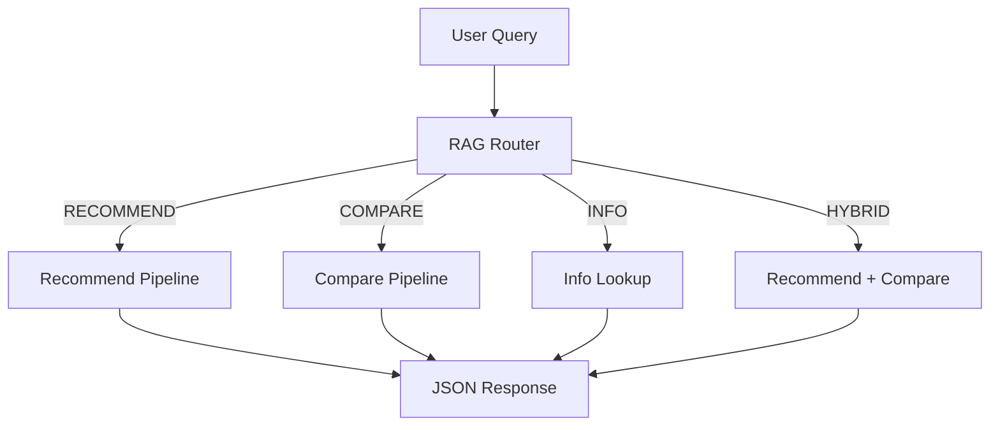
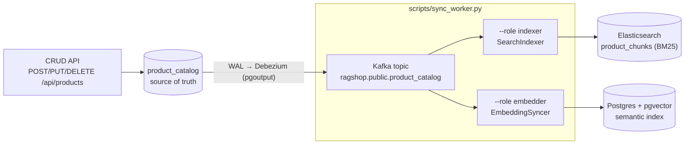
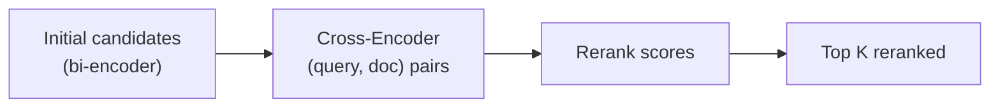
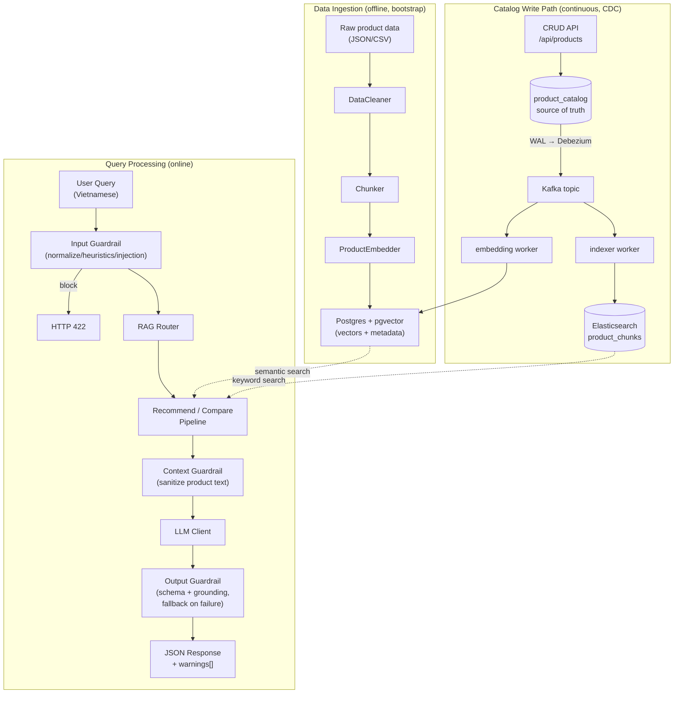

# Pipeline Flow

This page describes the detailed data flow through the RAG system, from user query to final response.

## High-Level Overview

Every user query goes through the **RAG Router** first, which classifies the query into one of four types and dispatches it to the appropriate pipeline.



## Query Classification (RAG Router)

The `RAGRouter` classifies queries using regex pattern matching on Vietnamese and English keywords.

| Query Type | Trigger Keywords | Example |
| ---------- | --------------- | ------- |
| **RECOMMEND** | gợi ý, nên mua, tư vấn, recommend, đề xuất | *"Tư vấn điện thoại dưới 10 triệu"* |
| **COMPARE** | so sánh, compare, vs, tốt hơn, khác nhau | *"So sánh iPhone 15 và Samsung S24"* |
| **INFO** | thông số, giá, specs, cấu hình, review | *"Giá iPhone 15 Pro Max bao nhiêu?"* |
| **HYBRID** | Both recommend + compare patterns matched | *"Nên mua iPhone hay Samsung, so sánh giúp tôi"* |

If no pattern matches, the router defaults to **RECOMMEND**.

**Source:** `src/pipeline/rag_router.py`

---

## Recommend Pipeline

The recommendation pipeline finds products matching the user's intent and generates an LLM-powered explanation.

```mermaid
flowchart LR
    subgraph Guard0["0. Input Guardrail"]
        Q0[Raw Query] --> GIN["normalize → heuristics\n→ injection"]
        GIN -->|block| E422["raise\nInputGuardrailBlocked"]
        GIN -->|allow / sanitize| Q[Sanitized Query]
    end

    subgraph Intent["1. Parse Intent"]
        Q --> IP[UserIntentParser]
        IP --> Intent_Out["budget, use_case,\npriorities, brand_pref"]
    end

    subgraph Retrieve["2. Retrieve"]
        Intent_Out --> QR["QueryRewriter\n(normalize/expand/\nintent-aware)"]
        QR --> FE[FilterEngine]
        FE --> Filters["price, brand,\ncategory, rating"]
        QR --> EMB[ProductEmbedder]
        EMB --> Vec["Query Vector(s)\n(1 per variant)"]
        Filters --> VS[VectorStore.query]
        Vec --> VS
        Q --> BM["Keyword search\n(Elasticsearch BM25 /\nin-memory fallback)"]
        Filters --> BM
        VS --> RRF["RRF fusion\n(HybridSearch)"]
        BM --> RRF
        RRF --> Candidates["top_k × 3 candidates"]
    end

    subgraph Score["3. Score & Rank"]
        Candidates --> CE["CrossEncoderReranker\n(optional)"]
        CE --> PS[ProductScorer]
        PS --> Ranked["Scored + sorted"]
        Ranked --> TopK["Top K products"]
    end

    subgraph Generate["4. Generate"]
        TopK --> GCTX["Context Guardrail\n(sanitize_text_field per product)"]
        GCTX --> PT[Prompt Template]
        PT --> LLM[LLM Client]
        LLM --> RP[ResponseParser]
        RP --> GOUT["Output Guardrail\n(schema validate + grounding)"]
        GOUT -->|invalid / ungrounded| FB["Deterministic Fallback\n(from TopK, no 2nd LLM call)"]
        GOUT -->|valid & grounded| Resp["JSON Response\n+ warnings[]"]
        FB --> Resp
    end
```



### Step-by-Step

**Step 0 — Input Guardrail**

Before anything else, the raw query runs through the input `GuardrailChain`: `NormalizeGuardrail` (strip control chars, collapse whitespace) → `HeuristicGuardrail` (blank/length/URL-count/code-block checks) → `InjectionGuardrail` (prompt-injection/jailbreak regex denylist, English + Vietnamese). A `block` result raises `InputGuardrailBlocked`, which the route maps to `HTTP 422` with the Vietnamese reason — retrieval and the LLM are never reached. A `sanitize` result (e.g. collapsed repeated characters) just replaces the query text and processing continues.

**Source:** `src/guardrails/input/`, `src/pipeline/recommend_pipeline.py`

**Step 1 — Parse User Intent**

The `UserIntentParser` analyzes the query to extract structured intent:

- **budget** — price range (e.g., "dưới 15 triệu" → `price_max: 15_000_000`)
- **use_case** — purpose (gaming, photography, work, etc.)
- **priorities** — what matters most (camera, battery, performance, etc.)
- **brand_pref** — preferred brand if mentioned

**Source:** `src/pipeline/recommend/user_intent_parser.py`

**Step 2 — Rewrite, Filter & Retrieve**

Before filtering and embedding, `QueryRewriter` normalizes the query, corrects
common typos, expands synonyms, and (using the intent from Step 1) appends
use_case/priority vocabulary. This is local (regex + lookup tables) so it
costs no extra API calls with the default single-variant configuration. See
[Query Rewriting](query-rewriting.md) for the full breakdown.

Then two things happen in parallel, both operating on the **rewritten**
query:

1. **FilterEngine** extracts metadata filters from the query (brand, category, price range, minimum rating) using regex patterns on both Vietnamese ("dưới 15 triệu") and English ("under 15 million") text.
2. **ProductEmbedder** converts each query variant into a vector using the configured embedding provider (`embedding_provider`/`embedding_model` in `configs/settings.yaml`, e.g. Gemini `gemini-embedding-001` or OpenAI `text-embedding-3-small`). With the default `query_rewrite_max_variants: 1` there is exactly one variant, so this is a single embedding call, same as before query rewriting existed.

The `ProductRetriever` then queries Postgres (pgvector) with each vector and the filters translated into SQL conditions — equality for brand/category, numeric ranges for price/rating (e.g. `(metadata->>'price')::numeric <= 15000000`) — retrieving `top_k × 3` candidates per variant (over-fetching for the scoring step to narrow down), merging multi-variant results by keeping the best score per product id. Over-budget products are excluded here, before scoring and prompting.

With `use_bm25` enabled (default), the semantic results are then fused with a **BM25** keyword ranking via **Reciprocal Rank Fusion** (`HybridSearch`), so exact-term matches (model numbers, spec tokens) get boosted. In production the keyword branch is served by **Elasticsearch** (`ESKeywordSearch`, index `product_chunks`), kept fresh by the CDC sync workers, with filters pushed into the ES query as `bool.filter` clauses (**pre-filter**, same guarantee as the semantic branch's SQL `WHERE`). If Elasticsearch is unreachable, the branch falls back to an **in-memory BM25** snapshot built at startup (filters re-applied in Python, a post-filter); if even that is unavailable, retrieval degrades to semantic-only. See [Hybrid Retrieval & Reranking](hybrid-retrieval.md) for the full technique.

**Source:** `src/retrieval/query_rewriter.py`, `src/retrieval/product_retriever.py`, `src/retrieval/filter_engine.py`, `src/retrieval/hybrid_search.py`, `src/retrieval/es_keyword_search.py`, `src/retrieval/keyword_search.py`

**Step 3 — Score & Rank**

Each candidate gets a composite score from `ProductScorer`:

- **Semantic similarity** — cosine distance from the vector search (converted to `1 - distance`)
- **Price match** — how well the product fits the budget
- **Rating** — average user rating
- **Feature match** — overlap between user priorities and product features

With `use_reranker` enabled, the fused candidates are first re-scored by the cross-encoder (`CrossEncoderReranker`) and the sigmoid-squashed rerank score replaces the retrieval score as the relevance component.

Products are sorted by `final_score` descending and truncated to `top_k`.

**Source:** `src/pipeline/recommend/scoring.py`, `src/retrieval/similarity_scorer.py`

**Step 4 — Generate LLM Response**

The top products are first run through the **context guardrail** (`sanitize_text_field()` — strips HTML/script and embedded-instruction sentences, truncates each field), then formatted into a context string (name, brand, price, rating, score — these fields come from the chunk metadata written at ingest time) and injected into a prompt template along with the parsed intent. The LLM is called in **native JSON mode** (Gemini `response_mime_type: application/json`, OpenAI `response_format: json_object`), so it returns strict JSON with no prose preamble.

The raw text then goes through the **output guardrail**: `ResponseParser` extracts JSON (direct or markdown-fenced), which is validated against `RecommendLLMOutput` (Pydantic), then every recommendation's `name` is **grounded** against the retrieved product list (unmatched items are dropped). If validation fails, or grounding empties the list, the pipeline falls back to a deterministic response built from the already-scored `TopK` products — **no second LLM call**. Either way the API returns `200`; a `warnings[]` list explains anything that was sanitized, dropped, or replaced. See [Guardrails](guardrails.md) for the full mechanism.

**Source:** `src/pipeline/recommend_pipeline.py`, `src/generation/prompt_templates/recommend_prompt.py`, `src/guardrails/`

---

## Compare Pipeline

The comparison pipeline retrieves specs for multiple products and generates a detailed analysis.

```mermaid
flowchart LR
    subgraph Guard0["0. Input Guardrail (query only)"]
        Q0[Query, if provided] --> GIN["normalize → heuristics\n→ injection"]
        GIN -->|block| E422["raise\nInputGuardrailBlocked"]
        GIN -->|allow / sanitize| Q[Sanitized Query]
    end

    subgraph Extract["1. Get Products"]
        Q --> EX{product_ids\nprovided?}
        EX -->|Yes| Lookup["Lookup by ID\n(ProductRepository)"]
        EX -->|No| Search[Retrieve from query]
        Lookup --> Products
        Search --> Products["Product list\n(max_compare_products,\n≥ 2 required)"]
    end

    subgraph Compare["2. Compare"]
        Products --> COMP[ProductComparator]
        COMP --> SA[SpecAligner]
        SA --> Aligned["Aligned specs table"]
        Aligned --> FMT[ComparisonFormatter]
        FMT --> Table["Markdown table"]
    end

    subgraph Analyze["3. LLM Analysis"]
        Table --> GCTX["Context Guardrail\n(sanitize_text_field per product)"]
        Products --> GCTX
        GCTX --> PT[Prompt Template]
        PT --> LLM[LLM Client]
        LLM --> RP[ResponseParser]
        RP --> GOUT["Output Guardrail\n(schema validate + grounding)"]
        GOUT -->|invalid / ungrounded| FB["Deterministic Fallback\n(from Products, no 2nd LLM call)"]
        GOUT -->|valid & grounded| Resp["JSON Response\n(table + analysis)\n+ warnings[]"]
        FB --> Resp
    end
```



### Step-by-Step

**Step 0 — Input Guardrail**

Only runs when a free-text `query` is provided (a pure `product_ids` request has no query to check). Same `GuardrailChain` as the recommend pipeline: normalize → heuristics → injection. A `block` raises `InputGuardrailBlocked` → `HTTP 422`.

**Source:** `src/guardrails/input/`, `src/pipeline/compare_pipeline.py`

**Step 1 — Get Products**

Two paths depending on the API call:

- **With `product_ids`** — look up each id via `ProductRepository` (the source-of-truth catalog).
- **Without `product_ids`** — use the `ProductRetriever` to search for products mentioned in the query, then take the top 3.

The resulting list is capped at `GuardrailConfig.max_compare_products` (default 5). At least 2 products are required; otherwise the pipeline returns `{"error": "Cần ít nhất 2 sản phẩm để so sánh."}`, which the route maps to `HTTP 422`.

**Step 2 — Compare Specifications**

The `ProductComparator` orchestrates the comparison:

1. `SpecAligner` normalizes and aligns specifications across products so they share the same set of keys (e.g., "RAM", "Storage", "Battery").
2. `ComparisonFormatter` renders the aligned data as a Markdown table.
3. `ProsConsExtractor` identifies advantages and disadvantages for each product.

**Source:** `src/pipeline/compare/comparator.py`, `src/pipeline/compare/spec_aligner.py`

**Step 3 — LLM Analysis**

Product descriptions run through the **context guardrail** (`sanitize_text_field()`) before being injected into the prompt template alongside the comparison table. The LLM produces a detailed Vietnamese analysis covering strengths, weaknesses, and a final recommendation based on use case.

The raw response then goes through the **output guardrail**: parsed and validated against `CompareLLMOutput` (Pydantic), then every `product_analysis[].name` is **grounded** against the products actually being compared (unmatched items dropped). On schema failure or an empty grounded result, the pipeline falls back to a deterministic analysis built from the comparison table — **no second LLM call**. The response always includes both the structured table and the narrative analysis, plus a `warnings[]` list. See [Guardrails](guardrails.md).

**Source:** `src/pipeline/compare_pipeline.py`, `src/generation/prompt_templates/compare_prompt.py`, `src/guardrails/`

---

## Catalog & CDC Sync Flow

The pipelines above only **read** the search indexes. Writes follow a separate, continuous path so both indexes stay consistent with a single **source of truth**.

The `product_catalog` table (Postgres, `REPLICA IDENTITY FULL`) is that source of truth. The CRUD API (`POST/PUT/DELETE /api/products`) writes **only** there — it never touches Elasticsearch or pgvector. **Debezium** (pgoutput plugin, `snapshot.mode: initial`) captures WAL row changes into the Kafka topic `ragshop.public.product_catalog`, and two CDC sync workers (`scripts/sync_worker.py --role indexer|embedder`) consume that single ordered stream to update the derived indexes.



- **Indexer worker** (`src/sync/indexer_worker.py`, `SearchIndexer`) → Elasticsearch keyword/BM25 index `product_chunks`; idempotent upsert/delete keyed by chunk id `{product_id}_{chunk_type}`.
- **Embedding worker** (`src/sync/embedding_worker.py`, `EmbeddingSyncer`) → pgvector semantic index; re-embeds **only when a text-bearing field changed**. Price/rating changes are cheap **metadata-only** JSONB updates (no embedding call), and snapshot replays of unchanged rows cost zero embedding calls (detected via `content_hash`).

Delivery is **at-least-once** — offsets are committed only after the handler applied the event (`src/sync/runner.py`) — and both handlers are **idempotent**, so replays converge (eventual consistency). Lag makes results *stale*, never wrong. Supporting modules: `src/sync/events.py` (parse Debezium op `c`/`u`/`d`/`r`, decode JSONB, `content_hash`), `src/sync/chunk_builder.py` (row → chunk payload, shared with `scripts/ingest.py`), `src/sync/runner.py` (Kafka consumer loop).

See [Data Flow](data-flow.md#continuous-product-write-data-flow-cdc) and [Hybrid Retrieval](hybrid-retrieval.md).

**Source:** `scripts/sync_worker.py`, `src/sync/*.py`, `src/catalog/product_repository.py`, `docker/debezium/product-catalog-connector.json`

---

## Cross-Cutting Components

### Query Rewriting

Before filter extraction and embedding, `QueryRewriter` normalizes the query,
corrects common typos, expands synonyms, optionally enriches it with parsed
intent (use_case/priorities), and can fan out into multiple query variants
for parallel retrieval. Fully local — no extra LLM/embedding calls with the
default configuration. Full details: [Query Rewriting](query-rewriting.md).

**Source:** `src/retrieval/query_rewriter.py`

### Hybrid Search

`HybridSearch` combines multiple retrieval strategies:

- **Semantic search** — vector similarity via Postgres + pgvector
- **Keyword search** — **Elasticsearch** BM25 in production (`ESKeywordSearch`, index `product_chunks`, pre-filtered via `bool.filter`, CDC-synced), with an in-memory BM25 (Okapi) snapshot as the dev fallback and semantic-only as the final fallback
- **Metadata filter** — price, brand, category constraints, enforced on both branches

Results from the two branches are fused with **Reciprocal Rank Fusion** (`rrf_k = 60`). Full details: [Hybrid Retrieval & Reranking](hybrid-retrieval.md).

**Source:** `src/retrieval/hybrid_search.py`, `src/retrieval/es_keyword_search.py`

### Cross-Encoder Reranking

After initial retrieval, the `CrossEncoderReranker` can re-score candidates using a cross-encoder model (`ms-marco-MiniLM-L-6-v2`). Unlike bi-encoders that encode query and document separately, cross-encoders process the (query, document) pair jointly, producing more accurate relevance scores at the cost of speed.



Enabled via `use_reranker: true` in `configs/settings.yaml` (requires `uv add sentence-transformers`); wired into the recommend engine by `get_reranker()` in `api/deps.py`. Rerank logits are sigmoid-squashed before entering `ProductScorer`.

**Source:** `src/retrieval/reranker.py`

### Guardrails

Both pipelines run three non-LLM guardrail stages: an **input guardrail** (normalize → heuristics → injection denylist) rejects or cleans the raw query before retrieval; a **context guardrail** sanitizes retrieved product text (strip HTML, strip embedded instructions, truncate) before it enters the prompt; an **output guardrail** validates the LLM's JSON against a Pydantic schema and **grounds** every item against the retrieved/compared products, falling back to a deterministic response (no second LLM call) on failure. See [Guardrails](guardrails.md) for the full contract, package layout, and extension guide.

**Source:** `src/guardrails/`

### LLM Client

The `LLMClient` provides a unified interface for three providers (Gemini is the default):

| Provider | Model Example | SDK |
| -------- | ------------- | --- |
| Gemini | `gemini-2.5-flash` | `google-genai` |
| Anthropic | `claude-sonnet-4-6` | `anthropic` |
| OpenAI | `gpt-4o` | `openai` |

The provider is configured in `configs/settings.yaml` and the appropriate API key is resolved automatically via the `PROVIDER_API_KEY_ENV` mapping.

**Source:** `src/generation/llm_client.py`

### Dependency Injection

All components are wired together via factory functions in `api/deps.py`:

```
get_config() → PipelineConfig
get_embedder() → ProductEmbedder
get_vector_store() → VectorStore
get_query_rewriter() → QueryRewriter | None            # None when use_query_rewrite is off
get_retriever() → ProductRetriever                      # wraps query_rewriter, filter_engine, scorer
get_keyword_backend() → ESKeywordSearch | None        # Elasticsearch when configured & reachable
get_searcher() → HybridSearch | ProductRetriever      # ES/BM25 + RRF (use_bm25); ES → in-memory BM25 → semantic-only
get_reranker() → CrossEncoderReranker | None          # when use_reranker
get_llm_client() → LLMClient
get_cached_product_repository() → ProductRepository    # CRUD source-of-truth catalog
get_recommend_pipeline() → RecommendPipeline
get_compare_pipeline() → ComparePipeline
```

FastAPI routes call these factories to get fully configured pipeline instances.

**Source:** `api/deps.py`

---

## Data Flow Summary



The system has three data phases: **bootstrap ingestion** (offline, batch) loads the catalog plus both search indexes, the **CDC write path** (continuous) propagates every catalog write to Elasticsearch and pgvector, and **runtime** (online, per-request) answers user queries through the appropriate pipeline.
