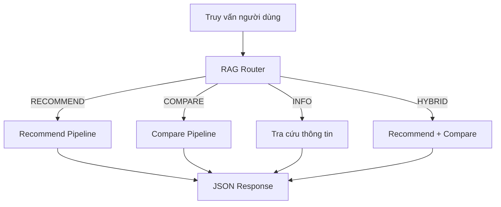
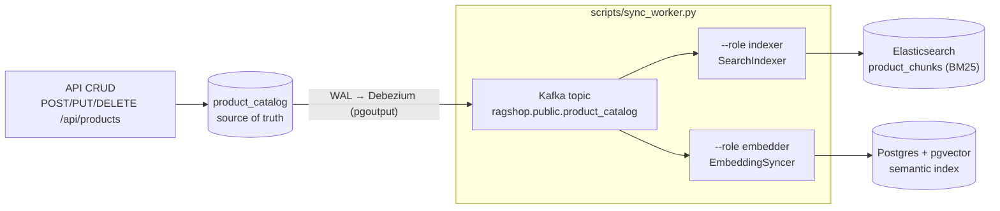
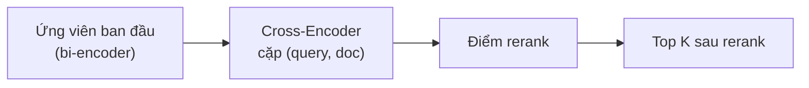
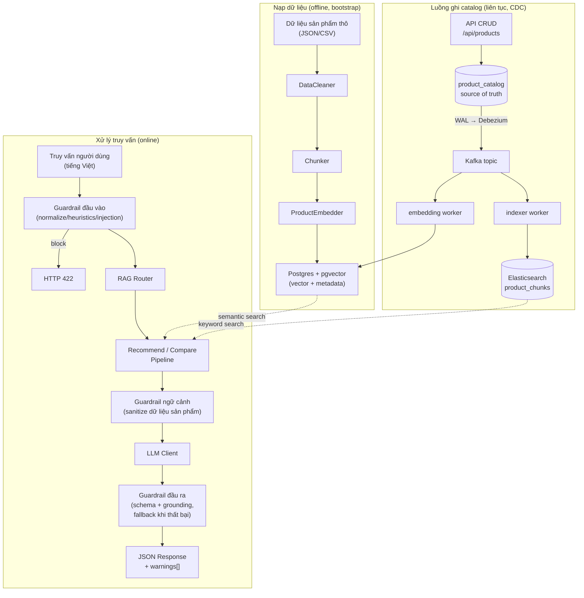

# Luồng xử lý (Pipeline Flow)

Trang này mô tả chi tiết luồng dữ liệu qua hệ thống RAG, từ truy vấn người dùng đến phản hồi cuối cùng.

## Tổng quan

Mọi truy vấn của người dùng đều đi qua **RAG Router** trước tiên, router này phân loại truy vấn thành một trong bốn loại và điều hướng tới pipeline phù hợp.



## Phân loại truy vấn (RAG Router)

`RAGRouter` phân loại truy vấn bằng cách so khớp regex trên từ khóa tiếng Việt và tiếng Anh.

| Loại truy vấn | Từ khóa kích hoạt | Ví dụ |
| ---------- | --------------- | ------- |
| **RECOMMEND** | gợi ý, nên mua, tư vấn, recommend, đề xuất | *"Tư vấn điện thoại dưới 10 triệu"* |
| **COMPARE** | so sánh, compare, vs, tốt hơn, khác nhau | *"So sánh iPhone 15 và Samsung S24"* |
| **INFO** | thông số, giá, specs, cấu hình, review | *"Giá iPhone 15 Pro Max bao nhiêu?"* |
| **HYBRID** | Khớp cả pattern recommend + compare | *"Nên mua iPhone hay Samsung, so sánh giúp tôi"* |

Nếu không pattern nào khớp, router mặc định chọn **RECOMMEND**.

**Nguồn:** `src/pipeline/rag_router.py`

---

## Recommend Pipeline

Pipeline gợi ý tìm các sản phẩm khớp với ý định của người dùng và sinh giải thích bằng LLM.

```mermaid
flowchart LR
    subgraph Guard0["0. Guardrail đầu vào"]
        Q0[Query gốc] --> GIN["normalize → heuristics\n→ injection"]
        GIN -->|block| E422["raise\nInputGuardrailBlocked"]
        GIN -->|allow / sanitize| Q[Query đã sanitize]
    end

    subgraph Intent["1. Phân tích ý định"]
        Q --> IP[UserIntentParser]
        IP --> Intent_Out["budget, use_case,\npriorities, brand_pref"]
    end

    subgraph Retrieve["2. Truy xuất"]
        Intent_Out --> QR["QueryRewriter\n(chuẩn hóa/mở rộng/\nintent-aware)"]
        QR --> FE[FilterEngine]
        FE --> Filters["price, brand,\ncategory, rating"]
        QR --> EMB[ProductEmbedder]
        EMB --> Vec["Query Vector(s)\n(1 mỗi variant)"]
        Filters --> VS[VectorStore.query]
        Vec --> VS
        Q --> BM["Keyword search\n(Elasticsearch BM25 /\nin-memory fallback)"]
        Filters --> BM
        VS --> RRF["RRF fusion\n(HybridSearch)"]
        BM --> RRF
        RRF --> Candidates["top_k × 3 candidates"]
    end

    subgraph Score["3. Chấm điểm & Xếp hạng"]
        Candidates --> CE["CrossEncoderReranker\n(optional)"]
        CE --> PS[ProductScorer]
        PS --> Ranked["Đã chấm điểm + sắp xếp"]
        Ranked --> TopK["Top K sản phẩm"]
    end

    subgraph Generate["4. Sinh phản hồi"]
        TopK --> GCTX["Guardrail ngữ cảnh\n(sanitize_text_field từng sản phẩm)"]
        GCTX --> PT[Prompt Template]
        PT --> LLM[LLM Client]
        LLM --> RP[ResponseParser]
        RP --> GOUT["Guardrail đầu ra\n(validate schema + grounding)"]
        GOUT -->|không hợp lệ / ungrounded| FB["Fallback tất định\n(từ TopK, không gọi lại LLM)"]
        GOUT -->|hợp lệ & grounded| Resp["JSON Response\n+ warnings[]"]
        FB --> Resp
    end
```



### Từng bước

**Bước 0 — Guardrail đầu vào**

Trước tiên, truy vấn thô đi qua `GuardrailChain` đầu vào: `NormalizeGuardrail` (bỏ ký tự điều khiển, gộp khoảng trắng) → `HeuristicGuardrail` (kiểm tra rỗng/độ dài/số URL/code block) → `InjectionGuardrail` (regex denylist prompt injection/jailbreak, tiếng Anh + tiếng Việt). Kết quả `block` sẽ raise `InputGuardrailBlocked`, route map thành `HTTP 422` kèm lý do tiếng Việt — retrieval và LLM không bao giờ được chạm tới. Kết quả `sanitize` (vd gộp ký tự lặp) chỉ thay thế text của query rồi xử lý tiếp tục.

**Nguồn:** `src/guardrails/input/`, `src/pipeline/recommend_pipeline.py`

**Bước 1 — Phân tích ý định người dùng**

`UserIntentParser` phân tích truy vấn để trích xuất ý định có cấu trúc:

- **budget** — khoảng giá (vd: "dưới 15 triệu" → `price_max: 15_000_000`)
- **use_case** — mục đích sử dụng (chơi game, chụp ảnh, công việc, ...)
- **priorities** — điều quan trọng nhất (camera, pin, hiệu năng, ...)
- **brand_pref** — thương hiệu ưu tiên nếu được đề cập

**Nguồn:** `src/pipeline/recommend/user_intent_parser.py`

**Bước 2 — Viết lại truy vấn, Filter & Retrieve**

Trước khi lọc và embed, `QueryRewriter` chuẩn hóa truy vấn, sửa lỗi gõ phổ
biến, mở rộng đồng nghĩa, và (dùng intent từ Bước 1) thêm từ vựng
use_case/priority. Bước này chạy local (regex + bảng tra cứu) nên không tốn
thêm lệnh gọi API nào với cấu hình mặc định (một variant). Xem [Viết lại
truy vấn](query-rewriting.vi.md) để biết chi tiết đầy đủ.

Sau đó hai việc diễn ra song song, cả hai đều thao tác trên truy vấn **đã
rewrite**:

1. **FilterEngine** trích xuất metadata filter từ truy vấn (thương hiệu, danh mục, khoảng giá, rating tối thiểu) bằng regex pattern trên cả văn bản tiếng Việt ("dưới 15 triệu") lẫn tiếng Anh ("under 15 million").
2. **ProductEmbedder** chuyển từng query variant thành vector bằng embedding provider đã cấu hình (`embedding_provider`/`embedding_model` trong `configs/settings.yaml`, ví dụ Gemini `gemini-embedding-001` hoặc OpenAI `text-embedding-3-small`). Với `query_rewrite_max_variants: 1` (mặc định), chỉ có đúng một variant, nên đây là một lệnh gọi embedding duy nhất, giống hệt trước khi có query rewriting.

`ProductRetriever` sau đó truy vấn Postgres (pgvector) với từng vector và các filter đã dịch thành điều kiện SQL — so sánh bằng cho thương hiệu/danh mục, khoảng số cho giá/rating (ví dụ `(metadata->>'price')::numeric <= 15000000`) — lấy về `top_k × 3` ứng viên mỗi variant (lấy dư để bước chấm điểm thu hẹp lại), hợp nhất kết quả đa-variant bằng cách giữ điểm cao nhất cho mỗi product id. Sản phẩm vượt ngân sách bị loại ngay tại đây, trước khi chấm điểm và đưa vào prompt.

Khi bật `use_bm25` (mặc định), kết quả semantic được hợp nhất với bảng xếp hạng keyword **BM25** qua **Reciprocal Rank Fusion** (`HybridSearch`), nhờ đó các khớp chính xác theo từ (mã model, thông số) được đẩy hạng. Ở production, nhánh keyword do **Elasticsearch** phục vụ (`ESKeywordSearch`, index `product_chunks`), luôn fresh nhờ các CDC sync worker, với filter đẩy vào query ES dưới dạng mệnh đề `bool.filter` (**pre-filter**, cùng đảm bảo như mệnh đề SQL `WHERE` của nhánh semantic). Nếu Elasticsearch không kết nối được, nhánh này rơi về snapshot **BM25 in-memory** build lúc khởi động (filter áp lại bằng Python, tức post-filter); nếu cả cái đó cũng không có, truy xuất suy giảm về semantic-only. Xem [Truy xuất lai & Reranking](hybrid-retrieval.vi.md) để hiểu đầy đủ kỹ thuật.

**Nguồn:** `src/retrieval/query_rewriter.py`, `src/retrieval/product_retriever.py`, `src/retrieval/filter_engine.py`, `src/retrieval/hybrid_search.py`, `src/retrieval/es_keyword_search.py`, `src/retrieval/keyword_search.py`

**Bước 3 — Chấm điểm & Xếp hạng**

Mỗi ứng viên nhận một composite score từ `ProductScorer`:

- **Độ tương đồng ngữ nghĩa** — khoảng cách cosine từ vector search (chuyển đổi thành `1 - distance`)
- **Độ khớp giá** — sản phẩm phù hợp với ngân sách đến mức nào
- **Rating** — điểm đánh giá trung bình của người dùng
- **Độ khớp tính năng** — mức độ trùng khớp giữa ưu tiên người dùng và tính năng sản phẩm

Khi bật `use_reranker`, các ứng viên sau fusion được chấm lại bằng cross-encoder (`CrossEncoderReranker`) và điểm rerank (ép qua sigmoid) thay thế điểm truy xuất làm thành phần relevance.

Sản phẩm được sắp xếp giảm dần theo `final_score` và cắt còn `top_k`.

**Nguồn:** `src/pipeline/recommend/scoring.py`, `src/retrieval/similarity_scorer.py`

**Bước 4 — Sinh phản hồi bằng LLM**

Các sản phẩm hàng đầu trước tiên đi qua **guardrail ngữ cảnh** (`sanitize_text_field()` — bỏ HTML/script và các câu chứa chỉ dẫn giả mạo, cắt độ dài từng trường), sau đó được định dạng thành chuỗi ngữ cảnh (tên, thương hiệu, giá, rating, điểm — các trường này lấy từ metadata của chunk được ghi lúc ingest) và chèn vào prompt template cùng ý định đã phân tích. LLM được gọi ở **JSON mode gốc** (Gemini `response_mime_type: application/json`, OpenAI `response_format: json_object`) nên trả về JSON chuẩn, không có đoạn văn mở đầu.

Văn bản thô sau đó đi qua **guardrail đầu ra**: `ResponseParser` trích xuất JSON (trực tiếp hoặc từ markdown-fence), validate theo `RecommendLLMOutput` (Pydantic), rồi mỗi `name` trong danh sách gợi ý được **grounding** với sản phẩm đã truy xuất (item không khớp bị loại). Nếu validate thất bại, hoặc grounding làm rỗng danh sách, pipeline rơi về phản hồi tất định dựng từ `TopK` sản phẩm đã chấm điểm — **không gọi lại LLM**. Dù theo hướng nào, API vẫn trả `200`; danh sách `warnings[]` giải thích những gì đã bị sanitize, loại bỏ, hoặc thay thế. Xem [Guardrail](guardrails.vi.md) để biết cơ chế đầy đủ.

**Nguồn:** `src/pipeline/recommend_pipeline.py`, `src/generation/prompt_templates/recommend_prompt.py`, `src/guardrails/`

---

## Compare Pipeline

Pipeline so sánh truy xuất thông số của nhiều sản phẩm và sinh phân tích chi tiết.

```mermaid
flowchart LR
    subgraph Guard0["0. Guardrail đầu vào (chỉ khi có query)"]
        Q0[Query, nếu có] --> GIN["normalize → heuristics\n→ injection"]
        GIN -->|block| E422["raise\nInputGuardrailBlocked"]
        GIN -->|allow / sanitize| Q[Query đã sanitize]
    end

    subgraph Extract["1. Lấy sản phẩm"]
        Q --> EX{Có cung cấp\nproduct_ids?}
        EX -->|Có| Lookup["Tra cứu theo ID\n(ProductRepository)"]
        EX -->|Không| Search[Truy xuất từ query]
        Lookup --> Products
        Search --> Products["Danh sách sản phẩm\n(max_compare_products,\n≥ 2 yêu cầu)"]
    end

    subgraph Compare["2. So sánh"]
        Products --> COMP[ProductComparator]
        COMP --> SA[SpecAligner]
        SA --> Aligned["Bảng thông số đã đối chiếu"]
        Aligned --> FMT[ComparisonFormatter]
        FMT --> Table["Bảng Markdown"]
    end

    subgraph Analyze["3. Phân tích bằng LLM"]
        Table --> GCTX["Guardrail ngữ cảnh\n(sanitize_text_field từng sản phẩm)"]
        Products --> GCTX
        GCTX --> PT[Prompt Template]
        PT --> LLM[LLM Client]
        LLM --> RP[ResponseParser]
        RP --> GOUT["Guardrail đầu ra\n(validate schema + grounding)"]
        GOUT -->|không hợp lệ / ungrounded| FB["Fallback tất định\n(từ Products, không gọi lại LLM)"]
        GOUT -->|hợp lệ & grounded| Resp["JSON Response\n(bảng + phân tích)\n+ warnings[]"]
        FB --> Resp
    end
```



### Từng bước

**Bước 0 — Guardrail đầu vào**

Chỉ chạy khi có `query` dạng văn bản tự do (request chỉ có `product_ids` thì không có query để kiểm tra). Dùng cùng `GuardrailChain` như recommend pipeline: normalize → heuristics → injection. Kết quả `block` sẽ raise `InputGuardrailBlocked` → `HTTP 422`.

**Nguồn:** `src/guardrails/input/`, `src/pipeline/compare_pipeline.py`

**Bước 1 — Lấy sản phẩm**

Hai đường dẫn tùy theo lời gọi API:

- **Có `product_ids`** — tra cứu từng id qua `ProductRepository` (catalog source-of-truth).
- **Không có `product_ids`** — dùng `ProductRetriever` để tìm sản phẩm được nhắc đến trong truy vấn, sau đó lấy top 3.

Danh sách kết quả bị giới hạn tối đa `GuardrailConfig.max_compare_products` (mặc định 5). Cần tối thiểu 2 sản phẩm; nếu không pipeline trả về `{"error": "Cần ít nhất 2 sản phẩm để so sánh."}`, route map thành `HTTP 422`.

**Bước 2 — So sánh thông số kỹ thuật**

`ProductComparator` điều phối việc so sánh:

1. `SpecAligner` chuẩn hóa và đối chiếu thông số giữa các sản phẩm để chúng dùng chung một bộ khóa (vd: "RAM", "Bộ nhớ", "Pin").
2. `ComparisonFormatter` render dữ liệu đã đối chiếu thành bảng Markdown.
3. `ProsConsExtractor` xác định ưu điểm và nhược điểm của từng sản phẩm.

**Nguồn:** `src/pipeline/compare/comparator.py`, `src/pipeline/compare/spec_aligner.py`

**Bước 3 — Phân tích bằng LLM**

Mô tả sản phẩm đi qua **guardrail ngữ cảnh** (`sanitize_text_field()`) trước khi được chèn vào prompt template cùng bảng so sánh. LLM tạo ra phân tích chi tiết bằng tiếng Việt bao gồm điểm mạnh, điểm yếu, và khuyến nghị cuối cùng dựa trên mục đích sử dụng.

Phản hồi thô sau đó đi qua **guardrail đầu ra**: parse và validate theo `CompareLLMOutput` (Pydantic), rồi mỗi `product_analysis[].name` được **grounding** với các sản phẩm thực sự đang so sánh (item không khớp bị loại). Khi schema thất bại hoặc kết quả grounding rỗng, pipeline rơi về phân tích tất định dựng từ bảng so sánh — **không gọi lại LLM**. Phản hồi luôn bao gồm cả bảng có cấu trúc lẫn phần phân tích tường thuật, cộng thêm danh sách `warnings[]`. Xem [Guardrail](guardrails.vi.md).

**Nguồn:** `src/pipeline/compare_pipeline.py`, `src/generation/prompt_templates/compare_prompt.py`, `src/guardrails/`

---

## Catalog & CDC Sync Flow

Các pipeline ở trên chỉ **đọc** các index tìm kiếm. Việc ghi đi theo một đường riêng, liên tục, để cả hai index luôn nhất quán với một **source of truth** duy nhất.

Bảng `product_catalog` (Postgres, `REPLICA IDENTITY FULL`) chính là source of truth đó. API CRUD (`POST/PUT/DELETE /api/products`) **chỉ** ghi vào đó — không bao giờ động tới Elasticsearch hay pgvector. **Debezium** (plugin pgoutput, `snapshot.mode: initial`) bắt thay đổi row từ WAL vào Kafka topic `ragshop.public.product_catalog`, và hai CDC sync worker (`scripts/sync_worker.py --role indexer|embedder`) consume một stream có thứ tự duy nhất để cập nhật các index dẫn xuất.



- **Indexer worker** (`src/sync/indexer_worker.py`, `SearchIndexer`) → index keyword/BM25 Elasticsearch `product_chunks`; upsert/delete idempotent theo chunk id `{product_id}_{chunk_type}`.
- **Embedding worker** (`src/sync/embedding_worker.py`, `EmbeddingSyncer`) → index semantic pgvector; chỉ re-embed **khi trường mang text thay đổi**. Thay đổi giá/rating là update **metadata-only** JSONB rẻ (không gọi embedding), và replay snapshot của các row không đổi tốn 0 lần gọi embedding (phát hiện qua `content_hash`).

Delivery là **at-least-once** — offset chỉ commit sau khi handler áp xong event (`src/sync/runner.py`) — và cả hai handler đều **idempotent**, nên replay luôn hội tụ (eventual consistency). Lag chỉ làm kết quả *trễ*, không bao giờ sai. Các module hỗ trợ: `src/sync/events.py` (parse Debezium op `c`/`u`/`d`/`r`, decode JSONB, `content_hash`), `src/sync/chunk_builder.py` (row → chunk payload, dùng chung với `scripts/ingest.py`), `src/sync/runner.py` (vòng lặp Kafka consumer).

Xem [Luồng dữ liệu](data-flow.vi.md) và [Truy xuất lai](hybrid-retrieval.vi.md).

**Nguồn:** `scripts/sync_worker.py`, `src/sync/*.py`, `src/catalog/product_repository.py`, `docker/debezium/product-catalog-connector.json`

---

## Các thành phần dùng chung (Cross-Cutting)

### Viết lại truy vấn (Query Rewriting)

Trước khi trích filter và embed, `QueryRewriter` chuẩn hóa truy vấn, sửa lỗi
gõ phổ biến, mở rộng đồng nghĩa, tùy chọn làm giàu bằng intent đã parse
(use_case/priorities), và có thể fan-out thành nhiều query variant để truy
xuất song song. Hoàn toàn chạy local — không tốn thêm lệnh gọi LLM/embedding
nào với cấu hình mặc định. Chi tiết đầy đủ: [Viết lại truy vấn](query-rewriting.vi.md).

**Nguồn:** `src/retrieval/query_rewriter.py`

### Hybrid Search

`HybridSearch` kết hợp nhiều chiến lược truy xuất:

- **Semantic search** — độ tương đồng vector qua Postgres + pgvector
- **Keyword search** — **Elasticsearch** BM25 ở production (`ESKeywordSearch`, index `product_chunks`, pre-filter qua `bool.filter`, CDC-synced), với snapshot BM25 (Okapi) in-memory làm fallback cho dev và semantic-only làm fallback cuối
- **Metadata filter** — ràng buộc giá, thương hiệu, danh mục, áp trên cả hai nhánh

Kết quả từ hai nhánh được hợp nhất bằng **Reciprocal Rank Fusion** (`rrf_k = 60`). Chi tiết đầy đủ: [Truy xuất lai & Reranking](hybrid-retrieval.vi.md).

**Nguồn:** `src/retrieval/hybrid_search.py`, `src/retrieval/es_keyword_search.py`

### Cross-Encoder Reranking

Sau khi truy xuất ban đầu, `CrossEncoderReranker` có thể chấm điểm lại các ứng viên bằng mô hình cross-encoder (`ms-marco-MiniLM-L-6-v2`). Khác với bi-encoder mã hóa truy vấn và tài liệu riêng biệt, cross-encoder xử lý cặp (query, document) cùng lúc, cho ra điểm liên quan chính xác hơn nhưng đánh đổi bằng tốc độ.



Bật qua `use_reranker: true` trong `configs/settings.yaml` (cần `uv add sentence-transformers`); nối vào recommend engine bởi `get_reranker()` trong `api/deps.py`. Logit rerank được ép qua sigmoid trước khi vào `ProductScorer`.

**Nguồn:** `src/retrieval/reranker.py`

### Guardrails

Cả hai pipeline đều chạy ba tầng guardrail không dùng LLM: **guardrail đầu vào** (normalize → heuristics → injection denylist) từ chối hoặc làm sạch truy vấn thô trước khi truy xuất; **guardrail ngữ cảnh** sanitize dữ liệu sản phẩm đã truy xuất (bỏ HTML, bỏ chỉ dẫn giả mạo, cắt độ dài) trước khi đưa vào prompt; **guardrail đầu ra** validate JSON của LLM theo Pydantic schema và **grounding** từng item với sản phẩm đã truy xuất/so sánh, rơi về phản hồi tất định (không gọi lại LLM) khi thất bại. Xem [Guardrail](guardrails.vi.md) để biết đầy đủ contract, cấu trúc package, và cách mở rộng.

**Nguồn:** `src/guardrails/`

### LLM Client

`LLMClient` cung cấp giao diện thống nhất cho ba provider (Gemini là mặc định):

| Provider | Model ví dụ | SDK |
| -------- | ------------- | --- |
| Gemini | `gemini-2.5-flash` | `google-genai` |
| Anthropic | `claude-sonnet-4-6` | `anthropic` |
| OpenAI | `gpt-4o` | `openai` |

Provider được cấu hình trong `configs/settings.yaml` và API key tương ứng được tự động resolve qua mapping `PROVIDER_API_KEY_ENV`.

**Nguồn:** `src/generation/llm_client.py`

### Dependency Injection

Tất cả các component được kết nối với nhau qua các factory function trong `api/deps.py`:

```
get_config() → PipelineConfig
get_embedder() → ProductEmbedder
get_vector_store() → VectorStore
get_query_rewriter() → QueryRewriter | None            # None khi use_query_rewrite tắt
get_retriever() → ProductRetriever                      # bọc query_rewriter, filter_engine, scorer
get_keyword_backend() → ESKeywordSearch | None        # Elasticsearch khi được cấu hình & sẵn sàng
get_searcher() → HybridSearch | ProductRetriever      # ES/BM25 + RRF (use_bm25); ES → BM25 in-memory → semantic-only
get_reranker() → CrossEncoderReranker | None          # khi use_reranker
get_llm_client() → LLMClient
get_cached_product_repository() → ProductRepository    # catalog source-of-truth cho CRUD
get_recommend_pipeline() → RecommendPipeline
get_compare_pipeline() → ComparePipeline
```

Các route FastAPI gọi các factory này để lấy instance pipeline đã được cấu hình đầy đủ.

**Nguồn:** `api/deps.py`

---

## Tóm tắt luồng dữ liệu



Hệ thống có ba giai đoạn dữ liệu: **bootstrap ingestion** (offline, theo batch) nạp catalog cùng cả hai index tìm kiếm, **luồng ghi CDC** (liên tục) lan truyền mọi thay đổi catalog sang Elasticsearch và pgvector, và **runtime** (online, theo từng request) trả lời truy vấn người dùng qua pipeline phù hợp.
