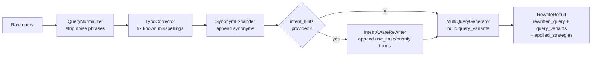

# Query Rewriting

Before a query is embedded or matched against `FilterEngine`, it passes through
`QueryRewriter` (`src/retrieval/query_rewriter.py`) - a small, extensible
pipeline that improves recall on the messy, colloquial Vietnamese (and
English) phrasing real users type. It runs entirely locally (regex + static
lookup tables), so enabling it costs no extra LLM/embedding calls unless
multi-query fan-out is turned on.

## Four techniques, one file

| # | Technique | Class | What it does |
|---|-----------|-------|---------------|
| 1 | Query Normalization | `QueryNormalizer` | Replaces colloquial/inflated phrasing with canonical terms (e.g. "siêu rẻ" → "giá thấp"), collapses whitespace |
| 2 | Query Expansion — typo correction | `TypoCorrector` | Fixes common misspellings/abbreviations via a static whole-word lookup (e.g. "sam sung" → "samsung", "dt" → "điện thoại") |
| 2 | Query Expansion — synonyms | `SynonymExpander` | Appends related terms not already present (e.g. "pin trâu" → adds "pin khỏe, thời lượng pin dài") |
| 3 | Multi-query generation | `MultiQueryGenerator` | Produces several query variants (rewritten, original, stopword-stripped "core") for parallel retrieval |
| 4 | Intent-aware rewriting | `IntentAwareRewriter` | Enriches the query with vocabulary derived from the already-parsed `UserIntent` (use_case, priorities) |

## Data-driven vocabulary

Every lookup table used above (`noise_replacements`, `typo_corrections`,
`synonyms`, `use_case_terms`, `priority_terms`, `stopwords`) lives in
`src/retrieval/data/query_rewrite_rules.json`, not hard-coded in the classes.
Each strategy loads it once at construction time (module-level
`@lru_cache`d loader), so growing the vocabulary is a pure data change - no
code edit, no redeploy of logic:

```json
{
  "noise_replacements": [["\\bsiêu rẻ\\b", "giá thấp"], ...],
  "typo_corrections": {"sam sung": "samsung", ...},
  "synonyms": {"pin trâu": ["pin khỏe", "thời lượng pin dài"], ...},
  "use_case_terms": {"gaming": ["hiệu năng mạnh chơi game mượt", ...], ...},
  "priority_terms": {"battery": ["pin trâu thời lượng pin dài", ...], ...},
  "stopwords": ["cho", "tôi", "please", ...]
}
```

`use_case_terms`/`priority_terms` map each key to a **list** of phrases
(not a single string) - `IntentAwareRewriter` checks each phrase for
"already present in the query" independently, so adding a new phrase to an
existing key never breaks the containment check for the phrases already
there. Every class also accepts the corresponding table as a constructor
argument (e.g. `TypoCorrector(corrections={...})`) to override the JSON
default entirely - handy for tests or a per-tenant vocabulary.

## End-to-end flow



`QueryNormalizer`, `TypoCorrector`, and `SynonymExpander` run as a sequential
chain (`QueryRewriter.strategies`) - each strategy receives the previous
one's output, mirroring `GuardrailChain` in `src/guardrails/base.py`.
`IntentAwareRewriter` and `MultiQueryGenerator` sit outside that chain because
their contract differs: the former needs `intent_hints` in addition to the
query text, and the latter returns *multiple* queries instead of rewriting
one.

## Wiring into retrieval

`ProductRetriever.retrieve()` (`src/retrieval/product_retriever.py`) is the
only integration point:

1. If a `QueryRewriter` is configured, call `.rewrite(query, intent_hints)`
   to get a `RewriteResult`.
2. Extract filters (`FilterEngine.extract_filters`) from the **rewritten**
   query, not the raw one - so a typo-corrected brand name (e.g. "sam sung"
   → "samsung") still produces a brand filter.
3. Embed **each** query variant and query the vector store; results are
   merged by keeping the best (max) score per product id.
4. Score and rank the merged candidates exactly as before.

With the default `max_variants=1`, `query_variants == [rewritten_query]`, so
step 3 makes exactly one embedding call - identical cost to the pre-rewrite
code path.

`HybridSearch.retrieve()`/`.search()` (`src/retrieval/hybrid_search.py`)
forward `intent_hints` to the semantic branch (`ProductRetriever`); the
keyword (BM25/Elasticsearch) branch still searches on the raw query text.

`RecommendEngine.recommend()` (`src/pipeline/recommend/engine.py`) builds
`intent_hints` from the `UserIntent` already returned by `UserIntentParser`
(`{"use_case": [...], "priorities": [...]}`) and passes it through to
`retriever.retrieve()`. The compare flow (`ComparePipeline`) does not parse
intent, so it only benefits from normalization/expansion, not the
intent-aware step.

!!! note
    `src/retrieval/` intentionally does not import `UserIntent` from
    `src/pipeline/` — `intent_hints` is a plain `dict`, so retrieval stays
    decoupled from the pipeline/orchestration layer (the same direction all
    other dependencies in the codebase point).

## Configuration

`configs/settings.yaml` → `PipelineConfig`:

| Key | Default | Meaning |
|---|---|---|
| `use_query_rewrite` | `true` | Enable normalization + typo correction + synonym expansion + intent-aware rewriting. Cheap (local, no API calls), so on by default. |
| `query_rewrite_max_variants` | `1` | Max query variants for multi-query fan-out. Each extra variant costs one more embedding call, so this is opt-in like `use_reranker`. |

Wired in `api/deps.py`:

```
get_query_rewriter() → QueryRewriter | None   # None when use_query_rewrite is off
get_retriever()      → ProductRetriever(..., query_rewriter=get_query_rewriter())
```

`get_retriever()` mirrors `get_reranker()`: `None` fully disables the feature
and `ProductRetriever.retrieve()` behaves exactly as it did before this
module existed.

## Extending

**Vocabulary only (no code change)** - edit
`src/retrieval/data/query_rewrite_rules.json`:

- Add a `[pattern, replacement]` pair to `noise_replacements` to normalize
  another colloquial phrase.
- Add an entry to `typo_corrections` to fix another misspelling/abbreviation
  (including toneless-Vietnamese input, e.g. `"gia re": "giá rẻ"`).
- Add an entry to `synonyms` to expand another term.
- Add a phrase to a list in `use_case_terms`/`priority_terms` to enrich
  intent-aware rewriting. Keys must match the values `UserIntentParser`
  produces - see `USE_CASE_KEYWORDS`/`PRIORITY_KEYWORDS` in
  `src/pipeline/recommend/user_intent_parser.py`, just applied in the
  opposite direction (intent → query text instead of query text → intent).
- Add a word to `stopwords` to strip another filler word from the
  "core keyword" multi-query variant.

**New logic** - add a new normalization/expansion step:

1. Subclass `BaseRewriteStrategy` and implement `apply(query: str) -> str`.
2. Add an instance to the list returned by `build_default_strategies()`.

To change how multi-query variants are generated (e.g. add an LLM-based
paraphrase step), extend `MultiQueryGenerator.generate()` or swap in a
different `multi_query` implementation when constructing `QueryRewriter`.

**Tests:** `tests/unit/retrieval/test_query_rewriter.py` covers every
strategy plus the `QueryRewriter` facade; `tests/unit/retrieval/test_product_retriever.py`
covers the retrieval-side wiring (filter extraction from the rewritten query,
multi-query fan-out and score merging).
