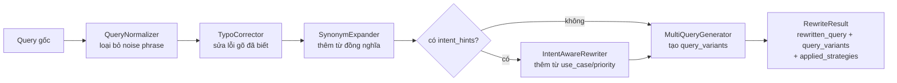

# Viết lại truy vấn (Query Rewriting)

Trước khi một câu query được embed hoặc so khớp với `FilterEngine`, nó đi qua
`QueryRewriter` (`src/retrieval/query_rewriter.py`) - một pipeline nhỏ, dễ mở
rộng giúp tăng recall trên những câu hỏi tiếng Việt (và tiếng Anh) khẩu ngữ,
không chuẩn mà người dùng thật hay gõ. Toàn bộ chạy local (regex + bảng tra
cứu tĩnh), nên bật tính năng này không tốn thêm lệnh gọi LLM/embedding nào,
trừ khi bật multi-query fan-out.

## Bốn kỹ thuật, một file

| # | Kỹ thuật | Class | Chức năng |
|---|-----------|-------|---------------|
| 1 | Query Normalization | `QueryNormalizer` | Thay cách nói khẩu ngữ/thổi phồng bằng thuật ngữ chuẩn (VD: "siêu rẻ" → "giá thấp"), gộp khoảng trắng thừa |
| 2 | Query Expansion — sửa lỗi gõ | `TypoCorrector` | Sửa lỗi gõ/viết tắt phổ biến qua bảng tra cứu tĩnh, whole-word (VD: "sam sung" → "samsung", "dt" → "điện thoại") |
| 2 | Query Expansion — đồng nghĩa | `SynonymExpander` | Thêm các từ liên quan chưa xuất hiện trong câu (VD: "pin trâu" → thêm "pin khỏe, thời lượng pin dài") |
| 3 | Multi-query generation | `MultiQueryGenerator` | Sinh nhiều phiên bản query (đã rewrite, câu gốc, phiên bản "từ khóa cốt lõi" đã bỏ hư từ) để retrieve song song |
| 4 | Intent-aware rewriting | `IntentAwareRewriter` | Làm giàu query bằng từ vựng suy ra từ `UserIntent` đã được parse trước đó (use_case, priorities) |

## Dữ liệu (vocabulary) tách riêng dạng JSON

Toàn bộ bảng tra cứu dùng ở trên (`noise_replacements`, `typo_corrections`,
`synonyms`, `use_case_terms`, `priority_terms`, `stopwords`) nằm trong
`src/retrieval/data/query_rewrite_rules.json`, không hard-code trong class.
Mỗi strategy nạp file này một lần lúc khởi tạo (loader module-level có
`@lru_cache`), nên mở rộng vocabulary chỉ là thay đổi dữ liệu - không cần
sửa code, không cần redeploy logic:

```json
{
  "noise_replacements": [["\\bsiêu rẻ\\b", "giá thấp"], ...],
  "typo_corrections": {"sam sung": "samsung", ...},
  "synonyms": {"pin trâu": ["pin khỏe", "thời lượng pin dài"], ...},
  "use_case_terms": {"gaming": ["hiệu năng mạnh chơi game mượt", ...], ...},
  "priority_terms": {"battery": ["pin trâu thời lượng pin dài", ...], ...},
  "stopwords": ["cho", "tôi", "please", ...]
}
```

`use_case_terms`/`priority_terms` ánh xạ mỗi khóa tới một **danh sách**
phrase (không phải một chuỗi) - `IntentAwareRewriter` kiểm tra từng phrase
"đã có trong query chưa" độc lập, nên thêm phrase mới vào một khóa đã có
không bao giờ phá vỡ việc kiểm tra của các phrase cũ. Mỗi class cũng nhận
bảng tương ứng qua constructor (VD: `TypoCorrector(corrections={...})`) để
override hoàn toàn mặc định từ JSON - tiện cho test hoặc vocabulary riêng
theo tenant.

## Luồng end-to-end



`QueryNormalizer`, `TypoCorrector`, và `SynonymExpander` chạy tuần tự
(`QueryRewriter.strategies`) - output của strategy trước là input của
strategy sau, giống hệt `GuardrailChain` trong `src/guardrails/base.py`.
`IntentAwareRewriter` và `MultiQueryGenerator` nằm ngoài chain đó vì hợp đồng
khác: cái trước cần thêm `intent_hints` ngoài text query, cái sau trả về
*nhiều* query thay vì rewrite một câu.

## Kết nối vào retrieval

`ProductRetriever.retrieve()` (`src/retrieval/product_retriever.py`) là điểm
tích hợp duy nhất:

1. Nếu có cấu hình `QueryRewriter`, gọi `.rewrite(query, intent_hints)` để
   lấy `RewriteResult`.
2. Trích xuất filter (`FilterEngine.extract_filters`) từ query **đã
   rewrite**, không phải câu gốc - nên một tên brand đã được sửa lỗi gõ (VD:
   "sam sung" → "samsung") vẫn tạo ra filter brand.
3. Embed **từng** query variant rồi query vector store; kết quả được hợp
   nhất bằng cách giữ điểm cao nhất (max) cho mỗi product id.
4. Chấm điểm và xếp hạng các ứng viên đã hợp nhất như cũ.

Với `max_variants=1` (mặc định), `query_variants == [rewritten_query]`, nên
bước 3 chỉ gọi embedding đúng một lần - chi phí giống hệt code trước khi có
query rewriting.

`HybridSearch.retrieve()`/`.search()` (`src/retrieval/hybrid_search.py`)
chuyển tiếp `intent_hints` cho nhánh semantic (`ProductRetriever`); nhánh
keyword (BM25/Elasticsearch) vẫn search trên text query gốc.

`RecommendEngine.recommend()` (`src/pipeline/recommend/engine.py`) xây dựng
`intent_hints` từ `UserIntent` mà `UserIntentParser` đã trả về
(`{"use_case": [...], "priorities": [...]}`) và truyền xuống
`retriever.retrieve()`. Luồng compare (`ComparePipeline`) không parse intent,
nên chỉ hưởng lợi từ normalization/expansion, không có bước intent-aware.

!!! note
    `src/retrieval/` cố tình không import `UserIntent` từ `src/pipeline/` -
    `intent_hints` là một `dict` thuần, nên retrieval vẫn tách biệt khỏi lớp
    pipeline/orchestration (đúng chiều phụ thuộc mà toàn bộ codebase tuân
    theo).

## Cấu hình

`configs/settings.yaml` → `PipelineConfig`:

| Key | Mặc định | Ý nghĩa |
|---|---|---|
| `use_query_rewrite` | `true` | Bật normalization + sửa lỗi gõ + mở rộng đồng nghĩa + intent-aware rewriting. Rẻ (chạy local, không gọi API) nên mặc định bật. |
| `query_rewrite_max_variants` | `1` | Số query variant tối đa cho multi-query fan-out. Mỗi variant thêm tốn một lệnh gọi embedding, nên đây là tùy chọn giống `use_reranker`. |

Kết nối trong `api/deps.py`:

```
get_query_rewriter() → QueryRewriter | None   # None khi use_query_rewrite tắt
get_retriever()      → ProductRetriever(..., query_rewriter=get_query_rewriter())
```

`get_retriever()` giống hệt `get_reranker()`: `None` sẽ tắt hoàn toàn tính
năng và `ProductRetriever.retrieve()` hoạt động y hệt như trước khi module
này tồn tại.

## Mở rộng

**Chỉ đổi vocabulary (không cần sửa code)** - sửa
`src/retrieval/data/query_rewrite_rules.json`:

- Thêm cặp `[pattern, replacement]` vào `noise_replacements` để chuẩn hóa
  thêm một cụm khẩu ngữ.
- Thêm entry vào `typo_corrections` để sửa thêm một lỗi gõ/viết tắt (kể cả
  input tiếng Việt không dấu, VD: `"gia re": "giá rẻ"`).
- Thêm entry vào `synonyms` để mở rộng thêm một từ.
- Thêm phrase vào danh sách trong `use_case_terms`/`priority_terms` để làm
  giàu intent-aware rewriting. Khóa phải khớp với giá trị mà
  `UserIntentParser` sinh ra - xem `USE_CASE_KEYWORDS`/`PRIORITY_KEYWORDS`
  trong `src/pipeline/recommend/user_intent_parser.py`, chỉ áp dụng theo
  chiều ngược lại (intent → query text thay vì query text → intent).
- Thêm từ vào `stopwords` để loại thêm hư từ khỏi biến thể "từ khóa cốt lõi"
  của multi-query.

**Thêm logic mới** - thêm một bước normalization/expansion mới:

1. Subclass `BaseRewriteStrategy` và implement `apply(query: str) -> str`.
2. Thêm instance vào danh sách trả về bởi `build_default_strategies()`.

Để đổi cách sinh multi-query variant (VD: thêm bước paraphrase bằng LLM), mở
rộng `MultiQueryGenerator.generate()` hoặc truyền một implementation
`multi_query` khác khi khởi tạo `QueryRewriter`.

**Tests:** `tests/unit/retrieval/test_query_rewriter.py` bao phủ từng
strategy và facade `QueryRewriter`; `tests/unit/retrieval/test_product_retriever.py`
bao phủ phần kết nối ở retrieval (trích filter từ query đã rewrite,
multi-query fan-out và hợp nhất điểm).
