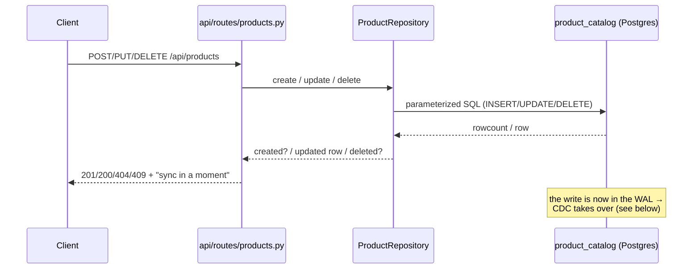
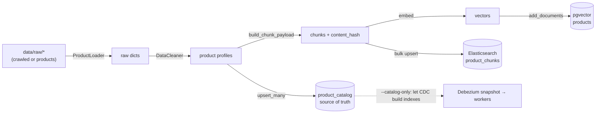
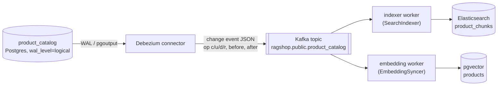

# Product Write Path (CRUD API, Ingest & DB Sync)

This page answers two related questions: **what happens when you call the product CRUD API**, **what happens when you run `scripts/ingest.py`**, and — for both — **how the databases are updated afterwards**.

For the broader system overview see [Data Flow](data-flow.md); for the ingest script reference see [ingest.py](../scripts/ingest.md); for the sync worker see [sync_worker.py](../scripts/sync-worker.md); for endpoint payloads see [API Endpoints](../api/endpoints.md).

## The golden rule: one source of truth

Every product write — whether from the CRUD API or from `ingest.py` — lands in **exactly one place**: the `product_catalog` table in Postgres. The two search indexes are *derived* from it and are **never written directly by API handlers**:

| Store | Container / engine | Holds | Written by | Read by (query time) |
| ----- | ------------------ | ----- | ---------- | -------------------- |
| `product_catalog` (Postgres) | `postgres` | Source-of-truth rows, `REPLICA IDENTITY FULL` | CRUD API, `ingest.py` | Debezium (WAL), `GET /api/products` |
| `products` table + pgvector (Postgres) | `postgres` | Chunk embeddings + JSONB metadata | embedding worker, `ingest.py` | semantic retriever |
| `product_chunks` index (Elasticsearch) | `elasticsearch` | Keyword/BM25 chunk documents | indexer worker, `ingest.py` | keyword retriever |
| `ragshop.public.product_catalog` topic (Kafka) | `kafka` | Debezium change events | Debezium connector | both sync workers |

Because writes only ever touch the catalog, the two indexes can never be updated out of order and there is no dual-write inconsistency window — the indexes simply catch up a moment later (eventual consistency).

## Path A — the CRUD API (`/api/products`)

The handlers in `api/routes/products.py` call `ProductRepository` (`src/catalog/product_repository.py`) and touch **only** the catalog table. Each mutating response carries the note *"Dữ liệu tìm kiếm sẽ được đồng bộ trong giây lát."* — a deliberate signal that the search indexes update asynchronously.

| Method & path | Repository call | SQL executed | Result |
| ------------- | --------------- | ------------ | ------ |
| `POST /api/products` | `repo.create(product)` | `INSERT ... ON CONFLICT (product_id) DO NOTHING` | `201` with the (possibly generated) `product_id`, or `409` if the id already exists |
| `PUT /api/products/{id}` | `repo.update(id, fields)` | read row → merge non-null fields → `INSERT ... ON CONFLICT DO UPDATE ... , updated_at = now()` | `200`, or `404` if the id is unknown, or `422` if the body is empty |
| `DELETE /api/products/{id}` | `repo.delete(id)` | `DELETE FROM product_catalog WHERE product_id = %s` | `200`, or `404` if the id is unknown |
| `GET /api/products/{id}` | `repo.get(id)` | `SELECT ... WHERE product_id = %s` | read-only, no sync |
| `GET /api/products` | `repo.list_products` / `repo.count` | `SELECT ... ORDER BY product_id LIMIT %s OFFSET %s` | read-only, paginated |

Notes on behaviour:

- **Create** is collision-safe. When `product_id` is omitted it is generated from the name as a slug plus a short random suffix (`_generate_product_id`). `ON CONFLICT DO NOTHING` means a duplicate id returns `409` rather than silently overwriting.
- **Update** is a *partial* update: only fields sent in the body are applied (`model_dump(exclude_unset=True)`), the handler reads the current row, merges, and re-upserts, bumping `updated_at`.
- **Delete** removes the row; the CDC delete event later removes the product from both indexes.
- All SQL uses parameterized `%s` placeholders; only the (trusted, sanitized) table name is interpolated.

The handler's job ends at the catalog write. Everything after that is the shared **DB update flow** described further down.

## Path B — bootstrap ingest (`scripts/ingest.py`)

`ingest.py` is the **offline bootstrap** that fills a fresh system from crawled or sample data. It is never triggered by an API request.

Steps for the default (full) run:

1. **Load** raw products with `ProductLoader` — `--source crawled` reads `data/raw/crawled/*/latest.json`, `--source products` reads `data/raw/products/*`, `--source all` reads both.
2. **Clean** each record via `DataCleaner.build_product_profile` (brand detection, price normalization, HTML stripping) into a standardized profile.
3. **Upsert the catalog first** — `ProductRepository.upsert_many` writes every profile into `product_catalog` (the source of truth). This is the step that everything else derives from.
4. **Chunk + embed + index** (skipped with `--catalog-only`): `build_chunk_payload` produces the same chunk documents the workers build, `ProductEmbedder` embeds them, `VectorStore.add_documents` upserts into pgvector, and the chunks are bulk-indexed into Elasticsearch (a missing ES cluster is logged and skipped, not fatal).

Two modes:

- **Full run** (default): writes the catalog **and** directly builds both indexes in-process. Fastest way to get a queryable system without Kafka running.
- **`--catalog-only`**: writes just the catalog and lets the CDC pipeline build the indexes from Debezium's initial snapshot. Because each chunk's metadata carries a `content_hash`, when the snapshot is later replayed the embedding worker sees the stored vectors are already current and makes **zero** embedding API calls.

## The DB update flow (CDC propagation)

This is the "luồng cập nhật DB" that applies **after any catalog write**, regardless of whether it came from the CRUD API or from `ingest.py`. It is a Change-Data-Capture (CDC) pipeline: **Postgres WAL → Debezium → Kafka → two independent sync workers**.

1. **WAL capture.** Postgres runs with `wal_level=logical`; `product_catalog` has `REPLICA IDENTITY FULL` so UPDATE/DELETE emit the full *before* image.
2. **Debezium.** The Postgres connector (`pgoutput` plugin, `snapshot.mode=initial`) turns each row change into a JSON event `{op, before, after}` where `op` is `c` (insert), `u` (update), `d` (delete), or `r` (snapshot read). `src/sync/events.py` parses it into a `ChangeEvent` and decodes the JSONB columns.
3. **Kafka.** Events land on topic `ragshop.public.product_catalog`.
4. **Two consumers, one topic.** Each worker is an independent consumer group (`src/sync/runner.py` → `run_loop`), so Elasticsearch and pgvector update in parallel and independently.

### What each worker does per op

| `op` | indexer worker → Elasticsearch | embedding worker → pgvector |
| ---- | ------------------------------ | --------------------------- |
| `c` / `r` (create / snapshot) | delete then upsert the product's chunk set | re-embed if `content_hash` differs from stored (a fresh product always embeds; an unchanged snapshot replay embeds nothing) |
| `u` (update) | delete then upsert the product's chunk set | if a **text** field changed → re-embed; if only **metadata** (`price`, `avg_rating`, `review_count`) changed → cheap JSONB update, **no embedding call** |
| `d` (delete) | delete all chunks for the product | delete all chunks for the product |

The indexer always rebuilds the whole chunk set (delete-then-upsert) so chunk types that disappeared — e.g. specs removed — don't linger.

### Re-embed vs. metadata-only (why embeddings are cheap)

The embedding worker avoids burning embedding quota on changes that don't affect meaning (`src/sync/events.py`):

- **Text fields** (`name`, `brand`, `category`, `description`, `specifications`, `pros`, `cons`, `review_summary`) appear in chunk text — changing any of them requires re-embedding.
- **Metadata fields** (`price`, `avg_rating`, `review_count`) drift constantly, so they are propagated by a metadata-only JSONB update with no embedding call.
- The decision uses the `REPLICA IDENTITY FULL` before-image when available (`text_changed(before, after)`), otherwise falls back to comparing a `content_hash` (an MD5 fingerprint of the text-bearing fields) against what pgvector already stores. This is what makes snapshot replays free.

### Delivery & consistency guarantees

- **At-least-once delivery.** Offsets are committed only *after* the handler applies the event; if a worker crashes mid-apply, the event is redelivered on restart.
- **Idempotent appliers.** Chunk ids are deterministic (`{product_id}_{chunk_type}`) and every apply is an upsert or delete, so redelivery and replays converge to the same state.
- **Eventual consistency.** There is a small lag between the catalog write and the index update. Search results can be briefly *stale*, never *wrong* — hence the API's "sync in a moment" message.
- **Ordering.** A single source of truth plus per-product deterministic ids means there are no dual-write races between the two indexes.

## How to run each piece

| Piece | Command | Notes |
| ----- | ------- | ----- |
| CRUD API | (already serving) `POST/PUT/DELETE /api/products` | Needs the API + full CDC stack up for indexes to catch up |
| Bootstrap ingest | `uv run python scripts/ingest.py --source crawled` | Add `--catalog-only` to let CDC build the indexes |
| Keyword sync worker | `uv run python scripts/sync_worker.py --role indexer` | Debezium topic → Elasticsearch |
| Semantic sync worker | `uv run python scripts/sync_worker.py --role embedder` | Debezium topic → pgvector |
| Whole stack | `docker compose -f docker/docker-compose.yml up` | Brings up Postgres, Kafka, Debezium (`connect-init` registers the connector), Elasticsearch, and both workers |

## CRUD API vs. `ingest.py` at a glance

| Aspect | CRUD API | `ingest.py` |
| ------ | -------- | ----------- |
| Scope | one product per call | batch bootstrap |
| Writes `product_catalog` | yes | yes (`upsert_many`) |
| Touches indexes directly | never | yes, unless `--catalog-only` |
| Produces embeddings | asynchronously, via the CDC embedding worker | inline (or via CDC with `--catalog-only`) |
| Create semantics | `409` on duplicate id (`DO NOTHING`) | upsert (replace) |
| Typical use | live edits / operational changes | first load, re-seed, migrations |

## Configuration reference

Values below come from `configs/settings.yaml` (env vars override where noted):

| Setting | Value | Meaning |
| ------- | ----- | ------- |
| `catalog_table` | `product_catalog` | Source-of-truth table (CDC-captured) |
| `products_topic` | `ragshop.public.product_catalog` | Kafka topic (topic prefix + schema + table) |
| `collection_name` | `products` | pgvector table |
| `es_index` | `product_chunks` | Elasticsearch index |
| `embedding_model` / `embedding_dim` | `gemini-embedding-001` / `768` | Embedding model and vector size (configurable) |
| `kafka_bootstrap` | `localhost:9092` | Kafka brokers (`KAFKA_BOOTSTRAP_SERVERS` overrides) |
