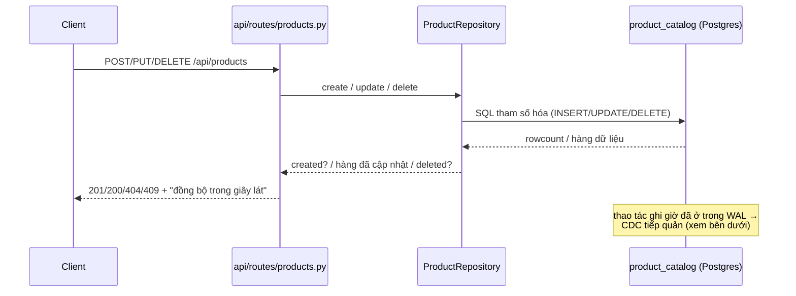
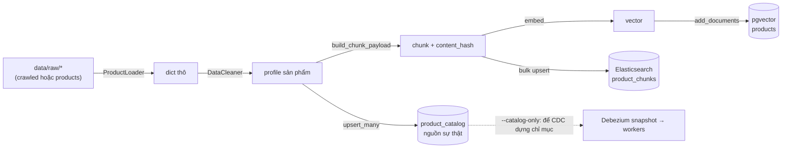
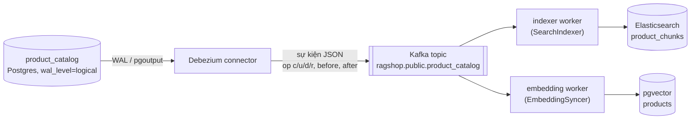

# Luồng ghi dữ liệu sản phẩm (API CRUD, Ingest & Đồng bộ DB)

Trang này trả lời các câu hỏi liên quan: **điều gì xảy ra khi bạn gọi API CRUD sản phẩm**, **điều gì xảy ra khi bạn chạy `scripts/ingest.py`**, và — cho cả hai — **các database được cập nhật ra sao sau đó**.

Xem tổng quan toàn hệ thống ở [Luồng dữ liệu](data-flow.md); tài liệu script ingest ở [ingest.py](../scripts/ingest.md); sync worker ở [sync_worker.py](../scripts/sync-worker.md); payload các endpoint ở [API Endpoints](../api/endpoints.md).

## Nguyên tắc vàng: một nguồn sự thật duy nhất

Mọi thao tác ghi sản phẩm — dù đến từ API CRUD hay từ `ingest.py` — đều rơi vào **đúng một nơi**: bảng `product_catalog` trong Postgres. Hai chỉ mục tìm kiếm được *dẫn xuất* từ nó và **không bao giờ được các handler API ghi trực tiếp**:

| Kho lưu trữ | Container / engine | Chứa gì | Ai ghi | Ai đọc (lúc truy vấn) |
| ----------- | ------------------ | ------- | ------ | --------------------- |
| `product_catalog` (Postgres) | `postgres` | Hàng dữ liệu nguồn sự thật, `REPLICA IDENTITY FULL` | API CRUD, `ingest.py` | Debezium (WAL), `GET /api/products` |
| Bảng `products` + pgvector (Postgres) | `postgres` | Vector của chunk + metadata JSONB | embedding worker, `ingest.py` | bộ truy xuất ngữ nghĩa |
| Chỉ mục `product_chunks` (Elasticsearch) | `elasticsearch` | Tài liệu chunk từ khóa/BM25 | indexer worker, `ingest.py` | bộ truy xuất từ khóa |
| Topic `ragshop.public.product_catalog` (Kafka) | `kafka` | Sự kiện thay đổi của Debezium | Debezium connector | cả hai sync worker |

Vì thao tác ghi chỉ chạm vào catalog, hai chỉ mục không bao giờ bị cập nhật sai thứ tự và không có khoảng thời gian bất nhất kiểu dual-write — các chỉ mục chỉ đơn giản là bắt kịp một lát sau (nhất quán cuối cùng — eventual consistency).

## Hướng A — API CRUD (`/api/products`)

Các handler trong `api/routes/products.py` gọi `ProductRepository` (`src/catalog/product_repository.py`) và **chỉ** chạm vào bảng catalog. Mỗi phản hồi có thay đổi đều kèm ghi chú *"Dữ liệu tìm kiếm sẽ được đồng bộ trong giây lát."* — một tín hiệu cố ý rằng chỉ mục tìm kiếm cập nhật bất đồng bộ.

| Method & path | Lời gọi repository | SQL thực thi | Kết quả |
| ------------- | ------------------ | ------------ | ------- |
| `POST /api/products` | `repo.create(product)` | `INSERT ... ON CONFLICT (product_id) DO NOTHING` | `201` kèm `product_id` (có thể được sinh tự động), hoặc `409` nếu id đã tồn tại |
| `PUT /api/products/{id}` | `repo.update(id, fields)` | đọc hàng → gộp các field khác null → `INSERT ... ON CONFLICT DO UPDATE ... , updated_at = now()` | `200`, hoặc `404` nếu id không tồn tại, hoặc `422` nếu body rỗng |
| `DELETE /api/products/{id}` | `repo.delete(id)` | `DELETE FROM product_catalog WHERE product_id = %s` | `200`, hoặc `404` nếu id không tồn tại |
| `GET /api/products/{id}` | `repo.get(id)` | `SELECT ... WHERE product_id = %s` | chỉ đọc, không đồng bộ |
| `GET /api/products` | `repo.list_products` / `repo.count` | `SELECT ... ORDER BY product_id LIMIT %s OFFSET %s` | chỉ đọc, phân trang |

Ghi chú về hành vi:

- **Create** an toàn với trùng lặp. Khi bỏ trống `product_id`, id được sinh từ tên dưới dạng slug cộng hậu tố ngẫu nhiên ngắn (`_generate_product_id`). `ON CONFLICT DO NOTHING` nghĩa là id trùng trả về `409` thay vì âm thầm ghi đè.
- **Update** là cập nhật *một phần*: chỉ các field gửi lên mới được áp dụng (`model_dump(exclude_unset=True)`); handler đọc hàng hiện tại, gộp, rồi upsert lại và cập nhật `updated_at`.
- **Delete** xóa hàng; sự kiện delete của CDC sau đó gỡ sản phẩm khỏi cả hai chỉ mục.
- Toàn bộ SQL dùng placeholder tham số hóa `%s`; chỉ tên bảng (nội bộ, đã được làm sạch, đáng tin) mới được nội suy.

Nhiệm vụ của handler kết thúc ngay tại thao tác ghi catalog. Mọi thứ sau đó là **luồng cập nhật DB** dùng chung, mô tả bên dưới.

## Hướng B — nạp dữ liệu khởi tạo (`scripts/ingest.py`)

`ingest.py` là bước **khởi tạo ngoại tuyến (offline bootstrap)** nạp dữ liệu cho một hệ thống mới từ dữ liệu crawl hoặc dữ liệu mẫu. Nó không bao giờ được kích hoạt bởi một request API.

Các bước cho lần chạy mặc định (đầy đủ):

1. **Load** sản phẩm thô bằng `ProductLoader` — `--source crawled` đọc `data/raw/crawled/*/latest.json`, `--source products` đọc `data/raw/products/*`, `--source all` đọc cả hai.
2. **Clean** từng bản ghi qua `DataCleaner.build_product_profile` (nhận diện thương hiệu, chuẩn hóa giá, loại bỏ HTML) thành một profile chuẩn.
3. **Ghi catalog trước tiên** — `ProductRepository.upsert_many` ghi mọi profile vào `product_catalog` (nguồn sự thật). Đây là bước mà mọi thứ khác dẫn xuất từ đó.
4. **Chunk + embed + index** (bỏ qua khi dùng `--catalog-only`): `build_chunk_payload` tạo ra đúng những tài liệu chunk mà worker sẽ tạo, `ProductEmbedder` embed chúng, `VectorStore.add_documents` upsert vào pgvector, và các chunk được bulk-index vào Elasticsearch (thiếu cụm ES chỉ được ghi log và bỏ qua, không gây lỗi nghiêm trọng).

Hai chế độ:

- **Chạy đầy đủ** (mặc định): ghi catalog **và** trực tiếp dựng cả hai chỉ mục ngay trong tiến trình. Cách nhanh nhất để có một hệ thống truy vấn được mà không cần Kafka chạy.
- **`--catalog-only`**: chỉ ghi catalog và để pipeline CDC dựng chỉ mục từ snapshot khởi tạo của Debezium. Vì metadata của mỗi chunk mang theo `content_hash`, khi snapshot được phát lại sau này, embedding worker thấy các vector đã lưu vẫn còn mới và thực hiện **không** một lời gọi embedding API nào.

## Luồng cập nhật DB (lan truyền qua CDC)

Đây là "luồng cập nhật DB" áp dụng **sau bất kỳ thao tác ghi catalog nào**, bất kể đến từ API CRUD hay từ `ingest.py`. Đó là một pipeline Change-Data-Capture (CDC): **WAL của Postgres → Debezium → Kafka → hai sync worker độc lập**.

1. **Bắt WAL.** Postgres chạy với `wal_level=logical`; `product_catalog` có `REPLICA IDENTITY FULL` nên UPDATE/DELETE phát ra ảnh *before* đầy đủ.
2. **Debezium.** Connector Postgres (plugin `pgoutput`, `snapshot.mode=initial`) biến mỗi thay đổi hàng thành sự kiện JSON `{op, before, after}` với `op` là `c` (insert), `u` (update), `d` (delete), hoặc `r` (đọc snapshot). `src/sync/events.py` phân tích thành `ChangeEvent` và giải mã các cột JSONB.
3. **Kafka.** Sự kiện rơi vào topic `ragshop.public.product_catalog`.
4. **Hai consumer, một topic.** Mỗi worker là một consumer group độc lập (`src/sync/runner.py` → `run_loop`), nên Elasticsearch và pgvector cập nhật song song và độc lập.

### Mỗi worker làm gì theo từng op

| `op` | indexer worker → Elasticsearch | embedding worker → pgvector |
| ---- | ------------------------------ | --------------------------- |
| `c` / `r` (tạo / snapshot) | xóa rồi upsert lại bộ chunk của sản phẩm | re-embed nếu `content_hash` khác giá trị đã lưu (sản phẩm mới luôn embed; phát lại snapshot không đổi thì embed rỗng) |
| `u` (cập nhật) | xóa rồi upsert lại bộ chunk của sản phẩm | nếu một field **văn bản** đổi → re-embed; nếu chỉ **metadata** (`price`, `avg_rating`, `review_count`) đổi → cập nhật JSONB rẻ, **không** gọi embedding |
| `d` (xóa) | xóa toàn bộ chunk của sản phẩm | xóa toàn bộ chunk của sản phẩm |

Indexer luôn dựng lại toàn bộ bộ chunk (xóa rồi upsert) để các loại chunk đã biến mất — ví dụ specs bị gỡ — không còn sót lại.

### Re-embed và cập nhật chỉ-metadata (vì sao embedding rẻ)

Embedding worker tránh đốt quota embedding cho những thay đổi không ảnh hưởng ngữ nghĩa (`src/sync/events.py`):

- **Field văn bản** (`name`, `brand`, `category`, `description`, `specifications`, `pros`, `cons`, `review_summary`) xuất hiện trong văn bản chunk — đổi bất kỳ field nào đòi hỏi re-embed.
- **Field metadata** (`price`, `avg_rating`, `review_count`) thay đổi liên tục, nên được lan truyền bằng một cập nhật JSONB chỉ-metadata mà không gọi embedding.
- Quyết định dùng ảnh before của `REPLICA IDENTITY FULL` khi có (`text_changed(before, after)`), nếu không thì so sánh một `content_hash` (dấu vân tay MD5 của các field văn bản) với giá trị pgvector đang lưu. Đây chính là điều khiến việc phát lại snapshot miễn phí.

### Đảm bảo phân phối & nhất quán

- **Phân phối ít nhất một lần (at-least-once).** Offset chỉ được commit *sau khi* handler áp dụng sự kiện; nếu worker sập giữa chừng, sự kiện được phân phối lại khi khởi động lại.
- **Bộ áp dụng lũy đẳng (idempotent).** Id chunk mang tính tất định (`{product_id}_{chunk_type}`) và mọi lần áp dụng là upsert hoặc delete, nên phân phối lại và phát lại đều hội tụ về cùng một trạng thái.
- **Nhất quán cuối cùng.** Có một độ trễ nhỏ giữa thao tác ghi catalog và việc cập nhật chỉ mục. Kết quả tìm kiếm có thể *cũ* trong chốc lát, nhưng không bao giờ *sai* — do đó mới có thông báo "đồng bộ trong giây lát" của API.
- **Thứ tự.** Một nguồn sự thật duy nhất cộng với id tất định theo sản phẩm nghĩa là không có tranh chấp dual-write giữa hai chỉ mục.

## Cách chạy từng phần

| Phần | Lệnh | Ghi chú |
| ---- | ---- | ------- |
| API CRUD | (đang phục vụ) `POST/PUT/DELETE /api/products` | Cần API + toàn bộ stack CDC để chỉ mục bắt kịp |
| Nạp khởi tạo | `uv run python scripts/ingest.py --source crawled` | Thêm `--catalog-only` để CDC dựng chỉ mục |
| Sync worker từ khóa | `uv run python scripts/sync_worker.py --role indexer` | Topic Debezium → Elasticsearch |
| Sync worker ngữ nghĩa | `uv run python scripts/sync_worker.py --role embedder` | Topic Debezium → pgvector |
| Toàn bộ stack | `docker compose -f docker/docker-compose.yml up` | Khởi động Postgres, Kafka, Debezium (`connect-init` đăng ký connector), Elasticsearch, và cả hai worker |

## API CRUD và `ingest.py` — nhìn nhanh

| Khía cạnh | API CRUD | `ingest.py` |
| --------- | -------- | ----------- |
| Phạm vi | một sản phẩm mỗi lần gọi | nạp hàng loạt (bootstrap) |
| Ghi `product_catalog` | có | có (`upsert_many`) |
| Chạm chỉ mục trực tiếp | không bao giờ | có, trừ khi `--catalog-only` |
| Tạo embedding | bất đồng bộ, qua embedding worker của CDC | ngay trong tiến trình (hoặc qua CDC nếu `--catalog-only`) |
| Ngữ nghĩa create | `409` khi id trùng (`DO NOTHING`) | upsert (ghi đè) |
| Dùng điển hình | chỉnh sửa trực tiếp / thay đổi vận hành | nạp lần đầu, seed lại, migration |

## Tham chiếu cấu hình

Các giá trị dưới đây lấy từ `configs/settings.yaml` (biến môi trường ghi đè ở nơi có ghi chú):

| Cấu hình | Giá trị | Ý nghĩa |
| -------- | ------- | ------- |
| `catalog_table` | `product_catalog` | Bảng nguồn sự thật (được CDC bắt) |
| `products_topic` | `ragshop.public.product_catalog` | Kafka topic (tiền tố topic + schema + bảng) |
| `collection_name` | `products` | Bảng pgvector |
| `es_index` | `product_chunks` | Chỉ mục Elasticsearch |
| `embedding_model` / `embedding_dim` | `gemini-embedding-001` / `768` | Mô hình embedding và kích thước vector (có thể cấu hình) |
| `kafka_bootstrap` | `localhost:9092` | Kafka brokers (`KAFKA_BOOTSTRAP_SERVERS` ghi đè) |
