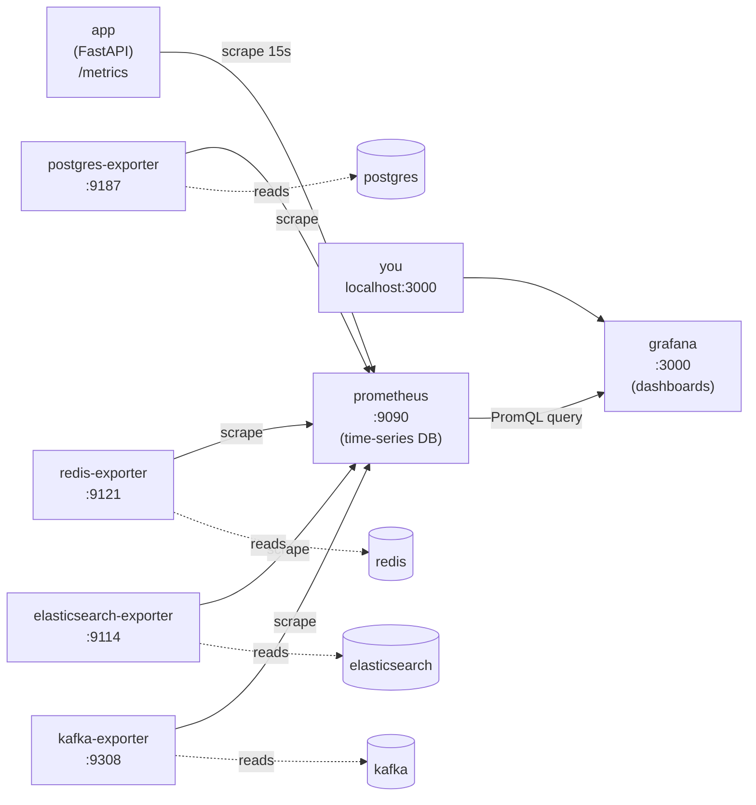

# Monitoring with Prometheus & Grafana

This stack ships a full **observability** layer: **Prometheus** collects metrics
from the API and every datastore, and **Grafana** turns them into dashboards.
Together they answer the operational questions the logs can't: *how fast is the
API right now, how often does it fail, is the LLM quota being hit, and are the
CDC sync workers keeping the search indexes fresh?*

Think of Kibana and Kafka UI as tools to inspect **data**; Prometheus + Grafana
are the tools to inspect the **system's behaviour over time**.

## The flow — how a number gets to a dashboard

The model is **pull-based**. Each service publishes its current metrics as plain
text at a `/metrics` HTTP endpoint. Prometheus *scrapes* (HTTP GETs) every target
on a fixed interval and stores each sample as a time series. Grafana never talks
to the services directly — it *queries* Prometheus with PromQL and draws the
result.



Two hops matter:

1. **Exporters translate.** Postgres, Redis, Elasticsearch and Kafka don't speak
   Prometheus natively, so a small *exporter* sidecar connects to each one and
   re-publishes its internals as Prometheus metrics. The **app** needs no
   exporter — it exposes `/metrics` itself (via `api/metrics.py`).
2. **Scrape ≠ query.** Prometheus *pulls* on a schedule (so a target being down
   is itself a signal — the `up` metric goes to 0). Grafana only *reads* from
   Prometheus, so dashboards keep working even while a service is restarting.

## Why it matters here (what each signal tells you)

A RAG service has failure modes that a plain "is the container up?" check misses:

- **Latency is dominated by the LLM.** A recommendation makes vector-DB and LLM
  calls; p95 latency creeping up usually means the provider is slow, not the API.
  `rag_pipeline_duration_seconds` isolates that "thinking" time from HTTP overhead.
- **LLM quota is a real outage.** When the provider returns 429, users get a 503.
  `rag_recommend_errors_total{reason="quota"}` makes a quota spike visible and
  distinct from other backend errors.
- **The indexes are eventually consistent.** Writes flow Postgres → Debezium →
  Kafka → sync workers → Elasticsearch/pgvector. **Kafka consumer-group lag** is
  exactly how far the search indexes trail the catalog — the one number that
  tells you the CDC pipeline is healthy.

## 1. Start it & open Grafana

Prometheus and Grafana are part of the Compose stack:

```bash
cd docker
docker compose up -d prometheus grafana \
  postgres-exporter redis-exporter elasticsearch-exporter kafka-exporter
```

- **Grafana** → `http://localhost:3000` (login **admin / admin**). The Prometheus
  datasource and the **RAG - Overview** dashboard are auto-provisioned, so you
  land on a working board with no setup.
- **Prometheus** → `http://localhost:9090`. Go to **Status → Targets**: every job
  (`rag-api`, `postgres`, `redis`, `elasticsearch`, `kafka`, `prometheus`) should
  be **UP**. A target stuck at *DOWN* means that service or its exporter isn't
  reachable yet.

!!! tip "Generate some traffic first"
    Metrics are empty until the app serves requests. Fire a few calls (or open
    `http://localhost:8000/docs`) so the request-rate and latency panels have
    something to draw:

    ```bash
    curl http://localhost:8000/health
    curl -X POST http://localhost:8000/api/recommend \
      -H "Content-Type: application/json" \
      -d '{"query": "Điện thoại pin trâu dưới 8 triệu", "top_k": 3}'
    ```

## 2. What is monitored

### Application metrics (exposed by the app at `/metrics`)

These come from `api/metrics.py`. The HTTP metrics are auto-collected for **every**
route by `prometheus-fastapi-instrumentator`; the `rag_*` ones are RAG-specific.

| Metric | Type | Labels | What it tells you |
| ------ | ---- | ------ | ----------------- |
| `http_requests_total` | counter | `handler`, `method`, `status` | Request volume and error mix per endpoint (exact status codes, e.g. `200`, `503`) |
| `http_request_duration_seconds` | histogram | `handler`, `method` | Per-endpoint latency; use `histogram_quantile` for p50/p95/p99 |
| `http_request_size_bytes` / `http_response_size_bytes` | summary | `handler` | Payload sizes |
| `rag_pipeline_duration_seconds` | histogram | `pipeline` | End-to-end RAG pipeline time (retrieval + rerank + LLM), separate from HTTP overhead |
| `rag_recommend_errors_total` | counter | `reason` | Recommend failures split into `quota` (provider 429) vs `error` (other) |

The `handler` label is the **route template** (`/api/products/{product_id}`, not
the concrete id) so the number of time series stays bounded.

### Infrastructure metrics (exposed by the exporters)

| Exporter | Port | Highlights | Why you care |
| -------- | ---- | ---------- | ------------ |
| **postgres-exporter** | 9187 | `pg_up`, `pg_stat_activity_count`, transactions, cache hit ratio, WAL/replication | The catalog + pgvector store; connection saturation or a stuck replication slot (Debezium) shows here |
| **redis-exporter** | 9121 | `redis_up`, commands/sec, memory, keyspace hit rate, clients | Cache health; a collapsing hit rate means more work hits the datastores |
| **elasticsearch-exporter** | 9114 | cluster health (green/yellow/red), `elasticsearch_indices_docs`, search/index latency | The `product_chunks` keyword index — doc count and query latency |
| **kafka-exporter** | 9308 | `kafka_consumergroup_lag`, broker/partition offsets | **CDC freshness** — lag per sync-worker consumer group |

Prometheus also synthesises an **`up`** metric per target (1 = last scrape
succeeded), which is the simplest health signal of all.

## 3. The provisioned dashboard

**RAG - Overview** (`docker/grafana/dashboards/rag-overview.json`) is loaded
automatically and groups the panels that matter day-to-day:

| Panel | Question it answers | PromQL (core) |
| ----- | ------------------- | ------------- |
| Scrape targets UP/DOWN | Is everything being scraped? | `up` |
| API request rate by endpoint | Where is the traffic? | `sum by (handler) (rate(http_requests_total[5m]))` |
| API latency p95 by endpoint | Which route is slow? | `histogram_quantile(0.95, sum by (le, handler) (rate(http_request_duration_seconds_bucket[5m])))` |
| HTTP error rate (4xx/5xx) | Are we failing? | `sum(rate(http_requests_total{status=~"5.."}[5m]))` |
| Recommend pipeline p50/p95 | Is the LLM slow? | `histogram_quantile(0.95, sum by (le) (rate(rag_pipeline_duration_seconds_bucket{pipeline="recommend"}[5m])))` |
| Recommend errors by reason | Quota vs bug? | `sum by (reason) (rate(rag_recommend_errors_total[5m]))` |
| Kafka consumer-group lag | Are indexes fresh? | `sum by (consumergroup) (kafka_consumergroup_lag)` |
| Postgres connections / Redis / ES docs | Infra pressure | `sum(pg_stat_activity_count)`, `rate(redis_commands_processed_total[5m])`, `elasticsearch_indices_docs{index="product_chunks"}` |

To add your own panels, edit the dashboard in the Grafana UI, or drop another
JSON file into `docker/grafana/dashboards/` — the provisioner picks it up within
30 seconds.

## 4. Querying Prometheus directly

You don't need Grafana to explore. Open `http://localhost:9090/graph` and try:

```promql
# Requests per second, per endpoint, over the last 5 minutes
sum by (handler) (rate(http_requests_total[5m]))

# 95th-percentile latency of the recommend pipeline
histogram_quantile(0.95, sum by (le) (rate(rag_pipeline_duration_seconds_bucket{pipeline="recommend"}[5m])))

# Provider-quota failures in the last 15 minutes
increase(rag_recommend_errors_total{reason="quota"}[15m])

# CDC lag: messages the sync workers still have to process
sum by (consumergroup) (kafka_consumergroup_lag)

# Which targets are down right now?
up == 0
```

## Ports reference

| Host port | Service | Use |
| --------- | ------- | --- |
| `3000` | grafana | Dashboards (admin / admin) |
| `9090` | prometheus | Query UI + scrape-target status |
| `9187` | postgres-exporter | Postgres metrics |
| `9121` | redis-exporter | Redis metrics |
| `9114` | elasticsearch-exporter | Elasticsearch metrics |
| `9308` | kafka-exporter | Kafka lag/offset metrics |
| `8000` | app | `/metrics` (Prometheus format) |

## 5. Troubleshooting

| Symptom | Cause & fix |
| ------- | ----------- |
| Grafana panels say *No data* | No traffic yet, or the time range predates startup. Send a few requests and set the range to *Last 15 minutes*. |
| A Prometheus target is **DOWN** | The service/exporter isn't ready or the name is wrong. Check `docker compose ps` and `docker compose logs <service>`; exporters depend on their datastore being healthy first. |
| `rag_*` metrics missing | The app must have served at least one request for a counter/histogram to appear. Hit `/api/recommend` once. |
| Kafka lag panel empty | `kafka-exporter` can't reach the broker, or no consumer group exists yet (the sync workers haven't started consuming). Check `docker compose logs kafka-exporter`. |
| Grafana asks to configure a datasource | Provisioning didn't mount. Confirm `docker/grafana/provisioning/` is mounted and restart Grafana. |
| Want to reset dashboards/history | `docker compose down` keeps data; `docker compose down -v` also drops the `promdata` and `grafanadata` volumes for a clean slate. |

## Related

- [Docker Deployment](docker.md) — the full stack, ports and volumes (including the monitoring services).
- [Viewing Kafka in Kafka UI](kafka-ui.md) — the same consumer-group lag, inspected message-by-message.
- [sync_worker.py](../scripts/sync-worker.md) — the CDC workers whose lag Prometheus tracks.
