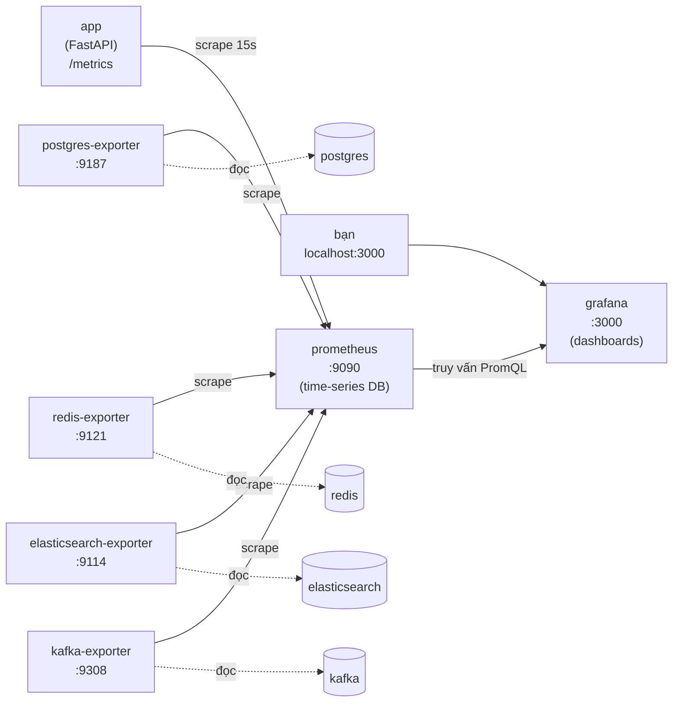

# Giám sát với Prometheus & Grafana

Stack này đi kèm một lớp **observability** (khả năng quan sát) đầy đủ:
**Prometheus** thu thập metric từ API và mọi datastore, còn **Grafana** biến chúng
thành dashboard. Cùng nhau, chúng trả lời những câu hỏi vận hành mà log không trả
lời được: *ngay lúc này API nhanh cỡ nào, lỗi thường xuyên ra sao, có bị chạm hạn
mức (quota) LLM không, và các worker đồng bộ CDC có giữ cho index tìm kiếm luôn
mới không?*

Hãy hình dung Kibana và Kafka UI là công cụ để soi **dữ liệu**; còn Prometheus +
Grafana là công cụ để soi **hành vi của hệ thống theo thời gian**.

## Luồng — một con số đi tới dashboard như thế nào

Mô hình ở đây là **pull-based** (kéo). Mỗi service công bố metric hiện tại của nó
dưới dạng text tại một endpoint HTTP `/metrics`. Prometheus *scrape* (gửi HTTP GET)
tới từng target theo chu kỳ cố định và lưu mỗi mẫu (sample) thành một chuỗi thời
gian (time series). Grafana không bao giờ nói chuyện trực tiếp với service — nó
*truy vấn* Prometheus bằng PromQL rồi vẽ kết quả.



Có hai chặng quan trọng:

1. **Exporter làm nhiệm vụ phiên dịch.** Postgres, Redis, Elasticsearch và Kafka
   không "nói" tiếng Prometheus, nên mỗi cái có một *exporter* sidecar nhỏ kết nối
   vào và công bố lại phần nội tại của nó dưới dạng metric Prometheus. Riêng **app**
   không cần exporter — nó tự expose `/metrics` (qua `api/metrics.py`).
2. **Scrape ≠ query.** Prometheus *kéo* theo lịch (nên việc một target chết cũng là
   một tín hiệu — metric `up` về 0). Grafana chỉ *đọc* từ Prometheus, nên dashboard
   vẫn hoạt động ngay cả khi một service đang khởi động lại.

## Vì sao điều này quan trọng ở đây (mỗi tín hiệu nói lên điều gì)

Một dịch vụ RAG có những kiểu hỏng mà việc kiểm tra "container còn sống không?"
không thấy được:

- **Độ trễ bị chi phối bởi LLM.** Một lượt gợi ý phải gọi vector-DB và LLM; nếu p95
  latency tăng dần thì thường là do provider chậm, chứ không phải API. Metric
  `rag_pipeline_duration_seconds` tách riêng phần "suy nghĩ" đó khỏi overhead HTTP.
- **Hết quota LLM là một sự cố thật.** Khi provider trả về 429, người dùng nhận 503.
  `rag_recommend_errors_total{reason="quota"}` giúp nhìn thấy đợt tăng vọt do quota
  và phân biệt nó với các lỗi backend khác.
- **Các index nhất quán theo kiểu eventual.** Ghi dữ liệu chảy theo Postgres →
  Debezium → Kafka → sync worker → Elasticsearch/pgvector. **Độ trễ consumer-group
  của Kafka** chính là mức độ index tìm kiếm bị tụt lại so với catalog — con số duy
  nhất cho biết pipeline CDC có khỏe hay không.

## 1. Khởi động & mở Grafana

Prometheus và Grafana là một phần của stack Compose:

```bash
cd docker
docker compose up -d prometheus grafana \
  postgres-exporter redis-exporter elasticsearch-exporter kafka-exporter
```

- **Grafana** → `http://localhost:3000` (đăng nhập **admin / admin**). Datasource
  Prometheus và dashboard **RAG - Overview** được provision sẵn, nên bạn mở lên là
  có ngay một bảng chạy được, không cần cấu hình.
- **Prometheus** → `http://localhost:9090`. Vào **Status → Targets**: mọi job
  (`rag-api`, `postgres`, `redis`, `elasticsearch`, `kafka`, `prometheus`) đều phải
  **UP**. Một target kẹt ở *DOWN* nghĩa là service đó hoặc exporter của nó chưa
  kết nối được.

!!! tip "Tạo một ít traffic trước đã"
    Metric sẽ trống cho tới khi app phục vụ request. Gọi vài lần (hoặc mở
    `http://localhost:8000/docs`) để các panel request-rate và latency có dữ liệu
    để vẽ:

    ```bash
    curl http://localhost:8000/health
    curl -X POST http://localhost:8000/api/recommend \
      -H "Content-Type: application/json" \
      -d '{"query": "Điện thoại pin trâu dưới 8 triệu", "top_k": 3}'
    ```

## 2. Giám sát những gì

### Metric tầng ứng dụng (app expose tại `/metrics`)

Những metric này đến từ `api/metrics.py`. Nhóm HTTP được thu thập tự động cho **mọi**
route bởi `prometheus-fastapi-instrumentator`; nhóm `rag_*` là metric riêng cho RAG.

| Metric | Kiểu | Nhãn (labels) | Ý nghĩa |
| ------ | ---- | ------------- | ------- |
| `http_requests_total` | counter | `handler`, `method`, `status` | Lưu lượng và tỉ lệ lỗi theo từng endpoint (mã status chính xác, ví dụ `200`, `503`) |
| `http_request_duration_seconds` | histogram | `handler`, `method` | Độ trễ theo endpoint; dùng `histogram_quantile` để lấy p50/p95/p99 |
| `http_request_size_bytes` / `http_response_size_bytes` | summary | `handler` | Kích thước payload |
| `rag_pipeline_duration_seconds` | histogram | `pipeline` | Thời gian toàn pipeline RAG (retrieve + rerank + LLM), tách khỏi overhead HTTP |
| `rag_recommend_errors_total` | counter | `reason` | Lỗi recommend chia thành `quota` (provider 429) và `error` (lỗi khác) |

Nhãn `handler` là **template của route** (`/api/products/{product_id}`, không phải
id cụ thể) để số lượng time series luôn bị giới hạn.

### Metric hạ tầng (các exporter expose)

| Exporter | Cổng | Điểm nổi bật | Vì sao cần quan tâm |
| -------- | ---- | ------------ | ------------------- |
| **postgres-exporter** | 9187 | `pg_up`, `pg_stat_activity_count`, giao dịch, tỉ lệ cache hit, WAL/replication | Kho catalog + pgvector; số kết nối bão hòa hay một replication slot (Debezium) bị kẹt sẽ hiện ở đây |
| **redis-exporter** | 9121 | `redis_up`, số lệnh/giây, bộ nhớ, tỉ lệ hit keyspace, số client | Sức khỏe cache; hit rate tụt nghĩa là nhiều việc dồn xuống datastore |
| **elasticsearch-exporter** | 9114 | tình trạng cluster (green/yellow/red), `elasticsearch_indices_docs`, latency search/index | Index từ khóa `product_chunks` — số document và độ trễ truy vấn |
| **kafka-exporter** | 9308 | `kafka_consumergroup_lag`, offset broker/partition | **Độ mới của CDC** — lag theo từng consumer group của sync worker |

Prometheus còn tự tổng hợp metric **`up`** cho mỗi target (1 = lần scrape gần nhất
thành công), đây là tín hiệu sức khỏe đơn giản nhất.

## 3. Dashboard provision sẵn

**RAG - Overview** (`docker/grafana/dashboards/rag-overview.json`) được nạp tự động
và gom các panel quan trọng hằng ngày:

| Panel | Trả lời câu hỏi | PromQL (cốt lõi) |
| ----- | --------------- | ---------------- |
| Scrape targets UP/DOWN | Mọi thứ có được scrape không? | `up` |
| Request rate theo endpoint | Traffic ở đâu? | `sum by (handler) (rate(http_requests_total[5m]))` |
| Latency p95 theo endpoint | Route nào chậm? | `histogram_quantile(0.95, sum by (le, handler) (rate(http_request_duration_seconds_bucket[5m])))` |
| Tỉ lệ lỗi HTTP (4xx/5xx) | Có đang lỗi không? | `sum(rate(http_requests_total{status=~"5.."}[5m]))` |
| Pipeline recommend p50/p95 | LLM có chậm không? | `histogram_quantile(0.95, sum by (le) (rate(rag_pipeline_duration_seconds_bucket{pipeline="recommend"}[5m])))` |
| Lỗi recommend theo reason | Do quota hay do bug? | `sum by (reason) (rate(rag_recommend_errors_total[5m]))` |
| Lag consumer-group Kafka | Index có mới không? | `sum by (consumergroup) (kafka_consumergroup_lag)` |
| Kết nối Postgres / Redis / ES docs | Áp lực hạ tầng | `sum(pg_stat_activity_count)`, `rate(redis_commands_processed_total[5m])`, `elasticsearch_indices_docs{index="product_chunks"}` |

Muốn thêm panel riêng, chỉnh dashboard ngay trong Grafana UI, hoặc thả thêm một
file JSON vào `docker/grafana/dashboards/` — bộ provisioner sẽ nhận ra trong vòng
30 giây.

## 4. Truy vấn Prometheus trực tiếp

Không cần Grafana bạn vẫn khám phá được. Mở `http://localhost:9090/graph` và thử:

```promql
# Số request mỗi giây, theo từng endpoint, trong 5 phút gần nhất
sum by (handler) (rate(http_requests_total[5m]))

# Độ trễ phân vị 95 của pipeline recommend
histogram_quantile(0.95, sum by (le) (rate(rag_pipeline_duration_seconds_bucket{pipeline="recommend"}[5m])))

# Số lần lỗi do hết quota provider trong 15 phút gần nhất
increase(rag_recommend_errors_total{reason="quota"}[15m])

# Lag CDC: số message các sync worker còn phải xử lý
sum by (consumergroup) (kafka_consumergroup_lag)

# Target nào đang chết?
up == 0
```

## Bảng cổng (ports)

| Cổng host | Service | Dùng để |
| --------- | ------- | ------- |
| `3000` | grafana | Dashboard (admin / admin) |
| `9090` | prometheus | Giao diện truy vấn + trạng thái scrape target |
| `9187` | postgres-exporter | Metric Postgres |
| `9121` | redis-exporter | Metric Redis |
| `9114` | elasticsearch-exporter | Metric Elasticsearch |
| `9308` | kafka-exporter | Metric lag/offset Kafka |
| `8000` | app | `/metrics` (định dạng Prometheus) |

## 5. Xử lý sự cố

| Hiện tượng | Nguyên nhân & cách xử lý |
| ---------- | ------------------------ |
| Panel Grafana báo *No data* | Chưa có traffic, hoặc khoảng thời gian đang xem trước lúc khởi động. Gửi vài request và đặt khoảng *Last 15 minutes*. |
| Một target Prometheus **DOWN** | Service/exporter chưa sẵn sàng hoặc sai tên. Kiểm tra `docker compose ps` và `docker compose logs <service>`; exporter cần datastore của nó healthy trước. |
| Thiếu metric `rag_*` | App phải phục vụ ít nhất một request thì counter/histogram mới xuất hiện. Gọi thử `/api/recommend` một lần. |
| Panel lag Kafka trống | `kafka-exporter` chưa tới được broker, hoặc chưa có consumer group nào (sync worker chưa bắt đầu consume). Xem `docker compose logs kafka-exporter`. |
| Grafana đòi cấu hình datasource | Provisioning chưa được mount. Kiểm tra `docker/grafana/provisioning/` đã mount chưa rồi khởi động lại Grafana. |
| Muốn reset dashboard/lịch sử | `docker compose down` giữ dữ liệu; `docker compose down -v` xóa luôn volume `promdata` và `grafanadata` để bắt đầu lại sạch sẽ. |

## Liên quan

- [Triển khai Docker](docker.md) — toàn bộ stack, cổng và volume (gồm cả các service giám sát).
- [Xem Kafka trong Kafka UI](kafka-ui.md) — cùng chỉ số lag consumer-group, soi từng message.
- [sync_worker.py](../scripts/sync-worker.md) — các worker CDC mà Prometheus theo dõi độ lag.
