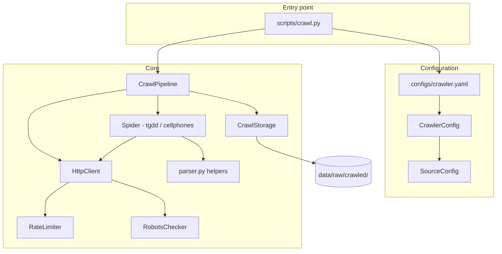
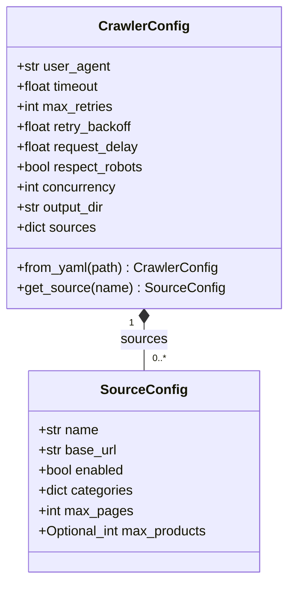
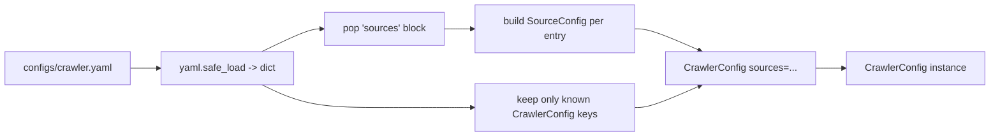
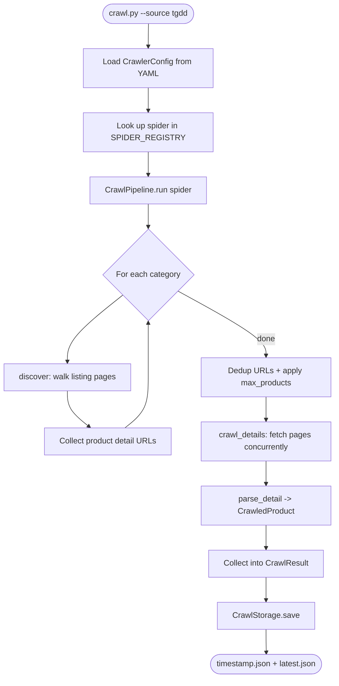
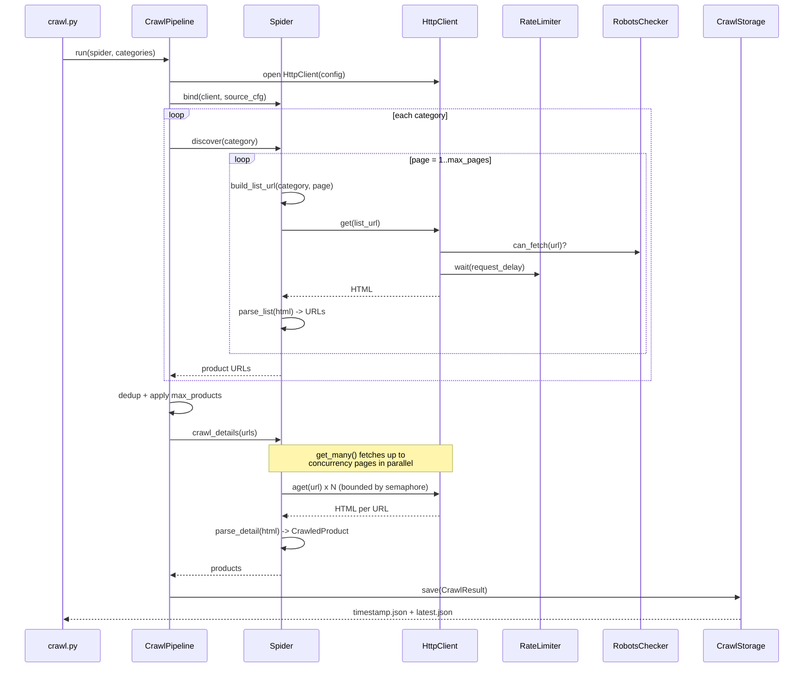
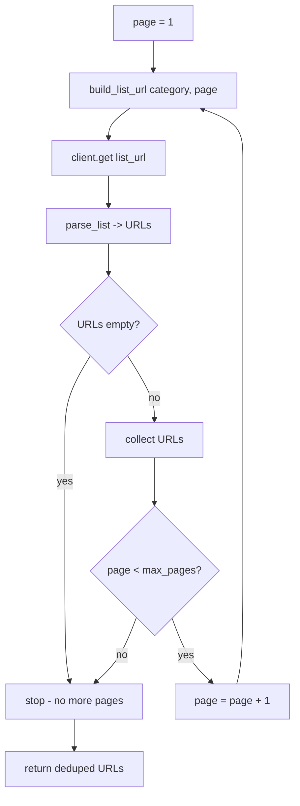
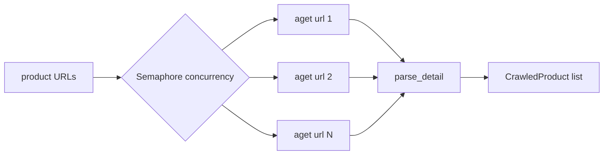
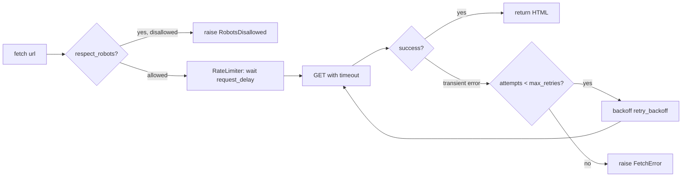
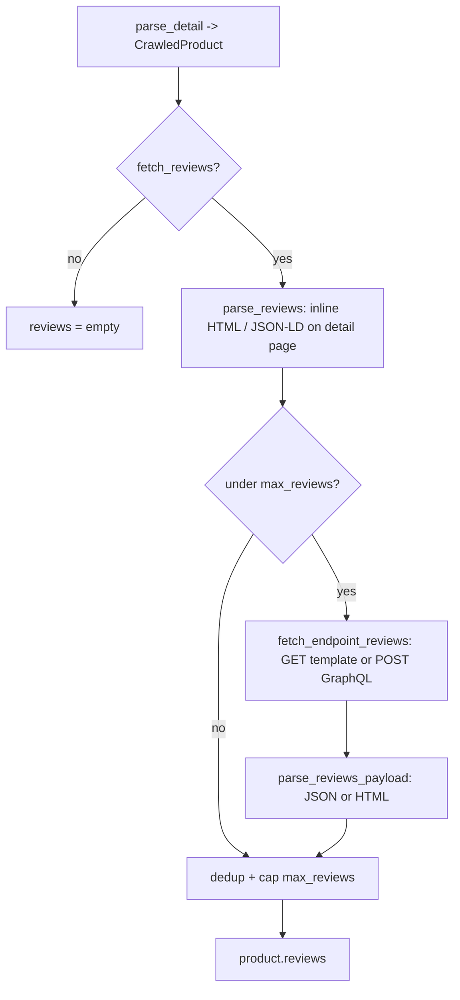

# Crawler

The crawler module (`src/crawler/`) collects raw product data from e-commerce
websites and writes it to `data/raw/crawled/`. Its output matches the raw product
schema consumed by the ingestion pipeline, so crawled data flows straight into
`scripts/ingest.py`.

The stack is deliberately lightweight — `httpx` for HTTP and `BeautifulSoup`
(with `lxml`) for parsing — matching the project's existing dependencies.

## Architecture at a glance



## Component responsibilities

| Module | Responsibility |
| --- | --- |
| `config.py` | `CrawlerConfig` / `SourceConfig`, loaded from `configs/crawler.yaml`. |
| `http_client.py` | `httpx` wrapper: retries (tenacity), rate limiting, robots.txt. |
| `rate_limiter.py` | Minimum delay between requests (sync + async). |
| `robots.py` | Fetches and caches `robots.txt` per host. |
| `parser.py` | Shared BeautifulSoup helpers (`parse_price`, `parse_rating`, ...). |
| `models.py` | `CrawledProduct`, `CrawlResult` dataclasses. |
| `storage.py` | Writes results to `data/raw/crawled/<source>/`. |
| `pipeline.py` | `CrawlPipeline` orchestrates a spider end-to-end. |
| `spiders/` | One spider per source (`tgdd`, `cellphones`). |

---

## Configuration

All crawler behavior is driven by a single YAML file, `configs/crawler.yaml`,
which is loaded into a `CrawlerConfig` dataclass. There are two levels:

- **`CrawlerConfig`** — global settings shared by every source (HTTP, politeness,
  concurrency, output).
- **`SourceConfig`** — per-website settings (base URL, categories, page limits).
  One `CrawlerConfig` holds many `SourceConfig` objects, keyed by source name.



> `sources` is `dict[str, SourceConfig]`, `categories` is `dict[str, str]`, and
> `max_products` is `int | None` — simplified above for the diagram renderer.

### Annotated `configs/crawler.yaml`

```yaml
# ---- CrawlerConfig (global) ----
user_agent: "Mozilla/5.0 (compatible; RagProductBot/0.1; +https://.../rag-product-recommend)"
timeout: 20.0             # per-request timeout (seconds)
max_retries: 3            # retry attempts on transient errors
retry_backoff: 1.5        # exponential backoff multiplier between retries
request_delay: 1.0        # minimum seconds between requests to the same host
respect_robots: true      # skip URLs disallowed by robots.txt
concurrency: 4            # parallel detail-page fetches
fetch_reviews: true       # collect buyer reviews alongside specs
max_reviews: 20           # cap reviews kept per product
output_dir: "data/raw/crawled"

# ---- SourceConfig (one block per website) ----
sources:
  tgdd:                                 # <- becomes SourceConfig.name
    base_url: "https://www.thegioididong.com"
    enabled: true
    max_pages: 8                        # listing pages to walk per category
    max_products: 100                   # cap detail pages per run (null = no cap)
    categories:                         # category slug -> listing path template
      smartphone: "/dtdd?page={page}"   # {page} is filled with 1..max_pages
      laptop: "/laptop?page={page}"
    # reviews_url: "https://.../aj/comment/get?slug={slug}&page={page}"  # optional

  cellphones:
    base_url: "https://cellphones.com.vn"
    enabled: true
    max_pages: 8
    max_products: 100
    categories:
      smartphone: "/mobile.html?p={page}"
      laptop: "/laptop.html?p={page}"
    # Comment GraphQL API (verified via network capture). The spider POSTs a
    # COMMENTS query with the parent product id taken from the detail HTML.
    reviews_url: "https://api.cellphones.com.vn/graphql-customer/graphql/query"
    reviews_query_type: "product"       # "product" = Q&A/comment feed
```

### `CrawlerConfig` fields

| Field | Type | Default | Meaning |
| --- | --- | --- | --- |
| `user_agent` | `str` | RagProductBot UA | Sent on every request; identifies the crawler. |
| `timeout` | `float` | `20.0` | Per-request timeout in seconds. |
| `max_retries` | `int` | `3` | Attempts before a fetch raises `FetchError`. |
| `retry_backoff` | `float` | `1.5` | Exponential backoff multiplier between retries. |
| `request_delay` | `float` | `1.0` | Minimum gap (seconds) between requests to a host. |
| `respect_robots` | `bool` | `true` | If true, `robots.txt` disallow rules are honored. |
| `concurrency` | `int` | `4` | Max detail pages fetched in parallel. |
| `fetch_reviews` | `bool` | `true` | Collect buyer reviews in addition to specs. |
| `max_reviews` | `int` | `20` | Cap on reviews kept per product. |
| `output_dir` | `str` | `data/raw/crawled` | Where results are written. |
| `sources` | `dict[str, SourceConfig]` | `{}` | All configured sources, keyed by name. |

### `SourceConfig` fields

| Field | Type | Default | Meaning |
| --- | --- | --- | --- |
| `name` | `str` | (key) | Source id; matches the YAML key and the spider's `name`. |
| `base_url` | `str` | — | Site root; relative links are resolved against it. |
| `enabled` | `bool` | `true` | `--all` only runs enabled sources. |
| `categories` | `dict[str, str]` | `{}` | Category slug → listing path template with `{page}`. |
| `max_pages` | `int` | `3` | Listing pages walked per category. |
| `max_products` | `int \| None` | `None` | Cap on detail pages per run (`None` = unlimited). |
| `reviews_url` | `str \| None` | `None` | Review endpoint. For GET sources it is a URL template (`{product_id}`, `{slug}`, `{page}`); for GraphQL sources (cellphones) it is the plain endpoint URL and the spider builds the POST payload itself. Empty = inline reviews only. |
| `reviews_query_type` | `str` | `"product"` | CellphoneS only: the `type` argument of the comment GraphQL query. `"product"` returns the Q&A/comment feed. |

### How the config is loaded

`CrawlerConfig.from_yaml()` reads the file, peels off the `sources:` block into
`SourceConfig` objects, and ignores any unknown top-level keys so the file can
carry extra notes without breaking loading.



```python
config = CrawlerConfig.from_yaml("configs/crawler.yaml")
src = config.get_source("tgdd")   # -> SourceConfig
print(src.categories["smartphone"])  # "/dtdd?page={page}"
```

---

## Crawl execution flow

### High-level



The run has two phases:

1. **Discovery** — for each category, walk `max_pages` listing pages and scrape
   the product detail URLs from each. Stops early if a page has no results.
2. **Detail** — deduplicate the URLs, cap them at `max_products`, then fetch all
   detail pages concurrently and parse each into a `CrawledProduct`.

### End-to-end sequence



### Inside `discover()` (one category)

`discover()` paginates through listing pages and gathers detail URLs. Each
`client.get()` transparently applies robots + rate limit + retry.



### Inside `crawl_details()` (concurrency)

Detail pages are independent, so they are fetched in parallel. `HttpClient.get_many()`
opens one shared `AsyncClient` and bounds parallelism with an
`asyncio.Semaphore(concurrency)`. A failed page is logged and skipped (returns
`None`) instead of aborting the whole run; the rate limiter still spaces requests
so the site is not hammered.



### How config controls each request

Every fetch (`get` / `aget`) runs the same guard rails, all driven by config:



- `respect_robots` → whether `RobotsChecker` can block a URL.
- `request_delay` → how long `RateLimiter` waits before each request.
- `timeout` → per-request deadline.
- `max_retries` + `retry_backoff` → retry behavior on transient failures.
- `concurrency` → how many detail pages run in parallel.

### Crawl volume & pagination

How many products a run collects is driven by two per-source settings:

- `max_products` — hard cap on products per run (default in `crawler.yaml`: `100`).
- `max_pages` — how many listing pages `discover()` walks per category (default `8`).

`discover()` walks pages `1..max_pages`, keeping only URLs it hasn't seen, and
stops as soon as a page yields **no new** URLs or `max_products` unique URLs have
been collected. So the effective count is roughly
`min(max_products, unique_urls_across_pages)`.

> Some listings (notably TGDĐ) load additional products with a "Xem thêm" button
> that calls an AJAX endpoint, so `?page=N` may keep returning the first page — in
> which case `discover()` stops early with ~one page of results. To go deeper,
> point the category template at the site's load-more endpoint (same `{page}`
> placeholder), e.g. `smartphone: "/aj/....?page={page}"`. CellphoneS `?p=N`
> paginates normally. Verify the pagination behavior against the live site.

---

## Specifications & reviews

Each crawled product carries the full technical-specifications table and, when
`fetch_reviews` is enabled, a list of buyer reviews.

### Specifications

Specs are captured in two shapes:

- `specifications` — a flat `label -> value` map (e.g. `{"RAM": "8 GB", "Pin": "4441 mAh"}`),
  kept for ingestion compatibility.
- `spec_groups` — the same specs grouped by category, e.g. `configuration_memory`,
  `camera_display`, `battery_charging`, `design_material`, `connectivity`, `general`.

Each spider's `_parse_spec_groups` walks the spec container in document order,
assigning every row to its nearest preceding heading, then `canonical_spec_group`
normalizes the site's Vietnamese headings ("Cấu hình & Bộ nhớ", "Camera & Màn hình",
"Pin & Sạc", "Thiết kế & Chất liệu", ...) to the stable canonical keys above.
`flatten_spec_groups` produces the flat `specifications` view. If no group headings
are found, all rows fall under `general`, so `specifications` is never empty.

| Canonical key | Covers (site headings) |
| --- | --- |
| `configuration_memory` | Cấu hình & Bộ nhớ — OS, chip, RAM, storage. |
| `camera_display` | Camera & Màn hình. |
| `battery_charging` | Pin & Sạc — type, technology, capacity. |
| `design_material` | Thiết kế & Chất liệu — dimensions, weight. |
| `connectivity` | Kết nối & Tiện ích. |
| `general` | Anything not matched above. |

### CellphoneS: layered field extraction

CellphoneS is a Nuxt app whose CSS class names churn often, so its spider does
**not** rely on selectors for the core fields. `parse_detail` resolves `price`,
`avg_rating`, `review_count`, `description` and `image_url` through layered
fallbacks, most reliable first:

| Priority | Source | Provides |
| --- | --- | --- |
| 1 | JSON-LD Product block (`<script type="application/ld+json">`) | price (`offers`), rating + review count (`aggregateRating`), description, image |
| 2 | `<meta>` tags (`product:price:amount`, `og:description`, `og:image`) | price, description, image |
| 3 | Price-ish CSS selectors (`[class*='sale-price']`, ...) | price |
| 4 | Inline JS state regex (`"special_price": ...` in Nuxt payload) | price |
| 5 | Server-rendered text patterns — `"4.9 (366 đánh giá)"` next to the `<h1>`, first VND amount (`30.990.000đ`) in the body | rating, review count, price |

The JSON-LD block is present in the live server HTML (verified July 2026), so
layer 1 normally answers everything; the lower layers only matter if the site
drops its structured data. Lazy-load placeholder images (`placehoder.png`,
YouTube thumbnails) are skipped in favor of JSON-LD/`og:image` URLs. The shared
helpers live in `parser.py` (`find_product_json_ld`, `json_ld_price`,
`json_ld_rating`, `meta_content`, `rating_summary_from_text`,
`price_from_inline_json`) and are reusable by other spiders.

### Reviews

Buyer reviews often live behind a separate AJAX/JSON endpoint rather than in the
detail-page HTML, so review collection runs in two stages:



Each `Review` stores `author`, `rating` and `content`. The endpoint call goes
through the `fetch_endpoint_reviews(product, detail_html)` hook on `BaseSpider`:

- **Default (GET template)** — used by `tgdd`: `build_reviews_url` fills the
  `reviews_url` template (`{product_id}`, `{slug}`, `{page}` placeholders) and the
  body is fetched with `client.get`. `parse_reviews_payload` locates the review
  array inside the JSON regardless of nesting and falls back to HTML parsing.
- **Override (POST GraphQL)** — used by `cellphones`: the spider builds a GraphQL
  payload and sends it with `HttpClient.post_json`, which applies the same
  politeness rules as `get` (robots, rate limit, retry). See the next section.

Endpoint failures are logged and skipped — reviews are best-effort and never abort
a run.

> The review endpoint and its JSON shape differ per site and change over time.
> For `tgdd`, `reviews_url` is left commented out in `configs/crawler.yaml`;
> verify the real endpoint against the live site before enabling it. For
> `cellphones`, the endpoint was verified via network capture (July 2026) and is
> enabled by default.

#### CellphoneS: comment GraphQL API

CellphoneS renders buyer reviews client-side, so the static HTML the crawler
fetches never contains them. The spider instead calls the site's own comment
API, discovered by capturing the page's network traffic
(`scripts/discover_reviews_api.py`, a Playwright-based dev utility):

```
POST https://api.cellphones.com.vn/graphql-customer/graphql/query

query COMMENTS {
  comment(type: "product", pageUrl: "<detail page URL>",
          productId: <parent id>, currentPage: 1) {
    total
    matches { id content is_shown is_admin created_at customer { fullname } }
  }
}
```

Flow details:

1. **Parent product id** — the query requires the page-level (parent) product id,
   not the color/storage variant id. The static detail HTML exposes it as
   `<div id="block-comment-cps" product-id="59258">`; the anchored pattern is
   tried before the generic `product-id` attribute so variant ids elsewhere in
   the page cannot shadow it. If no id is found, the endpoint call is skipped
   with a warning.
2. **Query type** — the `type` argument comes from `reviews_query_type` in
   `configs/crawler.yaml`. `"product"` returns the Q&A/comment feed (questions
   about stock and installments mixed with feedback). The starred-rating feed
   ("Đánh giá & nhận xét") likely uses another type value —
   `scripts/probe_comment_api.py` probes candidates (`rating`, `review`, ...);
   if one is confirmed, switching is a one-line config change.
3. **Filtering** — staff replies (`is_admin`) and hidden entries (`is_shown: 0`)
   are dropped; only customer-authored content becomes a `Review`.

> The page's JSON-LD also lists a few SEO reviews, but they carry only a star
> rating and author (no body), so they are collected only when they have text.

#### Robust content & rating extraction (inline)

Review class names change often, so `parse_reviews` only needs to select the
review **block** and the **author**; the body and rating are pulled out with two
helpers that do not depend on exact class names:

- `review_content(node, author, content_selectors=...)` — tries the given content
  selectors first; if none yield text distinct from the author, it falls back to
  the block's full text with the author, purchase badges ("Đã mua tại …") and
  footer ("Hữu ích", "Đã dùng", "Bộ phận bán hàng", "Trả lời", …) stripped. So the
  real review sentence is recovered even when its class is unknown.
- `star_rating(node)` — resolves the score in priority order: a numeric label
  (`"5/5"`) → a filled-bar `width: N%` overlay (`N/20`) → count of filled star
  icons → count of any star icons (assumed filled). Returns `0.0` only when nothing
  star-like is present.

A review is dropped when its content ends up empty or equal to the author. Because
these run on the already-selected block, they fix the common failure where content
was captured as the author name and rating stayed `0`.

> Only the **block** and **author** selectors are site-specific. If a review still
> comes out wrong, inspect one review block (Copy → outerHTML) and adjust
> `_REVIEW_BLOCK_SELECTOR` / `_AUTHOR_SELECTOR` on the spider. For the cleanest
> data, set `reviews_url` and parse the JSON endpoint instead of inline HTML.

To add reviews to a new spider, override `parse_reviews` (inline HTML) and, for an
endpoint, `parse_reviews_payload` (response body → `list[Review]`); the base
`build_reviews_url` already builds the URL from `reviews_url`.

## Output

```
data/raw/crawled/<source>/<timestamp>.json   # full run: metadata + errors + products
data/raw/crawled/<source>/latest.json        # products only, ingest-ready
```

Each product entry includes `specifications` (a `label -> value` map) and
`reviews` (a list of `{author, rating, content}`). `latest.json` uses the same
field names as `data/raw/products/`, so it can be fed directly to
`scripts/ingest.py` without transformation.

### Product schema (`CrawledProduct`)

| Field | Type | Notes |
| --- | --- | --- |
| `id` | `str` | `"<source>-<slug>"`, e.g. `tgdd-iphone-15-pro-max`. |
| `name` | `str` | Product title from the detail page `<h1>`. |
| `source` | `str` | Source id (`tgdd`, `cellphones`). |
| `source_url` | `str` | Detail page URL the product was scraped from. |
| `brand` | `str` | Best-effort brand guess (first token of the name). |
| `category` | `str` | Category slug (e.g. `smartphone`). |
| `price` | `int` | Price in VND (digits only). |
| `currency` | `str` | Defaults to `VND`. |
| `specifications` | `dict[str, str]` | Flattened spec table as `label -> value`. |
| `spec_groups` | `dict[str, dict[str, str]]` | Specs grouped by canonical category. |
| `description` | `str` | Short product description / key selling points. |
| `image_url` | `str` | Primary product image. |
| `avg_rating` | `float` | Average star rating shown on the page. |
| `review_count` | `int` | Rating count (falls back to number of scraped reviews). |
| `reviews` | `list[Review]` | Buyer reviews: `{author, rating, content}`. |
| `tags` | `list[str]` | Optional tags (unused by default). |
| `crawled_at` | `str` | ISO timestamp of when the product was crawled. |

### Sample `latest.json` entry

```json
[
  {
    "id": "tgdd-iphone-15-pro-max",
    "name": "iPhone 15 Pro Max",
    "source": "tgdd",
    "source_url": "https://www.thegioididong.com/dtdd/iphone-15-pro-max",
    "brand": "iPhone",
    "category": "smartphone",
    "price": 29990000,
    "currency": "VND",
    "specifications": {
      "Hệ điều hành": "iOS 17",
      "Chip": "A17 Pro",
      "RAM": "8 GB",
      "Màn hình": "6.7 inch",
      "Dung lượng pin": "4441 mAh",
      "Khối lượng": "221 g"
    },
    "spec_groups": {
      "configuration_memory": { "Hệ điều hành": "iOS 17", "Chip": "A17 Pro", "RAM": "8 GB" },
      "camera_display": { "Màn hình": "6.7 inch" },
      "battery_charging": { "Dung lượng pin": "4441 mAh", "Công nghệ sạc": "Sạc nhanh 20 W" },
      "design_material": { "Khối lượng": "221 g" }
    },
    "description": "Flagship cao cấp với chip A17 Pro và khung titanium.",
    "image_url": "https://.../iphone-15-pro-max.jpg",
    "avg_rating": 4.7,
    "review_count": 2,
    "reviews": [
      { "author": "Nguyễn An", "rating": 5.0, "content": "Máy đẹp, pin trâu." },
      { "author": "Trần Bình", "rating": 4.0, "content": "Giá hơi cao nhưng đáng tiền." }
    ],
    "tags": [],
    "crawled_at": "2026-07-01T14:30:00"
  }
]
```

## Adding a new source

1. Add a `SourceConfig` block under `sources:` in `configs/crawler.yaml`.
2. Create `src/crawler/spiders/<name>_spider.py` subclassing `BaseSpider` and
   implement the three required hooks:
   - `build_list_url(category, page)` — build a listing page URL.
   - `parse_list(html, base_url)` — return absolute product detail URLs.
   - `parse_detail(html, url)` — return a `CrawledProduct` (or `None` to skip).
   Optionally override the review hooks:
   - `parse_reviews(html, url)` — reviews embedded in the detail-page HTML.
   - `parse_reviews_payload(body, url)` — reviews from the `reviews_url` endpoint.
   - `fetch_endpoint_reviews(product, detail_html)` — full endpoint fetch, for
     POST/GraphQL APIs or endpoints needing page-derived parameters (see the
     CellphoneS spider for a worked example).
3. Register the class in `SPIDER_REGISTRY` in `src/crawler/spiders/__init__.py`.

The base class handles pagination, concurrent detail fetching, review collection,
deduplication, capping and per-page error capture, so a spider only needs the
site-specific selectors.

## Usage

```bash
# Crawl a single source
uv run python scripts/crawl.py --source tgdd

# Crawl specific categories
uv run python scripts/crawl.py --source cellphones --category smartphone

# Crawl every enabled source
uv run python scripts/crawl.py --all
```

## Politeness & compliance

- `respect_robots: true` (default) skips URLs disallowed by `robots.txt`.
- `request_delay` enforces a minimum gap between requests to the same host.
- Use a descriptive `user_agent` so site owners can identify the crawler.
- CSS selectors in the spiders reflect the site markup at the time of writing and
  are the most likely thing to break; verify them against the live DOM before a
  production run. Always review each site's Terms of Service before crawling.

## Testing

Crawler unit tests run offline (no network) against inline HTML fixtures:

```bash
uv run pytest tests/test_crawler.py            # shared crawler + tgdd tests
uv run pytest tests/test_cellphones_spider.py  # cellphones field extraction
uv run pytest tests/test_cellphones_reviews.py # cellphones comment GraphQL API
```

Two dev utilities support endpoint work against the live site (not part of CI):
`scripts/discover_reviews_api.py` (Playwright network capture of review-related
API calls) and `scripts/probe_comment_api.py` (probes comment-query `type`
variants and dumps the responses).
