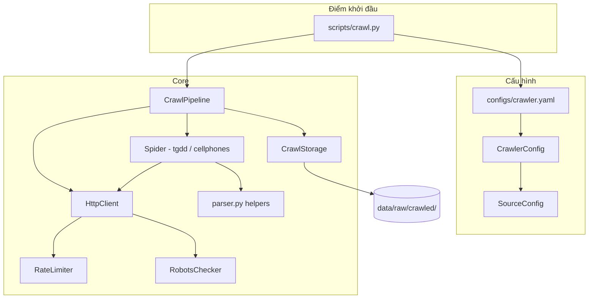
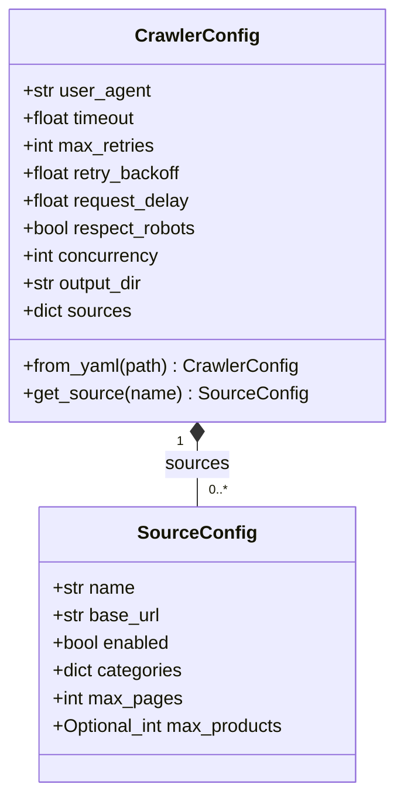
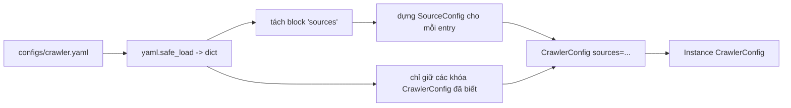
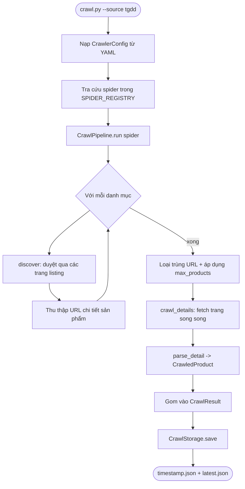
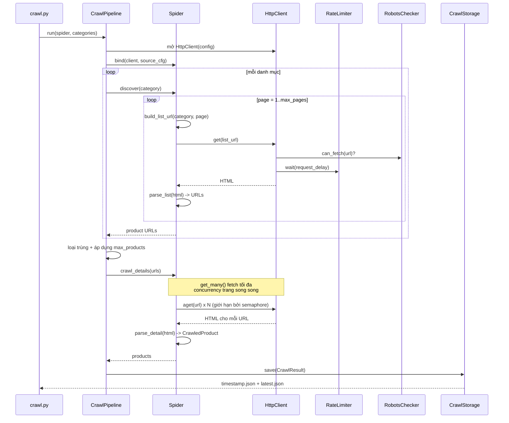
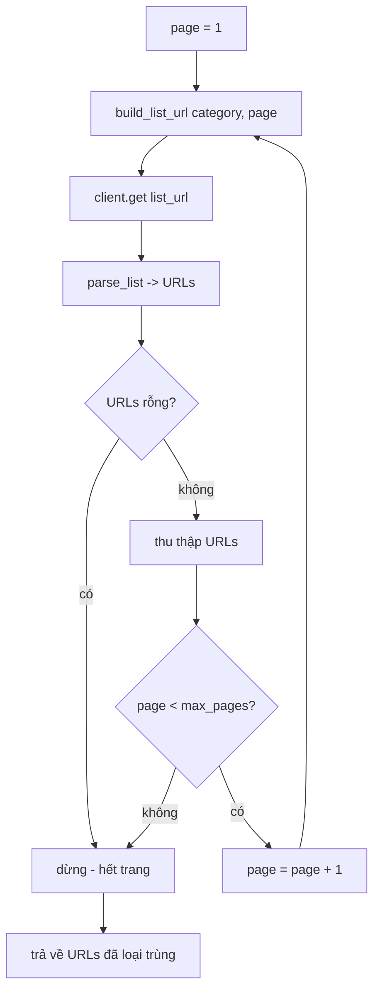
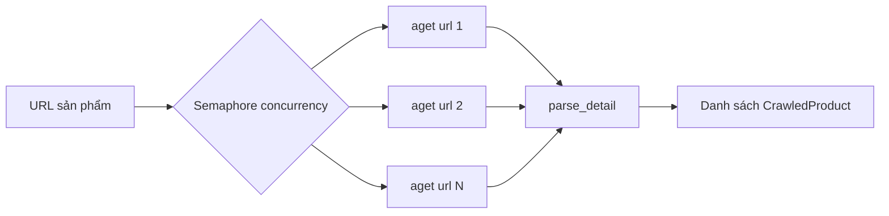
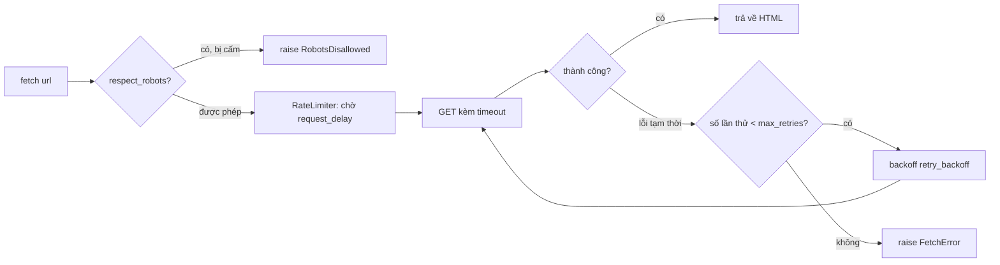
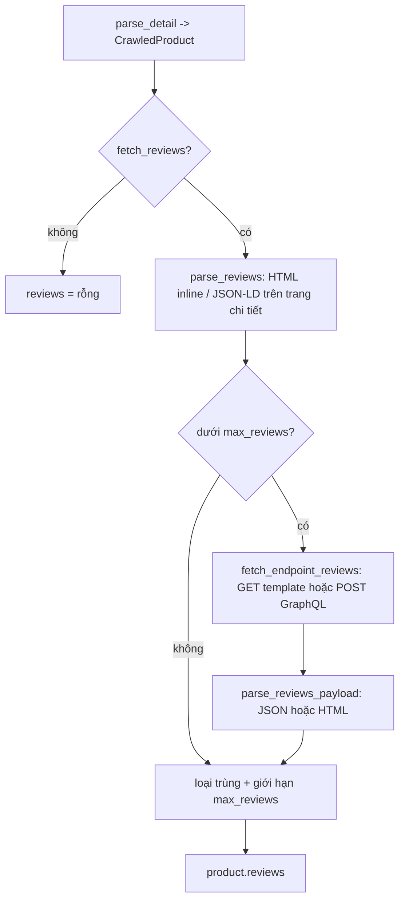

# Crawler

Module crawler (`src/crawler/`) thu thập dữ liệu sản phẩm thô từ các trang
thương mại điện tử và ghi vào `data/raw/crawled/`. Output của nó khớp với
schema sản phẩm thô mà pipeline ingestion tiêu thụ, nên dữ liệu crawl được có
thể đi thẳng vào `scripts/ingest.py`.

Stack được thiết kế cố tình nhẹ — `httpx` cho HTTP và `BeautifulSoup`
(cùng `lxml`) để parse — khớp với các dependency sẵn có của dự án.

## Tổng quan kiến trúc



## Trách nhiệm của từng thành phần

| Module | Trách nhiệm |
| --- | --- |
| `config.py` | `CrawlerConfig` / `SourceConfig`, nạp từ `configs/crawler.yaml`. |
| `http_client.py` | Wrapper `httpx`: retry (tenacity), rate limiting, robots.txt. |
| `rate_limiter.py` | Độ trễ tối thiểu giữa các request (sync + async). |
| `robots.py` | Lấy và cache rule `robots.txt` theo từng host. |
| `parser.py` | Helper BeautifulSoup dùng chung (`parse_price`, `parse_rating`, ...). |
| `models.py` | Dataclass `CrawledProduct`, `CrawlResult`. |
| `storage.py` | Ghi kết quả vào `data/raw/crawled/<source>/`. |
| `pipeline.py` | `CrawlPipeline` điều phối một spider từ đầu đến cuối. |
| `spiders/` | Một spider cho mỗi nguồn (`tgdd`, `cellphones`). |

---

## Cấu hình

Toàn bộ hành vi của crawler được điều khiển bởi một file YAML duy nhất,
`configs/crawler.yaml`, được nạp vào dataclass `CrawlerConfig`. Có hai cấp:

- **`CrawlerConfig`** — cài đặt toàn cục dùng chung cho mọi nguồn (HTTP, mức độ
  lịch sự, concurrency, output).
- **`SourceConfig`** — cài đặt riêng cho từng website (base URL, danh mục, giới
  hạn trang). Một `CrawlerConfig` chứa nhiều đối tượng `SourceConfig`, được
  đánh khóa theo tên nguồn.



> `sources` là `dict[str, SourceConfig]`, `categories` là `dict[str, str]`, và
> `max_products` là `int | None` — được đơn giản hóa ở trên cho công cụ render diagram.

### `configs/crawler.yaml` có chú thích

```yaml
# ---- CrawlerConfig (toàn cục) ----
user_agent: "Mozilla/5.0 (compatible; RagProductBot/0.1; +https://.../rag-product-recommend)"
timeout: 20.0             # timeout mỗi request (giây)
max_retries: 3            # số lần retry khi có lỗi tạm thời
retry_backoff: 1.5        # hệ số backoff lũy thừa giữa các lần retry
request_delay: 1.0        # số giây tối thiểu giữa các request đến cùng một host
respect_robots: true      # bỏ qua URL bị robots.txt cấm
concurrency: 4            # số trang chi tiết fetch song song
fetch_reviews: true       # thu thập đánh giá người mua cùng với thông số
max_reviews: 20           # giới hạn số review giữ lại cho mỗi sản phẩm
output_dir: "data/raw/crawled"

# ---- SourceConfig (một block cho mỗi website) ----
sources:
  tgdd:                                 # <- trở thành SourceConfig.name
    base_url: "https://www.thegioididong.com"
    enabled: true
    max_pages: 8                        # số trang listing duyệt qua mỗi danh mục
    max_products: 100                   # giới hạn số trang chi tiết mỗi lần chạy (null = không giới hạn)
    categories:                         # slug danh mục -> template đường dẫn listing
      smartphone: "/dtdd?page={page}"   # {page} được điền từ 1..max_pages
      laptop: "/laptop?page={page}"
    # reviews_url: "https://.../aj/comment/get?slug={slug}&page={page}"  # tùy chọn

  cellphones:
    base_url: "https://cellphones.com.vn"
    enabled: true
    max_pages: 8
    max_products: 100
    categories:
      smartphone: "/mobile.html?p={page}"
      laptop: "/laptop.html?p={page}"
    # API GraphQL bình luận (đã xác minh qua network capture). Spider POST một
    # query COMMENTS với parent product id lấy từ HTML trang chi tiết.
    reviews_url: "https://api.cellphones.com.vn/graphql-customer/graphql/query"
    reviews_query_type: "product"       # "product" = feed bình luận/hỏi đáp
```

### Các trường của `CrawlerConfig`

| Trường | Kiểu | Mặc định | Ý nghĩa |
| --- | --- | --- | --- |
| `user_agent` | `str` | RagProductBot UA | Gửi trên mọi request; định danh crawler. |
| `timeout` | `float` | `20.0` | Timeout mỗi request tính bằng giây. |
| `max_retries` | `int` | `3` | Số lần thử trước khi fetch báo lỗi `FetchError`. |
| `retry_backoff` | `float` | `1.5` | Hệ số backoff lũy thừa giữa các lần retry. |
| `request_delay` | `float` | `1.0` | Khoảng cách tối thiểu (giây) giữa các request đến một host. |
| `respect_robots` | `bool` | `true` | Nếu true, các rule cấm trong `robots.txt` được tuân thủ. |
| `concurrency` | `int` | `4` | Số trang chi tiết tối đa fetch song song. |
| `fetch_reviews` | `bool` | `true` | Thu thập đánh giá người mua ngoài thông số. |
| `max_reviews` | `int` | `20` | Giới hạn số review giữ lại cho mỗi sản phẩm. |
| `output_dir` | `str` | `data/raw/crawled` | Nơi kết quả được ghi vào. |
| `sources` | `dict[str, SourceConfig]` | `{}` | Tất cả nguồn đã cấu hình, đánh khóa theo tên. |

### Các trường của `SourceConfig`

| Trường | Kiểu | Mặc định | Ý nghĩa |
| --- | --- | --- | --- |
| `name` | `str` | (khóa) | ID nguồn; khớp với khóa YAML và `name` của spider. |
| `base_url` | `str` | — | Gốc trang web; link tương đối được resolve dựa trên đây. |
| `enabled` | `bool` | `true` | `--all` chỉ chạy các nguồn đã bật. |
| `categories` | `dict[str, str]` | `{}` | Slug danh mục → template đường dẫn listing kèm `{page}`. |
| `max_pages` | `int` | `3` | Số trang listing duyệt qua mỗi danh mục. |
| `max_products` | `int \| None` | `None` | Giới hạn số trang chi tiết mỗi lần chạy (`None` = không giới hạn). |
| `reviews_url` | `str \| None` | `None` | Endpoint review. Với nguồn dùng GET đây là URL template (`{product_id}`, `{slug}`, `{page}`); với nguồn GraphQL (cellphones) đây là URL endpoint thuần và spider tự dựng POST payload. Rỗng = chỉ lấy review inline. |
| `reviews_query_type` | `str` | `"product"` | Chỉ dùng cho CellphoneS: tham số `type` của query GraphQL bình luận. `"product"` trả về feed bình luận/hỏi đáp. |

### Cách cấu hình được nạp

`CrawlerConfig.from_yaml()` đọc file, tách block `sources:` thành các đối
tượng `SourceConfig`, và bỏ qua bất kỳ khóa cấp cao nhất nào không rõ, nên
file có thể chứa ghi chú thêm mà không làm hỏng việc nạp.



```python
config = CrawlerConfig.from_yaml("configs/crawler.yaml")
src = config.get_source("tgdd")   # -> SourceConfig
print(src.categories["smartphone"])  # "/dtdd?page={page}"
```

---

## Luồng thực thi crawl

### Tổng quan cấp cao



Quá trình chạy có hai giai đoạn:

1. **Discovery** — với mỗi danh mục, duyệt qua `max_pages` trang listing và
   scrape URL chi tiết sản phẩm từ mỗi trang. Dừng sớm nếu một trang không có
   kết quả.
2. **Detail** — loại trùng URL, giới hạn ở `max_products`, sau đó fetch tất cả
   trang chi tiết song song và parse mỗi trang thành một `CrawledProduct`.

### Chuỗi tuần tự end-to-end



### Bên trong `discover()` (một danh mục)

`discover()` phân trang qua các trang listing và thu thập URL chi tiết. Mỗi
`client.get()` tự động áp dụng robots + rate limit + retry.



### Bên trong `crawl_details()` (concurrency)

Các trang chi tiết độc lập với nhau, nên được fetch song song.
`HttpClient.get_many()` mở một `AsyncClient` dùng chung và giới hạn độ song
song bằng `asyncio.Semaphore(concurrency)`. Một trang lỗi sẽ được log và bỏ
qua (trả về `None`) thay vì hủy toàn bộ lần chạy; rate limiter vẫn giãn cách
các request để không làm quá tải trang web.



### Cách config điều khiển từng request

Mỗi lần fetch (`get` / `aget`) đều chạy qua cùng một tập guard rail, tất cả
được điều khiển bởi config:



- `respect_robots` → `RobotsChecker` có thể chặn một URL hay không.
- `request_delay` → `RateLimiter` chờ bao lâu trước mỗi request.
- `timeout` → deadline cho mỗi request.
- `max_retries` + `retry_backoff` → hành vi retry khi có lỗi tạm thời.
- `concurrency` → số trang chi tiết chạy song song.

### Số lượng crawl & phân trang

Số sản phẩm một lần chạy thu thập được điều khiển bởi hai cài đặt theo từng
nguồn:

- `max_products` — giới hạn cứng số sản phẩm mỗi lần chạy (mặc định trong
  `crawler.yaml`: `100`).
- `max_pages` — số trang listing mà `discover()` duyệt qua mỗi danh mục (mặc
  định `8`).

`discover()` duyệt qua các trang `1..max_pages`, chỉ giữ lại URL chưa từng
thấy, và dừng ngay khi một trang không trả về URL mới nào hoặc đã thu thập đủ
`max_products` URL duy nhất. Vì vậy số lượng thực tế xấp xỉ
`min(max_products, số URL duy nhất trên các trang)`.

> Một số trang listing (đặc biệt là TGDĐ) tải thêm sản phẩm bằng nút "Xem
> thêm" gọi đến một endpoint AJAX, nên `?page=N` có thể luôn trả về trang đầu
> tiên — trong trường hợp đó `discover()` dừng sớm với khoảng một trang kết
> quả. Để đi sâu hơn, trỏ template danh mục vào endpoint load-more của trang
> web (cùng placeholder `{page}`), ví dụ `smartphone: "/aj/....?page={page}"`.
> CellphoneS `?p=N` phân trang bình thường. Hãy xác minh hành vi phân trang
> trên trang web thực tế.

---

## Thông số kỹ thuật & đánh giá

Mỗi sản phẩm được crawl mang theo bảng thông số kỹ thuật đầy đủ và, khi
`fetch_reviews` được bật, một danh sách đánh giá của người mua.

### Thông số kỹ thuật

Thông số được thu thập dưới hai dạng:

- `specifications` — một map phẳng `nhãn -> giá trị` (vd. `{"RAM": "8 GB", "Pin": "4441 mAh"}`),
  giữ lại để tương thích với ingestion.
- `spec_groups` — cùng thông số đó nhưng gom nhóm theo danh mục, ví dụ
  `configuration_memory`, `camera_display`, `battery_charging`,
  `design_material`, `connectivity`, `general`.

`_parse_spec_groups` của mỗi spider duyệt qua container thông số theo thứ tự
tài liệu, gán mỗi dòng vào heading gần nhất phía trước nó, sau đó
`canonical_spec_group` chuẩn hóa các heading tiếng Việt của trang ("Cấu hình
& Bộ nhớ", "Camera & Màn hình", "Pin & Sạc", "Thiết kế & Chất liệu", ...) về
các khóa canonical ổn định ở trên. `flatten_spec_groups` tạo ra view phẳng
`specifications`. Nếu không tìm thấy heading nhóm nào, tất cả các dòng sẽ rơi
vào `general`, nên `specifications` không bao giờ rỗng.

| Khóa canonical | Bao gồm (heading trên trang) |
| --- | --- |
| `configuration_memory` | Cấu hình & Bộ nhớ — hệ điều hành, chip, RAM, dung lượng. |
| `camera_display` | Camera & Màn hình. |
| `battery_charging` | Pin & Sạc — loại, công nghệ, dung lượng. |
| `design_material` | Thiết kế & Chất liệu — kích thước, trọng lượng. |
| `connectivity` | Kết nối & Tiện ích. |
| `general` | Bất cứ thứ gì không khớp ở trên. |

### CellphoneS: trích xuất trường theo tầng

CellphoneS là ứng dụng Nuxt với tên class CSS thay đổi thường xuyên, nên
spider của nó **không** phụ thuộc vào selector cho các trường cốt lõi.
`parse_detail` resolve `price`, `avg_rating`, `review_count`, `description`
và `image_url` qua các tầng fallback, đáng tin cậy nhất trước:

| Ưu tiên | Nguồn | Cung cấp |
| --- | --- | --- |
| 1 | Block JSON-LD Product (`<script type="application/ld+json">`) | giá (`offers`), rating + số đánh giá (`aggregateRating`), mô tả, ảnh |
| 2 | Thẻ `<meta>` (`product:price:amount`, `og:description`, `og:image`) | giá, mô tả, ảnh |
| 3 | Selector CSS liên quan đến giá (`[class*='sale-price']`, ...) | giá |
| 4 | Regex trên JS state inline (`"special_price": ...` trong payload Nuxt) | giá |
| 5 | Mẫu text render phía server — `"4.9 (366 đánh giá)"` cạnh `<h1>`, số tiền VND đầu tiên (`30.990.000đ`) trong body | rating, số đánh giá, giá |

Block JSON-LD có mặt trong HTML server thực tế (đã xác minh tháng 7/2026),
nên tầng 1 thường trả lời được tất cả; các tầng dưới chỉ cần đến nếu trang
bỏ structured data. Ảnh placeholder lazy-load (`placehoder.png`, thumbnail
YouTube) bị bỏ qua, ưu tiên URL từ JSON-LD/`og:image`. Các helper dùng chung
nằm trong `parser.py` (`find_product_json_ld`, `json_ld_price`,
`json_ld_rating`, `meta_content`, `rating_summary_from_text`,
`price_from_inline_json`) và có thể tái sử dụng cho spider khác.

### Đánh giá (Reviews)

Đánh giá của người mua thường nằm sau một endpoint AJAX/JSON riêng thay vì
trong HTML của trang chi tiết, nên việc thu thập review chạy qua hai giai
đoạn:



Mỗi `Review` lưu `author`, `rating` và `content`. Lời gọi endpoint đi qua
hook `fetch_endpoint_reviews(product, detail_html)` trên `BaseSpider`:

- **Mặc định (GET template)** — dùng cho `tgdd`: `build_reviews_url` điền
  template `reviews_url` (placeholder `{product_id}`, `{slug}`, `{page}`) và
  body được fetch bằng `client.get`. `parse_reviews_payload` tìm mảng review
  bên trong JSON bất kể độ lồng nhau và fallback về parse HTML.
- **Override (POST GraphQL)** — dùng cho `cellphones`: spider dựng GraphQL
  payload và gửi bằng `HttpClient.post_json`, áp dụng cùng các quy tắc lịch
  sự như `get` (robots, rate limit, retry). Xem mục tiếp theo.

Lỗi endpoint được log và bỏ qua — review là best-effort và không bao giờ hủy
một lần chạy.

> Endpoint review và định dạng JSON của nó khác nhau tùy trang và thay đổi
> theo thời gian. Với `tgdd`, `reviews_url` mặc định được comment trong
> `configs/crawler.yaml`; hãy xác minh endpoint thực tế trên trang web trước
> khi bật nó. Với `cellphones`, endpoint đã được xác minh qua network capture
> (tháng 7/2026) và được bật mặc định.

#### CellphoneS: API GraphQL bình luận

CellphoneS render đánh giá của người mua phía client, nên HTML tĩnh mà
crawler fetch không bao giờ chứa chúng. Thay vào đó spider gọi thẳng API bình
luận của trang, được phát hiện bằng cách capture network traffic của trang
(`scripts/discover_reviews_api.py`, tiện ích dev dùng Playwright):

```
POST https://api.cellphones.com.vn/graphql-customer/graphql/query

query COMMENTS {
  comment(type: "product", pageUrl: "<URL trang chi tiết>",
          productId: <parent id>, currentPage: 1) {
    total
    matches { id content is_shown is_admin created_at customer { fullname } }
  }
}
```

Chi tiết luồng:

1. **Parent product id** — query yêu cầu product id cấp trang (id cha), không
   phải id biến thể màu/dung lượng. HTML tĩnh của trang chi tiết chứa nó tại
   `<div id="block-comment-cps" product-id="59258">`; pattern neo theo
   `block-comment-cps` được thử trước pattern `product-id` chung để id biến
   thể ở nơi khác trong trang không che mất nó. Nếu không tìm thấy id, lời
   gọi endpoint bị bỏ qua kèm warning.
2. **Query type** — tham số `type` lấy từ `reviews_query_type` trong
   `configs/crawler.yaml`. `"product"` trả về feed bình luận/hỏi đáp (câu hỏi
   về hàng, trả góp lẫn với nhận xét). Feed đánh giá sao ("Đánh giá & nhận
   xét") nhiều khả năng dùng một giá trị type khác —
   `scripts/probe_comment_api.py` thăm dò các ứng viên (`rating`, `review`,
   ...); nếu xác nhận được, việc chuyển đổi chỉ là thay một dòng config.
3. **Lọc** — reply của nhân viên (`is_admin`) và entry bị ẩn (`is_shown: 0`)
   bị loại; chỉ nội dung do khách hàng viết trở thành `Review`.

> JSON-LD của trang cũng liệt kê vài review SEO, nhưng chúng chỉ có số sao và
> tác giả (không có nội dung), nên chỉ được thu thập khi có text.

#### Trích xuất nội dung & rating bền vững (inline)

Tên class của review thay đổi thường xuyên, nên `parse_reviews` chỉ cần chọn
**block** review và **tác giả**; phần nội dung và rating được lấy ra bằng hai
helper không phụ thuộc vào tên class chính xác:

- `review_content(node, author, content_selectors=...)` — thử các selector
  nội dung được cung cấp trước; nếu không cái nào cho ra text khác với tên
  tác giả, nó fallback về toàn bộ text của block sau khi loại bỏ tên tác giả,
  badge mua hàng ("Đã mua tại …") và footer ("Hữu ích", "Đã dùng", "Bộ phận
  bán hàng", "Trả lời", …). Nhờ vậy câu review thật sự vẫn được khôi phục dù
  không biết class của nó.
- `star_rating(node)` — resolve điểm số theo thứ tự ưu tiên: nhãn số
  (`"5/5"`) → overlay thanh lấp đầy `width: N%` (`N/20`) → đếm số icon sao đã
  tô đầy → đếm số icon sao bất kỳ (giả định đã tô đầy). Chỉ trả về `0.0` khi
  không có gì giống sao xuất hiện.

Một review bị loại bỏ khi nội dung của nó rỗng hoặc trùng với tên tác giả. Vì
các helper này chạy trên block đã được chọn sẵn, chúng khắc phục lỗi thường
gặp khi nội dung bị nhầm thành tên tác giả và rating giữ nguyên `0`.

> Chỉ selector **block** và **tác giả** là đặc thù theo từng trang. Nếu một
> review vẫn ra sai, hãy kiểm tra một block review (Copy → outerHTML) và điều
> chỉnh `_REVIEW_BLOCK_SELECTOR` / `_AUTHOR_SELECTOR` trên spider. Để có dữ
> liệu sạch nhất, hãy đặt `reviews_url` và parse endpoint JSON thay vì HTML
> inline.

Để thêm review vào một spider mới, override `parse_reviews` (HTML inline) và,
với một endpoint, `parse_reviews_payload` (response body → `list[Review]`);
`build_reviews_url` của base class đã tự dựng URL từ `reviews_url`.

## Output

```
data/raw/crawled/<source>/<timestamp>.json   # toàn bộ lần chạy: metadata + lỗi + sản phẩm
data/raw/crawled/<source>/latest.json        # chỉ sản phẩm, sẵn sàng để ingest
```

Mỗi entry sản phẩm bao gồm `specifications` (map `nhãn -> giá trị`) và
`reviews` (danh sách `{author, rating, content}`). `latest.json` dùng cùng
tên trường với `data/raw/products/`, nên có thể đưa thẳng vào
`scripts/ingest.py` mà không cần biến đổi.

### Schema sản phẩm (`CrawledProduct`)

| Trường | Kiểu | Ghi chú |
| --- | --- | --- |
| `id` | `str` | `"<source>-<slug>"`, vd. `tgdd-iphone-15-pro-max`. |
| `name` | `str` | Tiêu đề sản phẩm lấy từ `<h1>` của trang chi tiết. |
| `source` | `str` | ID nguồn (`tgdd`, `cellphones`). |
| `source_url` | `str` | URL trang chi tiết mà sản phẩm được scrape từ đó. |
| `brand` | `str` | Suy đoán thương hiệu tốt nhất có thể (token đầu tiên của tên). |
| `category` | `str` | Slug danh mục (vd. `smartphone`). |
| `price` | `int` | Giá tính bằng VND (chỉ chữ số). |
| `currency` | `str` | Mặc định là `VND`. |
| `specifications` | `dict[str, str]` | Bảng thông số phẳng dạng `nhãn -> giá trị`. |
| `spec_groups` | `dict[str, dict[str, str]]` | Thông số gom nhóm theo danh mục canonical. |
| `description` | `str` | Mô tả sản phẩm ngắn / điểm bán hàng chính. |
| `image_url` | `str` | Ảnh sản phẩm chính. |
| `avg_rating` | `float` | Điểm rating trung bình hiển thị trên trang. |
| `review_count` | `int` | Số lượng rating (fallback về số review đã scrape được). |
| `reviews` | `list[Review]` | Đánh giá người mua: `{author, rating, content}`. |
| `tags` | `list[str]` | Tag tùy chọn (mặc định không dùng). |
| `crawled_at` | `str` | Timestamp ISO của thời điểm sản phẩm được crawl. |

### Ví dụ một entry trong `latest.json`

```json
[
  {
    "id": "tgdd-iphone-15-pro-max",
    "name": "iPhone 15 Pro Max",
    "source": "tgdd",
    "source_url": "https://www.thegioididong.com/dtdd/iphone-15-pro-max",
    "brand": "iPhone",
    "category": "smartphone",
    "price": 29990000,
    "currency": "VND",
    "specifications": {
      "Hệ điều hành": "iOS 17",
      "Chip": "A17 Pro",
      "RAM": "8 GB",
      "Màn hình": "6.7 inch",
      "Dung lượng pin": "4441 mAh",
      "Khối lượng": "221 g"
    },
    "spec_groups": {
      "configuration_memory": { "Hệ điều hành": "iOS 17", "Chip": "A17 Pro", "RAM": "8 GB" },
      "camera_display": { "Màn hình": "6.7 inch" },
      "battery_charging": { "Dung lượng pin": "4441 mAh", "Công nghệ sạc": "Sạc nhanh 20 W" },
      "design_material": { "Khối lượng": "221 g" }
    },
    "description": "Flagship cao cấp với chip A17 Pro và khung titanium.",
    "image_url": "https://.../iphone-15-pro-max.jpg",
    "avg_rating": 4.7,
    "review_count": 2,
    "reviews": [
      { "author": "Nguyễn An", "rating": 5.0, "content": "Máy đẹp, pin trâu." },
      { "author": "Trần Bình", "rating": 4.0, "content": "Giá hơi cao nhưng đáng tiền." }
    ],
    "tags": [],
    "crawled_at": "2026-07-01T14:30:00"
  }
]
```

## Thêm một nguồn mới

1. Thêm một block `SourceConfig` dưới `sources:` trong `configs/crawler.yaml`.
2. Tạo `src/crawler/spiders/<name>_spider.py` kế thừa `BaseSpider` và
   implement ba hook bắt buộc:
   - `build_list_url(category, page)` — dựng URL trang listing.
   - `parse_list(html, base_url)` — trả về URL chi tiết sản phẩm dạng tuyệt đối.
   - `parse_detail(html, url)` — trả về một `CrawledProduct` (hoặc `None` để bỏ qua).
   Tùy chọn override các hook review:
   - `parse_reviews(html, url)` — review nhúng trong HTML trang chi tiết.
   - `parse_reviews_payload(body, url)` — review từ endpoint `reviews_url`.
   - `fetch_endpoint_reviews(product, detail_html)` — toàn bộ bước fetch
     endpoint, dành cho API POST/GraphQL hoặc endpoint cần tham số lấy từ
     trang (xem spider CellphoneS làm ví dụ hoàn chỉnh).
3. Đăng ký class trong `SPIDER_REGISTRY` tại `src/crawler/spiders/__init__.py`.

Base class xử lý phân trang, fetch chi tiết song song, thu thập review, loại
trùng, giới hạn số lượng và ghi nhận lỗi theo từng trang, nên một spider chỉ
cần các selector đặc thù của trang web đó.

## Sử dụng

```bash
# Crawl một nguồn
uv run python scripts/crawl.py --source tgdd

# Crawl danh mục cụ thể
uv run python scripts/crawl.py --source cellphones --category smartphone

# Crawl mọi nguồn đã bật
uv run python scripts/crawl.py --all
```

## Lịch sự & tuân thủ

- `respect_robots: true` (mặc định) bỏ qua URL bị `robots.txt` cấm.
- `request_delay` đảm bảo khoảng cách tối thiểu giữa các request đến cùng một host.
- Dùng một `user_agent` mô tả rõ ràng để chủ trang web có thể nhận diện crawler.
- CSS selector trong các spider phản ánh markup của trang tại thời điểm viết
  và là thứ dễ hỏng nhất; hãy xác minh chúng với DOM thực tế trước khi chạy
  production. Luôn xem lại Điều khoản dịch vụ của mỗi trang trước khi crawl.

## Testing

Unit test của crawler chạy offline (không cần mạng) với fixture HTML inline:

```bash
uv run pytest tests/test_crawler.py            # test dùng chung + tgdd
uv run pytest tests/test_cellphones_spider.py  # trích xuất trường của cellphones
uv run pytest tests/test_cellphones_reviews.py # API GraphQL bình luận cellphones
```

Hai tiện ích dev hỗ trợ làm việc với endpoint trên trang thật (không thuộc CI):
`scripts/discover_reviews_api.py` (capture network các API liên quan review
bằng Playwright) và `scripts/probe_comment_api.py` (thăm dò các biến thể
`type` của query bình luận và lưu response).
