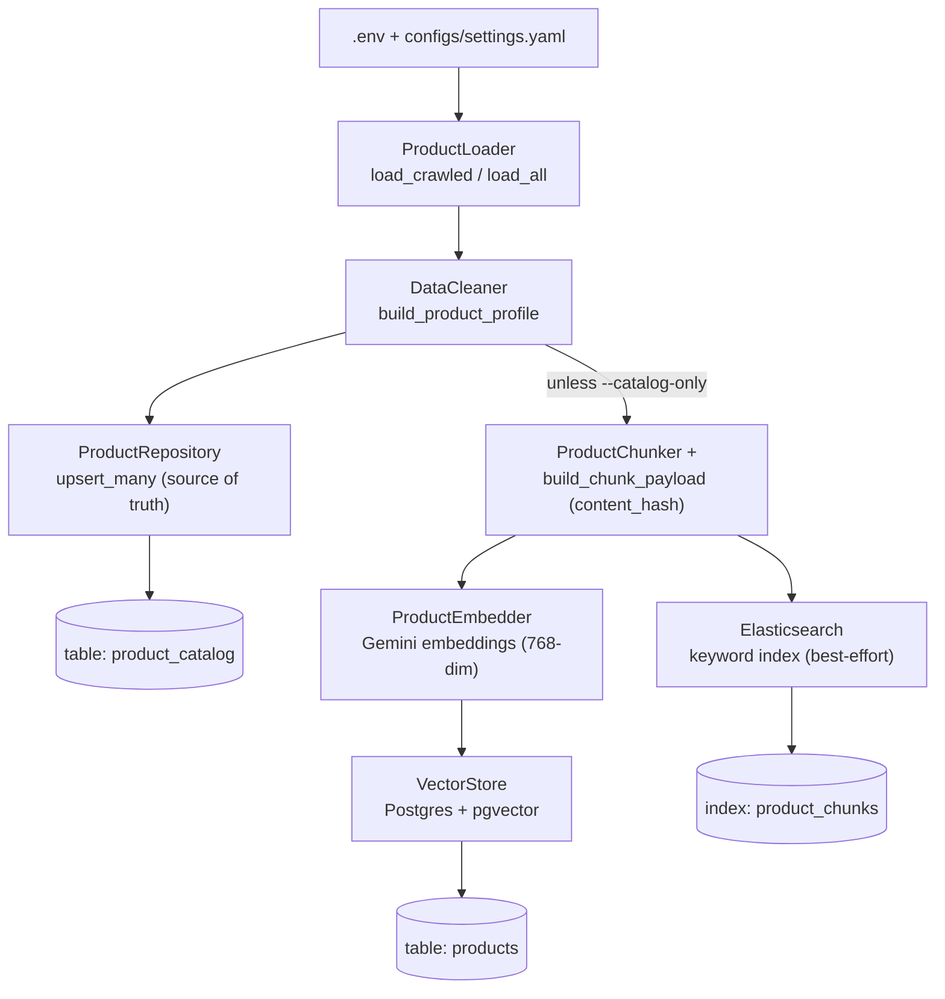

# Ingestion

The ingestion script (`scripts/ingest.py`) is the **bootstrap** path for a fresh
system. It loads raw products from disk, normalizes them, and writes **three
targets** so the stack is immediately usable:

1. the source-of-truth `product_catalog` table (via `ProductRepository.upsert_many`,
   written **first** — everything else derives from it);
2. the PostgreSQL + pgvector store (`products` table) that powers semantic retrieval;
3. the Elasticsearch keyword index (`product_chunks`) — a best-effort bulk upsert,
   gracefully skipped when the cluster is unreachable.

It is the bridge between the [Crawler](crawler.md) (which produces raw data) and
the recommend/compare pipelines (which query the search indexes).

For **ongoing** changes after bootstrap you do not re-run this script — writes go
through the CRUD API `/api/products` → `product_catalog` → Debezium → Kafka, and
the CDC sync workers keep both indexes fresh. See
[Catalog, CDC & re-runs](#catalog-cdc-re-runs) below.

## Running it

```bash
uv run python scripts/ingest.py                 # source=crawled (default)
uv run python scripts/ingest.py --source products
uv run python scripts/ingest.py --source all
uv run python scripts/ingest.py --catalog-only  # only product_catalog; CDC builds the indexes
```

| `--source`   | Reads from                                             | Typical size |
| ------------ | ------------------------------------------------------ | ------------ |
| `crawled`    | `data/raw/crawled/<source>/latest.json` (one per site) | ~92 products |
| `products`   | `data/raw/products/*.json` and `*.csv`                 | 3 (samples)  |
| `all`        | both of the above                                      | ~95 products |

With `--catalog-only`, the script writes **only** the `product_catalog` table and
lets the CDC pipeline (Debezium snapshot → indexer + embedding workers) build both
search indexes from the Debezium snapshot instead.

## Pipeline at a glance



## Step 1 — Environment & configuration

`main()` first calls `load_dotenv()` so the `.env` file is read before any API
key lookup, then loads `PipelineConfig` from `configs/settings.yaml`.

The settings that drive ingestion:

| Setting              | Default                 | Used for                                  |
| -------------------- | ----------------------- | ----------------------------------------- |
| `embedding_provider` | `gemini`                | which embedding backend to call           |
| `embedding_model`    | `gemini-embedding-001`  | embedding model name                      |
| `embedding_dim`      | `768`                   | vector size (also the pgvector column)    |
| `vector_db_url`      | `postgresql://…/rag_products` | DB connection (overridden by `DATABASE_URL`) |
| `collection_name`    | `products`              | destination table name                    |

API keys come from environment variables resolved by
`resolve_api_keys(<PROVIDER>_API_KEY)`, which supports one or several keys for
[token rotation](#embedding-rate-limits-token-rotation):

```properties
GEMINI_API_KEY=key_1,key_2          # comma-separated, or…
GEMINI_API_KEY_1=key_2              # …numbered variants
```

## Step 2 — Loading raw products

`ProductLoader` reads the products depending on `--source`:

- **`load_crawled()`** globs `data/raw/crawled/*/latest.json` — exactly one
  `latest.json` per source folder (`tgdd/`, `cellphones/`). Timestamped
  snapshots in the same folders are intentionally skipped so products are not
  counted twice.
- **`load_all()`** reads every `.json` / `.csv` file in `data/raw/products/`.

Each product is a plain `dict`. The loader does not validate the schema — every
downstream field is read defensively with `.get()` and a sensible default.

## Step 3 — Cleaning & normalization

`DataCleaner.build_product_profile(raw)` maps a raw record onto a standardized
**product profile**. This is also where crawler quirks are corrected.

| Profile field    | Source                                   | Notes                                             |
| ---------------- | ---------------------------------------- | ------------------------------------------------- |
| `product_id`     | `raw["id"]`                              | e.g. `tgdd-iphone-17-pro-max`                     |
| `name`           | `clean_text(raw["name"])`               | HTML/whitespace stripped                          |
| `brand`          | `detect_brand(name)` or raw `brand`     | maps product lines to maker (iPhone → **Apple**)  |
| `category`       | `raw["category"].lower()`               |                                                   |
| `price`          | `normalize_price(raw["price"])`         | first price-like number only                      |
| `currency`       | `raw["currency"]`                       | default `VND`                                     |
| `specifications` | `raw["specifications"]`                 | `dict` of label → value                           |
| `description`    | `clean_text(raw["description"])`        |                                                   |
| `pros` / `cons`  | `raw` lists                             |                                                   |
| `avg_rating`     | `float(raw["avg_rating"])`              |                                                   |
| `review_count`   | `int(raw["review_count"])`              |                                                   |
| `review_summary` | `""`                                     | filled by a separate LLM step, not by ingest      |
| `tags`           | `raw["tags"]`                           |                                                   |

!!! note "Brand & price fixes"
    `detect_brand` reads the manufacturer from the product **name** (so raw
    values like `"Điện"` become `"Apple"`/`"Samsung"`/…), and `normalize_price`
    takes only the first price number to avoid concatenating several prices on a
    page. See [Crawler](crawler.md) for where the raw values come from.

## Step 4 — Chunking

`ProductChunker.chunk_product(profile)` performs **field-based chunking**: each
product becomes several small, self-contained text chunks, so retrieval can
match on the most relevant aspect (specs vs. reviews vs. description).

| `chunk_type`     | Created when…              | Text shape                                                    |
| ---------------- | ------------------------- | ------------------------------------------------------------- |
| `description`    | always                    | `"{name} - {brand}. {description}"`                           |
| `specifications` | `specifications` present  | `"Thông số kỹ thuật {name}:"` + one `- label: value` per spec |
| `pros_cons`      | any `pros`/`cons`         | `"Đánh giá {name}: Ưu điểm: …; Nhược điểm: …"`                |
| `review`         | `review_summary` present  | `"Đánh giá về {name}: … Rating: x/5 (n reviews)"`             |

Every chunk carries lightweight metadata used for filtering later:
`product_id`, `brand`, `category`, `price`, plus its own `chunk_type`.

!!! info "Crawled data → 2 chunks each"
    Crawled products currently have no `pros`/`cons` and no `review_summary`, so
    each yields **2 chunks** (`description` + `specifications`). That is why 92
    crawled products produce ~184 chunks.

## Step 5 — Embedding

Every chunk's `text` is embedded through `ProductEmbedder`, which delegates to
the configured provider (Gemini by default).

**How the embedding call works** (`GeminiEmbeddingProvider`):

- Uses `google-genai`: `client.models.embed_content(model, contents, config)`.
- `contents` is a **list of texts** (a whole batch in one request).
- `config = EmbedContentConfig(output_dimensionality=768)` requests 768-dim
  vectors so they match the pgvector column exactly (Gemini's
  `gemini-embedding-001` supports Matryoshka sizes such as 768/1536/3072).

**How batching works** (`ProductEmbedder.embed_batch`):

- Texts are processed in slices of `batch_size` (default **100**).
- Each returned vector is a `list[float]` of length `embedding_dim` (768).

| Embedding parameter | Value                    | Where set                       |
| ------------------- | ------------------------ | ------------------------------- |
| Provider            | `gemini`                 | `settings.embedding_provider`   |
| Model               | `gemini-embedding-001`   | `settings.embedding_model`      |
| Output dimension    | `768`                    | `settings.embedding_dim`        |
| Batch size          | `100`                    | `embed_batch(batch_size=…)`     |
| Similarity metric   | cosine                   | pgvector index (see Step 6)     |

### Embedding rate limits & token rotation

Gemini's free tier allows ~**100 embedding requests/minute**. `ProductEmbedder`
handles this automatically:

1. On a `429 / RESOURCE_EXHAUSTED` error it **rotates to the next configured API
   key** and retries immediately.
2. Only when **all** keys are throttled does it sleep for the delay the API
   suggests (`retry in …s`) and try again — up to `max_retries` waits.

Configure several keys (see Step 1) to multiply throughput: with *N* keys you
effectively get *N × 100* embeddings per minute. The same mechanism is reused by
the LLM client for generation.

## Step 6 — Storing in the vector store

`VectorStore.setup()` connects to Postgres, enables the `vector` extension, and
creates the table + HNSW index if they do not exist. Then `add_documents()`
upserts every chunk.

Table `products` (the `collection_name`):

| Column      | Type            | Contents                                             |
| ----------- | --------------- | ---------------------------------------------------- |
| `id`        | `TEXT` (PK)     | `"{product_id}_{chunk_type}"`, e.g. `tgdd-iphone-17-pro-max_specifications` |
| `document`  | `TEXT`          | the chunk text (what gets shown/retrieved)           |
| `metadata`  | `JSONB`         | `{product_id, brand, category, price, chunk_type}`   |
| `embedding` | `vector(768)`   | the Gemini embedding                                 |

- **Index:** `USING hnsw (embedding vector_cosine_ops)` — cosine similarity.
- **Upsert:** `INSERT … ON CONFLICT (id) DO UPDATE`, so re-running ingest
  refreshes existing rows instead of duplicating them.
- **Query** (used by retrieval): `embedding <=> %s::vector` ordered ascending
  (nearest first), with optional `metadata->>key = value` filters.

Example stored row:

```json
{
  "id": "tgdd-iphone-17-pro-max_description",
  "document": "iPhone 17 Pro Max 256GB - Apple. …",
  "metadata": {
    "product_id": "tgdd-iphone-17-pro-max",
    "brand": "Apple",
    "category": "smartphone",
    "price": 37990000,
    "chunk_type": "description"
  },
  "embedding": [0.0123, -0.0456, "… 768 floats …"]
}
```

## Re-running & clearing

Because inserts are keyed by `id` (`{product_id}_{chunk_type}`), re-ingesting the
same source **overwrites** those rows but leaves unrelated rows (e.g. old sample
products) in place. To start clean:

```bash
# fastest: empty the table, keep the schema
docker compose -f docker/docker-compose.yml exec postgres \
  psql -U postgres -d rag_products -c "TRUNCATE products;"

uv run python scripts/ingest.py
```

Only drop and recreate the table (or the whole volume) when changing
`embedding_dim`, since the `vector(768)` column size is fixed at creation.

### Catalog, CDC & re-runs

A few things to keep in mind once the CDC stack is running:

- **The catalog is the source of truth.** `product_catalog` is written first and
  both search indexes derive from it. `ingest.py` only bootstraps; ongoing writes
  go through the CRUD API, so you should not re-run this script to apply edits.
- **`content_hash` makes snapshot replays cheap.** Every chunk built by
  `build_chunk_payload` carries a `content_hash` of the text-bearing fields — the
  *same* payload the CDC sync workers build. When Debezium later replays the
  initial snapshot of the catalog, the embedding worker sees the vectors are
  already current and makes **zero embedding API calls** for unchanged products.
- **Elasticsearch indexing is best-effort.** If the cluster is unreachable the
  bulk upsert is skipped with a warning; the CDC sync workers rebuild the keyword
  index from the Debezium snapshot. With `--catalog-only` this is the intended
  path for *both* indexes.

For the continuous counterpart to this one-time bootstrap, see the
[Continuous: Product Write Data Flow (CDC)](../architecture/data-flow.md#continuous-product-write-data-flow-cdc)
and the [sync_worker.py](../scripts/sync-worker.md) page.

## Related

- [Crawler](crawler.md) — produces the raw data consumed here.
- [sync_worker.py](../scripts/sync-worker.md) — the CDC workers that keep the indexes fresh.
- [Data Flow](../architecture/data-flow.md) — end-to-end system view.
- [Pipeline](../architecture/pipeline.md) — how the stored vectors are queried.
