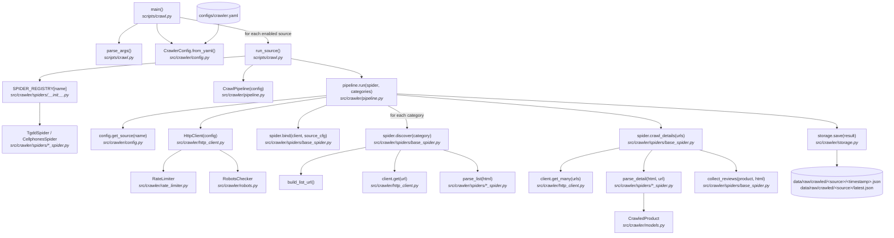

# crawl.py — Execution Flow

Crawls product data from configured sources (thegioididong, cellphones) into
`data/raw/crawled/`.

```bash
uv run python scripts/crawl.py --source tgdd
uv run python scripts/crawl.py --source cellphones --category smartphone
uv run python scripts/crawl.py --all
```

## Flow diagram



## Step-by-step

| # | Step | Function | File |
|---|------|----------|------|
| 1 | Parse CLI args (`--source`, `--category`, `--all`, `--config`) | `parse_args()` | `scripts/crawl.py` |
| 2 | Load crawler config from YAML | `CrawlerConfig.from_yaml()` | `src/crawler/config.py` |
| 3 | Resolve targets: one source, or all enabled sources | `main()` | `scripts/crawl.py` |
| 4 | Look up spider class for the source | `SPIDER_REGISTRY[name]` | `src/crawler/spiders/__init__.py` |
| 5 | Build the pipeline and run it | `CrawlPipeline.run()` | `src/crawler/pipeline.py` |
| 6 | Open HTTP client (retry + rate limit + robots.txt) | `HttpClient` | `src/crawler/http_client.py` |
| 7 | Discover product URLs per category (list pages, pagination) | `BaseSpider.discover()` | `src/crawler/spiders/base_spider.py` |
| 8 | Fetch detail pages concurrently and parse products | `BaseSpider.crawl_details()` → `parse_detail()` | `src/crawler/spiders/base_spider.py`, `*_spider.py` |
| 9 | Collect reviews for each product (optional hook) | `BaseSpider.collect_reviews()` | `src/crawler/spiders/base_spider.py` |
| 10 | Save timestamped run + `latest.json` snapshot | `CrawlStorage.save()` | `src/crawler/storage.py` |

## Output

Each run writes two files per source under `data/raw/crawled/<source>/`:
a timestamped `YYYYMMDD_HHMMSS.json` (full `CrawlResult`, including errors) and
`latest.json` (products only) — the file that `scripts/ingest.py` reads by default.
