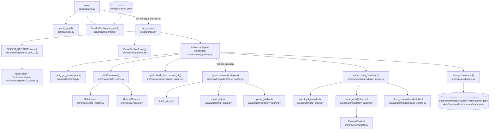

# crawl.py — Luồng chạy

Crawl dữ liệu sản phẩm từ các nguồn đã cấu hình (thegioididong, cellphones) vào
`data/raw/crawled/`.

```bash
uv run python scripts/crawl.py --source tgdd
uv run python scripts/crawl.py --source cellphones --category smartphone
uv run python scripts/crawl.py --all
```

## Sơ đồ luồng



## Từng bước

| # | Bước | Function | File |
|---|------|----------|------|
| 1 | Parse tham số CLI (`--source`, `--category`, `--all`, `--config`) | `parse_args()` | `scripts/crawl.py` |
| 2 | Load config crawler từ YAML | `CrawlerConfig.from_yaml()` | `src/crawler/config.py` |
| 3 | Xác định target: một nguồn, hoặc tất cả nguồn được bật | `main()` | `scripts/crawl.py` |
| 4 | Tra cứu spider class cho nguồn | `SPIDER_REGISTRY[name]` | `src/crawler/spiders/__init__.py` |
| 5 | Khởi tạo pipeline và chạy | `CrawlPipeline.run()` | `src/crawler/pipeline.py` |
| 6 | Mở HTTP client (retry + rate limit + robots.txt) | `HttpClient` | `src/crawler/http_client.py` |
| 7 | Tìm URL sản phẩm theo category (trang danh sách, phân trang) | `BaseSpider.discover()` | `src/crawler/spiders/base_spider.py` |
| 8 | Fetch trang chi tiết đồng thời và parse sản phẩm | `BaseSpider.crawl_details()` → `parse_detail()` | `src/crawler/spiders/base_spider.py`, `*_spider.py` |
| 9 | Thu thập review cho mỗi sản phẩm (hook tùy chọn) | `BaseSpider.collect_reviews()` | `src/crawler/spiders/base_spider.py` |
| 10 | Lưu bản chạy có timestamp + snapshot `latest.json` | `CrawlStorage.save()` | `src/crawler/storage.py` |

## Kết quả

Mỗi lần chạy ghi hai file cho mỗi nguồn trong `data/raw/crawled/<source>/`:
file `YYYYMMDD_HHMMSS.json` (toàn bộ `CrawlResult`, gồm cả lỗi) và
`latest.json` (chỉ sản phẩm) — file mà `scripts/ingest.py` đọc mặc định.
