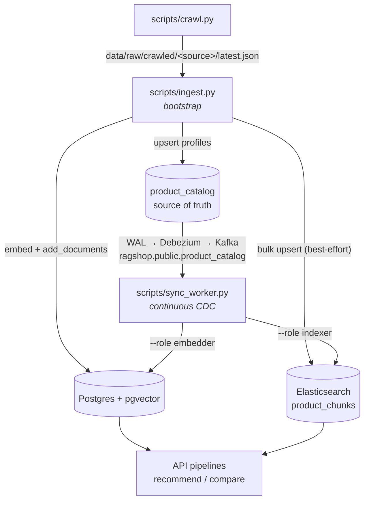

# Scripts Overview

The `scripts/` folder contains CLI entry points for operating the system outside the API:

| Script | Purpose | Typical command |
|---|---|---|
| [`crawl.py`](crawl.md) | Crawl raw product data from configured sources into `data/raw/crawled/` | `uv run python scripts/crawl.py --all` |
| [`ingest.py`](ingest.md) | Clean, chunk, embed and load products into the source-of-truth catalog + both search indexes (pgvector + Elasticsearch) | `uv run python scripts/ingest.py --source crawled` |
| [`sync_worker.py`](sync-worker.md) | Run a CDC sync worker that keeps a search index in sync with the catalog (Debezium/Kafka → Elasticsearch or pgvector) | `uv run python scripts/sync_worker.py --role indexer\|embedder` |
| [`seed.py`](seed.md) | Seed sample data for development (placeholder) | `uv run python scripts/seed.py` |

The usual end-to-end order is **crawl → ingest**: the crawler writes
`data/raw/crawled/<source>/latest.json`, and the ingest script reads exactly those
files by default (`--source crawled`).

`ingest.py` is a **one-time bootstrap**: it fills the `product_catalog` table
(source of truth) plus both search indexes so a fresh system is immediately
usable. `sync_worker.py` runs **continuously** afterward: it consumes the
Debezium/Kafka change stream and propagates every catalog write to the derived
indexes, so no re-ingest is needed once the catalog is live.

Each page below documents the full execution flow of a script: which functions are
called, in which order, and which file each one lives in.
