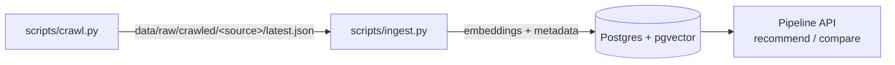

# Tổng quan Scripts

Thư mục `scripts/` chứa các CLI entry point để vận hành hệ thống bên ngoài API:

| Script | Mục đích | Lệnh thường dùng |
|---|---|---|
| [`crawl.py`](crawl.md) | Crawl dữ liệu sản phẩm thô từ các nguồn đã cấu hình vào `data/raw/crawled/` | `uv run python scripts/crawl.py --all` |
| [`ingest.py`](ingest.md) | Làm sạch, chunk, embed và nạp sản phẩm vào vector store | `uv run python scripts/ingest.py --source crawled` |
| [`seed.py`](seed.md) | Seed dữ liệu mẫu cho development (placeholder) | `uv run python scripts/seed.py` |

Thứ tự end-to-end thông thường là **crawl → ingest**: crawler ghi ra
`data/raw/crawled/<source>/latest.json`, và script ingest mặc định đọc đúng các
file đó (`--source crawled`).

Mỗi trang bên dưới mô tả đầy đủ luồng chạy của một script: gọi những function
nào, theo thứ tự nào, và mỗi function nằm ở file nào.
