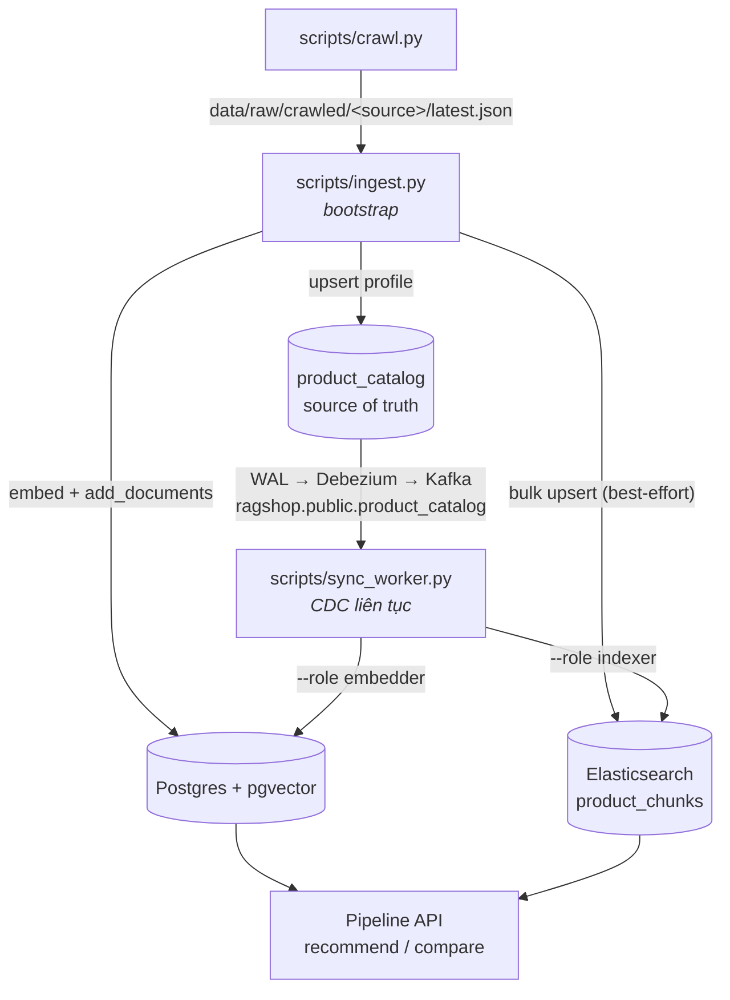

# Tổng quan Scripts

Thư mục `scripts/` chứa các CLI entry point để vận hành hệ thống bên ngoài API:

| Script | Mục đích | Lệnh thường dùng |
|---|---|---|
| [`crawl.py`](crawl.vi.md) | Crawl dữ liệu sản phẩm thô từ các nguồn đã cấu hình vào `data/raw/crawled/` | `uv run python scripts/crawl.py --all` |
| [`ingest.py`](ingest.vi.md) | Làm sạch, chunk, embed và nạp sản phẩm vào catalog source of truth + cả hai search index (pgvector + Elasticsearch) | `uv run python scripts/ingest.py --source crawled` |
| [`sync_worker.py`](sync-worker.vi.md) | Chạy một CDC sync worker giữ một search index đồng bộ với catalog (Debezium/Kafka → Elasticsearch hoặc pgvector) | `uv run python scripts/sync_worker.py --role indexer\|embedder` |
| [`seed.py`](seed.vi.md) | Seed dữ liệu mẫu cho development (placeholder) | `uv run python scripts/seed.py` |

Thứ tự end-to-end thông thường là **crawl → ingest**: crawler ghi ra
`data/raw/crawled/<source>/latest.json`, và script ingest mặc định đọc đúng các
file đó (`--source crawled`).

`ingest.py` là bước **bootstrap một lần**: nó nạp bảng `product_catalog`
(source of truth) cùng cả hai search index để một hệ thống mới có thể dùng được
ngay. Sau đó `sync_worker.py` chạy **liên tục**: nó consume luồng change từ
Debezium/Kafka và lan truyền mọi lần ghi catalog sang các index dẫn xuất, nên
không cần ingest lại một khi catalog đã hoạt động.

Mỗi trang bên dưới mô tả đầy đủ luồng chạy của một script: gọi những function
nào, theo thứ tự nào, và mỗi function nằm ở file nào.
