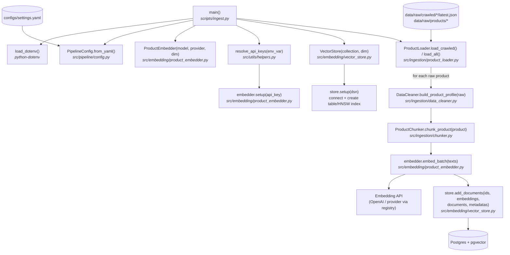

# ingest.py — Execution Flow

Loads raw product data, cleans and chunks it, generates embeddings, and stores
everything in the vector store (Postgres + pgvector).

```bash
uv run python scripts/ingest.py                    # default: --source crawled
uv run python scripts/ingest.py --source products  # data/raw/products only
uv run python scripts/ingest.py --source all       # both
```

## Flow diagram



## Step-by-step

| # | Step | Function | File |
|---|------|----------|------|
| 1 | Load `.env` so API keys are available | `load_dotenv()` | `python-dotenv` |
| 2 | Parse `--source` (`crawled` \| `products` \| `all`) | `argparse` | `scripts/ingest.py` |
| 3 | Load pipeline settings (model, dim, collection, DB URL) | `PipelineConfig.from_yaml()` | `src/pipeline/config.py` |
| 4 | Create embedder for the configured provider | `ProductEmbedder.__init__()` | `src/embedding/product_embedder.py` |
| 5 | Resolve API key(s) from env and set up the client | `resolve_api_keys()` → `embedder.setup()` | `src/utils/helpers.py`, `src/embedding/product_embedder.py` |
| 6 | Connect to Postgres, ensure table + HNSW index | `VectorStore.setup()` | `src/embedding/vector_store.py` |
| 7 | Load raw products from disk | `ProductLoader.load_crawled()` / `load_all()` | `src/ingestion/product_loader.py` |
| 8 | Normalize each raw product into a profile | `DataCleaner.build_product_profile()` | `src/ingestion/data_cleaner.py` |
| 9 | Split each product into field-based chunks | `ProductChunker.chunk_product()` | `src/ingestion/chunker.py` |
| 10 | Embed all chunk texts in batches | `ProductEmbedder.embed_batch()` | `src/embedding/product_embedder.py` |
| 11 | Upsert ids + embeddings + documents + metadata | `VectorStore.add_documents()` | `src/embedding/vector_store.py` |

## Notes

- Chunk ids are `"{product_id}_{chunk_type}"`, so re-running ingestion upserts
  rather than duplicates.
- The embedding provider and key env var come from `configs/settings.yaml`;
  `resolve_api_keys()` supports multiple comma-separated keys with rotation on
  rate limits.
- Database connection uses `DATABASE_URL` or `vector_db_url` from settings.
