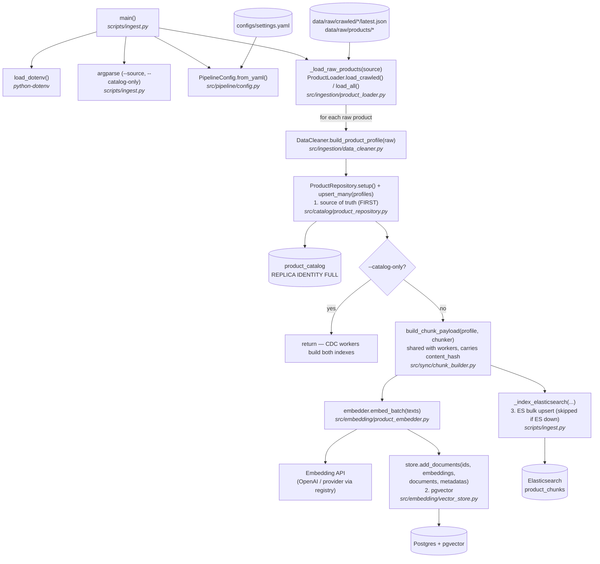

# ingest.py — Execution Flow

Bootstrap script: loads raw product data, cleans it, and writes **three
targets** so a fresh system is immediately usable:

1. the `product_catalog` table — the **source of truth** (what CDC captures);
2. **pgvector** — chunk, embed, and upsert vectors directly (no Kafka needed);
3. the **Elasticsearch** keyword index (`product_chunks`) — bulk upsert,
   **skipped gracefully** if the cluster is unreachable (the CDC workers will
   build it later from the Debezium snapshot).

```bash
uv run python scripts/ingest.py                    # default: --source crawled
uv run python scripts/ingest.py --source products  # data/raw/products only
uv run python scripts/ingest.py --source all       # both
uv run python scripts/ingest.py --catalog-only     # catalog only; CDC builds the indexes
```

With `--catalog-only` the script writes **only** the catalog table and returns
early, letting the CDC pipeline (Debezium initial snapshot → sync workers)
build both search indexes.

## Flow diagram



## Step-by-step

| # | Step | Function | File |
|---|------|----------|------|
| 1 | Load `.env` so API keys / URLs are available | `load_dotenv()` | `python-dotenv` |
| 2 | Parse `--source` (`crawled` \| `products` \| `all`) and `--catalog-only` | `argparse` | `scripts/ingest.py` |
| 3 | Load pipeline settings (model, dim, DB URL, `catalog_table`, ES/Kafka config) | `PipelineConfig.from_yaml()` | `src/pipeline/config.py` |
| 4 | Load raw products from disk | `_load_raw_products()` → `ProductLoader.load_crawled()` / `load_all()` | `scripts/ingest.py`, `src/ingestion/product_loader.py` |
| 5 | Normalize each raw product into a profile | `DataCleaner.build_product_profile()` | `src/ingestion/data_cleaner.py` |
| 6 | **Source of truth first** — connect, ensure table (`REPLICA IDENTITY FULL`), bulk upsert profiles | `ProductRepository.setup()` → `upsert_many()` | `src/catalog/product_repository.py` |
| 7 | `--catalog-only`: return here; CDC workers build both indexes from the Debezium snapshot | `main()` short-circuit | `scripts/ingest.py` |
| 8 | Chunk each profile into index-ready payloads (**shared with the sync workers**, metadata carries `content_hash`) | `build_chunk_payload()` | `src/sync/chunk_builder.py` |
| 9 | Embed all chunk texts in batches | `ProductEmbedder.embed_batch()` | `src/embedding/product_embedder.py` |
| 10 | Upsert ids + embeddings + documents + metadata into pgvector | `VectorStore.add_documents()` | `src/embedding/vector_store.py` |
| 11 | Bulk-upsert the same chunks into Elasticsearch (**best-effort**, skipped if ES unreachable) | `_index_elasticsearch()` → `ESKeywordSearch.upsert_chunks()` | `scripts/ingest.py`, `src/retrieval/es_keyword_search.py` |

## Notes

- Chunk ids are `"{product_id}_{chunk_type}"`, so re-running ingestion upserts
  rather than duplicates — in both pgvector and Elasticsearch.
- Chunks are built with `build_chunk_payload()`, the **same** function the sync
  workers use, so bootstrap and CDC produce identically shaped documents. Each
  chunk's metadata carries a `content_hash` over the text-bearing fields. When
  Debezium later replays the initial snapshot (`op = r`), the embedding worker
  sees the vectors are already current and makes **zero embedding calls** — the
  snapshot replay is essentially free.
- Elasticsearch indexing is **best-effort**: if the cluster is unreachable,
  `_index_elasticsearch()` logs a warning and returns without failing the run;
  the `--role indexer` sync worker will build the keyword index from the
  Debezium snapshot instead.
- The embedding provider and key env var come from `configs/settings.yaml`;
  `resolve_api_keys()` supports multiple comma-separated keys with rotation on
  rate limits.
- Database connection uses `DATABASE_URL` or `vector_db_url` from settings;
  the ES URL uses `ELASTICSEARCH_URL` or `es_url`.
