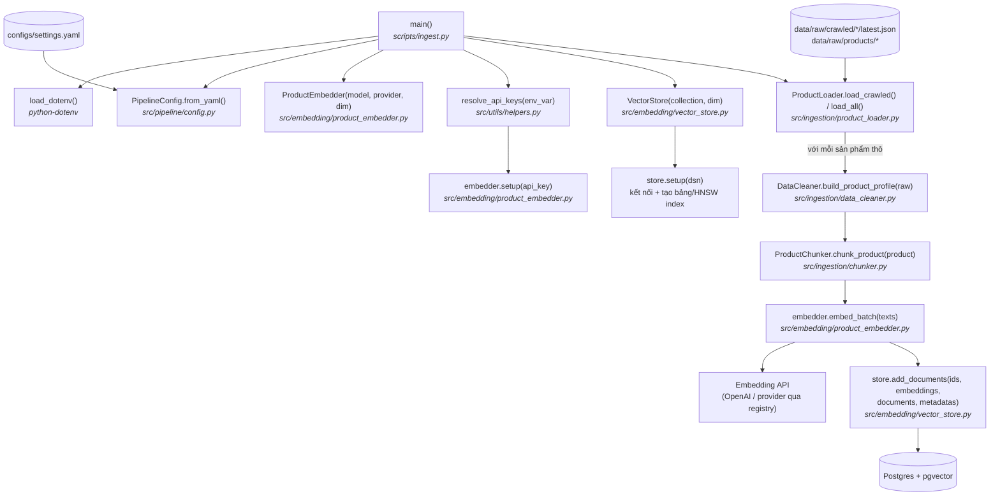

# ingest.py — Luồng chạy

Load dữ liệu sản phẩm thô, làm sạch và chunk, tạo embedding, rồi lưu tất cả vào
vector store (Postgres + pgvector).

```bash
uv run python scripts/ingest.py                    # mặc định: --source crawled
uv run python scripts/ingest.py --source products  # chỉ data/raw/products
uv run python scripts/ingest.py --source all       # cả hai
```

## Sơ đồ luồng



## Từng bước

| # | Bước | Function | File |
|---|------|----------|------|
| 1 | Load `.env` để có sẵn API key | `load_dotenv()` | `python-dotenv` |
| 2 | Parse `--source` (`crawled` \| `products` \| `all`) | `argparse` | `scripts/ingest.py` |
| 3 | Load cấu hình pipeline (model, dim, collection, DB URL) | `PipelineConfig.from_yaml()` | `src/pipeline/config.py` |
| 4 | Tạo embedder cho provider đã cấu hình | `ProductEmbedder.__init__()` | `src/embedding/product_embedder.py` |
| 5 | Lấy API key từ env và khởi tạo client | `resolve_api_keys()` → `embedder.setup()` | `src/utils/helpers.py`, `src/embedding/product_embedder.py` |
| 6 | Kết nối Postgres, đảm bảo bảng + HNSW index | `VectorStore.setup()` | `src/embedding/vector_store.py` |
| 7 | Load sản phẩm thô từ đĩa | `ProductLoader.load_crawled()` / `load_all()` | `src/ingestion/product_loader.py` |
| 8 | Chuẩn hóa mỗi sản phẩm thô thành profile | `DataCleaner.build_product_profile()` | `src/ingestion/data_cleaner.py` |
| 9 | Tách mỗi sản phẩm thành các chunk theo field | `ProductChunker.chunk_product()` | `src/ingestion/chunker.py` |
| 10 | Embed toàn bộ text của chunk theo batch | `ProductEmbedder.embed_batch()` | `src/embedding/product_embedder.py` |
| 11 | Upsert ids + embeddings + documents + metadata | `VectorStore.add_documents()` | `src/embedding/vector_store.py` |

## Ghi chú

- Chunk id có dạng `"{product_id}_{chunk_type}"`, nên chạy lại ingestion sẽ
  upsert thay vì tạo bản ghi trùng.
- Embedding provider và tên biến env chứa key lấy từ `configs/settings.yaml`;
  `resolve_api_keys()` hỗ trợ nhiều key phân tách bằng dấu phẩy, tự xoay vòng
  khi bị rate limit.
- Kết nối database dùng `DATABASE_URL` hoặc `vector_db_url` trong settings.
