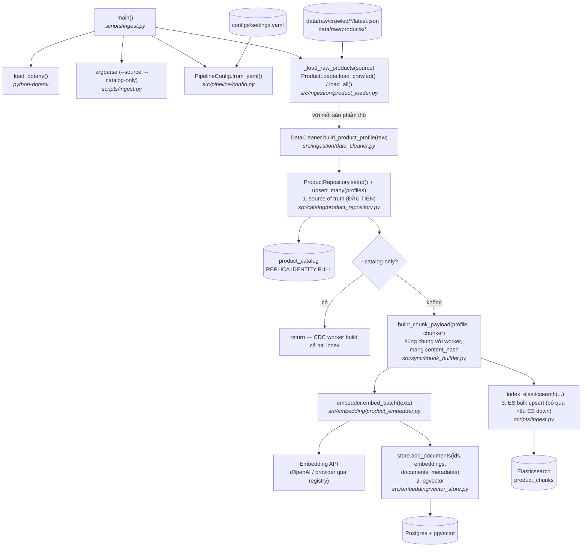

# ingest.py — Luồng chạy

Script bootstrap: load dữ liệu sản phẩm thô, làm sạch, rồi ghi **ba đích** để
một hệ thống mới có thể dùng được ngay:

1. bảng `product_catalog` — **source of truth** (thứ mà CDC capture);
2. **pgvector** — chunk, embed và upsert vector trực tiếp (không cần Kafka);
3. index keyword **Elasticsearch** (`product_chunks`) — bulk upsert, **bỏ qua
   một cách nhẹ nhàng** nếu cluster không truy cập được (các CDC worker sẽ tự
   build sau từ snapshot Debezium).

```bash
uv run python scripts/ingest.py                    # mặc định: --source crawled
uv run python scripts/ingest.py --source products  # chỉ data/raw/products
uv run python scripts/ingest.py --source all       # cả hai
uv run python scripts/ingest.py --catalog-only     # chỉ catalog; CDC build các index
```

Với `--catalog-only`, script chỉ ghi bảng catalog rồi return sớm, để pipeline
CDC (Debezium initial snapshot → sync worker) tự build cả hai search index.

## Sơ đồ luồng



## Từng bước

| # | Bước | Function | File |
|---|------|----------|------|
| 1 | Load `.env` để có sẵn API key / URL | `load_dotenv()` | `python-dotenv` |
| 2 | Parse `--source` (`crawled` \| `products` \| `all`) và `--catalog-only` | `argparse` | `scripts/ingest.py` |
| 3 | Load cấu hình pipeline (model, dim, DB URL, `catalog_table`, config ES/Kafka) | `PipelineConfig.from_yaml()` | `src/pipeline/config.py` |
| 4 | Load sản phẩm thô từ đĩa | `_load_raw_products()` → `ProductLoader.load_crawled()` / `load_all()` | `scripts/ingest.py`, `src/ingestion/product_loader.py` |
| 5 | Chuẩn hóa mỗi sản phẩm thô thành profile | `DataCleaner.build_product_profile()` | `src/ingestion/data_cleaner.py` |
| 6 | **Source of truth trước** — kết nối, đảm bảo bảng (`REPLICA IDENTITY FULL`), bulk upsert profile | `ProductRepository.setup()` → `upsert_many()` | `src/catalog/product_repository.py` |
| 7 | `--catalog-only`: return ở đây; CDC worker build cả hai index từ snapshot Debezium | short-circuit trong `main()` | `scripts/ingest.py` |
| 8 | Chunk mỗi profile thành payload sẵn sàng đánh index (**dùng chung với sync worker**, metadata mang `content_hash`) | `build_chunk_payload()` | `src/sync/chunk_builder.py` |
| 9 | Embed toàn bộ text của chunk theo batch | `ProductEmbedder.embed_batch()` | `src/embedding/product_embedder.py` |
| 10 | Upsert ids + embeddings + documents + metadata vào pgvector | `VectorStore.add_documents()` | `src/embedding/vector_store.py` |
| 11 | Bulk-upsert cùng các chunk đó vào Elasticsearch (**best-effort**, bỏ qua nếu ES không truy cập được) | `_index_elasticsearch()` → `ESKeywordSearch.upsert_chunks()` | `scripts/ingest.py`, `src/retrieval/es_keyword_search.py` |

## Ghi chú

- Chunk id có dạng `"{product_id}_{chunk_type}"`, nên chạy lại ingestion sẽ
  upsert thay vì tạo bản ghi trùng — ở cả pgvector lẫn Elasticsearch.
- Chunk được build bằng `build_chunk_payload()`, **đúng** function mà các sync
  worker dùng, nên bootstrap và CDC tạo ra document có hình dạng giống hệt nhau.
  Metadata của mỗi chunk mang một `content_hash` tính trên các trường chứa
  text. Khi Debezium sau này replay initial snapshot (`op = r`), embedding
  worker thấy vector đã sẵn cập nhật và thực hiện **zero embedding call** — lần
  replay snapshot gần như miễn phí.
- Đánh index Elasticsearch là **best-effort**: nếu cluster không truy cập được,
  `_index_elasticsearch()` chỉ log cảnh báo và return mà không làm hỏng lần
  chạy; sync worker `--role indexer` sẽ tự build index keyword từ snapshot
  Debezium.
- Embedding provider và tên biến env chứa key lấy từ `configs/settings.yaml`;
  `resolve_api_keys()` hỗ trợ nhiều key phân tách bằng dấu phẩy, tự xoay vòng
  khi bị rate limit.
- Kết nối database dùng `DATABASE_URL` hoặc `vector_db_url` trong settings;
  URL của ES dùng `ELASTICSEARCH_URL` hoặc `es_url`.
