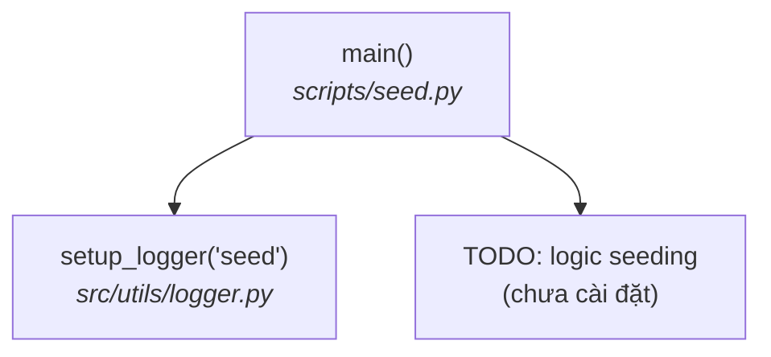

# seed.py — Luồng chạy

Seed dữ liệu sản phẩm mẫu cho development. Hiện tại là placeholder — logic
seeding chưa được cài đặt.

```bash
uv run python scripts/seed.py
```

## Sơ đồ luồng



## Từng bước

| # | Bước | Function | File |
|---|------|----------|------|
| 1 | Tạo logger | `setup_logger()` | `src/utils/logger.py` |
| 2 | Log bắt đầu/kết thúc; logic seeding còn là `TODO` | `main()` | `scripts/seed.py` |

## Cách thay thế hiện tại

Trong khi chưa có seeding, hãy nạp dữ liệu development bằng pipeline thật:

```bash
uv run python scripts/crawl.py --all
uv run python scripts/ingest.py --source crawled
```

Hoặc bỏ file JSON/CSV mẫu vào `data/raw/products/` rồi chạy
`uv run python scripts/ingest.py --source products`.
