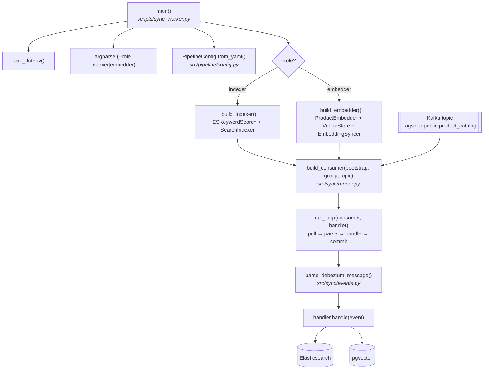

# sync_worker.py — Execution Flow

Runs a **CDC sync worker**: a Kafka consumer that reads the Debezium change
stream for `product_catalog` and keeps **one** derived index fresh. There are
two roles, one per index:

- `--role indexer` — Debezium topic → **Elasticsearch** keyword index
  (`product_chunks`).
- `--role embedder` — Debezium topic → **pgvector** semantic index
  (`products`).

```bash
uv run python scripts/sync_worker.py --role indexer   # keyword index
uv run python scripts/sync_worker.py --role embedder  # semantic index
```

In Docker both roles run as long-lived services (`indexer-worker`,
`embedding-worker`) — see [Docker](../deployment/docker.md). For the end-to-end
write path this worker sits on, see [Write Path](../architecture/write-path.md).

## Flow diagram



## Step-by-step

| # | Step | Function | File |
|---|------|----------|------|
| 1 | Load `.env` (embedding key for the embedder role) | `load_dotenv()` | `python-dotenv` |
| 2 | Parse `--role` (`indexer` \| `embedder`) | `argparse` | `scripts/sync_worker.py` |
| 3 | Load settings (Kafka bootstrap, topic, model/dim, DB URL, ES URL) | `PipelineConfig.from_yaml()` | `src/pipeline/config.py` |
| 4 | Build the handler for the role | `_build_indexer()` / `_build_embedder()` | `scripts/sync_worker.py` |
| 5 | Create + subscribe the Kafka consumer (`auto.offset.reset=earliest`, manual commit) | `build_consumer()` | `src/sync/runner.py` |
| 6 | Consume–apply–commit loop | `run_loop()` | `src/sync/runner.py` |
| 7 | Parse each Kafka record into a `ChangeEvent` (JSONB decoded) | `parse_debezium_message()` | `src/sync/events.py` |
| 8 | Apply the event to the index | `SearchIndexer.handle()` / `EmbeddingSyncer.handle()` | `src/sync/indexer_worker.py`, `src/sync/embedding_worker.py` |

## What `handle()` does per op

| `op` | indexer (`SearchIndexer`) | embedder (`EmbeddingSyncer`) |
| ---- | ------------------------- | ---------------------------- |
| `c` / `r` | delete + upsert the chunk set | re-embed only if `content_hash` differs from what pgvector stores |
| `u` | delete + upsert the chunk set | re-embed if a text field changed; else a metadata-only JSONB update (no embedding call) |
| `d` | delete all chunks | delete all chunks |

## Notes

- **At-least-once**: offsets are committed only after `handle()` succeeds. A
  handler exception crashes the worker on purpose so the uncommitted event is
  redelivered on restart — index updates are never silently dropped.
- **Idempotent**: chunk ids are deterministic (`{product_id}_{chunk_type}`) and
  every apply is an upsert or delete, so redelivery and snapshot replays
  converge to the same index state.
- **First start** reads the whole topic from the beginning
  (`auto.offset.reset=earliest`); Debezium's initial snapshot (`op = r`) is how a
  fresh index gets bootstrapped. Thanks to the stored `content_hash`, replaying
  the snapshot costs **zero** embedding calls when nothing changed.
- Both handlers share `build_chunk_payload()` with `ingest.py`, so bootstrap and
  CDC produce identically shaped chunk documents.
