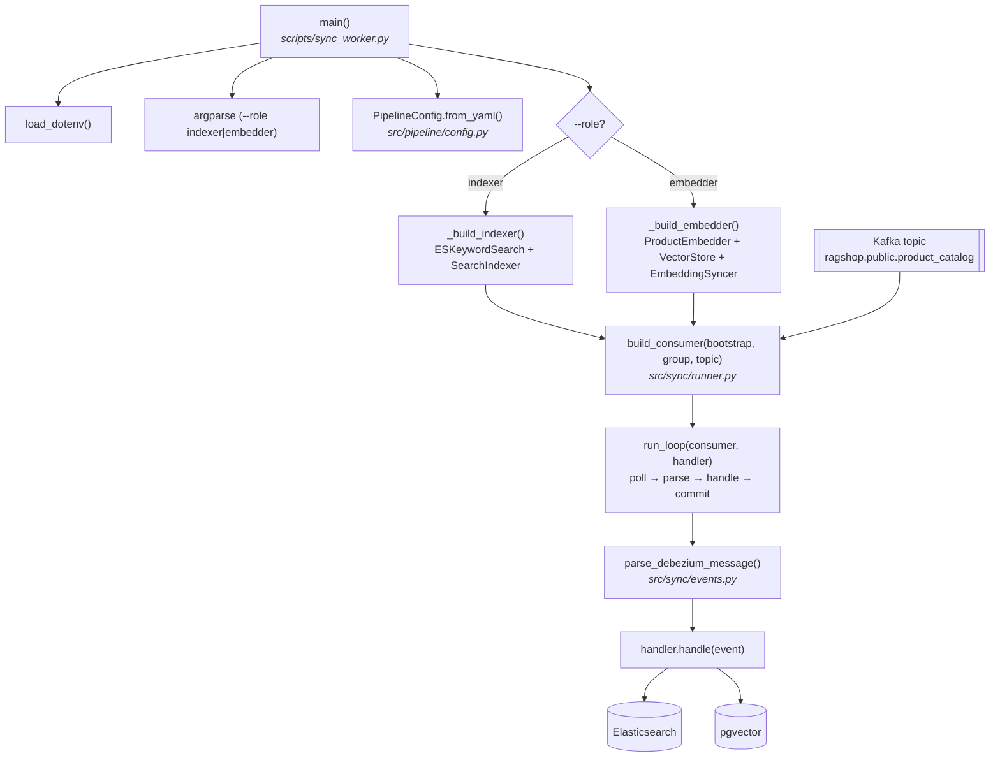

# sync_worker.py — Luồng thực thi

Chạy một **CDC sync worker**: một Kafka consumer đọc luồng thay đổi Debezium của
bảng `product_catalog` và giữ cho **một** chỉ mục dẫn xuất luôn mới. Có hai vai
trò, mỗi vai trò cho một chỉ mục:

- `--role indexer` — topic Debezium → chỉ mục từ khóa **Elasticsearch**
  (`product_chunks`).
- `--role embedder` — topic Debezium → chỉ mục ngữ nghĩa **pgvector**
  (`products`).

```bash
uv run python scripts/sync_worker.py --role indexer   # chỉ mục từ khóa
uv run python scripts/sync_worker.py --role embedder  # chỉ mục ngữ nghĩa
```

Trong Docker, cả hai vai trò chạy như dịch vụ chạy nền lâu dài (`indexer-worker`,
`embedding-worker`) — xem [Docker](../deployment/docker.md). Về luồng ghi
đầu-cuối mà worker này nằm trong đó, xem [Luồng ghi dữ liệu](../architecture/write-path.md).

## Sơ đồ luồng



## Từng bước

| # | Bước | Hàm | File |
|---|------|-----|------|
| 1 | Load `.env` (khóa embedding cho vai trò embedder) | `load_dotenv()` | `python-dotenv` |
| 2 | Phân tích `--role` (`indexer` \| `embedder`) | `argparse` | `scripts/sync_worker.py` |
| 3 | Load cấu hình (Kafka bootstrap, topic, model/dim, DB URL, ES URL) | `PipelineConfig.from_yaml()` | `src/pipeline/config.py` |
| 4 | Dựng handler cho vai trò | `_build_indexer()` / `_build_embedder()` | `scripts/sync_worker.py` |
| 5 | Tạo + subscribe Kafka consumer (`auto.offset.reset=earliest`, commit thủ công) | `build_consumer()` | `src/sync/runner.py` |
| 6 | Vòng lặp consume–apply–commit | `run_loop()` | `src/sync/runner.py` |
| 7 | Phân tích mỗi bản ghi Kafka thành `ChangeEvent` (đã giải mã JSONB) | `parse_debezium_message()` | `src/sync/events.py` |
| 8 | Áp dụng sự kiện vào chỉ mục | `SearchIndexer.handle()` / `EmbeddingSyncer.handle()` | `src/sync/indexer_worker.py`, `src/sync/embedding_worker.py` |

## `handle()` làm gì theo từng op

| `op` | indexer (`SearchIndexer`) | embedder (`EmbeddingSyncer`) |
| ---- | ------------------------- | ---------------------------- |
| `c` / `r` | xóa + upsert bộ chunk | chỉ re-embed nếu `content_hash` khác giá trị pgvector đang lưu |
| `u` | xóa + upsert bộ chunk | re-embed nếu field văn bản đổi; nếu không thì cập nhật JSONB chỉ-metadata (không gọi embedding) |
| `d` | xóa toàn bộ chunk | xóa toàn bộ chunk |

## Ghi chú

- **Ít nhất một lần (at-least-once)**: offset chỉ được commit sau khi `handle()`
  thành công. Một exception trong handler cố ý làm sập worker để sự kiện chưa
  commit được phân phối lại khi khởi động lại — cập nhật chỉ mục không bao giờ bị
  âm thầm bỏ rơi.
- **Lũy đẳng (idempotent)**: id chunk mang tính tất định (`{product_id}_{chunk_type}`)
  và mọi lần áp dụng là upsert hoặc delete, nên phân phối lại và phát lại snapshot
  đều hội tụ về cùng một trạng thái chỉ mục.
- **Lần khởi động đầu** đọc toàn bộ topic từ đầu (`auto.offset.reset=earliest`);
  snapshot khởi tạo của Debezium (`op = r`) là cách một chỉ mục mới được bootstrap.
  Nhờ `content_hash` đã lưu, việc phát lại snapshot tốn **không** một lời gọi
  embedding nào khi không có gì thay đổi.
- Cả hai handler dùng chung `build_chunk_payload()` với `ingest.py`, nên bootstrap
  và CDC tạo ra các tài liệu chunk có hình dạng giống hệt nhau.
